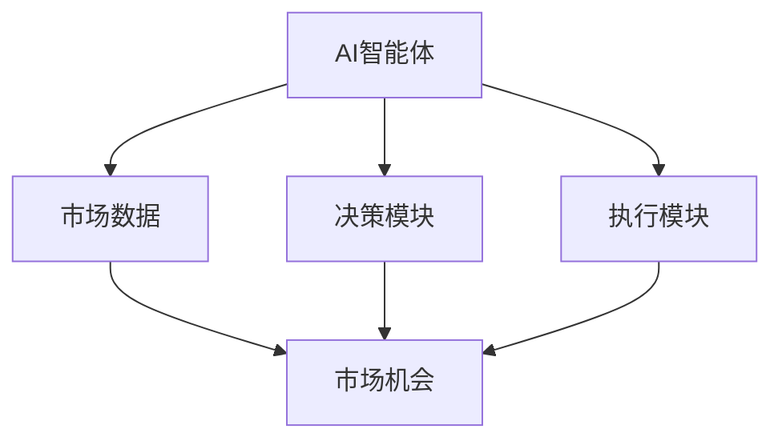
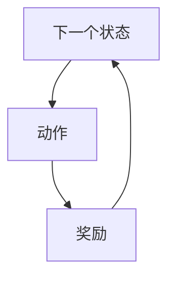
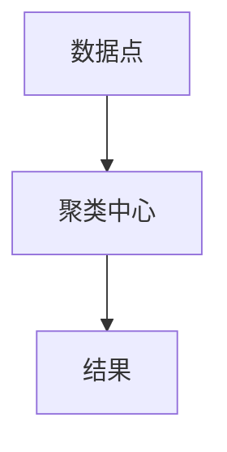
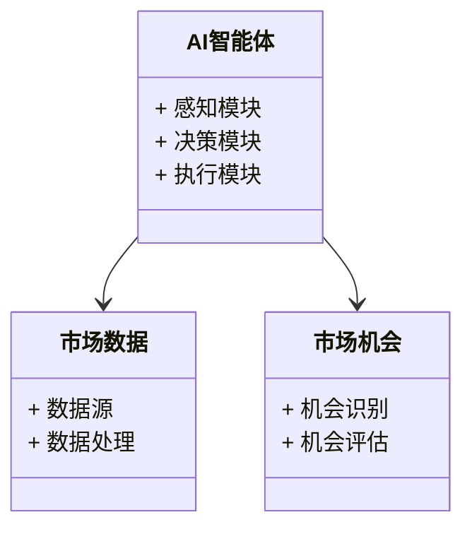
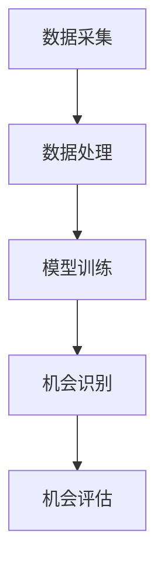
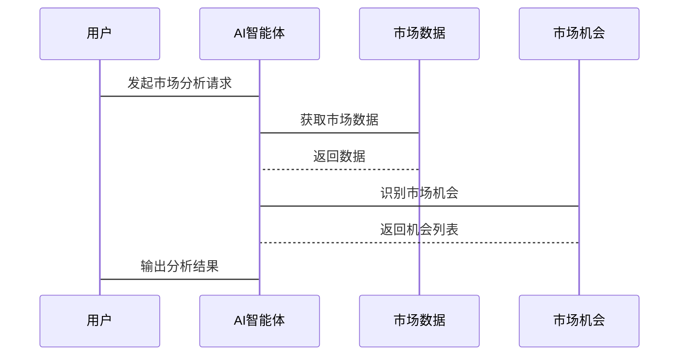

                 


# AI智能体在识别市场结构性机会中的作用

> 关键词：AI智能体，市场机会，算法原理，系统架构，项目实战

> 摘要：本文深入探讨了AI智能体在识别市场结构性机会中的作用，从基本概念、算法原理、系统架构到项目实战，详细分析了AI智能体如何通过感知、决策和执行机制来识别和优化市场机会。文章结合理论与实践，为读者提供了全面的视角，展示了AI智能体在市场分析中的巨大潜力。

---

## 第1章: AI智能体与市场机会概述

### 1.1 AI智能体的基本概念

AI智能体（Artificial Intelligence Agent）是指能够感知环境、做出决策并采取行动以实现目标的智能系统。与传统软件不同，AI智能体具备自主性、反应性、目标导向性和社会性等核心特征。

#### 1.1.1 AI智能体的定义与特点

- **自主性**：AI智能体能够独立运作，无需外部干预。
- **反应性**：能够实时感知环境变化并做出响应。
- **目标导向性**：所有行为均以实现特定目标为导向。
- **社会性**：能够与其他智能体或人类进行交互协作。

#### 1.1.2 AI智能体的核心要素

- **感知模块**：负责从环境中获取信息，如数据收集、市场调研等。
- **决策模块**：基于感知信息，利用算法做出最优决策。
- **执行模块**：将决策转化为具体行动，如自动化交易、策略调整等。

### 1.2 市场结构性机会的定义

市场结构性机会是指由于市场环境、行业趋势或技术进步等因素引发的长期、系统性机会。这类机会通常具有较高的战略价值，能够为企业的长期发展带来显著竞争优势。

### 1.3 AI智能体在市场机会识别中的作用

AI智能体通过强大的数据处理能力、学习能力和自动化能力，能够高效识别市场中的结构性机会。与传统方法相比，AI智能体具有更高的准确性和实时性，能够在复杂多变的市场环境中快速捕捉机会。

---

## 第2章: AI智能体的核心概念与联系

### 2.1 AI智能体的原理

AI智能体的运作基于感知、决策和执行三大核心机制。通过这三大机制的协同工作，AI智能体能够实现从信息收集到策略制定，再到具体执行的完整流程。

#### 2.1.1 感知机制

感知机制负责从环境中获取信息，通常包括数据采集、特征提取和信息处理等步骤。AI智能体会通过多种渠道（如社交媒体、新闻资讯、交易数据等）收集相关信息，并利用自然语言处理（NLP）、计算机视觉等技术进行数据清洗和特征提取。

#### 2.1.2 决策机制

决策机制是AI智能体的核心部分，负责根据感知到的信息制定最优策略。常用的决策算法包括强化学习（Reinforcement Learning）、聚类分析（Clustering）和回归分析（Regression Analysis）等。决策机制通常会结合历史数据和实时信息，通过建模和优化算法得出最优决策。

#### 2.1.3 执行机制

执行机制负责将决策转化为具体行动，例如发出交易指令、调整市场策略等。AI智能体的执行能力通常依赖于自动化系统和API接口，能够快速响应决策模块的指令。

### 2.2 AI智能体与市场机会的关系

AI智能体通过感知、分析和预测市场数据，能够识别出传统方法难以发现的市场机会。例如，在金融市场上，AI智能体可以通过分析大量的历史数据和实时信息，识别出股票价格波动的模式，从而提前做出买入或卖出决策。

### 2.3 AI智能体的核心属性对比

以下是几种常见AI智能体的核心属性对比：

| 属性 | 描述 |
|------|------|
| 感知能力 | 数据收集与分析能力 |
| 决策能力 | 基于数据的决策算法 |
| 执行能力 | 自动化操作能力 |
| 学习能力 | 模型优化与迭代能力 |

### 2.4 AI智能体的实体关系图

以下是AI智能体与市场机会之间的实体关系图：



---

## 第3章: AI智能体的算法原理

### 3.1 常见算法概述

#### 3.1.1 强化学习算法

强化学习是一种通过试错机制来优化决策的算法。AI智能体会通过不断尝试不同的策略，逐步逼近最优解。以下是强化学习的基本流程图：



#### 3.1.2 聚类算法

聚类算法用于将相似的数据点归类，从而识别出市场的潜在机会。以下是聚类算法的基本流程图：



### 3.2 数学模型与公式

#### 3.2.1 强化学习的数学模型

强化学习的Q-learning算法如下：

$$ Q(s,a) = Q(s,a) + \alpha (r + \max Q(s',a') - Q(s,a)) $$

其中：
- \( Q(s,a) \) 表示当前状态下采取动作 \( a \) 的价值。
- \( \alpha \) 表示学习率。
- \( r \) 表示奖励。
- \( s' \) 表示下一个状态。
- \( \max Q(s',a') \) 表示下一个状态下最大的Q值。

#### 3.2.2 聚类算法的数学模型

聚类算法通常使用距离公式来衡量数据点之间的相似性：

$$ \text{距离} = \sqrt{(x_i - x_j)^2 + (y_i - y_j)^2} $$

### 3.3 算法实现与代码示例

以下是一个简单的强化学习算法实现示例：

```python
import numpy as np

def reinforce_learning(env, alpha=0.1):
    state = env.reset()
    while True:
        action = np.argmax(Q[state])
        next_state, reward, done = env.step(action)
        Q[state][action] += alpha * (reward + np.max(Q[next_state]))
        state = next_state
        if done:
            break
```

---

## 第4章: 系统分析与架构设计

### 4.1 系统功能设计

#### 4.1.1 领域模型

以下是市场机会识别系统的领域模型图：



#### 4.1.2 系统架构

以下是市场机会识别系统的架构图：



### 4.2 接口设计

以下是系统的主要接口设计：

- 数据采集接口：负责从外部数据源获取市场数据。
- 数据处理接口：对获取的数据进行清洗、转换和特征提取。
- 模型训练接口：利用训练数据训练AI智能体的模型。
- 机会识别接口：基于训练好的模型识别市场机会。
- 机会评估接口：对识别出的机会进行评估和排序。

### 4.3 交互流程

以下是系统交互流程图：



---

## 第5章: 项目实战

### 5.1 环境安装

以下是在Python中安装必要的库：

```bash
pip install numpy
pip install matplotlib
pip install pandas
pip install scikit-learn
```

### 5.2 核心代码实现

以下是AI智能体识别市场机会的核心代码实现：

```python
import numpy as np
import pandas as pd
from sklearn.cluster import KMeans

# 数据处理
data = pd.read_csv('market_data.csv')
features = data[['feature1', 'feature2', 'feature3']]

# 模型训练
kmeans = KMeans(n_clusters=3, random_state=0)
clusters = kmeans.fit_predict(features)

# 机会识别
opportunity = np.where(clusters == 0, 'High', 'Low')
```

### 5.3 案例分析

以金融市场的股票价格预测为例，AI智能体可以通过分析历史价格数据和市场新闻，识别出股票价格的潜在上涨机会。以下是具体实现步骤：

1. 数据采集：从Yahoo Finance获取股票历史数据。
2. 数据处理：清洗数据并提取技术指标（如移动平均线、相对强弱指数等）。
3. 模型训练：利用强化学习算法训练AI智能体。
4. 机会识别：识别出潜在的买入和卖出信号。
5. 机会评估：评估识别出的机会的可行性。

### 5.4 项目小结

通过项目实战，我们可以看到AI智能体在识别市场机会中的巨大潜力。结合实际案例，我们可以更好地理解AI智能体的应用场景和实现过程。

---

## 第6章: 总结与展望

### 6.1 总结

本文详细探讨了AI智能体在识别市场结构性机会中的作用，从基本概念、算法原理到系统设计和项目实战，全面分析了AI智能体的优势和应用潜力。

### 6.2 展望

未来，随着AI技术的不断发展，AI智能体在市场机会识别中的应用将更加广泛。我们可以期待AI智能体与边缘计算、区块链等技术的结合，进一步提升市场机会识别的准确性和效率。

---

## 第7章: 附录

### 7.1 参考文献

1. Russell, S., & Norvig, P. (2010). Artificial Intelligence: A Modern Approach.
2. Goodfellow, I., Bengio, Y., & Courville, A. (2016). Deep Learning.

### 7.2 工具与资源

- Python编程语言
- 机器学习库：scikit-learn、TensorFlow、PyTorch
- 数据可视化工具：Matplotlib、Seaborn

---

通过本文的详细讲解，我们可以看到AI智能体在识别市场结构性机会中的巨大潜力。希望本文能够为读者提供有价值的参考，帮助他们在实际应用中更好地利用AI智能体来识别和把握市场机会。

