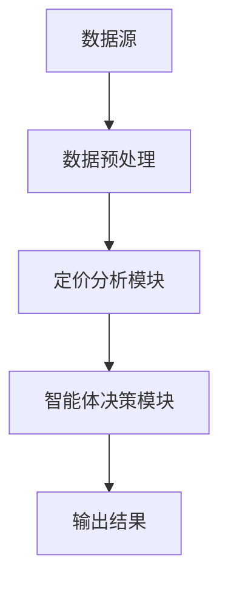

                 


# AI智能体在识别市场错误定价机会中的作用

> 关键词：AI智能体，市场定价，错误定价机会，强化学习，定价分析，系统架构

> 摘要：本文探讨了AI智能体在识别市场错误定价机会中的应用，通过分析定价机制的复杂性，提出基于强化学习和监督学习的定价分析方法，并结合实际案例展示系统架构和实现过程。

---

## 第1章：AI智能体与市场错误定价概述

### 1.1 问题背景与挑战

#### 1.1.1 市场定价机制的复杂性
市场定价机制涉及供需关系、竞争环境、经济周期等多种因素，传统定价方法难以捕捉所有变量。

#### 1.1.2 错误定价机会的定义与特征
错误定价是指商品或服务的定价与实际价值不符，常见于市场信息不对称或短期市场波动。

#### 1.1.3 AI智能体在定价中的潜在价值
AI智能体通过数据挖掘和模式识别，能够发现定价中的异常情况，帮助市场参与者获利。

### 1.2 AI智能体的核心概念

#### 1.2.1 AI智能体的基本原理
AI智能体通过感知市场数据，执行决策并优化行为，形成闭环系统。

#### 1.2.2 智能体与市场的交互机制
智能体通过数据输入、分析决策和输出建议与市场交互。

#### 1.2.3 错误定价识别的理论框架
基于定价模型和异常检测算法，构建错误定价识别的理论框架。

---

## 第2章：AI智能体识别错误定价的核心原理

### 2.1 数据驱动的定价分析

#### 2.1.1 数据收集与预处理
收集市场数据，清洗和特征提取，为后续分析做准备。

#### 2.1.2 市场数据特征提取
提取价格、需求量、竞争产品等特征，用于定价模型。

### 2.2 AI算法在定价分析中的应用

#### 2.2.1 强化学习模型
通过Q-Learning算法优化定价策略，实时调整价格以最大化收益。

#### 2.2.2 监督学习模型
使用回归模型和分类模型预测价格波动，识别错误定价机会。

#### 2.2.3 聚类分析与异常检测
通过聚类分析发现异常定价模式，利用异常检测算法识别错误定价。

---

## 第3章：AI智能体识别错误定价的算法原理

### 3.1 强化学习算法

#### 3.1.1 Q-Learning算法
通过状态-动作-奖励机制优化定价策略。

#### 3.1.2 Deep Q-Networks (DQN) 算法
使用深度神经网络近似Q值函数，提升定价决策的复杂度和灵活性。

### 3.2 监督学习算法

#### 3.2.1 线性回归模型
通过最小二乘法拟合价格与特征变量的关系，预测实际价值。

#### 3.2.2 支持向量机 (SVM)
用于分类定价异常情况，区分正常定价和错误定价。

#### 3.2.3 神经网络模型
构建多层感知机模型，学习复杂的定价模式。

---

## 第4章：数学模型与定价分析

### 4.1 定价模型的数学基础

#### 4.1.1 回归分析模型
$$
y = \beta_0 + \beta_1 x + \epsilon
$$
其中，$y$ 是目标变量，$x$ 是自变量，$\epsilon$ 是误差项。

#### 4.1.2 分类模型
使用逻辑回归分类错误定价：
$$
P(y=1|x) = \frac{e^{\beta x}}{1 + e^{\beta x}}
$$

### 4.2 错误定价识别的数学公式

#### 4.2.1 回归模型公式
$$
\hat{y} = \sum_{i=1}^{n} w_i x_i + b
$$

#### 4.2.2 分类模型公式
$$
f(x) = \arg\max_i y_i
$$

---

## 第5章：系统架构与设计

### 5.1 系统功能设计

#### 5.1.1 数据采集模块
负责收集市场数据，清洗和特征提取。

#### 5.1.2 定价分析模块
基于AI算法分析数据，识别错误定价机会。

#### 5.1.3 智能体决策模块
根据分析结果生成定价建议，优化定价策略。

### 5.2 系统架构图



---

## 第6章：项目实战与应用

### 6.1 环境搭建与安装

#### 6.1.1 Python环境配置
安装Python 3.8及以上版本，配置Jupyter Notebook。

#### 6.1.2 数据库安装与配置
安装MySQL或MongoDB，配置连接字符串。

### 6.2 核心代码实现

#### 6.2.1 数据预处理代码
```python
import pandas as pd
data = pd.read_csv('market_data.csv')
data = data.dropna()
```

#### 6.2.2 模型训练代码
```python
from sklearn.linear_model import LinearRegression
model = LinearRegression()
model.fit(X_train, y_train)
```

#### 6.2.3 智能体决策代码
```python
import numpy as np
def decide_price(action):
    return action
```

### 6.3 实际案例分析

#### 6.3.1 案例介绍
分析某电商平台的商品定价，发现错误定价机会。

#### 6.3.2 案例解读
通过AI智能体分析，识别出部分商品定价过低，存在利润空间。

---

## 第7章：最佳实践与注意事项

### 7.1 实战中的

#### 7.1.1 小结
AI智能体能够有效识别市场错误定价机会，提升定价效率和准确性。

#### 7.1.2 注意事项
- 数据质量：确保数据的准确性和完整性。
- 模型优化：持续优化算法参数，提升识别精度。
- 持续学习：结合市场反馈，动态更新定价模型。

#### 7.1.3 拓展阅读
推荐阅读《机器学习实战》和《强化学习导论》，深入理解定价分析和AI智能体的应用。

---

通过以上步骤，可以系统地构建和实现一个基于AI智能体的市场错误定价识别系统，帮助市场参与者捕捉定价机会，提升市场竞争力。

