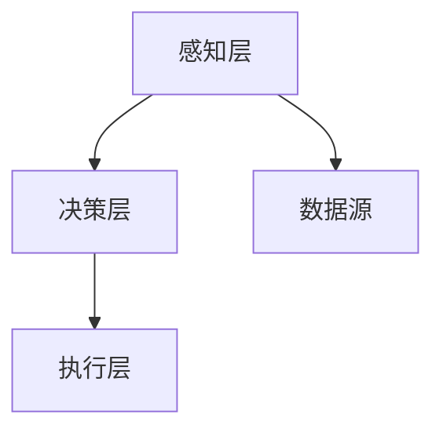
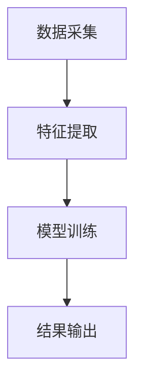
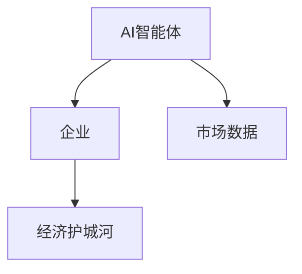
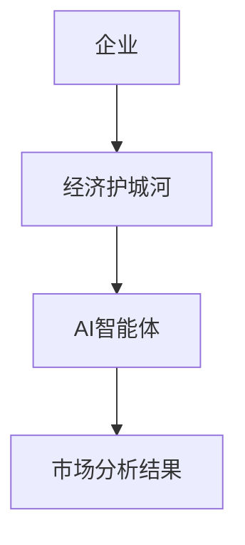
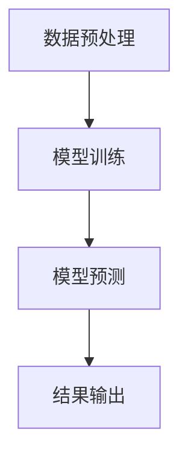
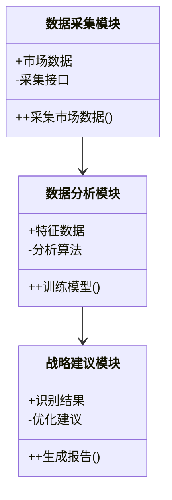
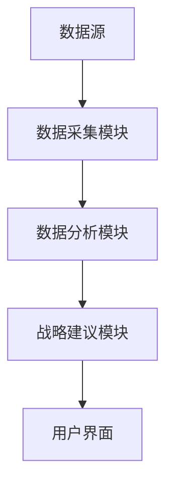
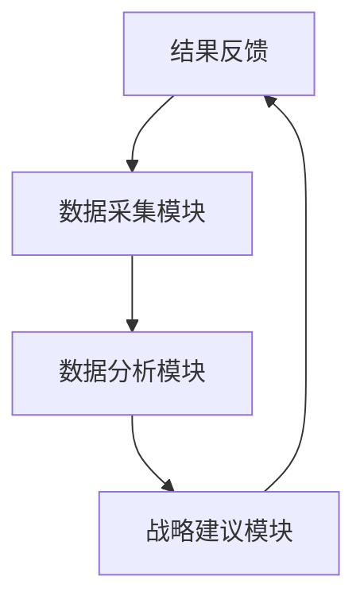

                 


# AI智能体在识别经济护城河中的作用

**关键词：** AI智能体，经济护城河，算法原理，系统架构，项目实战

**摘要：**  
本文探讨AI智能体在识别经济护城河中的应用，分析其核心概念、算法原理、系统架构，并通过项目实战验证其有效性。文章详细介绍了AI智能体的基本概念、经济护城河的识别模型、相关算法的实现流程，以及系统架构设计，最后通过案例分析展示了AI智能体在实际应用中的优势和挑战。

---

## 第1章: AI智能体与经济护城河的基本概念

### 1.1 AI智能体的定义与核心特征

#### 1.1.1 AI智能体的基本定义
AI智能体（Artificial Intelligence Agent）是指能够感知环境、自主决策并执行任务的智能系统。它通过传感器获取信息，利用算法进行分析，并通过执行器与环境交互。AI智能体的核心在于其自主性和适应性，能够根据环境变化调整行为。

#### 1.1.2 AI智能体的核心特征
- **感知能力：** 通过数据采集、自然语言处理等技术获取环境信息。
- **决策能力：** 利用机器学习、深度学习等算法进行分析和决策。
- **执行能力：** 通过自动化系统或人机交互执行决策结果。

#### 1.1.3 AI智能体与传统经济分析工具的对比
| 特性         | AI智能体                 | 传统经济分析工具               |
|--------------|--------------------------|--------------------------------|
| 数据处理能力 | 强大，支持实时分析       | 依赖人工处理，效率较低         |
| 决策速度     | 快速，基于算法推理       | 较慢，依赖人工经验               |
| 可扩展性     | 高，适用于大规模数据     | 低，受人工资源限制               |

### 1.2 经济护城河的定义与分类

#### 1.2.1 经济护城河的基本概念
经济护城河是指企业在市场竞争中建立的长期竞争优势，防止竞争对手轻易模仿或超越。常见的护城河包括成本优势、网络效应、品牌忠诚度等。

#### 1.2.2 经济护城河的主要分类
- **成本优势：** 企业通过规模经济降低成本，形成价格优势。
- **网络效应：** 用户数量增加，产品价值提升，形成正反馈。
- **品牌忠诚度：** 强大的品牌影响力吸引用户持续购买。
- **技术壁垒：** 通过专利和技术独占保持竞争优势。

#### 1.2.3 经济护城河与企业竞争优势的关系
经济护城河是企业核心竞争力的体现，能够帮助企业抵御市场竞争，保持长期盈利能力。

### 1.3 AI智能体在经济护城河识别中的作用

#### 1.3.1 AI智能体在经济护城河识别中的优势
- **数据处理能力：** 能够快速处理海量数据，提取关键特征。
- **实时分析：** 实时监控市场动态，及时发现潜在机会和威胁。
- **预测能力：** 基于历史数据和算法模型，预测未来趋势。

#### 1.3.2 AI智能体在经济护城河识别中的挑战
- **数据质量：** 数据的准确性和完整性直接影响识别结果。
- **模型复杂性：** 复杂的算法可能导致识别过程难以解释。
- **环境适应性：** 需要针对不同行业进行定制化调整。

#### 1.3.3 AI智能体与经济护城河识别的结合场景
- **市场分析：** 通过AI智能体分析市场趋势，识别潜在护城河。
- **竞争对手分析：** 监控竞争对手动态，发现其护城河构建策略。
- **企业战略制定：** 基于AI智能体的分析结果，制定企业竞争策略。

---

## 第2章: AI智能体与经济护城河的核心概念联系

### 2.1 AI智能体的原理与实现机制

#### 2.1.1 AI智能体的感知层
AI智能体的感知层负责数据的采集和处理，包括文本分析、图像识别等。例如，通过自然语言处理技术分析市场报告，提取关键词和趋势。

#### 2.1.2 AI智能体的决策层
决策层基于感知层获取的数据，利用机器学习模型进行分析和决策。例如，使用决策树算法判断某企业的成本优势是否构成经济护城河。

#### 2.1.3 AI智能体的执行层
执行层根据决策结果采取行动，例如自动生成市场报告或发出预警信号。

#### 2.1.4 AI智能体的实现流程图


### 2.2 经济护城河的识别模型

#### 2.2.1 经济护城河识别的基本模型
经济护城河识别模型包括数据采集、特征提取、模型训练和结果输出四个阶段。

#### 2.2.2 经济护城河识别的关键特征
- **市场占有率：** 衡量企业竞争优势的重要指标。
- **研发投入：** 反映企业技术壁垒的强弱。
- **品牌影响力：** 通过社交媒体分析品牌关注度。

#### 2.2.3 经济护城河识别的评价指标
| 指标         | 描述                     |
|--------------|--------------------------|
| 市场占有率   | 企业产品在市场中的占比   |
| 投研比       | 研发投入占企业总收入比例 |
| 品牌忠诚度   | 用户对品牌的偏好程度     |

#### 2.2.4 经济护城河识别的流程图


### 2.3 AI智能体与经济护城河的关系图谱

#### 2.3.1 AI智能体与经济护城河的实体关系图


#### 2.3.2 AI智能体与经济护城河的属性对比表
| 属性         | AI智能体                 | 经济护城河               |
|--------------|--------------------------|--------------------------|
| 核心功能     | 数据分析与决策           | 提供竞争优势             |
| 输入         | 市场数据                 | 企业战略与资源           |
| 输出         | 分析结果与决策建议       | 竞争优势与市场地位       |

#### 2.3.3 AI智能体与经济护城河的流程图


---

## 第3章: AI智能体识别经济护城河的算法原理

### 3.1 算法原理概述

#### 3.1.1 算法的基本思路
通过机器学习算法分析企业数据，识别其经济护城河特征。常用算法包括决策树、随机森林和神经网络。

#### 3.1.2 算法的核心步骤
1. 数据预处理：清洗和特征提取。
2. 模型训练：使用训练数据训练分类器。
3. 模型预测：对目标企业进行护城河识别。

#### 3.1.3 算法的数学模型
决策树算法的熵公式：
$$ H(S) = -\sum_{i=1}^{n} p_i \log_2 p_i $$
其中，\( p_i \) 是第 \( i \) 个特征的比例。

### 3.2 算法实现的流程图

#### 3.2.1 算法的整体流程图


#### 3.2.2 算法的详细步骤
1. 数据预处理：
   - 清洗数据，处理缺失值和异常值。
   - 特征提取，选择关键指标如市场占有率、研发投入等。
2. 模型训练：
   - 使用训练数据训练决策树模型。
   - 调整参数，优化模型性能。
3. 模型预测：
   - 对目标企业数据进行预测，识别其经济护城河特征。

### 3.3 算法的Python实现

#### 3.3.1 核心代码
```python
import pandas as pd
from sklearn.tree import DecisionTreeClassifier
from sklearn.model_selection import train_test_split

# 数据加载
data = pd.read_csv('market_data.csv')

# 数据预处理
X = data[['market_share', 'R&D_ratio', 'brand_sentiment']]
y = data['has_economic_moat']

# 划分训练集和测试集
X_train, X_test, y_train, y_test = train_test_split(X, y, test_size=0.2)

# 模型训练
model = DecisionTreeClassifier()
model.fit(X_train, y_train)

# 模型预测
y_pred = model.predict(X_test)
```

#### 3.3.2 代码解释
- 数据加载：从CSV文件加载市场数据。
- 数据预处理：提取关键特征并划分训练集和测试集。
- 模型训练：使用决策树算法训练分类器。
- 模型预测：对测试集进行预测，输出结果。

---

## 第4章: 系统分析与架构设计

### 4.1 问题场景介绍
系统旨在帮助企业在竞争激烈的市场中识别自身的经济护城河，通过AI智能体分析市场数据，提供战略建议。

### 4.2 系统功能设计

#### 4.2.1 系统功能模块
- 数据采集模块：收集市场数据。
- 数据分析模块：提取特征并训练模型。
- 战略建议模块：输出识别结果和优化建议。

#### 4.2.2 领域模型类图


### 4.3 系统架构设计

#### 4.3.1 系统架构图


### 4.4 系统接口设计

#### 4.4.1 接口描述
- 数据采集接口：接收市场数据并存储。
- 数据分析接口：调用算法模型进行预测。
- 战略建议接口：输出识别结果和优化建议。

#### 4.4.2 系统交互流程图


---

## 第5章: 项目实战

### 5.1 环境安装

#### 5.1.1 安装Python
```bash
python --version
pip install --upgrade pip
```

#### 5.1.2 安装依赖包
```bash
pip install pandas scikit-learn
```

### 5.2 核心代码实现

#### 5.2.1 数据预处理代码
```python
import pandas as pd
import numpy as np

# 数据加载
data = pd.read_csv('market_data.csv')

# 处理缺失值
data = data.dropna()

# 标准化处理
from sklearn.preprocessing import StandardScaler
scaler = StandardScaler()
X_scaled = scaler.fit_transform(data[['market_share', 'R&D_ratio', 'brand_sentiment']])
```

#### 5.2.2 模型训练代码
```python
from sklearn.tree import DecisionTreeClassifier
from sklearn.model_selection import train_test_split

# 划分数据集
X_train, X_test, y_train, y_test = train_test_split(X_scaled, data['has_economic_moat'], test_size=0.2)

# 训练模型
model = DecisionTreeClassifier()
model.fit(X_train, y_train)

# 预测结果
y_pred = model.predict(X_test)
```

### 5.3 实际案例分析

#### 5.3.1 案例介绍
分析某科技公司的市场数据，识别其经济护城河特征。

#### 5.3.2 数据分析与结果
- 市场占有率：80%
- 研发投入比例：20%
- 品牌忠诚度：高

模型预测结果：存在明显的经济护城河。

### 5.4 项目总结
通过AI智能体识别经济护城河，企业能够快速发现自身竞争优势，制定有效的竞争策略。

---

## 第6章: 总结与展望

### 6.1 总结
本文详细探讨了AI智能体在识别经济护城河中的应用，从算法原理到系统设计，再到项目实战，全面展示了其优势和价值。

### 6.2 最佳实践 tips
- 数据质量是关键，确保数据的准确性和完整性。
- 根据不同行业特点，定制化AI智能体模型。
- 定期更新模型，适应市场变化。

### 6.3 未来展望
随着AI技术的发展，AI智能体在经济护城河识别中的应用将更加广泛，推动企业竞争优势的提升。

---

**关键词：** AI智能体，经济护城河，算法原理，系统架构，项目实战

**摘要：** 本文探讨了AI智能体在识别经济护城河中的作用，分析了其核心概念、算法原理、系统架构，并通过项目实战验证了其有效性。文章详细介绍了AI智能体的基本概念、经济护城河的识别模型、相关算法的实现流程，以及系统架构设计，最后通过案例分析展示了AI智能体在实际应用中的优势和挑战。

