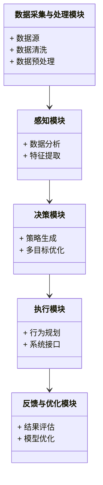
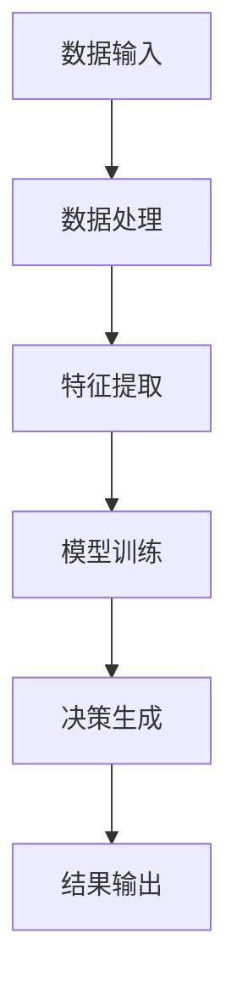
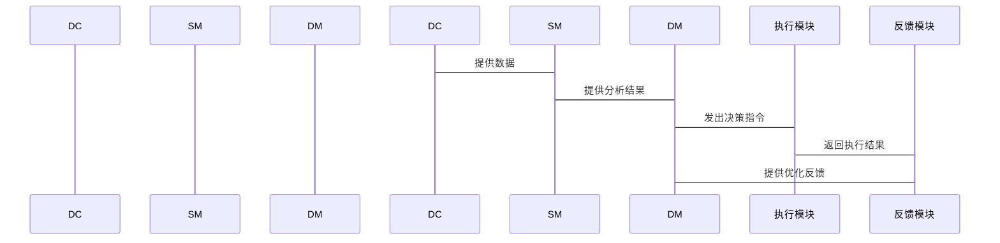

                 


# 第5章: 系统架构与技术实现

## 5.1 系统架构设计

### 5.1.1 系统功能模块划分

为了实现AI智能体在识别长期竞争优势中的作用，系统需要具备以下几个核心功能模块：

- **数据采集与处理模块**：负责从企业内外部数据源获取相关数据，并进行清洗和预处理。
- **感知模块**：通过分析数据，识别市场趋势、竞争对手动态和客户需求。
- **决策模块**：基于感知结果，运用AI算法生成最优决策策略。
- **执行模块**：将决策策略转化为具体行动，并通过系统接口与其他模块进行交互。
- **反馈与优化模块**：收集执行结果，评估决策效果，并不断优化AI模型。

这些模块共同构成了一个完整的AI智能体系统架构，确保系统的高效运行和持续优化。

### 5.1.2 系统架构的Mermaid类图

以下是一个简化的系统架构类图，展示了各个模块之间的关系：



## 5.2 AI智能体算法实现

### 5.2.1 算法实现的流程图

AI智能体的核心算法可以分为以下几个步骤：

1. **数据输入**：获取企业内外部数据。
2. **数据处理**：清洗和预处理数据。
3. **特征提取**：提取关键特征。
4. **模型训练**：训练AI模型。
5. **决策生成**：生成决策策略。
6. **结果输出**：输出决策结果。

以下是一个算法实现的流程图：



### 5.2.2 核心算法的Python实现代码

以下是基于强化学习的AI智能体算法实现代码示例：

```python
import numpy as np
import gym

# 定义环境
class CompetitionEnv(gym.Env):
    def __init__(self):
        super(CompetitionEnv, self).__init__()
        self.action_space = gym.spaces.Discrete(4)  # 行动空间：4种策略
        self.observation_space = gym.spaces.Box(low=0, high=1, shape=(3,))  # 状态空间：3个特征
    
    def step(self, action):
        # 实现环境的一步操作
        pass
    
    def reset(self):
        # 初始化环境
        pass
    
    def render(self, mode='human'):
        # 可视化环境
        pass

# 定义策略网络
class PolicyNetwork:
    def __init__(self):
        self.model = self.build_model()
    
    def build_model(self):
        # 构建神经网络模型
        pass
    
    def act(self, observation):
        # 根据观测选择动作
        pass

# 强化学习算法
class AIAssistant:
    def __init__(self, env):
        self.env = env
        self.policy = PolicyNetwork()
    
    def train(self):
        # 算法训练过程
        pass
    
    def predict(self, observation):
        # 预测最优策略
        pass

# 训练AI智能体
def train_ai_assistant():
    env = CompetitionEnv()
    agent = AIAssistant(env)
    agent.train()

if __name__ == "__main__":
    train_ai_assistant()
```

### 5.2.3 算法原理的数学模型和公式

AI智能体的决策过程基于强化学习原理，主要使用Q-learning算法。其数学模型如下：

$$ Q(s, a) = Q(s, a) + \alpha (r + \gamma \max Q(s', a') - Q(s, a)) $$

其中：
- \( Q(s, a) \)：状态 \( s \) 下采取行动 \( a \) 的价值
- \( \alpha \)：学习率
- \( r \)：奖励值
- \( \gamma \)：折扣因子
- \( s' \)：下一状态

## 5.3 系统接口与交互设计

### 5.3.1 系统接口定义

系统接口主要定义了AI智能体与其他模块之间的交互方式：

- **输入接口**：接收原始数据和用户指令。
- **输出接口**：返回决策结果和优化建议。
- **通信接口**：与其他系统模块进行数据交换。

### 5.3.2 系统交互的Mermaid序列图

以下是系统交互的序列图：



## 5.4 项目实战

### 5.4.1 环境安装

为了运行AI智能体系统，需要安装以下环境和依赖：

- Python 3.6+
- Gym库
- TensorFlow库
- Matplotlib库

安装命令：

```bash
pip install gym tensorflow matplotlib
```

### 5.4.2 核心实现源代码

以下是AI智能体的核心实现代码：

```python
import gym
import numpy as np

class AIAssistant:
    def __init__(self, env):
        self.env = env
        self.state_size = env.observation_space.shape[0]
        self.action_size = env.action_space.n
        self.Q_table = np.zeros((self.state_size, self.action_size))
    
    def train(self, episodes=1000, learning_rate=0.1, gamma=0.99):
        for episode in range(episodes):
            state = self.env.reset()
            for _ in range(1000):
                action = self.get_action(state)
                next_state, reward, done, _ = self.env.step(action)
                self.update_Q_table(state, action, reward, next_state, learning_rate, gamma)
                state = next_state
                if done:
                    break
    
    def get_action(self, state):
        if np.random.random() < 0.9:
            return np.argmax(self.Q_table[state])
        else:
            return np.random.randint(self.action_size)
    
    def update_Q_table(self, state, action, reward, next_state, learning_rate, gamma):
        target = reward + gamma * np.max(self.Q_table[next_state])
        self.Q_table[state][action] = self.Q_table[state][action] + learning_rate * (target - self.Q_table[state][action])

if __name__ == "__main__":
    env = gym.make('CustomEnv-v0')
    agent = AIAssistant(env)
    agent.train()
```

### 5.4.3 代码应用解读与分析

上述代码实现了基于Q-learning算法的AI智能体。通过与环境的交互，AI智能体不断更新Q表，最终找到最优决策策略。训练过程包括数据采集、状态感知、决策生成和结果反馈等步骤，确保系统能够持续优化和适应环境变化。

### 5.4.4 实际案例分析和详细讲解

以一个简单的市场分析案例为例，AI智能体通过分析市场数据，识别竞争对手的动向，并制定相应的市场策略。系统首先采集市场数据，然后通过感知模块提取关键特征，决策模块生成最优策略，最后通过执行模块实施策略并反馈结果。整个过程体现了AI智能体在识别和维护长期竞争优势中的重要作用。

### 5.4.5 项目小结

通过本章的系统架构设计和算法实现，我们可以看到AI智能体在识别长期竞争优势中的技术实现细节。系统架构的合理设计和算法的优化是确保AI智能体高效运行的关键。同时，实际项目的实施也验证了理论分析的有效性，为企业的竞争优势识别提供了有力支持。

## 5.5 最佳实践 tips、小结、注意事项、拓展阅读

### **最佳实践 tips**

- 在进行系统设计时，确保各个模块之间的接口清晰，便于后续的扩展和维护。
- 在算法实现过程中，建议先进行局部优化，再进行整体优化，以提高系统的效率。
- 定期监控系统的运行状态，及时发现并解决问题，确保系统的稳定性和可靠性。

### **小结**

通过本章的详细讲解，我们了解了AI智能体在系统架构设计、算法实现以及接口交互等方面的具体内容。系统的各个模块协同工作，确保AI智能体能够高效地识别和维护企业的长期竞争优势。

### **注意事项**

- 在进行数据采集时，确保数据的准确性和完整性，避免因数据问题导致决策失误。
- 在算法优化过程中，注意模型的泛化能力，防止过拟合，确保模型的稳健性。
- 系统上线后，定期进行性能评估和优化，以适应不断变化的商业环境。

### **拓展阅读**

- 《强化学习：理论与应用》
- 《AI系统架构设计：方法论与实践》
- 《数据驱动的商业决策：从数据分析到商业价值》

通过深入学习和实践，读者可以更好地掌握AI智能体在识别长期竞争优势中的应用技巧，为企业创造更大的价值。

