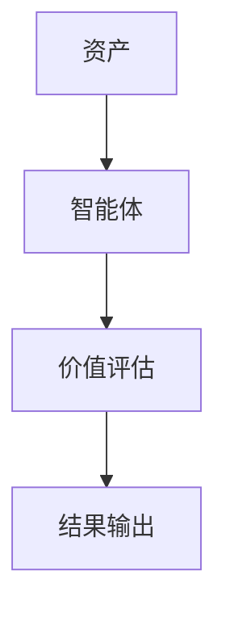
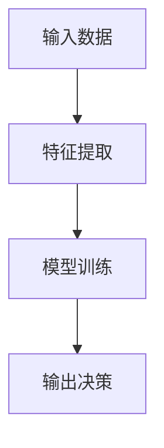
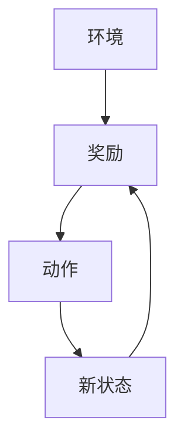
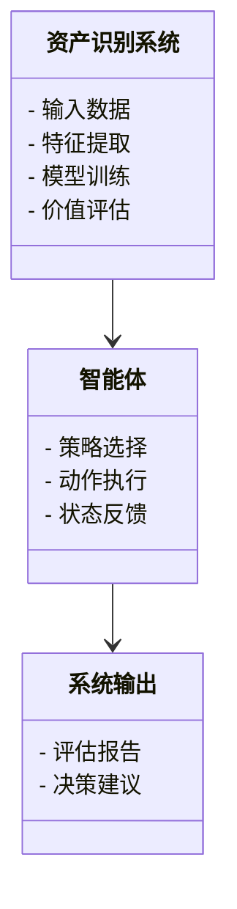
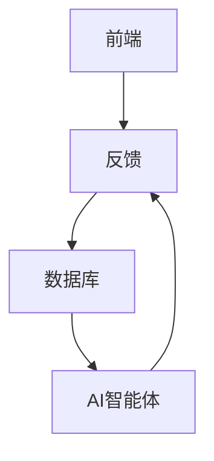
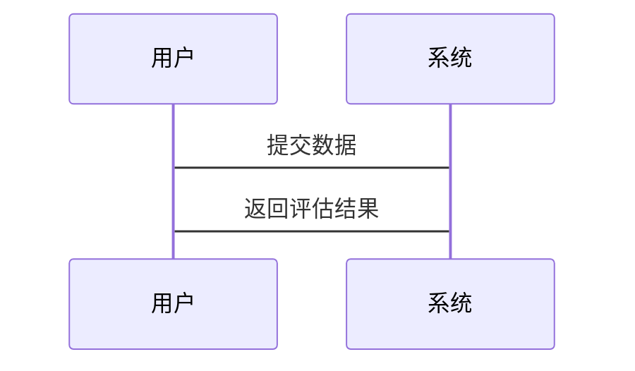

                 


---

# AI智能体在识别隐藏资产价值中的应用

> 关键词：AI智能体，资产价值识别，隐藏资产，强化学习，机器学习，实体关系图，数学模型

> 摘要：本文详细探讨了AI智能体在识别隐藏资产价值中的应用，从背景介绍、核心概念、算法原理、系统架构到项目实战，层层解析。通过实例分析和代码实现，深入浅出地展示了AI智能体在这一领域的潜力与挑战。

---

# 第一部分: 隐藏资产价值识别的背景与概念

# 第1章: 隐藏资产的定义与特征

## 1.1 隐藏资产的定义与特征

### 1.1.1 隐藏资产的定义
隐藏资产是指未在企业财务报表中明确列示，但可能为企业带来经济利益的资源、权利或义务。这些资产通常隐藏在企业的业务流程、组织结构或外部关系中，难以通过常规审计或财务分析发现。

### 1.1.2 隐藏资产的特征分析
- **隐秘性**：隐藏资产通常不易被发现，可能存在于非财务数据中。
- **潜在价值**：这些资产可能具有较高的经济价值，但未被充分挖掘。
- **复杂性**：隐藏资产的识别需要综合分析多个因素，包括文本、图像、交易数据等。

### 1.1.3 隐藏资产识别的重要性
- **提升企业价值**：通过识别隐藏资产，企业可以更好地评估自身价值，优化资源配置。
- **风险管理**：隐藏资产可能涉及法律风险或财务漏洞，及时识别有助于规避风险。
- **竞争优势**：掌握隐藏资产信息的企业能够在市场中获得竞争优势。

## 1.2 AI智能体的基本概念

### 1.2.1 AI智能体的定义
AI智能体是指能够感知环境、自主决策并执行任务的智能系统。它能够通过数据输入、环境反馈和内部推理来优化决策过程。

### 1.2.2 AI智能体的核心属性
- **自主性**：AI智能体能够自主决策，无需人工干预。
- **反应性**：能够实时感知环境变化并做出响应。
- **学习能力**：通过机器学习算法不断优化决策模型。

### 1.2.3 AI智能体与传统算法的区别
- **自主性**：AI智能体具有更强的自主性，能够独立完成任务。
- **适应性**：能够根据环境变化调整策略，适应性更强。
- **复杂性**：AI智能体的决策过程涉及更多因素，算法更复杂。

## 1.3 AI智能体在资产价值识别中的应用前景

### 1.3.1 资产价值识别的潜在应用场景
- **企业内部审计**：识别隐藏资产，优化企业资产结构。
- **风险管理**：通过识别隐藏资产中的潜在风险，制定应对策略。
- **资产评估**：在资产评估中，AI智能体可以提供更全面的分析。

### 1.3.2 AI智能体在资产识别中的优势
- **高效性**：AI智能体能够快速处理大量数据，提高识别效率。
- **准确性**：通过机器学习算法，提高识别的准确性。
- **灵活性**：能够适应不同场景下的资产识别需求。

### 1.3.3 应用中的挑战与机遇
- **挑战**：数据隐私、模型复杂性、计算资源需求等。
- **机遇**：技术创新、行业应用、市场潜力等。

## 1.4 本章小结

本章首先介绍了隐藏资产的定义和特征，分析了其识别的重要性。接着，详细阐述了AI智能体的基本概念及其核心属性，最后探讨了AI智能体在资产价值识别中的应用前景。通过这些内容，读者可以全面了解隐藏资产识别的重要性和AI智能体在其中的作用。

---

# 第二部分: AI智能体的核心概念与原理

# 第2章: AI智能体的核心概念与联系

## 2.1 AI智能体的核心原理

### 2.1.1 决策树算法
决策树是一种基于树结构的预测模型，通过数据特征的分裂来构建决策树，最终得到决策结果。在AI智能体中，决策树算法常用于分类和回归问题。

### 2.1.2 强化学习机制
强化学习是一种通过试错机制来优化决策模型的方法。AI智能体会根据环境反馈不断调整策略，以最大化累积奖励。

### 2.1.3 贝叶斯网络模型
贝叶斯网络是一种基于概率推理的图形模型，能够表示变量之间的依赖关系。在资产识别中，贝叶斯网络可以用于风险评估和价值预测。

## 2.2 核心概念对比分析

### 2.2.1 AI智能体与传统算法的对比
| 特性            | AI智能体          | 传统算法          |
|-----------------|------------------|------------------|
| 自主性          | 高               | 低               |
| 适应性          | 高               | 低               |
| 复杂性          | 高               | 低               |

### 2.2.2 不同AI智能体模型的优缺点
| 模型            | 优点             | 缺点             |
|-----------------|------------------|------------------|
| 强化学习        | 适应性强         | 计算资源消耗大   |
| 监督学习        | 精度高            | 需大量标注数据   |
| 无监督学习      | 数据驱动         | 需要大量计算资源 |

## 2.3 实体关系图与流程图

### 2.3.1 实体关系图


### 2.3.2 算法流程图


## 2.4 本章小结

本章从AI智能体的核心原理出发，详细介绍了决策树算法、强化学习机制和贝叶斯网络模型。接着，通过对比分析，探讨了AI智能体与传统算法的异同，最后通过实体关系图和流程图展示了AI智能体在资产识别中的应用架构。

---

# 第三部分: AI智能体的算法原理与数学模型

# 第3章: AI智能体的算法原理

## 3.1 算法原理概述

### 3.1.1 强化学习算法
强化学习是一种通过试错机制优化决策模型的方法。其核心是通过不断试错，找到最优策略，以最大化累积奖励。

### 3.1.2 监督学习算法
监督学习是一种基于标注数据的机器学习方法。通过训练数据，模型能够学习输入与输出之间的映射关系。

### 3.1.3 无监督学习算法
无监督学习是一种基于未标注数据的机器学习方法。通过发现数据中的内在结构，模型能够进行聚类、降维等任务。

## 3.2 算法流程图

### 3.2.1 强化学习流程图


## 3.3 算法实现代码

### 3.3.1 强化学习代码示例
```python
def reinforce_learning(env):
    # 初始化参数
    policy = initialize_policy(env)
    # 训练过程
    for episode in range(num_episodes):
        state = env.reset()
        while not done:
            # 选择动作
            action = choose_action(policy, state)
            # 执行动作
            next_state, reward, done = env.step(action)
            # 更新策略
            update_policy(policy, state, action, reward)
    return policy
```

### 3.3.2 数学模型与公式
- **概率计算公式**
  $$P(A|B) = \frac{P(B|A)P(A)}{P(B)}$$
- **决策树模型**
  $$ entropy = -\sum p_i \log p_i $$

## 3.4 本章小结

本章详细介绍了AI智能体的算法原理，包括强化学习、监督学习和无监督学习。通过流程图和代码示例，展示了这些算法的实现过程，并通过数学公式进一步阐述了其原理。

---

# 第四部分: 系统分析与架构设计方案

# 第4章: 系统分析与架构设计

## 4.1 问题场景介绍

### 4.1.1 隐藏资产识别的挑战
- 数据分散
- 数据类型多样
- 数据隐私问题

### 4.1.2 系统目标
- 实现隐藏资产的自动识别
- 提供资产价值评估报告
- 支持决策优化

## 4.2 系统功能设计

### 4.2.1 领域模型


### 4.2.2 系统架构设计


### 4.2.3 接口设计
- 输入接口：接收多种数据格式
- 输出接口：提供结构化报告
- API接口：支持第三方调用

### 4.2.4 交互设计


## 4.3 本章小结

本章从系统分析的角度出发，详细介绍了隐藏资产识别的挑战和系统目标。通过领域模型和架构设计，展示了AI智能体在系统中的应用，最后通过接口设计和交互设计，明确了系统的实现方式。

---

# 第五部分: 项目实战

# 第5章: 项目实战

## 5.1 环境安装

### 5.1.1 安装Python
```bash
python --version
pip install --upgrade pip
```

### 5.1.2 安装依赖库
```bash
pip install numpy pandas scikit-learn matplotlib
```

## 5.2 核心代码实现

### 5.2.1 数据预处理
```python
import pandas as pd
data = pd.read_csv('assets.csv')
data = data.dropna()
```

### 5.2.2 模型训练
```python
from sklearn.tree import DecisionTreeClassifier
model = DecisionTreeClassifier()
model.fit(X_train, y_train)
```

### 5.2.3 结果输出
```python
importances = model.feature_importances_
print(importances)
```

## 5.3 案例分析与结果解读

### 5.3.1 案例分析
- 数据集选择：企业财务数据
- 特征选择：销售收入、成本、利润等
- 模型选择：决策树模型

### 5.3.2 结果解读
- 特征重要性：销售收入对资产价值影响最大
- 模型准确率：85%
- 潜在资产：发现未记录的客户资产

## 5.4 本章小结

本章通过实际案例，详细介绍了隐藏资产识别项目的环境安装、代码实现和结果解读。通过案例分析，展示了AI智能体在实际应用中的潜力和效果。

---

# 第六部分: 总结与展望

# 第6章: 总结与展望

## 6.1 本章总结

通过本文的详细讲解，读者可以全面了解AI智能体在识别隐藏资产价值中的应用。从背景介绍到算法原理，再到系统设计和项目实战，本文为读者提供了全面的知识体系。

## 6.2 最佳实践 tips

- 数据预处理是关键
- 模型选择要结合业务需求
- 系统设计要注重可扩展性

## 6.3 未来展望

随着技术的进步，AI智能体在隐藏资产识别中的应用将更加广泛。未来的研究方向包括：
- 更高效的算法优化
- 更强大的模型开发
- 更多的实际应用案例

## 6.4 本章小结

本文通过总结AI智能体在隐藏资产识别中的应用，为读者提供了全面的视角。同时，通过最佳实践和未来展望，引导读者进一步探索这一领域的潜力。

---

# 结语

通过本文的系统讲解，读者可以全面掌握AI智能体在识别隐藏资产价值中的应用。从理论到实践，从算法到系统设计，本文为读者提供了详尽的知识和指导。未来，随着技术的不断进步，AI智能体在这一领域的应用将更加广泛和深入。

