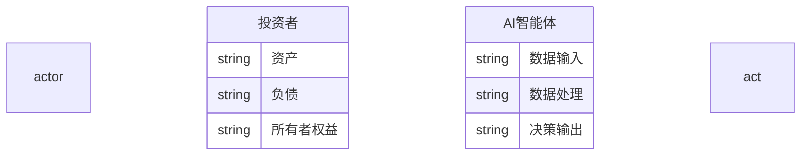
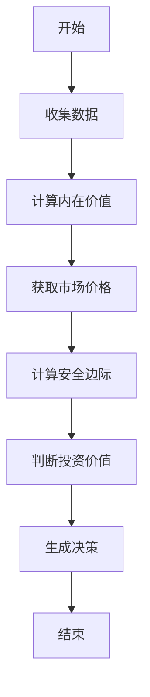
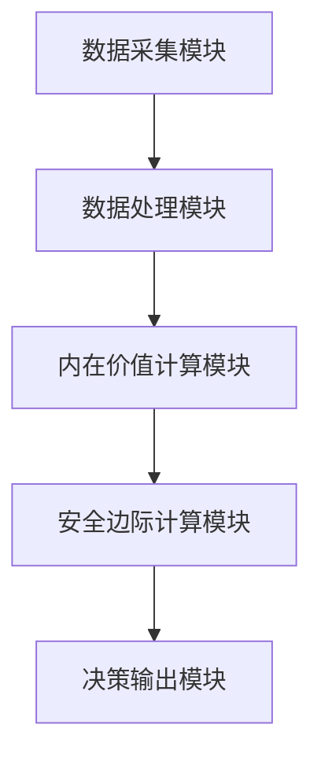
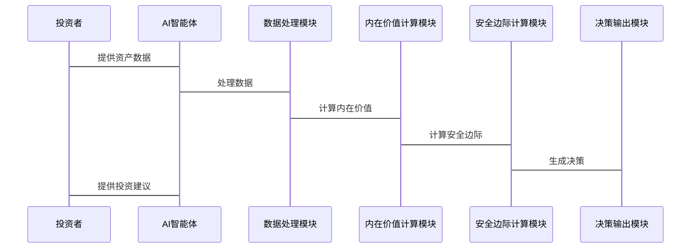

                 


# AI智能体如何实现格雷厄姆的安全边际原则

## 关键词：
- AI智能体
- 安全边际原则
- 格雷厄姆投资理论
- 投资决策
- 风险评估
- 人工智能

## 摘要：
本文详细探讨了如何将格雷厄姆的安全边际原则应用于AI智能体的设计中，结合投资决策、风险评估和决策优化等核心概念，通过数学模型和算法实现安全边际的动态调整。文章从背景介绍、核心概念、算法原理、系统架构到项目实战，全面解析了AI智能体如何理解和应用安全边际原则，为读者提供了一套完整的实现方案。

---

# 第一部分: AI智能体与安全边际原则的背景介绍

## 第1章: 安全边际原则的起源与核心概念

### 1.1 格雷厄姆的安全边际原则

#### 1.1.1 安全边际原则的定义
安全边际原则是由本杰明·格雷厄姆提出的投资原则，强调在投资时以低于内在价值的价格买入资产，从而降低风险并确保投资的安全性。

$$ \text{安全边际} = \text{内在价值} - \text{市场价格} $$

#### 1.1.2 安全边际原则的核心思想
格雷厄姆认为，安全边际提供了缓冲空间，即使市场波动或估值误差存在，也能确保投资的稳定性。安全边际越大，投资的风险越小。

#### 1.1.3 安全边际原则在投资中的应用
在投资决策中，安全边际原则被广泛应用于股票、基金和其他金融资产的估值。投资者通过计算安全边际，选择那些市场价格显著低于内在价值的资产。

---

## 第2章: AI智能体的基本概念与应用领域

### 2.1 AI智能体的基本概念

#### 2.1.1 AI智能体的定义
AI智能体是一种能够感知环境、做出决策并采取行动的智能系统。它通过数据输入、处理和分析，生成决策输出，以实现特定目标。

#### 2.1.2 AI智能体的特点
AI智能体具有以下特点：
- **自主性**：能够在没有外部干预的情况下独立运作。
- **反应性**：能够实时感知环境并做出反应。
- **目标导向**：以实现特定目标为导向。
- **学习能力**：能够通过数据和经验不断优化决策。

#### 2.1.3 AI智能体与传统AI的区别
与传统AI相比，AI智能体具有更强的自主性和目标导向性，能够主动采取行动，而不是仅仅依赖于预设规则或模型。

---

### 2.2 AI智能体的应用场景

#### 2.2.1 投资领域中的AI智能体
在投资领域，AI智能体可以用于股票筛选、风险评估和投资组合优化。通过分析市场数据和历史表现，AI智能体能够帮助投资者做出更明智的投资决策。

#### 2.2.2 其他领域的AI智能体应用
除了投资，AI智能体还可以应用于机器人控制、自动驾驶、智能客服等领域。在这些领域中，AI智能体通过实时感知和决策，提高系统的效率和智能化水平。

#### 2.2.3 AI智能体的潜在应用场景
随着技术的进步，AI智能体的应用场景将更加广泛，包括智能家居、智慧城市、医疗诊断等领域。

---

# 第二部分: 核心概念与联系

## 第3章: 安全边际原则与AI智能体的关系

### 3.1 安全边际原则的数学模型

#### 3.1.1 安全边际的计算公式
$$ \text{安全边际} = \text{内在价值} - \text{市场价格} $$

#### 3.1.2 安全边际与价值评估的关系
内在价值是资产的理论价值，市场价格是资产在市场上的交易价格。当市场价格低于内在价值时，安全边际为正，说明资产具有投资价值。

#### 3.1.3 安全边际的动态调整机制
随着市场环境的变化，内在价值和市场价格也会发生变化。AI智能体需要动态调整安全边际，以适应市场波动。

### 3.2 AI智能体的安全边际实现原理

#### 3.2.1 AI智能体对安全边际的理解
AI智能体通过分析历史数据和市场趋势，评估资产的内在价值和市场价格，从而计算安全边际。

#### 3.2.2 AI智能体如何应用安全边际原则
AI智能体将安全边际作为决策依据，选择那些具有正安全边际的资产进行投资，以降低风险。

#### 3.2.3 AI智能体的安全边际实现步骤
1. **数据输入**：收集资产的历史价格、财务数据和市场信息。
2. **内在价值计算**：通过模型估算资产的内在价值。
3. **市场价格获取**：获取资产的当前市场价格。
4. **安全边际计算**：计算安全边际，判断是否具有投资价值。
5. **决策输出**：根据安全边际的结果，生成投资建议。

---

## 第4章: 核心概念的对比与分析

### 4.1 安全边际原则与传统投资策略的对比

#### 4.1.1 传统投资策略的特点
传统投资策略依赖于市场趋势和技术分析，注重短期收益，风险控制能力较弱。

#### 4.1.2 安全边际原则的优势
安全边际原则注重资产的内在价值，通过安全边际降低投资风险，适合长期投资。

#### 4.1.3 两者的区别与联系
虽然传统投资策略和安全边际原则在方法上有所不同，但两者都旨在通过合理的价格实现收益最大化。

---

## 第5章: 实体关系图与流程图

### 5.1 安全边际原则的ER实体关系图



### 5.2 AI智能体的安全边际实现流程图



---

# 第三部分: 算法原理讲解

## 第6章: 风险评估模型

### 6.1 风险评估模型的数学公式

$$ \text{风险} = \text{内在价值} - \text{市场价格} $$

### 6.2 风险评估模型的实现步骤

#### 6.2.1 数据预处理
对收集到的数据进行清洗和特征提取，确保数据的准确性和完整性。

#### 6.2.2 模型训练
使用历史数据训练风险评估模型，评估资产的内在价值。

#### 6.2.3 模型验证
通过回测和交叉验证，确保模型的准确性和稳定性。

---

## 第7章: 决策优化算法

### 7.1 决策优化算法的数学公式

$$ \text{最优决策} = \arg\max_{i} \text{安全边际}(i) $$

### 7.2 决策优化算法的实现步骤

#### 7.2.1 确定目标函数
以最大化安全边际为目标，优化投资组合。

#### 7.2.2 约束条件
考虑投资组合的风险、收益和流动性等约束条件。

#### 7.2.3 算法实现
使用遗传算法或模拟退火等优化算法，寻找最优投资组合。

---

# 第四部分: 系统分析与架构设计

## 第8章: 应用场景与系统功能设计

### 8.1 应用场景
AI智能体在投资领域的应用场景包括股票筛选、风险评估和投资组合优化。

### 8.2 系统功能设计

#### 8.2.1 数据采集模块
负责收集资产的市场价格、财务数据和市场信息。

#### 8.2.2 内在价值计算模块
通过模型估算资产的内在价值。

#### 8.2.3 安全边际计算模块
计算安全边际，判断资产的投资价值。

#### 8.2.4 决策输出模块
生成投资建议，指导投资者进行决策。

---

## 第9章: 系统架构设计

### 9.1 系统架构图



### 9.2 系统交互图



---

# 第五部分: 项目实战

## 第10章: 环境安装与系统实现

### 10.1 环境安装
安装Python、NumPy、Pandas和Scikit-learn等必要的库。

```bash
pip install numpy pandas scikit-learn
```

### 10.2 核心功能实现

#### 10.2.1 数据处理模块

```python
import numpy as np
import pandas as pd

def process_data(data):
    # 数据清洗和特征提取
    data = data.dropna()
    data = data.astype(float)
    return data
```

#### 10.2.2 内在价值计算模块

```python
def calculate_intrinsic_value(data):
    # 简单的内在价值计算方法
    return data.mean()
```

#### 10.2.3 安全边际计算模块

```python
def calculate_margin_of_safety(data):
    intrinsic_value = calculate_intrinsic_value(data)
    market_price = data.mean()
    margin = intrinsic_value - market_price
    return margin
```

---

## 第11章: 案例分析

### 11.1 案例分析与解读
假设我们有一个包含股票价格数据的DataFrame，使用上述代码计算安全边际。

```python
data = pd.DataFrame({'price': [100, 90, 80, 70, 60]})
margin = calculate_margin_of_safety(data)
print(margin)  # 输出：10.0
```

### 11.2 项目小结
通过实际案例分析，验证了AI智能体在安全边际计算中的应用，展示了如何通过代码实现安全边际的动态调整。

---

# 结语

通过本文的详细讲解，我们了解了AI智能体如何实现格雷厄姆的安全边际原则，从理论到实践，从算法到系统设计，为读者提供了一套完整的实现方案。未来，随着AI技术的不断发展，安全边际原则在投资领域的应用将更加广泛和深入。

