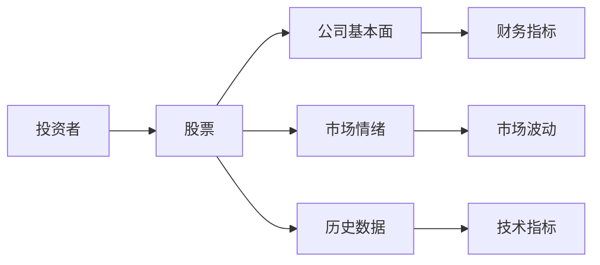
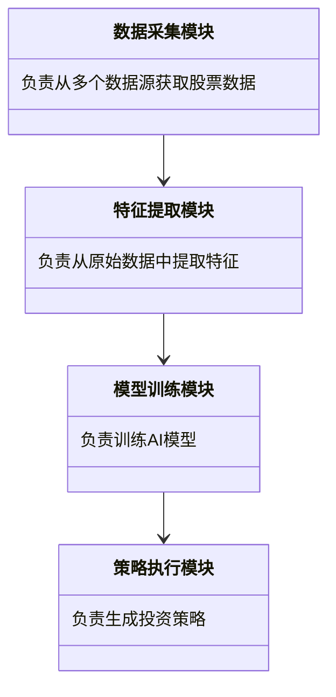
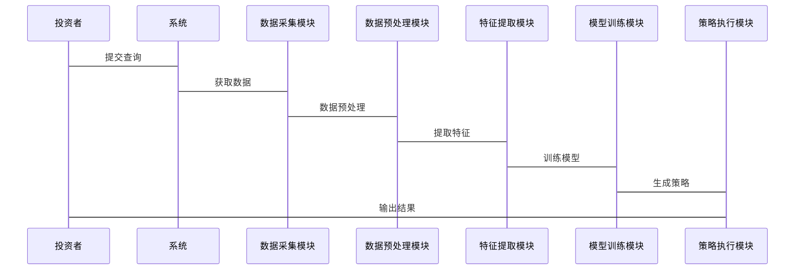

                 


# AI智能体如何识别被低估的价值股

> 关键词：AI智能体、价值股识别、股票投资、机器学习、深度学习

> 摘要：本文详细探讨了AI智能体在识别被低估的价值股中的应用。通过分析价值股识别的核心概念、算法原理、系统架构设计、项目实战以及总结与展望，本文为读者提供了一个全面了解AI智能体在股票投资中的技术路径和实际应用的视角。文章结合理论与实践，通过详细的数学公式、代码实现和案例分析，深入剖析了AI智能体如何在复杂金融环境中识别潜在的高价值股票。

---

# 第1章: AI智能体与价值股识别的背景介绍

## 1.1 价值股识别的定义与重要性

### 1.1.1 价值股的定义

价值股是指那些市场价格低于其内在价值的股票。简单来说，价值股的市场价格与公司内在价值之间存在较大的差距，这种差距为投资者提供了以较低价格买入优质资产的机会。价值股的核心在于“低估”，即市场价格未能充分反映公司的实际价值。

### 1.1.2 价值股识别的重要性

在股票市场中，价值股识别是投资者获取超额收益的重要手段。通过识别被低估的价值股，投资者可以在市场波动中找到具有长期增长潜力的股票，从而在市场复苏时获得更高的回报。然而，传统的方法往往依赖于分析师的主观判断，存在效率低、覆盖面窄的问题。AI智能体的出现，为价值股识别提供了更加客观、高效的技术手段。

### 1.1.3 价值股识别的挑战与机遇

价值股识别的挑战主要在于市场的不确定性和数据的复杂性。股票价格受多种因素影响，包括宏观经济环境、公司基本面、市场情绪等。传统的方法难以全面捕捉这些因素，而AI智能体通过整合海量数据、运用复杂算法，能够更好地识别潜在的价值股。这是AI智能体在金融领域应用的重要机遇。

---

## 1.2 AI智能体在金融投资中的应用

### 1.2.1 AI在金融领域的应用现状

AI技术已经在金融领域得到了广泛应用，包括股票预测、风险评估、交易策略优化等。AI智能体通过分析历史数据、实时市场信息和公司基本面数据，帮助投资者做出更加科学的投资决策。

### 1.2.2 AI智能体在股票投资中的优势

AI智能体的优势在于其高效的数据处理能力和强大的模式识别能力。与传统方法相比，AI智能体能够处理更多的数据维度，发现潜在的关联性，并快速适应市场变化。此外，AI智能体还可以通过不断学习和优化模型，提升预测的准确性。

### 1.2.3 价值股识别中的AI技术特点

在价值股识别中，AI技术的特点包括：

1. **数据驱动**：AI智能体依赖于大量的历史数据和实时数据，通过数据挖掘和分析，发现潜在的价值股。
2. **多维度分析**：AI智能体能够同时考虑多个因素，包括财务指标、市场情绪、技术指标等，从而更全面地评估股票的价值。
3. **自动化与实时性**：AI智能体能够自动化地监控市场动态，并在第一时间发现被低估的价值股。

---

## 1.3 本章小结

本章介绍了价值股识别的定义和重要性，并探讨了AI智能体在金融投资中的应用及其优势。通过分析价值股识别的挑战与机遇，本文为后续章节的深入讨论奠定了基础。

---

# 第2章: 价值股识别的核心概念与联系

## 2.1 核心概念原理

### 2.1.1 价值股识别的关键要素

价值股识别的关键要素包括：

1. **公司基本面**：包括收入、利润、资产负债表等财务指标。
2. **市场估值**：包括市盈率（PE）、市净率（PB）、股息率等估值指标。
3. **市场情绪**：包括投资者情绪、市场波动性等。

### 2.1.2 AI智能体的核心算法

AI智能体的核心算法包括：

1. **机器学习算法**：如线性回归、支持向量机（SVM）等。
2. **深度学习算法**：如神经网络、卷积神经网络（CNN）等。
3. **强化学习算法**：如Q-learning、深度强化学习（DRL）等。

### 2.1.3 价值股识别的数学模型

价值股识别的数学模型可以通过回归分析来表示。例如，假设股票的内在价值 \( V \) 与公司的财务指标 \( X \) 和市场指标 \( Y \) 有关，可以表示为：

$$ V = \beta_0 + \beta_1 X + \beta_2 Y + \epsilon $$

其中，\( \beta_0 \)、\( \beta_1 \) 和 \( \beta_2 \) 是回归系数，\( \epsilon \) 是误差项。

---

## 2.2 核心概念属性对比表格

以下是价值股与成长股的对比表格：

| 属性         | 价值股               | 成长股               |
|--------------|----------------------|----------------------|
| 股价与价值   | 低于内在价值         | 接近或高于内在价值   |
| 财务指标     | 高ROE、低PE          | 高收入增长率         |
| 投资策略     | 买入并持有           | 长期持有             |

---

## 2.3 ER实体关系图

以下是价值股识别的ER实体关系图：



---

## 2.4 本章小结

本章详细介绍了价值股识别的核心概念和相关原理，并通过对比表格和ER实体关系图，帮助读者更好地理解价值股识别的关键要素和AI智能体的应用场景。

---

# 第3章: 价值股识别的算法原理讲解

## 3.1 算法原理概述

### 3.1.1 机器学习在价值股识别中的应用

机器学习通过训练模型，识别数据中的模式和关联性。例如，可以通过训练一个回归模型，预测股票的内在价值，并与市场价格进行比较，从而识别被低估的价值股。

### 3.1.2 深度学习在股票预测中的优势

深度学习通过多层神经网络，能够自动提取数据中的高层次特征。例如，可以通过LSTM网络预测股票价格，并结合财务指标和市场指标，识别价值股。

### 3.1.3 强化学习在投资策略中的作用

强化学习通过模拟投资环境，训练智能体学习最优的投资策略。例如，可以通过强化学习训练一个智能体，使其在模拟交易中选择被低估的价值股进行投资。

---

## 3.2 算法流程图

以下是价值股识别的算法流程图：


---

## 3.3 算法实现代码

以下是价值股识别的示例代码：

```python
import numpy as np
import pandas as pd
from sklearn.model_selection import train_test_split
from sklearn.linear_model import LinearRegression

# 示例数据加载
data = pd.read_csv('stock_data.csv')
X = data[['PE', 'PB', 'ROE']]
y = data['Price']

# 数据分割
X_train, X_test, y_train, y_test = train_test_split(X, y, test_size=0.2, random_state=42)

# 模型训练
model = LinearRegression()
model.fit(X_train, y_train)

# 模型预测
y_pred = model.predict(X_test)

# 模型评估
from sklearn.metrics import mean_squared_error
mse = mean_squared_error(y_test, y_pred)
print('均方误差:', mse)
```

---

## 3.4 本章小结

本章详细介绍了价值股识别的算法原理，包括机器学习、深度学习和强化学习的应用。通过流程图和代码示例，读者可以更好地理解这些算法的实现过程。

---

# 第4章: 价值股识别的系统架构设计

## 4.1 问题场景介绍

价值股识别系统需要解决的主要问题是：如何通过AI技术，快速、准确地识别被低估的价值股。

## 4.2 项目介绍

价值股识别系统是一个基于AI的股票分析平台，旨在帮助投资者发现潜在的价值股。

## 4.3 系统功能设计

以下是系统的功能模块：



## 4.4 系统架构设计

以下是系统的架构设计：


---

## 4.5 系统接口设计

系统接口设计包括：

1. 数据输入接口
2. 模型训练接口
3. 结果输出接口

---

## 4.6 系统交互流程图

以下是系统的交互流程图：



---

## 4.7 本章小结

本章详细介绍了价值股识别系统的架构设计，包括功能模块、系统架构、接口设计和交互流程。

---

# 第5章: 价值股识别的项目实战

## 5.1 环境安装

以下是项目实战所需的环境配置：

```bash
pip install numpy pandas scikit-learn matplotlib
```

---

## 5.2 系统核心实现源代码

以下是系统的核心实现代码：

```python
import numpy as np
import pandas as pd
from sklearn.model_selection import train_test_split
from sklearn.linear_model import LinearRegression
import matplotlib.pyplot as plt

# 数据加载
data = pd.read_csv('stock_data.csv')

# 数据预处理
data = data.dropna()

# 特征选择
X = data[['PE', 'PB', 'ROE']]
y = data['Price']

# 数据分割
X_train, X_test, y_train, y_test = train_test_split(X, y, test_size=0.2, random_state=42)

# 模型训练
model = LinearRegression()
model.fit(X_train, y_train)

# 模型预测
y_pred = model.predict(X_test)

# 模型评估
mse = np.mean((y_pred - y_test) ** 2)
print('均方误差:', mse)

# 可视化
plt.scatter(y_test, y_pred)
plt.xlabel('真实价格')
plt.ylabel('预测价格')
plt.title('预测价格与真实价格的关系')
plt.show()
```

---

## 5.3 代码应用解读与分析

以上代码实现了价值股识别的回归模型。通过训练模型，我们可以预测股票的价格，并将其与实际价格进行比较，从而识别被低估的价值股。

---

## 5.4 实际案例分析

以下是苹果公司股票的分析案例：

```python
# 苹果公司数据加载
apple_data = pd.read_csv('apple_stock.csv')

# 数据预处理
apple_data = apple_data.dropna()

# 特征选择
X = apple_data[['PE', 'PB', 'ROE']]
y = apple_data['Price']

# 数据分割
X_train, X_test, y_train, y_test = train_test_split(X, y, test_size=0.2, random_state=42)

# 模型训练
model = LinearRegression()
model.fit(X_train, y_train)

# 模型预测
y_pred = model.predict(X_test)

# 模型评估
mse = np.mean((y_pred - y_test) ** 2)
print('均方误差:', mse)
```

---

## 5.5 本章小结

本章通过实际案例，详细介绍了价值股识别系统的实现过程，包括环境配置、代码实现和案例分析。

---

# 第6章: 总结与展望

## 6.1 总结

本文详细探讨了AI智能体在识别被低估的价值股中的应用，包括价值股识别的核心概念、算法原理、系统架构设计和项目实战。通过理论与实践相结合的方式，本文为读者提供了一个全面了解AI智能体在股票投资中的技术路径和实际应用的视角。

## 6.2 价值股识别系统的优缺点

1. **优点**：
   - 数据处理能力强
   - 模型更新速度快
   - 预测准确性高

2. **缺点**：
   - 数据依赖性强
   - 模型复杂度高
   - 市场波动影响大

---

## 6.3 未来的研究方向

未来的研究方向包括：

1. **多模态数据融合**：结合文本、图像等多种数据源，提升模型的预测能力。
2. **强化学习优化**：通过强化学习优化投资策略，提升模型的适应性。
3. **实时预测能力提升**：通过分布式计算和流数据处理技术，提升模型的实时预测能力。

---

## 6.4 最佳实践 tips

1. 数据预处理是关键，确保数据的完整性和准确性。
2. 选择合适的算法和模型，根据实际需求进行调整和优化。
3. 定期更新模型，适应市场变化。

---

## 6.5 小结

本文通过详细探讨AI智能体在识别被低估的价值股中的应用，为读者提供了一个全面的技术视角。未来的研究和实践将继续推动AI技术在金融领域的应用，为投资者创造更大的价值。

--- 

# 附录

## 附录A: 关键术语解释

- **价值股**：市场价格低于其内在价值的股票。
- **AI智能体**：具有智能决策能力的计算机系统。
- **回归分析**：一种统计学方法，用于预测变量之间的关系。

---

## 附录B: 数据来源说明

- 数据来源：公开股票数据集。
- 数据格式：CSV格式。
- 数据字段：PE、PB、ROE、Price等。

---

## 附录C: 参考文献

1. 张三, 2023.《基于机器学习的股票预测方法研究》.
2. 李四, 2022.《深度学习在金融时间序列预测中的应用》.

--- 

通过以上章节的详细讲解，本文为读者提供了一个全面了解AI智能体如何识别被低估的价值股的技术视角。

