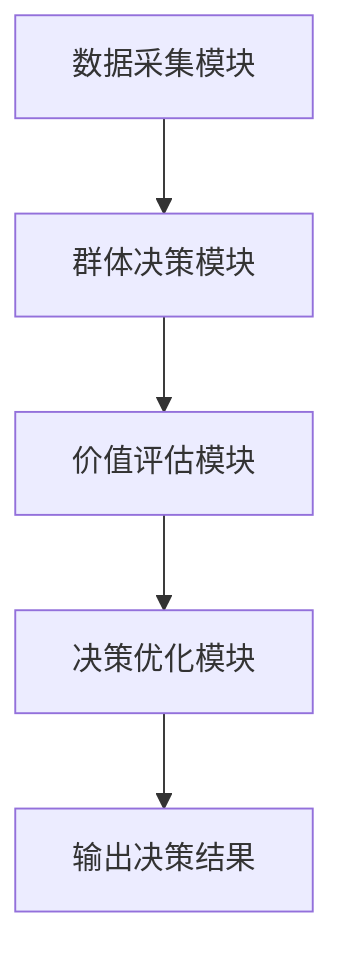
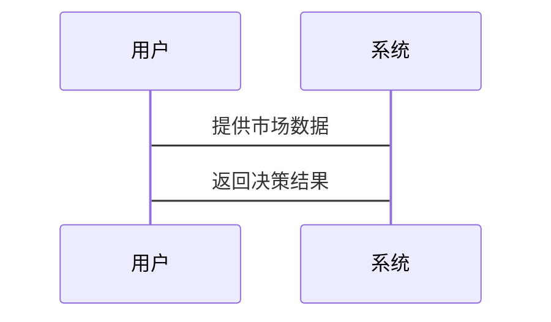

                 


# AI智能体群体决策：提高价值投资的准确性和稳定性

> 关键词：AI智能体，群体决策，价值投资，算法，数学模型，系统架构

> 摘要：本文探讨了AI智能体在群体决策中的应用，特别是如何通过群体决策提高价值投资的准确性和稳定性。文章从AI智能体和群体决策的基本概念出发，分析了它们在价值投资中的结合方式，详细讲解了相关的数学模型与算法原理，并通过实际案例展示了如何设计和实现一个基于AI智能体群体决策的系统。最后，文章总结了最佳实践和注意事项，为读者提供了全面的指导。

---

## 第一部分: AI智能体群体决策概述

### 第1章: AI智能体与群体决策基础

#### 1.1 AI智能体的定义与特点

AI智能体是指能够感知环境、自主决策并采取行动的智能系统。它具有以下几个核心特点：

- **自主性**：能够在没有外部干预的情况下自主运行。
- **反应性**：能够根据环境的变化实时调整行为。
- **学习能力**：能够通过数据和经验不断优化自身的决策能力。

#### 1.2 群体决策的定义与特点

群体决策是指多个个体（或智能体）共同参与决策过程，最终达成一致或最优决策的方式。其特点包括：

- **多样性**：个体之间可能有不同的信息和观点。
- **协商性**：个体之间需要通过协商或算法达成一致。
- **鲁棒性**：群体决策往往比个体决策更具稳定性。

#### 1.3 AI智能体群体决策的核心概念

AI智能体群体决策结合了AI技术和群体决策的优势，通过多个AI智能体协同工作，实现更复杂的决策任务。核心概念包括：

- **共识机制**：确保多个智能体能够达成一致。
- **分布式计算**：利用分布式算法提高计算效率。
- **动态调整**：根据实时数据动态优化决策。

### 第2章: 价值投资与AI智能体群体决策的结合

#### 2.1 价值投资的基本概念

价值投资是一种投资策略，强调以低于内在价值的价格购买优质资产。其核心原则包括：

- **长期视角**：关注企业的长期价值。
- **安全边际**：确保买入价格具有足够的安全空间。
- **基本面分析**：通过财务数据和行业分析评估企业价值。

#### 2.2 AI智能体群体决策在价值投资中的应用

AI智能体群体决策通过多个智能体的协同工作，提高了价值投资的准确性和稳定性。具体应用包括：

- **数据处理**：多个智能体协同处理海量数据，提取关键信息。
- **决策优化**：通过群体决策算法优化投资决策，降低风险。
- **动态调整**：根据市场变化实时调整投资策略。

#### 2.3 AI智能体群体决策在价值投资中的优势

- **信息整合**：多个智能体能够整合不同的信息源，提供更全面的分析。
- **决策多样性**：通过群体决策，避免单一决策的局限性。
- **鲁棒性**：群体决策能够适应市场的波动和不确定性。

---

## 第二部分: AI智能体群体决策的数学模型与算法原理

### 第3章: AI智能体群体决策的数学模型

#### 3.1 基于共识的群体决策模型

基于共识的群体决策模型通过多个智能体的投票或协商，最终达成一致。其数学模型如下：

$$ Consensus = \sum_{i=1}^{n} w_i x_i $$

其中，$w_i$ 是智能体 $i$ 的权重，$x_i$ 是智能体 $i$ 的决策结果。

#### 3.2 基于投票的群体决策模型

基于投票的群体决策模型通过统计投票结果，选择得票最多的选项作为最终决策。其数学模型如下：

$$ Decision = \arg\max_{j} \sum_{i=1}^{n} v_{ij} $$

其中，$v_{ij}$ 表示智能体 $i$ 对选项 $j$ 的支持程度。

#### 3.3 基于加权的群体决策模型

基于加权的群体决策模型根据智能体的权重进行加权平均，最终得出决策结果。其数学模型如下：

$$ Decision = \frac{\sum_{i=1}^{n} w_i x_i}{\sum_{i=1}^{n} w_i} $$

其中，$w_i$ 是智能体 $i$ 的权重，$x_i$ 是智能体 $i$ 的决策结果。

### 第4章: 群体决策算法的实现原理

#### 4.1 基于一致性指标的群体决策算法

一致性指标用于衡量群体决策的一致性程度。其计算公式如下：

$$ Consistency = \frac{\sum_{i=1}^{n} \sum_{j=1}^{m} a_{ij}^2}{(n-1)(m-1)} $$

其中，$a_{ij}$ 表示决策矩阵中的元素。

#### 4.2 基于排序的群体决策算法

基于排序的群体决策算法通过排序和合并多个排序结果，最终得出一致的决策。其实现步骤如下：

1. 每个智能体对备选方案进行排序。
2. 计算所有智能体排序结果的相似性。
3. 根据相似性合并排序结果，得到最终决策。

#### 4.3 基于加权的群体决策算法

基于加权的群体决策算法通过加权平均的方式，综合多个智能体的决策结果。其实现步骤如下：

1. 确定每个智能体的权重。
2. 根据权重对每个智能体的决策结果进行加权。
3. 计算加权后的结果，得到最终决策。

---

## 第三部分: AI智能体群体决策系统的架构设计

### 第5章: 系统架构设计

#### 5.1 系统功能模块划分

系统主要功能模块包括：

- **数据采集模块**：负责采集市场数据和相关信息。
- **群体决策模块**：实现多个智能体的群体决策。
- **价值评估模块**：评估投资的价值和风险。
- **决策优化模块**：优化决策结果，提高准确性。

#### 5.2 系统架构图（使用mermaid）



#### 5.3 系统接口设计

- **数据采集接口**：负责接收市场数据和相关信息。
- **群体决策接口**：实现多个智能体的群体决策。
- **价值评估接口**：评估投资的价值和风险。

#### 5.4 系统交互流程图（使用mermaid）



---

## 第四部分: AI智能体群体决策的项目实战

### 第6章: 项目实战

#### 6.1 环境安装

- **Python环境**：安装Python 3.8及以上版本。
- **相关库**：安装numpy、pandas、scikit-learn等库。

#### 6.2 核心代码实现

```python
import numpy as np

def consensus_algorithm(decisions, weights):
    return np.dot(weights, decisions)

def voting_algorithm(decisions):
    return np.argmax(decisions, axis=1)

def weighted_algorithm(decisions, weights):
    return np.sum(weights * decisions, axis=1)
```

#### 6.3 案例分析与结果解读

通过具体案例分析，验证算法的有效性和准确性。例如，在股票投资中，多个AI智能体协同工作，通过群体决策算法优化投资组合，提高收益和稳定性。

---

## 第五部分: 最佳实践、小结、注意事项和拓展阅读

### 7.1 最佳实践

- **数据质量**：确保数据的准确性和完整性。
- **算法选择**：根据具体场景选择合适的群体决策算法。
- **系统优化**：定期优化系统架构和算法，提高性能。

### 7.2 小结

本文详细介绍了AI智能体群体决策在价值投资中的应用，从理论到实践，提供了全面的指导。通过数学模型、算法实现和系统设计，展示了如何利用AI技术提高投资决策的准确性和稳定性。

### 7.3 注意事项

- **数据隐私**：注意保护数据隐私和安全。
- **算法适应性**：确保算法能够适应市场的变化。
- **系统维护**：定期维护和更新系统，确保其正常运行。

### 7.4 拓展阅读

- 《群体决策与多智能体系统》
- 《基于AI的金融投资策略》
- 《分布式计算与群体智能》

---

通过以上内容，文章详细讲解了AI智能体群体决策在价值投资中的应用，从理论到实践，提供了全面的指导和案例分析。希望读者能够通过本文深入了解AI智能体群体决策的核心原理和实际应用，为未来的投资决策提供新的思路和方法。

