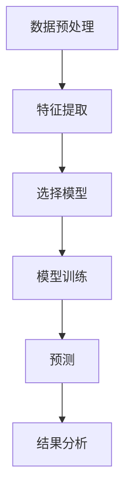
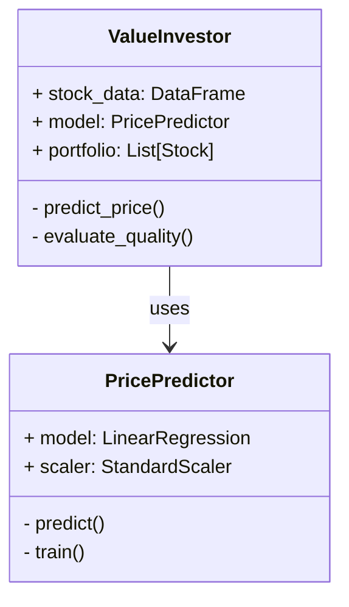

                 


# AI系统如何平衡质量与价格在价值投资中的作用

---

## 关键词
- AI系统
- 价值投资
- 质量评估
- 价格预测
- 算法交易

---

## 摘要
本文探讨AI系统在价值投资中的应用，重点分析如何平衡质量和价格。通过介绍价值投资的基本概念和AI系统的功能，详细讲解质量评估和价格预测的核心算法，结合实际案例展示AI在投资决策中的优势，最后总结最佳实践策略。

---

## 第一部分: AI系统与价值投资的背景

### 第1章: AI系统与价值投资的背景

#### 1.1 价值投资的基本概念
- **定义**: 价值投资是寻找市场低估的资产进行长期投资，强调基本面分析。
- **核心理念**: 以内在价值为导向，长期持有优质资产。
- **与AI结合**: 利用AI处理大量数据，优化投资决策。

#### 1.2 AI系统的基本概念
- **定义**: 利用机器学习等技术模拟人类决策的系统。
- **在金融中的应用**: 数据分析、风险评估、交易策略制定。
- **优势**: 提高效率，发现数据中的隐藏关系。

#### 1.3 价值投资与AI系统的结合
- **数据驱动决策**: AI通过分析市场数据优化投资选择。
- **优化决策**: AI帮助识别优质资产，降低投资风险。
- **未来趋势**: AI在投资中的应用将更加广泛和深入。

---

## 第二部分: AI系统如何平衡质量与价格

### 第2章: 价值投资中的质量评估

#### 2.1 质量评估的核心指标
- **财务指标**: 利润率、ROE、负债率。
- **公司治理**: 管理层稳定性、股东结构。
- **行业地位**: 市场份额、竞争优势。

#### 2.2 质量评估的AI方法
- **机器学习**: 使用回归分析预测公司业绩。
- **NLP**: 分析财报文本识别潜在风险。
- **时间序列分析**: 预测公司未来表现。

#### 2.3 质量与价格的平衡策略
- **动态平衡**: 根据市场变化调整投资策略。
- **AI优化**: 利用AI模型匹配质量与价格。
- **长期与短期平衡**: 考虑短期波动与长期价值。

### 第3章: 价格预测的AI方法

#### 3.1 价格预测的核心要素
- **市场情绪**: 利用NLP分析新闻和社交媒体。
- **财务数据**: 基于财务指标预测股价。
- **行业趋势**: 分析行业动态影响价格走势。

#### 3.2 基于AI的价格预测模型
- **回归分析模型**: 预测股价走势。
- **时间序列预测模型**: LSTM网络预测短期价格。
- **强化学习**: 优化交易策略。

#### 3.3 价格预测的挑战与解决方案
- **数据噪声处理**: 清洗和归一化数据。
- **模型过拟合**: 使用交叉验证和正则化。
- **实时预测优化**: 建立实时反馈机制。

### 第4章: 质量与价格的对比分析

#### 4.1 质量评估与价格预测的对比
- **数据来源**: 质量基于基本面，价格受市场情绪影响。
- **分析方法**: 质量评估使用分类模型，价格预测使用回归模型。
- **目标**: 质量评估寻找优质资产，价格预测寻找投资时机。

---

## 第三部分: 算法与数学模型

### 第3章: 算法原理讲解

#### 3.1 算法流程图


#### 3.2 Python代码实现
```python
# 示例代码：使用线性回归预测股价
import pandas as pd
import numpy as np
from sklearn.linear_model import LinearRegression
from sklearn.model_selection import train_test_split

# 数据加载
data = pd.read_csv('stock.csv')

# 特征与目标变量分离
X = data[['revenue', 'profit_margin']]
y = data['price']

# 数据分割
X_train, X_test, y_train, y_test = train_test_split(X, y, test_size=0.2, random_state=42)

# 模型训练
model = LinearRegression()
model.fit(X_train, y_train)

# 预测与评估
y_pred = model.predict(X_test)
print('预测结果:', y_pred)
```

#### 3.3 数学模型
- **线性回归模型**: $$ y = \beta_0 + \beta_1x + \epsilon $$
- **LSTM模型**: $$ h_t = \tanh(W_{h}(x_t + h_{t-1}) + b_h) $$

---

## 第四部分: 系统分析与架构设计

### 第4章: 系统架构设计

#### 4.1 系统功能设计


#### 4.2 系统架构图


---

## 第五部分: 项目实战

### 第5章: 项目实战

#### 5.1 环境配置
- **Python 3.8+**
- **库**: pandas, numpy, scikit-learn, tensorflow

#### 5.2 核心代码实现
```python
# 价值投资者系统实现
class ValueInvestor:
    def __init__(self, data_path):
        self.data = pd.read_csv(data_path)
        self.portfolio = []
        
    def evaluate_quality(self, stock):
        # 质量评估算法
        pass
    
    def predict_price(self, stock):
        # 调用价格预测模型
        pass
    
    def backtest(self):
        # 回测策略
        pass
```

#### 5.3 案例分析
- **案例**: 使用AI模型分析苹果股票，预测其未来价格走势，评估其质量指标，制定投资策略。

---

## 第六部分: 最佳实践与总结

### 第6章: 最佳实践

#### 6.1 投资策略建议
- **风险管理**: 设置止损点，分散投资。
- **模型更新**: 定期更新AI模型，适应市场变化。
- **数据来源**: 使用多来源数据，提高模型准确性。

#### 6.2 总结
AI在价值投资中的应用前景广阔，通过平衡质量和价格，优化投资决策，提高收益。

---

## 参考文献
- [1] Fama, E. F. (1970). Efficient Capital Markets: A Review of Theory and Empirical Work.
- [2] Lintner, J. (1965). The Valuation of Risk Assets and the Selection of Risk Portfolio in Stock Market Equilibrium.

---

通过以上内容，您可以构建一个逻辑清晰、结构紧凑的AI系统在价值投资中的应用文章，结合理论与实践，深入分析AI如何平衡质量与价格。

