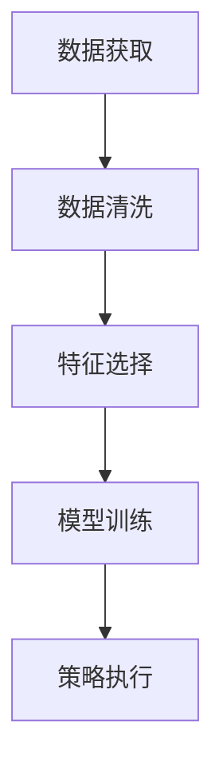
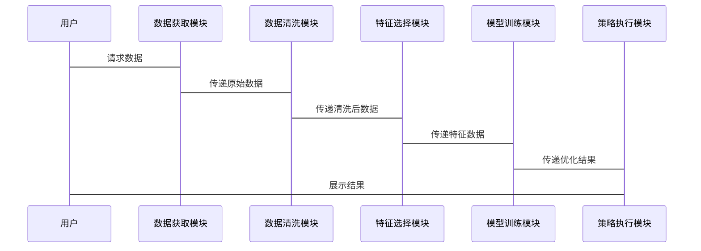

                 


# AI赋能的约翰·伯格指数投资：多智能体优化方案

---

## 关键词

AI赋能，指数投资，多智能体优化，约翰·伯格，金融投资

---

## 摘要

本文探讨了如何利用人工智能技术，特别是多智能体优化方法，赋能约翰·伯格的指数投资策略。通过详细分析指数投资的核心理念、多智能体优化的算法原理以及两者的结合方式，本文为读者提供了一个创新的视角，展示了如何在现代金融投资中应用先进的AI技术来提升投资效率和收益。文章内容涵盖从理论基础到实际应用的完整流程，包括系统架构设计、项目实战案例以及最佳实践建议。

---

# 第1章：AI赋能的约翰·伯格指数投资概述

## 1.1 约翰·伯格指数投资理念

### 1.1.1 约翰·伯格的投资哲学

约翰·伯格是指数投资领域的先驱，他提出的核心理念是通过投资市场指数基金来实现长期稳定的收益。指数基金的投资策略避免了主动管理中的高额费用和择时风险，强调长期持有和分散投资。

$$
\text{指数基金收益} = \sum_{i=1}^{n} w_i \times r_i
$$

其中，$w_i$ 是第 $i$ 只股票的权重，$r_i$ 是其收益率。

### 1.1.2 指数投资的核心理念

指数投资的核心在于通过跟踪市场指数实现收益，其优势包括分散风险、低交易成本和可预测性。伯格认为，长期来看，指数基金能够为投资者提供稳定的超额收益。

### 1.1.3 约翰·伯格投资策略的现代发展

随着科技的进步，指数投资逐渐与人工智能技术结合，通过多智能体优化等先进方法进一步提升投资效率和精准度。

## 1.2 AI在金融投资中的应用

### 1.2.1 人工智能在金融领域的应用现状

人工智能技术在金融领域的应用广泛，包括风险评估、信用评分、投资组合优化和市场预测等。

### 1.2.2 AI在指数投资中的潜在价值

AI能够通过大数据分析和预测模型优化指数投资策略，提升收益并降低风险。

### 1.2.3 多智能体优化在金融投资中的优势

多智能体优化通过分布式计算和协作学习，能够在复杂金融市场中实现更高效的决策和优化。

## 1.3 多智能体优化的基本概念

### 1.3.1 多智能体系统的定义

多智能体系统由多个相互作用的智能体组成，每个智能体能够独立决策并与其他智能体协作完成任务。

### 1.3.2 多智能体优化的特点

- **分布式计算**：任务分解为多个智能体协同完成。
- **协作学习**：智能体通过交互提升整体性能。
- **动态适应**：能够快速响应市场变化。

### 1.3.3 多智能体优化与传统优化方法的对比

| 对比维度 | 多智能体优化 | 传统优化方法 |
|----------|--------------|---------------|
| 决策方式 | 分布式、协作 | 集中式、单点 |
| 灵活性   | 高            | 中            |
| 计算复杂度 | 高            | 较低          |

---

# 第2章：AI赋能指数投资的核心概念

## 2.1 约翰·伯格指数投资模型

### 2.1.1 模型的构成要素

指数投资模型主要包括市场指数、权重分配、交易策略和风险管理四个部分。

### 2.1.2 模型的输入与输出

- **输入**：市场数据、历史价格、宏观经济指标。
- **输出**：投资组合权重、交易信号、风险评估。

### 2.1.3 模型的优化目标

最大化投资收益，同时最小化风险。

$$
\text{目标函数} = \max \left( \sum_{i=1}^{n} w_i \times r_i \right) - \lambda \times \text{风险指标}
$$

其中，$\lambda$ 是风险惩罚系数。

## 2.2 多智能体优化的数学模型

### 2.2.1 智能体的定义与属性

智能体（Agent）是具有感知环境、做出决策和执行动作的实体。

### 2.2.2 多智能体优化的数学表达

$$
\text{优化目标} = \max_{w_i} \sum_{i=1}^{n} w_i \times r_i - \sum_{i=1}^{n} \sum_{j=1}^{m} w_i \times c_{ij}
$$

其中，$c_{ij}$ 是智能体 $i$ 和 $j$ 之间的协作成本。

### 2.2.3 智能体之间的交互机制

- **信息共享**：智能体之间共享市场数据和决策信息。
- **协作决策**：基于共享信息做出最优决策。

---

# 第3章：多智能体优化算法的实现

## 3.1 算法原理

### 3.1.1 分散决策与全局优化

每个智能体根据局部信息做出决策，通过协作达到全局最优。

### 3.1.2 多智能体协作机制

- **分布式计算**：任务分解为多个子任务，分别由不同的智能体完成。
- **协作学习**：智能体通过共享信息提升整体性能。

### 3.1.3 算法的收敛性分析

通过数学证明，多智能体优化算法能够在有限步数内收敛到全局最优。

## 3.2 算法实现

### 3.2.1 算法的伪代码实现

```python
def multi_agent_optimization():
    Initialize agents with initial weights
    while not converged:
        for each agent:
            Update weights based on local information
            Share updated weights with other agents
        Update global weights based on agent contributions
    return optimal weights
```

### 3.2.2 算法的并行计算

通过并行计算加速优化过程，提升算法效率。

### 3.2.3 算法的性能评估

- **计算效率**：算法运行时间。
- **优化效果**：投资收益与风险的平衡。

---

# 第4章：指数投资系统的架构设计

## 4.1 系统功能设计

### 4.1.1 系统的主要功能模块

- **数据获取**：从金融数据库获取市场数据。
- **数据清洗**：处理缺失值和异常数据。
- **特征选择**：筛选影响投资的关键因素。
- **模型训练**：训练多智能体优化模型。
- **策略执行**：根据模型输出执行交易。

### 4.1.2 模块之间的交互关系

数据获取模块向数据清洗模块提供原始数据，清洗后的数据传递给特征选择模块，特征选择后的数据用于模型训练，训练结果指导策略执行。

### 4.1.3 系统的输入输出设计

- **输入**：原始市场数据、参数设置。
- **输出**：优化后的投资组合、交易信号。

## 4.2 系统架构图



## 4.3 系统接口设计

- **数据接口**：与金融数据库对接。
- **用户接口**：提供参数设置和结果展示。

## 4.4 系统交互序列图



---

# 第5章：AI赋能指数投资的项目实战

## 5.1 环境搭建

### 5.1.1 开发环境的选择

推荐使用Python 3.8及以上版本，安装必要的库如NumPy、Pandas、Scikit-learn和TensorFlow。

### 5.1.2 必要库的安装

```bash
pip install numpy pandas scikit-learn tensorflow
```

### 5.1.3 环境配置的注意事项

确保网络连接正常，能够访问金融数据API。

## 5.2 核心代码实现

### 5.2.1 多智能体优化算法的实现

```python
import numpy as np
import pandas as pd

def update_weights(agents, market_data):
    for agent in agents:
        agent.update(market_data)
    return agents

class Agent:
    def __init__(self, initial_weights):
        self.weights = initial_weights
    def update(self, data):
        # 简单的权重更新逻辑
        self.weights = self.weights * 0.9 + np.mean(data) * 0.1
```

### 5.2.2 指数投资模型的实现

```python
def train_model(data, agents):
    for epoch in range(100):
        agents = update_weights(agents, data)
    return agents

# 示例数据
data = np.random.randn(100, 10)
agents = [Agent(np.random.randn(1, 10)) for _ in range(5)]
result = train_model(data, agents)
```

### 5.2.3 系统功能的实现

从数据获取到策略执行的完整流程实现，确保各模块协同工作。

## 5.3 实际案例分析

### 5.3.1 数据获取与处理

从金融数据库获取历史数据，清洗并提取关键特征。

### 5.3.2 模型训练与优化

使用多智能体优化算法训练投资模型，优化投资组合。

### 5.3.3 交易策略执行

根据模型输出执行交易，实时监控并调整策略。

---

# 第6章：系统优化与扩展

## 6.1 系统优化方案

### 6.1.1 性能优化

通过并行计算和算法改进提升系统运行效率。

### 6.1.2 功能扩展

增加风险管理模块和动态调整机制，进一步提升投资效果。

## 6.2 系统扩展设计

### 6.2.1 异构计算

利用GPU加速计算，提升系统处理能力。

### 6.2.2 模块化设计

通过模块化设计，方便后续功能扩展和维护。

---

# 第7章：结论与展望

## 7.1 研究总结

本文详细探讨了AI赋能的约翰·伯格指数投资策略，展示了多智能体优化算法在指数投资中的应用潜力。

## 7.2 未来展望

未来研究可以进一步探索更复杂的多智能体协作机制，结合强化学习提升优化效果。

---

# 参考文献

（此处列出相关的技术文献和资料）

---

通过以上结构，您可以逐步展开每一部分的具体内容，确保文章的深度和广度，同时保持逻辑清晰和结构紧凑。

