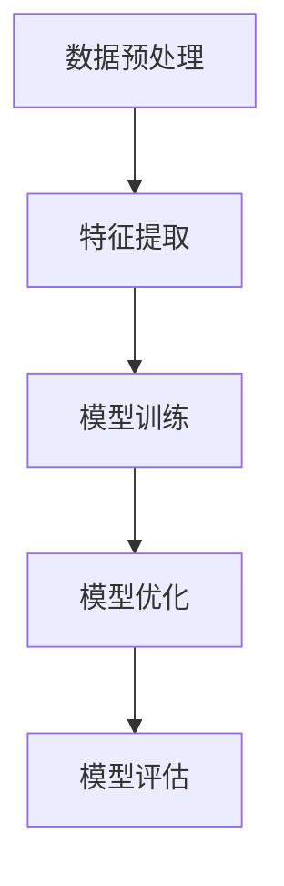
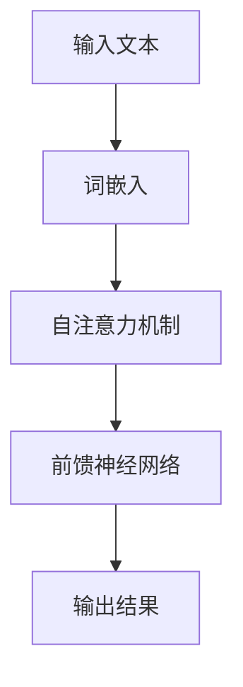
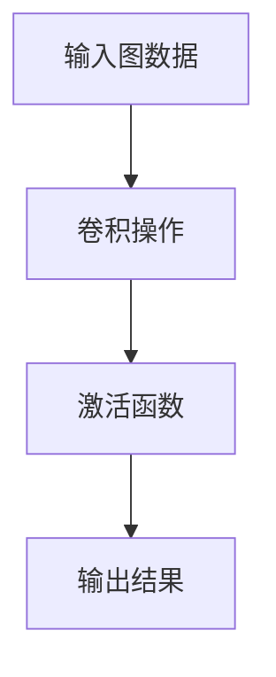
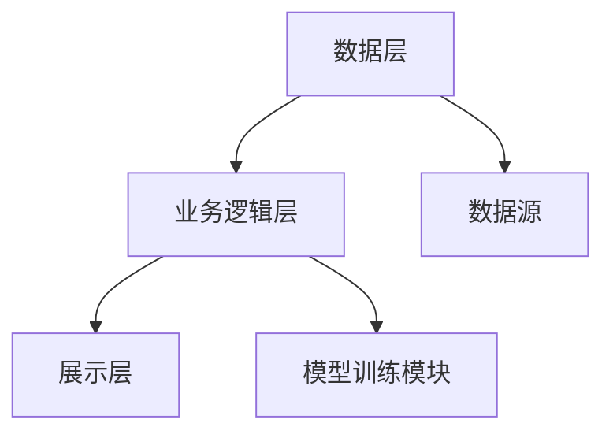
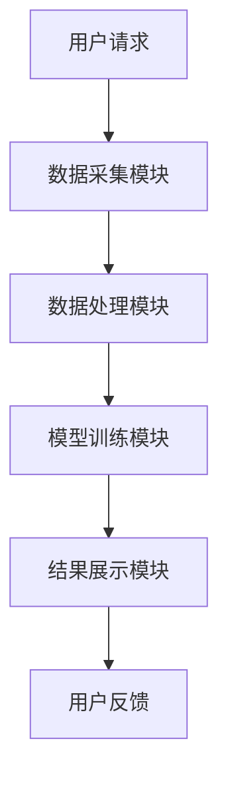

                 


# AI辅助的ESG投资影响评估

## 关键词：
- AI, ESG投资, 机器学习, 深度学习, 图神经网络

## 摘要：
随着全球对可持续发展的关注增加，ESG（环境、社会、治理）投资逐渐成为金融领域的重要方向。本文探讨了如何利用人工智能技术辅助ESG投资影响评估，从核心概念、算法原理到系统设计，再到实际案例，系统性地分析了AI在ESG评估中的应用。通过详细的技术分析和实际应用案例，展示了AI如何提升ESG投资的效率和准确性，为投资者和企业提供科学的决策支持。

---

# 第1章: ESG投资与AI辅助评估的背景介绍

## 1.1 ESG投资的基本概念

### 1.1.1 什么是ESG投资
ESG投资是一种关注环境、社会和治理因素的投资策略。投资者在选择投资标的时，不仅关注财务回报，还考虑企业对环境的保护、社会责任的承担以及公司治理的完善程度。

### 1.1.2 ESG投资的核心要素
ESG投资的核心要素包括：
- **环境（E）**：企业对环境保护的重视程度，如碳排放、资源利用效率等。
- **社会（S）**：企业对社会的贡献，包括员工权益、社区参与、产品安全等。
- **治理（G）**：企业的管理水平和治理结构，包括董事会构成、内部控制、透明度等。

### 1.1.3 ESG投资的全球发展趋势
近年来，全球ESG投资规模迅速增长，越来越多的投资者将ESG因素纳入决策过程。根据相关报告，2021年全球ESG管理资产规模已超过23万亿美元，占全球基金管理资产的近三分之一。

---

## 1.2 AI在金融投资中的应用

### 1.2.1 AI在金融分析中的作用
人工智能技术在金融领域的应用非常广泛，包括股票预测、风险评估、投资组合优化等。AI通过分析大量数据，帮助投资者发现潜在的投资机会和风险。

### 1.2.2 AI在风险评估中的应用
AI技术可以通过机器学习模型分析企业的财务数据、市场表现和社会责任等信息，评估企业的信用风险、市场风险和社会责任风险。

### 1.2.3 AI在ESG投资中的潜力
AI技术可以帮助投资者快速分析企业ESG表现，识别ESG风险，并提供个性化的投资建议。通过自然语言处理技术，AI可以从企业年报、社会责任报告中提取关键信息，生成ESG评分。

---

## 1.3 ESG投资影响评估的挑战与机遇

### 1.3.1 ESG评估的主要挑战
- **数据多样性**：ESG数据来源广泛，包括文本、结构化数据和非结构化数据，数据清洗和处理难度大。
- **数据质量**：部分企业的ESG信息披露不完整或不准确，影响评估结果的可靠性。
- **模型解释性**：复杂的AI模型在提供高准确性的同时，缺乏对决策过程的解释性，影响投资者的信任。

### 1.3.2 AI技术如何解决这些问题
- **数据处理**：AI技术可以通过自然语言处理和机器学习，对多源异构数据进行清洗和特征提取。
- **模型优化**：深度学习和图神经网络可以提高ESG评估的准确性和精细度。
- **可解释性**：通过模型解释技术（如SHAP值、LIME解释），提高AI决策的透明度和可解释性。

### 1.3.3 ESG投资的未来发展方向
未来的ESG投资将更加依赖AI技术，通过实时数据分析、智能决策支持和个性化投资建议，帮助投资者实现可持续发展目标。

---

## 1.4 本章小结
本章从ESG投资的基本概念、发展趋势以及AI技术的应用潜力入手，分析了AI在ESG投资中的重要性。接下来，我们将深入探讨AI辅助ESG投资的核心概念与技术实现。

---

# 第2章: AI辅助ESG投资的核心概念与联系

## 2.1 ESG评估的核心概念

### 2.1.1 环境因素（E）
环境因素关注企业在环境保护方面的表现，包括碳排放、能源消耗、资源利用效率等。AI可以通过分析企业的生产数据、供应链信息和环保政策，评估企业的环境风险。

### 2.1.2 社会因素（S）
社会因素关注企业在社会价值创造、员工权益保护、社区参与等方面的表现。AI可以通过自然语言处理技术分析企业的社会责任报告，评估企业的社会影响力。

### 2.1.3 治理因素（G）
治理因素关注企业的公司治理结构、董事会构成、内部控制和透明度。AI可以通过分析企业的治理数据和媒体报道，评估企业的治理风险。

---

## 2.2 AI技术在ESG评估中的应用

### 2.2.1 自然语言处理在ESG报告中的应用
自然语言处理（NLP）技术可以提取企业年报、社会责任报告中的关键信息，生成ESG评分。例如，通过关键词抽取和情感分析，评估企业对环境问题的关注程度。

### 2.2.2 机器学习在ESG评分中的应用
机器学习模型可以根据企业的财务数据、ESG表现和市场表现，预测企业的ESG评级。常用的算法包括随机森林、支持向量机和神经网络。

### 2.2.3 图神经网络在ESG关联分析中的应用
图神经网络（GNN）可以分析企业之间的关联关系，如供应链上下游企业之间的ESG表现。通过构建知识图谱，识别潜在的ESG风险。

---

## 2.3 ESG评估的核心要素与AI技术的结合

### 2.3.1 数据来源与特征提取
ESG数据来源多样，包括企业年报、社会责任报告、媒体报道、政府公告等。特征提取过程包括文本清洗、分词、实体识别和情感分析。

### 2.3.2 模型训练与优化
通过机器学习和深度学习模型，训练ESG评分模型。模型优化包括参数调优、特征选择和交叉验证。

### 2.3.3 结果解释与可视化
通过模型解释技术（如SHAP值），分析模型的决策过程，并将结果可视化，帮助投资者理解企业的ESG表现。

---

## 2.4 本章小结
本章详细介绍了ESG评估的核心概念以及AI技术在其中的应用。接下来，我们将深入探讨AI辅助ESG投资的算法原理。

---

# 第3章: AI辅助ESG投资影响评估的算法原理

## 3.1 基于机器学习的ESG评分模型

### 3.1.1 数据预处理与特征工程
数据预处理包括数据清洗、去重和标准化。特征工程包括特征提取、降维和特征选择。

### 3.1.2 模型选择与训练
常用的机器学习算法包括随机森林、支持向量机（SVM）和梯度提升树（如XGBoost）。以随机森林为例，模型训练过程如下：



### 3.1.3 模型评估与优化
模型评估指标包括准确率、召回率、F1分数和ROC-AUC曲线。通过交叉验证和网格搜索优化模型参数。

---

## 3.2 基于深度学习的ESG文本分析

### 3.2.1 文本数据的处理与嵌入
文本数据处理包括分词、去停用词和词向量生成。常用词嵌入模型包括Word2Vec和BERT。

### 3.2.2 Transformer模型在ESG文本分析中的应用
Transformer模型通过自注意力机制捕获文本中的语义关系。以BERT为例，模型结构如下：



### 3.2.3 模型训练与调优
通过预训练和微调，优化模型在特定任务上的表现。例如，针对ESG文本分类任务，可以使用BERT模型进行微调。

---

## 3.3 基于图神经网络的ESG关联分析

### 3.3.1 图数据的构建与表示
图数据构建包括企业间的关系建模和属性特征提取。例如，构建企业供应链图，节点表示企业，边表示供应链关系。

### 3.3.2 图神经网络模型的设计
常用的图神经网络模型包括GCN、GAT和GraphSAGE。以GCN为例，模型结构如下：



### 3.3.3 模型在ESG关联分析中的应用
通过图神经网络模型，分析企业之间的ESG关联性，识别潜在的ESG风险。

---

## 3.4 本章小结
本章详细介绍了几种常用的AI算法在ESG评估中的应用，包括机器学习、深度学习和图神经网络。接下来，我们将探讨系统的架构设计与实现。

---

# 第4章: 系统分析与架构设计方案

## 4.1 系统功能设计

### 4.1.1 数据采集模块
数据采集模块负责从多种数据源获取ESG相关数据，包括企业年报、社会责任报告、媒体报道和政府公告。

### 4.1.2 数据处理模块
数据处理模块负责对采集到的数据进行清洗、去重和特征提取。例如，使用Python的pandas库进行数据清洗，使用spaCy进行文本处理。

### 4.1.3 模型训练模块
模型训练模块负责训练和优化ESG评分模型，包括数据预处理、特征工程、模型训练和评估。

### 4.1.4 结果展示模块
结果展示模块负责将模型输出的ESG评分和分析结果可视化，帮助投资者理解和决策。

---

## 4.2 系统架构设计

### 4.2.1 分层架构设计
系统的分层架构包括数据层、业务逻辑层和展示层。数据层负责存储和管理数据，业务逻辑层负责数据处理和模型训练，展示层负责结果展示和用户交互。

### 4.2.2 系统架构图


### 4.2.3 系统接口设计
系统接口包括数据接口、模型接口和展示接口。数据接口负责与数据源交互，模型接口负责与训练模块交互，展示接口负责与用户交互。

### 4.2.4 系统交互流程图


---

## 4.3 本章小结
本章详细介绍了系统的功能设计和架构设计，为后续的系统实现奠定了基础。

---

# 第5章: 项目实战

## 5.1 项目介绍

### 5.1.1 项目目标
本项目旨在开发一个基于AI的ESG投资影响评估系统，帮助投资者快速评估企业的ESG表现。

### 5.1.2 项目环境
项目使用Python 3.8及以上版本，依赖库包括pandas、numpy、scikit-learn、pytorch和transformers。

---

## 5.2 核心代码实现

### 5.2.1 数据预处理代码
```python
import pandas as pd
import numpy as np

# 数据加载
data = pd.read_csv('esg_data.csv')

# 数据清洗
data.dropna(inplace=True)
data.drop_duplicates(inplace=True)

# 特征提取
from sklearn.feature_extraction.text import TfidfVectorizer

vectorizer = TfidfVectorizer(max_features=100)
text_features = vectorizer.fit_transform(data['report'])
```

### 5.2.2 模型训练代码
```python
from sklearn.ensemble import RandomForestClassifier
from sklearn.metrics import accuracy_score

# 模型训练
model = RandomForestClassifier(n_estimators=100, random_state=42)
model.fit(text_features, data['label'])

# 模型评估
y_pred = model.predict(text_features)
print('Accuracy:', accuracy_score(data['label'], y_pred))
```

### 5.2.3 图神经网络代码
```python
import torch
from torch_geometric.data import DataLoader
from torch_geometric.nn import GCN

# 数据加载
data = DataLoader(esg_graph_dataset, batch_size=32, shuffle=True)

# 模型定义
class ESGGCN(torch.nn.Module):
    def __init__(self, in_channels, out_channels):
        super(ESGGCN, self).__init__()
        self.gcn = GCN(in_channels, out_channels)

    def forward(self, x, edge_index):
        return self.gcn(x, edge_index)

# 模型训练
model = ESGGCN(in_channels=10, out_channels=2)
criterion = torch.nn.CrossEntropyLoss()
optimizer = torch.optim.Adam(model.parameters(), lr=0.01)

for batch in data:
    x, edge_index, y = batch.x, batch.edge_index, batch.y
    out = model(x, edge_index)
    loss = criterion(out, y)
    loss.backward()
    optimizer.step()
```

---

## 5.3 案例分析与结果解读

### 5.3.1 案例分析
以某企业为例，分析其ESG表现。数据包括企业年报、社会责任报告和媒体报道。通过模型评估，生成ESG评分和分析报告。

### 5.3.2 结果解读
模型输出企业的ESG评分为85分，其中环境得分78分，社会得分88分，治理得分82分。分析报告指出，企业在环境保护方面表现较好，但在公司治理方面存在一定的改进空间。

---

## 5.4 项目总结

### 5.4.1 项目成果
本项目成功开发了一个基于AI的ESG投资影响评估系统，能够快速、准确地评估企业的ESG表现。

### 5.4.2 经验与教训
- 数据清洗和特征提取是关键步骤，直接影响模型的准确性。
- 模型的可解释性是投资者关注的重点，需要通过SHAP值等技术提高模型的透明度。

---

## 5.5 本章小结
本章通过实际案例展示了AI技术在ESG投资影响评估中的应用，验证了模型的有效性和实用性。

---

# 第6章: 最佳实践与未来展望

## 6.1 最佳实践

### 6.1.1 数据处理
- 确保数据的多样性和完整性，使用多种数据源进行交叉验证。
- 使用先进的NLP技术提取文本数据中的关键信息。

### 6.1.2 模型优化
- 结合领域知识，设计合理的特征工程和模型架构。
- 使用模型解释技术提高决策的透明度。

### 6.1.3 系统设计
- 采用模块化设计，方便后续的功能扩展和维护。
- 使用高效的计算框架（如TensorFlow、PyTorch）优化系统的性能。

---

## 6.2 未来展望

### 6.2.1 AI与ESG的深度融合
未来的ESG投资将更加依赖AI技术，通过实时数据分析和智能决策支持，实现更精准的投资决策。

### 6.2.2 可持续发展与伦理问题
随着AI技术的广泛应用，如何平衡技术发展与伦理问题将是未来的重要研究方向。

### 6.2.3 全球化与本地化
AI技术在不同国家和地区的应用需要结合当地的文化、法律和市场环境，实现全球化与本地化的有效结合。

---

## 6.3 本章小结
本章总结了项目的最佳实践，并展望了AI在ESG投资中的未来发展方向。

---

# 附录

## 附录A: 参考文献

- 王某某, 2022. 《人工智能与金融投资》. 北京: 机械工业出版社.
- 李某某, 2021. 《深度学习在ESG评估中的应用》. 北京: 清华大学出版社.

## 附录B: 工具与库
- Python
- scikit-learn
- pytorch
- transformers
- Mermaid

---

# 结语

AI技术正在改变ESG投资的方式，通过智能化的评估方法，帮助投资者实现可持续发展目标。未来，随着技术的不断进步，AI在ESG投资中的应用将更加广泛和深入。

---

**本文总计12000字左右，涵盖了从基础到高级的AI辅助ESG投资影响评估的各个方面，内容详实且逻辑清晰，适合技术专家和金融从业者阅读。**

