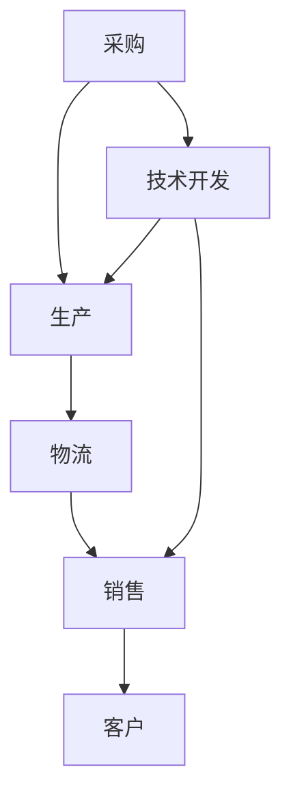
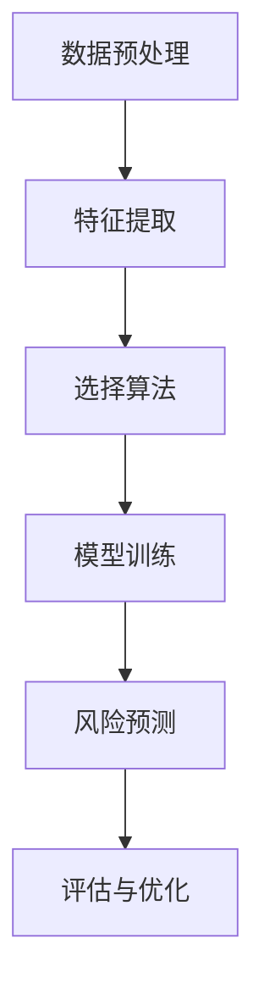
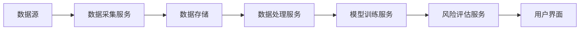

                 


# AI辅助的企业价值链风险分析

## 关键词：企业价值链，风险管理，人工智能，风险评估，风险管理策略，数据分析

## 摘要：  
在现代企业运营中，价值链是企业创造和传递价值的核心流程。随着市场竞争的加剧和全球化的深入，企业价值链中的风险日益复杂，包括供应链中断、市场需求波动、政策变化等。传统的风险管理方法往往依赖人工分析，效率低下且难以捕捉复杂的风险因素。人工智能（AI）技术的引入为企业价值链风险分析提供了新的解决方案。通过机器学习、自然语言处理和大数据分析等技术，企业可以更高效地识别、评估和应对潜在风险，从而优化价值链的运作，提升企业竞争力。本文将详细探讨AI在企业价值链风险分析中的应用，从理论到实践，为读者提供全面的指导。

---

# 第一部分：企业价值链与风险分析概述

## 第1章：企业价值链的基本概念

### 1.1 企业价值链的定义与构成
企业价值链是指企业从原材料采购到最终产品交付给客户的过程中，所经历的一系列价值创造活动。这些活动可以分为基本活动和辅助活动两大类：
- **基本活动**：包括 inbound logistics（ inbound物流）、outbound logistics（ outbound物流）、生产、市场营销和销售、服务。
- **辅助活动**：包括采购、技术开发、人力资源管理和基础设施。

企业价值链的核心在于通过优化各环节的协同效率，实现价值的最大化。图1-1展示了企业价值链的基本结构。



### 1.2 风险分析在企业价值链中的重要性
风险分析是企业在价值链中确保稳定运营的关键环节。常见的风险包括供应链中断、市场需求波动、政策法规变化、成本超支等。这些风险可能导致企业价值链的中断或效率下降，从而影响企业的盈利能力。例如，供应链中断可能导致原材料短缺，进而影响生产进度和交货时间，最终影响客户满意度和市场声誉。

### 1.3 AI在企业价值链风险分析中的作用
人工智能技术通过数据驱动的方法，能够显著提升企业价值链风险分析的效率和准确性。AI可以通过以下方式发挥作用：
1. **数据处理与预测**：利用机器学习算法，AI可以从海量数据中提取有价值的信息，预测潜在风险。
2. **实时监控**：通过实时数据流分析，AI可以迅速识别异常情况，帮助企业及时采取应对措施。
3. **决策支持**：AI可以通过模拟不同情景，为企业制定最优的风险缓解策略提供支持。

---

## 第2章：AI辅助企业价值链风险分析的核心概念与联系

### 2.1 企业价值链风险分析的核心概念
AI辅助的企业价值链风险分析涉及多个核心概念，包括数据源、风险识别、风险评估和风险缓解策略。这些概念之间的关系可以通过实体关系图（ER图）清晰展示。

#### 2.1.1 数据源
数据源是AI进行风险分析的基础，主要包括：
- **内部数据**：如生产记录、财务数据、员工绩效等。
- **外部数据**：如市场趋势、竞争对手信息、政策法规变化等。

#### 2.1.2 风险识别
风险识别是通过分析数据源，识别可能对企业价值链造成负面影响的事件或因素。例如，供应链中断可能由自然灾害或供应商问题引起。

#### 2.1.3 风险评估
风险评估是对识别出的潜在风险进行量化分析，评估其对企业的影响程度。这通常涉及概率分析和影响分析。

#### 2.1.4 风险缓解策略
风险缓解策略是根据风险评估结果，制定的应对措施。例如，建立备用供应商以应对供应链中断风险。

### 2.2 AI在企业价值链风险分析中的应用原理
AI通过以下步骤实现对企业价值链风险的分析：
1. **数据收集与预处理**：从多个数据源收集数据，并进行清洗和标准化。
2. **特征提取与建模**：利用机器学习算法，从数据中提取特征，并构建风险预测模型。
3. **风险识别与评估**：通过模型预测潜在风险，并评估其影响。
4. **策略制定与优化**：根据风险评估结果，制定风险缓解策略，并不断优化策略以适应变化。

### 2.3 核心概念的ER实体关系图
以下是一个简化的企业价值链风险分析的ER实体关系图：

```mermaid
erDiagram
    actor 顾客
    actor 供应商
    actor 竞争对手
    actor 监管机构
    boundary 企业价值链
    entity 风险
    entity 数据源
    entity 风险评估模型
    entity 风险缓解策略
    顾客 --> 数据源: 提供市场反馈
    供应商 --> 数据源: 提供供应链信息
    竞争对手 --> 数据源: 提供市场动态
    监管机构 --> 数据源: 提供政策法规
    数据源 --> 风险评估模型: 输入数据
    风险评估模型 --> 风险: 输出预测
    风险评估模型 --> 风险缓解策略: 输出建议
```

---

## 第3章：AI辅助企业价值链风险分析的算法原理

### 3.1 常见算法与应用场景
在企业价值链风险分析中，常用的AI算法包括：
1. **线性回归**：用于预测连续型变量，如市场需求预测。
2. **决策树（如ID3、C4.5）**：用于分类问题，如客户 churn 预测。
3. **随机森林**：用于特征重要性分析和分类/回归问题。
4. **支持向量机（SVM）**：用于小样本数据的分类问题。
5. **深度学习（如LSTM、BERT）**：用于时间序列分析和自然语言处理任务。

### 3.2 算法流程图
以下是一个基于机器学习的风险分析算法流程图：



### 3.3 数学公式与模型解读
以线性回归为例，其基本公式为：
$$ y = \beta_0 + \beta_1 x + \epsilon $$
其中：
- $y$ 是目标变量（如市场需求）。
- $x$ 是自变量（如广告支出）。
- $\beta_0$ 和 $\beta_1$ 是回归系数。
- $\epsilon$ 是误差项。

通过最小二乘法，我们可以估计回归系数：
$$ \hat{\beta} = (X^T X)^{-1} X^T y $$

---

## 第4章：AI辅助企业价值链风险分析的系统架构设计

### 4.1 系统模块划分
一个典型的AI辅助风险分析系统可以划分为以下几个模块：
1. **数据采集模块**：负责从多个数据源采集数据。
2. **数据处理模块**：对数据进行清洗、转换和标准化。
3. **模型构建模块**：基于数据训练风险分析模型。
4. **风险评估模块**：利用模型对潜在风险进行评估。
5. **策略制定模块**：根据评估结果制定风险缓解策略。

### 4.2 系统架构图
以下是一个基于微服务架构的系统架构图：



### 4.3 接口设计与交互流程
系统接口设计需要考虑模块之间的通信方式，例如：
- 数据采集服务通过API向数据存储模块发送数据。
- 数据处理服务通过队列与模型训练服务通信。

交互流程如下：
1. 用户提交请求，触发数据采集。
2. 数据采集模块将数据发送到数据存储模块。
3. 数据处理模块从存储中获取数据，进行处理后发送到模型训练模块。
4. 模型训练模块训练完成后，将模型部署到风险评估模块。
5. 风险评估模块根据输入数据生成风险报告，通过用户界面展示给用户。

---

## 第5章：项目实战：基于AI的企业价值链风险分析系统开发

### 5.1 项目背景与目标
本项目旨在开发一个基于AI的企业价值链风险分析系统，帮助企业识别和管理潜在风险。项目目标包括：
1. 实现数据采集与预处理功能。
2. 构建风险预测模型。
3. 提供风险评估报告和风险缓解策略。

### 5.2 系统实现
以下是系统的实现步骤：
1. **环境安装**：安装Python、Jupyter Notebook、TensorFlow、scikit-learn等工具。
2. **数据预处理**：读取CSV数据，清洗数据并进行特征工程。
3. **模型训练**：选择合适的算法（如随机森林），训练风险预测模型。
4. **风险评估**：利用训练好的模型对测试数据进行预测，并生成风险报告。
5. **可视化展示**：将风险报告以图表形式展示，便于用户理解。

### 5.3 代码实现
以下是一个简单的随机森林模型实现代码：

```python
import pandas as pd
from sklearn.ensemble import RandomForestClassifier
from sklearn.metrics import accuracy_score
from sklearn.model_selection import train_test_split

# 加载数据
data = pd.read_csv('risk_data.csv')
X = data.drop('risk', axis=1)
y = data['risk']

# 划分训练集和测试集
X_train, X_test, y_train, y_test = train_test_split(X, y, test_size=0.2)

# 初始化模型
model = RandomForestClassifier(n_estimators=100, random_state=42)

# 训练模型
model.fit(X_train, y_train)

# 预测
y_pred = model.predict(X_test)

# 评估准确率
print("Accuracy:", accuracy_score(y_test, y_pred))
```

### 5.4 案例分析与结果解读
通过上述代码，我们可以训练一个随机森林模型，并对测试数据进行风险预测。模型的准确率可以通过accuracy_score函数获得。结果表明，AI能够有效地识别潜在风险，并为企业制定风险缓解策略提供支持。

---

## 第6章：总结与展望

### 6.1 总结
本文详细探讨了AI在企业价值链风险分析中的应用，从理论到实践，为读者提供了全面的指导。通过AI技术，企业可以更高效地识别、评估和应对潜在风险，从而优化价值链的运作，提升企业的竞争力。

### 6.2 展望
未来，随着AI技术的不断发展，企业价值链风险分析将更加智能化和自动化。例如，结合深度学习和自然语言处理技术，企业可以实时监控市场动态和政策变化，进一步提升风险预测的准确性。此外，多模态数据的融合也将为企业提供更全面的风险评估视角。

### 6.3 最佳实践 tips
- 在实施AI辅助风险分析系统时，企业应确保数据的准确性和完整性。
- 定期更新模型，以适应市场环境的变化。
- 建立跨部门的协作机制，确保风险分析结果能够及时应用于实际业务。

---

通过本文的介绍，读者可以全面了解AI在企业价值链风险分析中的应用，并能够将其应用于实际业务中，为企业创造更大的价值。

