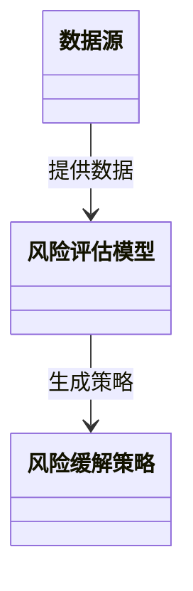
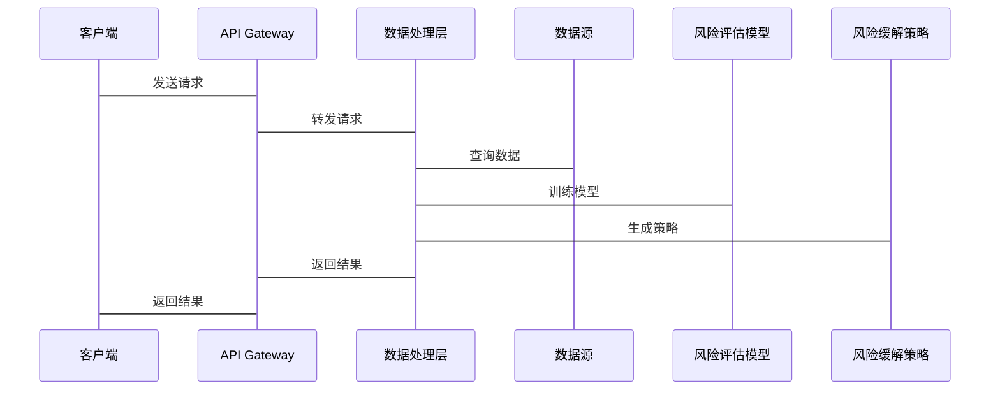
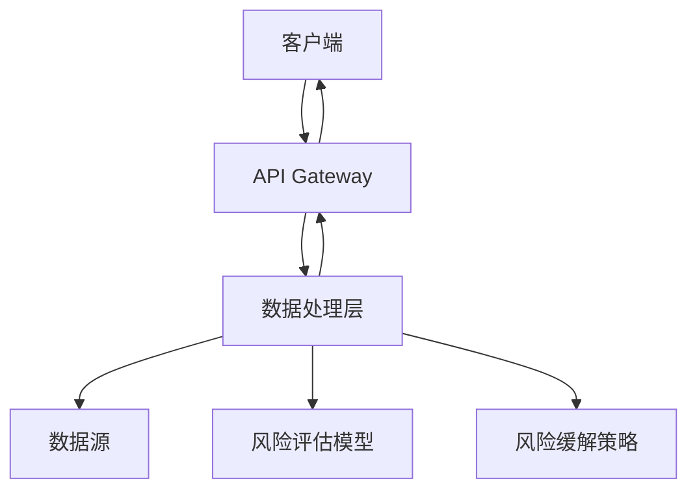

                 


# AI辅助的企业价值链风险分析

## 关键词：企业价值链、风险分析、人工智能、机器学习、风险管理、供应链优化

## 摘要：  
本文探讨了如何利用人工智能技术辅助企业价值链中的风险分析，通过分析企业价值链的构成、风险类型及其对业务的影响，结合机器学习和自然语言处理等AI技术，构建风险预测模型，优化企业风险管理流程。文章详细介绍了AI在企业价值链风险分析中的应用原理、算法实现、系统架构设计及实际案例，为企业在数字化转型中提供可操作的解决方案。

---

# 第1章 企业价值链与风险分析的背景

## 1.1 企业价值链的基本概念

### 1.1.1 企业价值链的定义与构成

企业价值链是指企业从原材料采购、生产、加工、分销到最终交付给客户的整个过程中的价值创造链。它涵盖了企业的所有业务活动，从供应链管理到客户关系维护，每个环节都对企业的最终价值产生影响。

- **价值链的核心要素**包括：供应商、生产过程、分销渠道、客户、合作伙伴等。
- **价值链的边界**：从供应商到客户的整个链条，包括内部和外部的活动。
- **价值链的外延**：扩展到企业的生态系统，包括合作伙伴、技术供应商、政府监管机构等。

### 1.1.2 风险分析在企业价值链中的重要性

风险分析是企业在价值链中确保稳健运营的关键环节。企业可能面临的风险包括供应链中断、市场需求波动、政策变化等，这些风险可能导致成本增加、利润下降甚至业务中断。

- **风险类型**：供应链风险、市场风险、财务风险、运营风险、合规风险。
- **风险分析的目标**：识别潜在风险、评估风险影响、制定应对策略。

### 1.1.3 AI在企业价值链风险分析中的作用

AI技术通过数据驱动的方式，帮助企业更高效地识别和管理风险。机器学习算法可以分析历史数据，预测未来风险；自然语言处理技术可以帮助企业从非结构化数据中提取风险信息。

- **AI的优势**：高效性、准确性、实时性。
- **应用场景**：供应链优化、市场预测、合规监控。

---

## 1.2 问题背景与解决方法

### 1.2.1 问题背景

企业在传统风险分析中面临以下挑战：

- 数据分散：企业价值链涉及多个部门和系统，数据分散，难以整合。
- 数据量大：企业每天产生的数据量巨大，人工分析效率低。
- 数据复杂：数据来源多样，结构化和非结构化数据并存，分析难度大。

### 1.2.2 问题解决方法

AI技术的应用可以有效解决上述问题：

- 数据整合与清洗：利用AI技术整合分散的数据，清洗无效数据。
- 风险预测模型：基于机器学习算法构建风险预测模型，提前识别潜在风险。
- 实时监控：通过自然语言处理技术实时监控新闻、社交媒体等信息，捕捉潜在风险信号。

---

## 1.3 问题的边界与外延

### 1.3.1 问题边界

- **数据范围**：仅限于企业内部数据，不包括外部公开数据。
- **时间范围**：仅考虑未来6个月内的风险预测。

### 1.3.2 问题外延

- **外部数据**：引入公开数据，如行业报告、政策变化等，以提高风险预测的准确性。
- **实时分析**：不仅分析历史数据，还实时监控当前数据，捕捉突发风险。

---

## 1.4 核心概念结构与组成

### 1.4.1 核心概念结构

- **数据源**：包括企业内部数据（如销售数据、生产数据）和外部数据（如行业报告、社交媒体）。
- **风险评估模型**：基于机器学习算法构建的模型，用于预测潜在风险。
- **风险缓解策略**：根据风险评估结果制定的应对措施。

### 1.4.2 核心要素组成

- **数据处理模块**：负责数据的清洗、整合和预处理。
- **模型训练模块**：利用机器学习算法训练风险预测模型。
- **风险监控模块**：实时监控企业价值链中的潜在风险。

---

## 1.5 核心概念的ER实体关系图

```mermaid
erDiagram
    actor 企业
    actor 供应商
    actor 客户
    actor 合规机构
    boundary 企业价值链
    entity 数据源
    entity 风险评估模型
    entity 风险缓解策略
    entity 风险事件
    企业 --> 数据源: 提供内部数据
    供应商 --> 数据源: 提供供应链数据
    客户 --> 数据源: 提供市场反馈
    合规机构 --> 数据源: 提供政策信息
    数据源 --> 风险评估模型: 训练模型
    风险评估模型 --> 风险事件: 预测风险
    风险事件 --> 风险缓解策略: 制定应对措施
```

---

## 1.6 小结

本章详细介绍了企业价值链的基本概念、风险分析的重要性以及AI在其中的作用。通过构建ER实体关系图，明确了数据源、风险评估模型和风险缓解策略之间的关系。下一章将深入探讨AI在企业价值链风险分析中的核心概念与联系。

---

# 第2章 AI辅助企业价值链风险分析的核心概念与联系

## 2.1 核心概念的原理

### 2.1.1 风险分析的原理

风险分析的核心在于识别潜在风险、评估其影响并制定应对策略。AI技术通过数据驱动的方式，帮助企业更高效地完成这些步骤。

- **识别潜在风险**：通过机器学习算法分析历史数据，识别出可能对企业价值链造成影响的风险。
- **评估风险影响**：利用模型预测风险对企业利润、供应链的影响程度。
- **制定应对策略**：根据风险评估结果，制定相应的风险缓解措施。

### 2.1.2 AI在风险分析中的应用原理

AI技术在风险分析中的应用主要体现在以下几个方面：

- **数据处理**：利用自然语言处理技术，从非结构化数据中提取有用信息。
- **模型训练**：通过机器学习算法训练风险预测模型。
- **实时监控**：实时监控企业价值链中的潜在风险，及时发出预警。

---

## 2.2 核心概念的属性特征对比

以下是核心概念的属性特征对比表：

| **属性**       | **风险分析**               | **AI辅助风险分析**          |
|----------------|---------------------------|-----------------------------|
| 数据来源       | 内部数据为主               | 内部+外部数据               |
| 分析方法       | 定性分析为主               | 定量分析为主                 |
| 分析效率       | 低                        | 高                          |
| 精确度         | 中                        | 高                          |
| 实时性         | 低                        | 高                          |

---

## 2.3 核心概念的联系

### 2.3.1 数据源与风险评估模型的联系

数据源是风险评估模型的基础，模型通过数据源提供的数据进行训练，从而预测潜在风险。

- **数据源**：包括企业内部数据（如销售数据、生产数据）和外部数据（如行业报告、政策变化）。
- **风险评估模型**：基于机器学习算法，利用数据源中的数据进行训练，预测潜在风险。

### 2.3.2 风险评估模型与风险缓解策略的联系

风险评估模型预测潜在风险后，风险缓解策略根据预测结果制定应对措施。

- **风险评估模型**：输出潜在风险及其影响程度。
- **风险缓解策略**：根据模型输出，制定相应的应对措施，如调整供应链、优化库存等。

---

## 2.4 核心概念的ER实体关系图

以下是核心概念的ER实体关系图：

```mermaid
erDiagram
    entity 数据源
    entity 风险评估模型
    entity 风险缓解策略
    数据源 --> 风险评估模型: 用于训练
    风险评估模型 --> 风险缓解策略: 生成应对措施
```

---

## 2.5 小结

本章详细探讨了AI辅助企业价值链风险分析的核心概念，包括风险分析的原理、AI在风险分析中的应用原理、核心概念的属性特征对比以及核心概念之间的联系。通过ER实体关系图，明确了数据源、风险评估模型和风险缓解策略之间的关系。下一章将深入探讨AI辅助企业价值链风险分析的算法原理。

---

# 第3章 AI辅助企业价值链风险分析的算法原理

## 3.1 算法原理概述

### 3.1.1 风险预测模型的构建

风险预测模型的构建主要分为以下几个步骤：

1. **数据预处理**：清洗数据，处理缺失值，标准化数据。
2. **特征提取**：从数据中提取有用的特征，用于模型训练。
3. **模型训练**：利用机器学习算法训练风险预测模型。
4. **模型评估**：通过测试数据评估模型的准确性。

### 3.1.2 机器学习算法的选择

在风险预测中，常用的机器学习算法包括：

- **线性回归**：用于预测连续型变量。
- **逻辑回归**：用于分类问题。
- **支持向量机（SVM）**：适用于小规模数据的分类问题。
- **随机森林**：适用于特征较多的情况。

### 3.1.3 算法实现步骤

以下是算法实现的步骤：

1. **数据预处理**：清洗数据，处理缺失值，标准化数据。
2. **特征提取**：从数据中提取有用的特征，用于模型训练。
3. **模型训练**：利用机器学习算法训练风险预测模型。
4. **模型评估**：通过测试数据评估模型的准确性。

---

## 3.2 算法实现的详细流程

### 3.2.1 数据预处理

数据预处理是模型训练的基础，主要包括以下几个步骤：

1. **数据清洗**：处理缺失值、重复值、异常值。
2. **数据转换**：将数据转换为适合模型训练的形式，如标准化、归一化。
3. **特征工程**：从数据中提取有用的特征，如将日期转换为星期几等。

### 3.2.2 特征提取

特征提取是模型训练的关键，以下是常用的特征提取方法：

- **数值型特征**：如销售额、成本等。
- **类别型特征**：如供应商、客户等。
- **文本型特征**：如新闻标题、社交媒体评论等。

### 3.2.3 模型训练

模型训练是利用训练数据训练机器学习模型，以下是常用的算法：

- **线性回归**：用于预测连续型变量。
- **逻辑回归**：用于分类问题。
- **支持向量机（SVM）**：适用于小规模数据的分类问题。
- **随机森林**：适用于特征较多的情况。

### 3.2.4 模型评估

模型评估是通过测试数据评估模型的准确性，以下是常用的评估指标：

- **准确率**：模型正确预测的样本数占总样本数的比例。
- **召回率**：模型正确预测的正样本数占所有正样本数的比例。
- **F1分数**：综合准确率和召回率的指标。

---

## 3.3 算法实现的Python代码示例

以下是基于随机森林算法的风险预测模型的Python代码示例：

```python
import pandas as pd
from sklearn.ensemble import RandomForestClassifier
from sklearn.model_selection import train_test_split
from sklearn.metrics import accuracy_score, recall_score, f1_score

# 数据加载
data = pd.read_csv('风险数据.csv')

# 特征提取
X = data.drop('风险标签', axis=1)
y = data['风险标签']

# 数据分割
X_train, X_test, y_train, y_test = train_test_split(X, y, test_size=0.2, random_state=42)

# 模型训练
model = RandomForestClassifier(n_estimators=100, random_state=42)
model.fit(X_train, y_train)

# 模型预测
y_pred = model.predict(X_test)

# 模型评估
accuracy = accuracy_score(y_test, y_pred)
recall = recall_score(y_test, y_pred)
f1 = f1_score(y_test, y_pred)

print(f'准确率: {accuracy}')
print(f'召回率: {recall}')
print(f'F1分数: {f1}')
```

---

## 3.4 小结

本章详细探讨了AI辅助企业价值链风险分析的算法原理，包括风险预测模型的构建、机器学习算法的选择以及算法实现的详细流程。通过Python代码示例，展示了如何利用随机森林算法构建风险预测模型。下一章将深入探讨系统分析与架构设计。

---

# 第4章 系统分析与架构设计

## 4.1 系统分析

### 4.1.1 问题场景介绍

企业在实际运营中，往往面临复杂的供应链管理、市场需求波动等风险。传统的风险分析方法效率低、准确性差，难以满足企业的需求。

### 4.1.2 项目介绍

本项目旨在利用AI技术构建一个企业价值链风险分析系统，帮助企业在复杂的市场环境中识别和管理风险，优化企业运营。

---

## 4.2 系统功能设计

### 4.2.1 领域模型

以下是领域模型的类图：



### 4.2.2 系统架构设计

以下是系统架构设计的架构图：


---

## 4.3 系统接口设计

### 4.3.1 系统接口设计

以下是系统接口设计的序列图：



---

## 4.4 系统交互设计

### 4.4.1 系统交互设计

以下是系统交互设计的流程图：



---

## 4.5 小结

本章详细探讨了AI辅助企业价值链风险分析的系统分析与架构设计，包括问题场景介绍、系统功能设计、系统架构设计以及系统接口设计。通过类图、架构图和序列图，明确了系统的模块划分和交互流程。下一章将深入探讨项目实战。

---

# 第5章 项目实战：AI辅助企业价值链风险分析系统实现

## 5.1 环境安装与配置

### 5.1.1 安装Python

安装Python 3.8及以上版本，推荐使用Anaconda。

```bash
conda install python=3.8
```

### 5.1.2 安装依赖库

安装所需的依赖库，包括pandas、scikit-learn、flask等。

```bash
pip install pandas scikit-learn flask
```

---

## 5.2 系统核心实现

### 5.2.1 数据处理模块实现

以下是数据处理模块的代码实现：

```python
import pandas as pd

def data_cleaning(data):
    # 处理缺失值
    data = data.dropna()
    # 标准化数据
    data = (data - data.min()) / (data.max() - data.min())
    return data

# 数据加载与处理
data = pd.read_csv('风险数据.csv')
data = data_cleaning(data)
```

### 5.2.2 风险评估模型实现

以下是风险评估模型的代码实现：

```python
from sklearn.ensemble import RandomForestClassifier

def train_model(X, y):
    # 模型训练
    model = RandomForestClassifier(n_estimators=100, random_state=42)
    model.fit(X, y)
    return model

# 数据分割
X_train, X_test, y_train, y_test = train_test_split(X, y, test_size=0.2, random_state=42)

# 模型训练
model = train_model(X_train, y_train)

# 模型预测
y_pred = model.predict(X_test)

# 模型评估
accuracy = accuracy_score(y_test, y_pred)
print(f'准确率: {accuracy}')
```

---

## 5.3 代码应用解读与分析

### 5.3.1 数据处理模块

数据处理模块主要负责数据的清洗和标准化。通过处理缺失值和标准化数据，确保数据适合模型训练。

### 5.3.2 风险评估模型

风险评估模型基于随机森林算法，通过训练数据预测潜在风险。模型训练完成后，可以通过测试数据评估模型的准确性。

---

## 5.4 实际案例分析

### 5.4.1 案例背景

某制造企业面临供应链中断的风险，希望通过AI技术预测潜在风险并制定应对策略。

### 5.4.2 数据准备

数据包括企业的销售数据、生产数据、供应链数据等。

### 5.4.3 模型训练

通过随机森林算法训练风险预测模型，预测潜在风险及其影响程度。

### 5.4.4 模型评估

评估模型的准确性，调整模型参数，优化模型性能。

### 5.4.5 风险缓解策略

根据模型预测结果，制定相应的风险缓解策略，如调整供应链库存、优化生产计划等。

---

## 5.5 项目小结

本章通过实际案例分析，展示了如何利用AI技术构建企业价值链风险分析系统。通过数据处理模块和风险评估模型的实现，帮助企业识别和管理潜在风险，优化企业运营。

---

# 第6章 总结与展望

## 6.1 小结

本文详细探讨了AI辅助企业价值链风险分析的核心概念、算法原理、系统架构设计及项目实现。通过构建风险预测模型，帮助企业识别和管理潜在风险，优化企业运营。

---

## 6.2 未来展望

随着AI技术的不断发展，企业价值链风险分析将更加智能化、自动化。未来的研究方向包括：

- **模型优化**：进一步优化风险预测模型，提高模型的准确性和实时性。
- **多模态数据融合**：结合文本、图像等多种数据源，提高风险识别的准确性。
- **实时监控**：实现对企业价值链的实时监控，及时发现潜在风险。

---

## 6.3 最佳实践 tips

- **数据质量管理**：确保数据的准确性和完整性，是模型训练的基础。
- **模型解释性**：选择具有高解释性的模型，便于业务人员理解。
- **持续优化**：定期更新模型，适应市场变化和企业需求。

---

## 6.4 注意事项

- **数据隐私**：在处理企业数据时，要注意数据隐私和合规性。
- **模型可解释性**：选择具有高解释性的模型，便于业务人员理解。
- **技术选型**：根据企业的实际需求，选择适合的AI技术。

---

## 6.5 拓展阅读

- **《机器学习实战》**：深入理解机器学习算法的实现与应用。
- **《企业风险管理》**：系统学习企业风险管理的理论与实践。

---

# 结语

通过本文的探讨，我们了解了AI技术在企业价值链风险分析中的重要作用。随着AI技术的不断发展，企业将能够更高效地识别和管理风险，优化企业运营，提升竞争力。希望本文能为企业的数字化转型提供有价值的参考和启发。

--- 

如果需要进一步探讨或补充内容，请随时告知！

