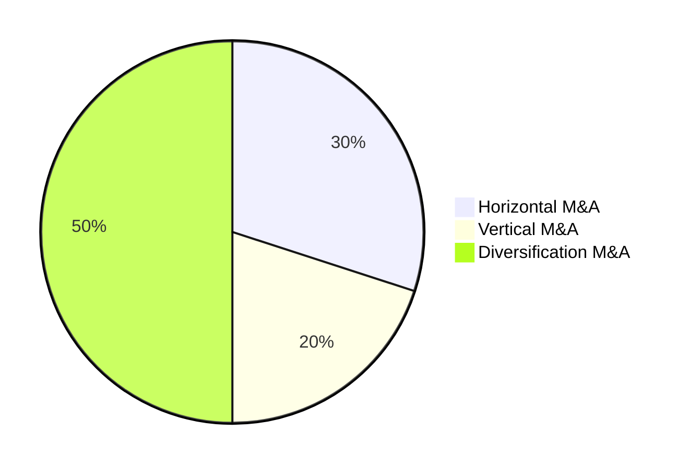
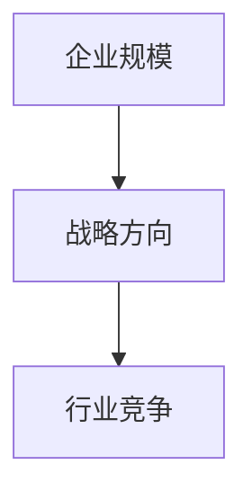
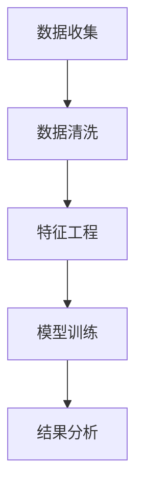
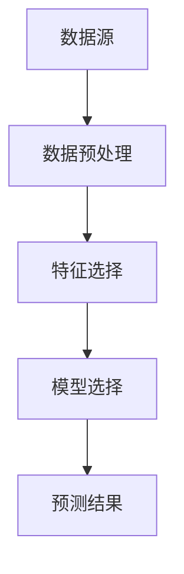
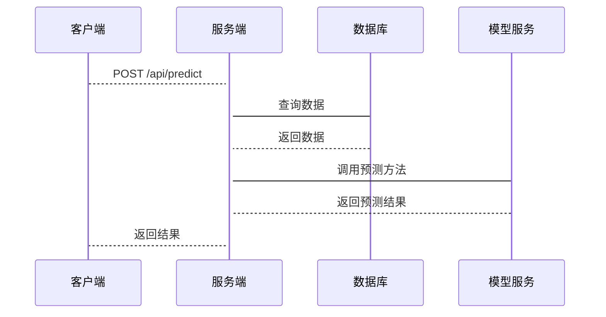

                 


# AI辅助的企业并购协同效应预测

## 关键词：AI，企业并购，协同效应，预测模型，机器学习，数据特征，系统设计

## 摘要：本文探讨了利用人工智能技术预测企业并购后的协同效应，分析了协同效应的定义、预测的必要性及AI技术的优势。通过详细讲解预测流程、算法原理、系统架构设计和实际案例，本文旨在为企业提供高效、准确的协同效应预测方法。

---

# 目录

1. [企业并购与协同效应概述](#企业并购与协同效应概述)
   1.1 [企业并购的基本概念](#企业并购的基本概念)
   1.2 [协同效应的背景与重要性](#协同效应的背景与重要性)
2. [AI辅助企业并购协同效应预测的必要性](#ai辅助企业并购协同效应预测的必要性)
   2.1 [传统协同效应预测的局限性](#传统协同效应预测的局限性)
   2.2 [AI技术在协同效应预测中的优势](#ai技术在协同效应预测中的优势)
   2.3 [本书的研究目标与框架](#本书的研究目标与框架)
3. [协同效应预测的核心概念](#协同效应预测的核心概念)
   3.1 [协同效应预测的关键要素](#协同效应预测的关键要素)
   3.2 [数据特征与模型选择](#数据特征与模型选择)
4. [协同效应预测的流程与框架](#协同效应预测的流程与框架)
   4.1 [协同效应预测的流程](#协同效应预测的流程)
   4.2 [协同效应预测的框架](#协同效应预测的框架)
5. [协同效应预测的机器学习算法](#协同效应预测的机器学习算法)
   5.1 [机器学习算法概述](#机器学习算法概述)
   5.2 [常用算法及其优缺点](#常用算法及其优缺点)
6. [协同效应预测的数学模型](#协同效应预测的数学模型)
   6.1 [线性回归模型](#线性回归模型)
   6.2 [随机森林模型](#随机森林模型)
7. [企业并购协同效应预测系统的功能设计](#企业并购协同效应预测系统的功能设计)
   7.1 [功能模块](#功能模块)
   7.2 [领域模型](#领域模型)
8. [系统架构设计](#系统架构设计)
   8.1 [系统架构](#系统架构)
   8.2 [接口设计](#接口设计)
   8.3 [交互设计](#交互设计)
9. [项目实战：企业并购协同效应预测系统实现](#项目实战企业并购协同效应预测系统实现)
   9.1 [环境配置](#环境配置)
   9.2 [数据收集与预处理](#数据收集与预处理)
   9.3 [模型训练与优化](#模型训练与优化)
   9.4 [结果分析](#结果分析)
10. [最佳实践与总结](#最佳实践与总结)
    10.1 [最佳实践](#最佳实践)
    10.2 [总结与展望](#总结与展望)

---

## 1. 企业并购与协同效应概述

### 1.1 企业并购的基本概念

企业并购是指企业之间的合并或收购行为，通常分为横向并购、纵向并购和混合并购。协同效应是并购后企业整合带来的效益，包括成本协同、收入协同和管理协同。

**图1.1 企业并购类型对比**



### 1.2 协同效应的背景与重要性

协同效应通过资源整合降低成本或提高收入，是并购成功的关键因素。然而，传统预测方法难以准确评估，因此需要借助AI技术。

---

## 2. AI辅助企业并购协同效应预测的必要性

### 2.1 传统协同效应预测的局限性

传统方法依赖经验分析，数据处理能力有限，导致预测结果不准确，效率低下。

**表2.1 传统方法与AI方法对比**

| 特性           | 传统方法          | AI方法           |
|----------------|-------------------|------------------|
| 数据处理能力   | 有限             | 强大             |
| 预测效率       | 低               | 高               |
| 准确性         | 中等             | 高               |

### 2.2 AI技术在协同效应预测中的优势

AI技术能够处理大量数据，识别隐藏模式，提高预测准确性。

---

## 3. 协同效应预测的核心概念

### 3.1 协同效应预测的关键要素

企业规模、战略方向、行业竞争是影响协同效应的关键因素。

**图3.1 协同效应关键要素**



### 3.2 数据特征与模型选择

选择合适的特征和模型是提高预测准确性的关键。常用特征包括财务指标和市场份额。

---

## 4. 协同效应预测的流程与框架

### 4.1 协同效应预测的流程

从数据收集到结果分析的完整流程，包括数据清洗和特征工程。

**图4.1 预测流程**



### 4.2 协同效应预测的框架

构建数据流图，展示各步骤的关系。

**图4.2 数据流图**



---

## 5. 协同效应预测的机器学习算法

### 5.1 机器学习算法概述

监督学习、无监督学习和深度学习是常用的三类算法。

**表5.1 常用算法对比**

| 算法类型       | 适用场景           | 优点               |
|----------------|--------------------|--------------------|
| 监督学习         | 标签数据           | 高准确性             |
| 无监督学习       | 无标签数据         | 发现数据结构         |
| 深度学习         | 复杂非线性关系     | 强大学习能力         |

### 5.2 常用算法及其优缺点

线性回归和随机森林是常用的预测模型。

**图5.2 线性回归模型**


---

## 6. 协同效应预测的数学模型

### 6.1 线性回归模型

线性回归是最简单的预测模型，适用于线性关系。

**公式6.1 线性回归**

$$ y = \beta_0 + \beta_1 x + \epsilon $$

### 6.2 随机森林模型

随机森林通过集成学习提高预测准确性。

**公式6.2 随机森林预测**

$$ y = \text{平均预测值} $$

---

## 7. 企业并购协同效应预测系统的功能设计

### 7.1 功能模块

系统包括数据输入、特征工程、模型训练和结果输出四个模块。

**图7.1 功能模块**


---

## 8. 系统架构设计

### 8.1 系统架构

系统采用分层架构，包括数据层、业务逻辑层和表现层。

**图8.1 系统架构**


### 8.2 接口设计

系统提供RESTful API接口，供其他系统调用。

**图8.2 接口设计**



---

## 9. 项目实战：企业并购协同效应预测系统实现

### 9.1 环境配置

安装Python和必要的库：

```bash
pip install numpy pandas scikit-learn
```

### 9.2 数据收集与预处理

从企业数据库中收集并购数据，清洗数据并提取特征。

### 9.3 模型训练与优化

训练随机森林模型并进行超参数调优。

### 9.4 结果分析

分析预测结果，评估模型性能。

---

## 10. 最佳实践与总结

### 10.1 最佳实践

1. 数据质量至关重要。
2. 根据数据特征选择模型。
3. 系统设计需考虑可扩展性。

### 10.2 总结与展望

本文详细讲解了AI在企业并购协同效应预测中的应用，未来可进一步研究深度学习模型的应用。

---

**关键词：AI，企业并购，协同效应，预测模型，机器学习，数据特征，系统设计**

**摘要：** 本文探讨了利用人工智能技术预测企业并购后的协同效应，分析了协同效应的定义、预测的必要性及AI技术的优势。通过详细讲解预测流程、算法原理、系统架构设计和实际案例，本文旨在为企业提供高效、准确的协同效应预测方法。

