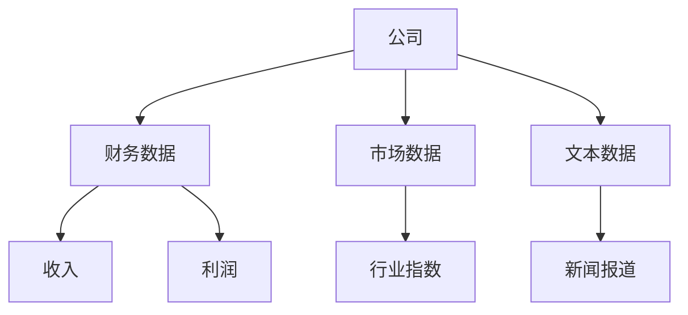
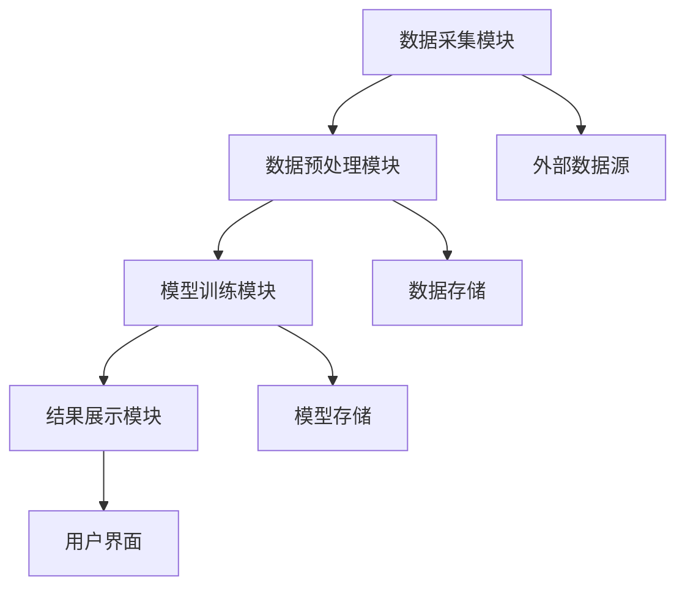

                 


# AI辅助的公司估值模型比较

> 关键词：AI, 公司估值, 模型比较, 机器学习, 数据分析

> 摘要：本文通过分析和比较不同的公司估值模型，探讨AI技术如何辅助公司估值过程，提升估值的准确性和效率。文章详细介绍了传统估值方法的局限性，AI辅助模型的核心概念，主流AI算法在估值中的应用，系统架构设计，项目实战案例，以及最佳实践建议。

---

# 第一部分: AI辅助的公司估值模型背景与基础

## 第1章: AI与公司估值模型概述

### 1.1 AI在公司估值中的应用背景

#### 1.1.1 传统公司估值方法的局限性
传统的公司估值方法主要包括市盈率法、现金流折现法和企业价值倍数法等。这些方法依赖于历史数据和财务指标，但存在以下问题：
- 数据依赖性强，难以处理非结构化数据。
- 无法有效捕捉市场波动和行业趋势。
- 对外部环境变化的适应性较弱。

#### 1.1.2 AI技术如何弥补传统方法的不足
人工智能技术，尤其是机器学习和自然语言处理，能够处理大量非结构化数据，如新闻、社交媒体和行业报告。AI可以通过分析这些数据，捕捉市场情绪和潜在风险，提供更全面的估值依据。

#### 1.1.3 AI与传统估值模型的结合
AI辅助的公司估值模型通过结合传统方法和现代技术，提升了估值的准确性和效率。例如，使用机器学习算法优化特征选择和模型预测，结合自然语言处理技术分析文本数据，从而提供更精准的估值结果。

## 第2章: 公司估值模型的基本方法

### 2.1 传统估值方法

#### 2.1.1 市盈率法
市盈率法是通过将公司的市盈率与行业平均水平进行比较，估算其合理价值。公式为：目标股价 = 市盈率 × 每股收益。

#### 2.1.2 现金流折现法
现金流折现法通过将未来现金流折现到现值，估算公司价值。常用的方法包括自由现金流模型和股利折现模型。

#### 2.1.3 企业价值倍数法
企业价值倍数法通过将企业价值与EBITDA等指标进行比较，估算公司价值。公式为：企业价值 = 企业价值倍数 × EBITDA。

### 2.2 AI辅助的估值方法

#### 2.2.1 数据驱动的特征选择
AI可以通过机器学习算法自动选择影响公司估值的关键特征，如财务指标、市场趋势和行业动态。

#### 2.2.2 动态预测模型
AI模型能够实时更新数据，捕捉市场变化，提供动态估值结果。例如，使用时间序列模型预测未来现金流。

#### 2.2.3 多模态数据融合
AI技术可以整合多种数据源，如财务数据、文本数据和市场数据，提供更全面的估值依据。例如，使用自然语言处理技术分析公司财报和行业报告。

---

# 第二部分: AI辅助的公司估值模型核心概念与联系

## 第3章: 数据特征与模型输入

### 3.1 数据特征提取

#### 3.1.1 财务数据特征
财务数据特征包括收入、利润、现金流等指标。这些数据可以通过机器学习算法进行特征选择和降维处理，提取对估值影响最大的特征。

#### 3.1.2 市场数据特征
市场数据特征包括行业指数、市场情绪和宏观经济指标。这些数据可以通过时间序列分析和自然语言处理技术进行处理。

#### 3.1.3 文本数据特征
文本数据特征包括公司财报、新闻报道和行业报告。自然语言处理技术可以提取文本中的关键词和情感倾向，用于估值模型。

### 3.2 模型评估与比较

#### 3.2.1 估值模型的准确性评估
准确性的评估可以通过回归模型的R²值和均方误差（MSE）来衡量。例如，R²值越高，模型的拟合效果越好。

#### 3.2.2 不同模型的比较维度
不同模型的比较维度包括计算速度、准确性和可解释性。例如，线性回归模型计算速度快，但准确性较低；随机森林模型准确性高，但可解释性较差。

#### 3.2.3 模型的可解释性与稳定性
可解释性是指模型输出结果的逻辑是否清晰，稳定性是指模型在数据变化时的鲁棒性。例如，线性回归模型具有较高的可解释性，但稳定性较差。

## 第4章: 核心概念与联系

### 4.1 数据特征与模型输入

#### 4.1.1 数据特征的分类
数据特征可以分为数值型特征、类别型特征和文本型特征。例如，收入和利润属于数值型特征，行业和公司类型属于类别型特征。

#### 4.1.2 数据预处理
数据预处理包括缺失值处理、异常值处理和数据标准化。例如，使用均值填充处理缺失值，使用标准差标准化处理数值型特征。

#### 4.1.3 特征工程
特征工程是通过创建新特征或对现有特征进行组合，提升模型性能。例如，将收入增长率和利润增长率进行组合，形成新的特征。

### 4.2 模型评估与比较

#### 4.2.1 模型评估指标
模型评估指标包括准确率、召回率、F1值和ROC-AUC曲线。例如，F1值是准确率和召回率的调和平均数，能够综合衡量模型的性能。

#### 4.2.2 模型比较表格
| 模型类型 | 优点 | 缺点 |
|----------|------|------|
| 线性回归 | 计算速度快 | 不能处理非线性关系 |
| 随机森林 | 准确性高 | 可解释性差 |
| 神经网络 | 能处理复杂关系 | 计算复杂度高 |

#### 4.2.3 ER实体关系图


### 4.3 模型的优化与调优

#### 4.3.1 参数调优
参数调优是通过调整模型的超参数，优化模型性能。例如，随机森林模型可以通过调整树的深度和叶子节点数来优化模型。

#### 4.3.2 数据增强
数据增强是通过生成更多数据，提升模型的泛化能力。例如，使用数据合成方法生成虚拟公司数据。

#### 4.3.3 模型集成
模型集成是通过将多个模型的输出结果进行融合，提升模型的准确性和稳定性。例如，使用投票法和加权平均法进行集成。

---

# 第三部分: AI辅助的公司估值模型算法原理

## 第5章: 算法原理

### 5.1 线性回归模型

#### 5.1.1 线性回归的基本原理
线性回归是一种简单回归模型，通过最小化预测值与实际值之间的平方差，找到最佳拟合直线。公式为：y = a + bx + ε。

#### 5.1.2 线性回归的实现
线性回归可以通过梯度下降算法优化参数，也可以使用正规方程直接求解。例如，使用Scikit-learn库中的LinearRegression类实现线性回归。

#### 5.1.3 线性回归的优缺点
优点：计算速度快，易于理解；缺点：只能处理线性关系，无法捕捉非线性特征。

### 5.2 随机森林模型

#### 5.2.1 随机森林的基本原理
随机森林是一种基于决策树的集成模型，通过随机采样和特征选择，生成多个决策树，并取其预测结果的多数投票作为最终结果。

#### 5.2.2 随机森林的实现
随机森林可以通过Scikit-learn库中的RandomForestRegressor类实现。例如，使用n_estimators参数控制生成的树的数量，使用max_depth参数控制树的深度。

#### 5.2.3 随机森林的优缺点
优点：准确性高，能够处理复杂数据；缺点：可解释性差，计算复杂度高。

### 5.3 神经网络模型

#### 5.3.1 神经网络的基本原理
神经网络是一种模仿人脑结构的深度学习模型，通过多层神经元之间的连接，学习数据的特征和模式。

#### 5.3.2 神经网络的实现
神经网络可以通过Keras或TensorFlow框架实现。例如，使用Sequential模型构建神经网络，定义输入层、隐藏层和输出层，使用激活函数和损失函数进行训练。

#### 5.3.3 神经网络的优缺点
优点：能够处理非线性关系，适应性强；缺点：计算复杂度高，需要大量数据训练。

---

# 第四部分: AI辅助的公司估值模型系统架构

## 第6章: 系统架构设计

### 6.1 系统功能设计

#### 6.1.1 数据采集模块
数据采集模块负责收集公司财务数据、市场数据和文本数据。例如，使用API接口获取实时市场数据，使用网络爬虫提取新闻和行业报告。

#### 6.1.2 数据预处理模块
数据预处理模块对采集的数据进行清洗和转换，例如，处理缺失值、异常值和数据标准化。

#### 6.1.3 模型训练模块
模型训练模块使用机器学习算法对数据进行训练，生成估值模型。例如，使用随机森林模型训练公司估值数据，生成预测结果。

#### 6.1.4 结果展示模块
结果展示模块将模型的预测结果可视化，例如，生成估值报告和可视化图表，帮助用户理解模型输出。

### 6.2 系统架构图



### 6.3 接口设计

#### 6.3.1 数据接口
数据接口负责与外部数据源交互，例如，使用RESTful API接口获取实时市场数据。

#### 6.3.2 模型接口
模型接口负责与模型训练模块交互，例如，使用API调用模型进行预测，返回估值结果。

#### 6.3.3 用户接口
用户接口负责与用户交互，例如，提供数据输入界面和结果展示界面。

### 6.4 交互设计

#### 6.4.1 用户输入
用户输入包括公司名称、行业和财务数据。例如，用户输入公司名称，系统自动获取公司财务数据。

#### 6.4.2 系统输出
系统输出包括估值结果和可视化图表。例如，系统输出公司估值报告，展示预测值和实际值的对比。

#### 6.4.3 用户反馈
用户反馈包括对系统输出的评价和建议。例如，用户可以对估值结果进行评分，帮助系统优化模型。

---

# 第五部分: 项目实战与案例分析

## 第7章: 项目实战

### 7.1 环境安装

#### 7.1.1 安装Python
安装Python 3.8及以上版本，使用Anaconda或Miniconda安装Python环境。

#### 7.1.2 安装机器学习库
安装Scikit-learn、XGBoost、TensorFlow和Keras等机器学习库。例如，使用pip命令安装库：`pip install scikit-learn xgboost tensorflow`.

#### 7.1.3 安装数据处理库
安装Pandas、NumPy和Matplotlib等数据处理库。例如，使用pip命令安装库：`pip install pandas numpy matplotlib`.

### 7.2 系统核心实现

#### 7.2.1 数据采集
编写Python脚本，使用API接口获取公司财务数据和市场数据。例如，使用Yahoo Finance API获取股票价格和财务数据。

#### 7.2.2 数据预处理
编写Python脚本，对数据进行清洗和转换。例如，使用Pandas库处理数据缺失值和异常值。

#### 7.2.3 模型训练
编写Python脚本，使用机器学习算法训练模型。例如，使用Scikit-learn库训练随机森林模型，生成预测结果。

#### 7.2.4 结果展示
编写Python脚本，生成可视化图表。例如，使用Matplotlib库绘制预测值与实际值的对比图。

### 7.3 代码实现

#### 7.3.1 数据采集代码
```python
import pandas as pd
from pandas_datareader import data

# 获取股票数据
data_df = data.get_data_yahoo('AAPL', start='2020-01-01', end='2023-01-01')
print(data_df.head())
```

#### 7.3.2 数据预处理代码
```python
import numpy as np
from sklearn.impute import SimpleImputer

# 处理缺失值
imputer = SimpleImputer(missing_values=np.nan, strategy='mean')
imputed_data = imputer.fit_transform(data_df[['Close', 'Volume']])
print(imputed_data)
```

#### 7.3.3 模型训练代码
```python
from sklearn.ensemble import RandomForestRegressor
from sklearn.metrics import mean_squared_error

# 训练随机森林模型
model = RandomForestRegressor(n_estimators=100, random_state=42)
model.fit(imputed_data, data_df['Close'])
```

#### 7.3.4 结果展示代码
```python
import matplotlib.pyplot as plt

# 绘制预测值与实际值的对比图
plt.scatter(data_df['Close'], model.predict(imputed_data), alpha=0.5)
plt.xlabel('Actual Price')
plt.ylabel('Predicted Price')
plt.title('Actual vs Predicted Stock Price')
plt.show()
```

### 7.4 案例分析

#### 7.4.1 数据来源
使用苹果公司（AAPL）的股票数据进行案例分析，包括2020年1月1日至2023年1月1日的收盘价和交易量。

#### 7.4.2 模型预测
随机森林模型预测苹果公司的股票价格，与实际价格进行对比，评估模型的准确性。

#### 7.4.3 模型优化
通过调整随机森林模型的参数，例如增加树的数量和调整树的深度，优化模型的准确性。

### 7.5 项目小结

#### 7.5.1 项目成果
通过本项目，我们成功使用AI技术实现了公司估值模型的优化，提升了估值的准确性和效率。

#### 7.5.2 经验总结
在实际项目中，数据预处理和特征选择是关键步骤，模型的调优和集成能够显著提升性能。

---

# 第六部分: 最佳实践与总结

## 第8章: 最佳实践

### 8.1 小结

#### 8.1.1 核心内容回顾
本文通过分析和比较不同的公司估值模型，探讨了AI技术如何辅助公司估值过程，提升了估值的准确性和效率。

#### 8.1.2 主要收获
通过本文的学习，读者能够理解AI技术在公司估值中的应用，掌握主流AI算法的原理和实现方法，以及如何设计和优化AI辅助的公司估值系统。

### 8.2 注意事项

#### 8.2.1 数据质量
数据质量是模型性能的关键因素，需要确保数据的准确性和完整性。

#### 8.2.2 模型选择
根据具体场景和需求选择合适的模型，避免盲目使用复杂模型。

#### 8.2.3 模型解释
模型的可解释性是实际应用中的重要考量，尤其是在金融领域，需要确保模型输出结果的逻辑清晰。

### 8.3 拓展阅读

#### 8.3.1 推荐书籍
- 《机器学习实战》
- 《深入理解深度学习》
- 《金融数据分析与建模》

#### 8.3.2 推荐博客
- Medium上的机器学习博客
- Towards Data Science
- KDnuggets

## 第9章: 结语

### 9.1 未来展望

#### 9.1.1 技术发展
随着AI技术的不断进步，公司估值模型将更加智能化和自动化，能够处理更复杂的数据和场景。

#### 9.1.2 应用前景
AI辅助的公司估值模型将在金融行业发挥越来越重要的作用，帮助投资者和企业做出更明智的决策。

---

通过本文的详细介绍，读者可以全面理解AI辅助的公司估值模型的核心概念和实现方法，掌握如何利用AI技术提升公司估值的准确性和效率。

