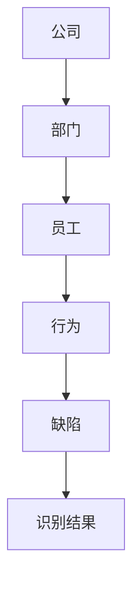
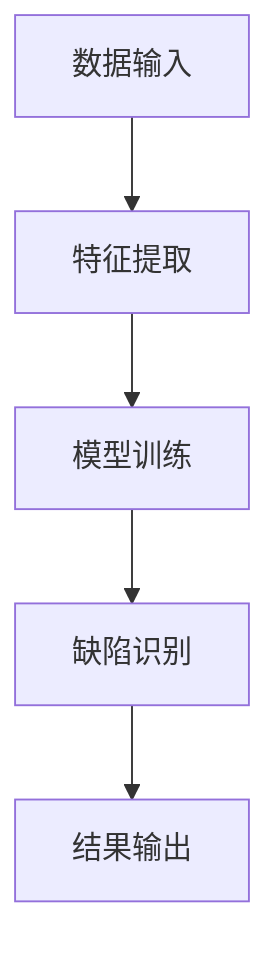
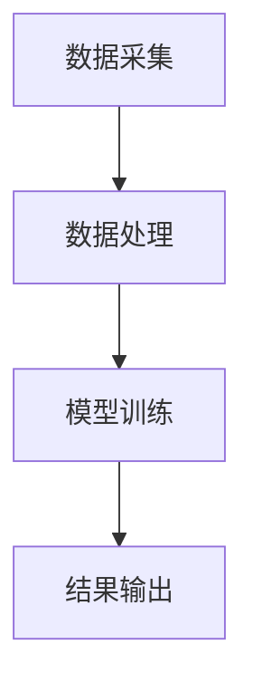
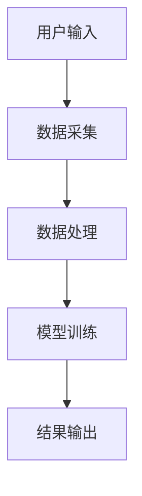

                 


# AI辅助的公司治理缺陷识别系统

**关键词**：公司治理，缺陷识别，人工智能，系统架构，风险评估，数据驱动

**摘要**：随着企业规模的不断扩大和业务复杂性的增加，公司治理中的缺陷识别变得越来越重要。传统的缺陷识别方法依赖于人工检查和经验判断，存在效率低下、主观性强、覆盖范围有限等问题。通过引入人工智能技术，可以实现对公司治理缺陷的自动化识别、精准定位和风险评估，从而提高企业治理的效率和准确性。本文将从背景介绍、核心概念、算法原理、系统架构、项目实战等多个方面，详细阐述AI辅助的公司治理缺陷识别系统的构建与应用。

---

# 第1章: 公司治理缺陷识别的背景与意义

## 1.1 问题背景

### 1.1.1 公司治理中的常见问题

公司治理是企业管理的核心，涉及股东、董事会、高管和员工之间的权利与责任分配。然而，公司治理中常常存在以下问题：

1. **权力滥用**：高管可能利用职权谋取私利，导致公司利益受损。
2. **信息披露不完整**：公司可能隐瞒重要信息，影响投资者决策。
3. **合规性不足**：公司可能违反法律法规，面临法律风险。
4. **内部管理混乱**：部门间协调不畅，导致效率低下。
5. **风险管理缺失**：公司未能有效识别和应对潜在风险。

这些问题不仅影响公司的正常运营，还可能导致严重的经济损失和声誉损害。

### 1.1.2 传统公司治理缺陷识别的局限性

传统的公司治理缺陷识别方法主要依赖于人工检查和经验判断，存在以下问题：

1. **效率低下**：人工检查需要大量时间和资源，难以覆盖所有潜在问题。
2. **主观性强**：检查结果受检查人员的经验和主观判断影响，缺乏客观性。
3. **覆盖范围有限**：人工检查难以发现隐藏在大量数据中的复杂问题。
4. **缺乏实时性**：传统方法通常在问题发生后才进行处理，难以实现事前预警。

### 1.1.3 AI技术在公司治理中的潜力

人工智能技术在公司治理缺陷识别中的应用具有显著优势：

1. **高效性**：AI可以快速处理大量数据，识别潜在问题。
2. **客观性**：AI算法基于数据进行分析，减少人为主观因素的影响。
3. **全面性**：AI能够从多个维度分析数据，发现隐藏的问题。
4. **实时性**：AI可以实时监控公司运营，实现风险预警。

## 1.2 问题描述

### 1.2.1 公司治理缺陷的定义与分类

公司治理缺陷是指公司治理过程中存在的各种问题，通常表现为以下几种类型：

1. **合规性缺陷**：公司行为违反法律法规或行业规范。
2. **管理缺陷**：公司内部管理混乱，效率低下。
3. **风险缺陷**：公司未能有效识别和应对潜在风险。
4. **信息披露缺陷**：公司信息披露不完整或不及时。

### 1.2.2 缺陷识别的难点与挑战

缺陷识别的难点主要在于：

1. **数据复杂性**：公司治理涉及大量结构化和非结构化数据，数据来源多样。
2. **模型准确性**：缺陷识别需要高精度的模型，否则可能导致误判或漏判。
3. **实时性要求**：公司治理问题可能随时发生，需要实时监控和响应。
4. **数据隐私**：公司治理数据通常涉及敏感信息，需要确保数据安全和隐私保护。

### 1.2.3 AI辅助识别的优势与应用场景

AI辅助识别的优势在于其高效性、客观性和全面性。其主要应用场景包括：

1. **合规性检查**：AI可以自动识别公司行为是否符合法律法规。
2. **风险管理**：AI可以实时监控公司运营，识别潜在风险。
3. **内部审计**：AI可以帮助审计部门发现管理中的问题。
4. **信息披露优化**：AI可以辅助生成准确的信息披露报告。

## 1.3 问题解决思路

### 1.3.1 AI辅助识别的核心思路

AI辅助识别的核心思路是基于大数据分析和机器学习算法，通过以下步骤实现：

1. **数据收集**：收集公司治理相关的数据，包括财务数据、业务数据、法律文件等。
2. **数据预处理**：清洗数据，提取特征。
3. **模型训练**：训练机器学习模型，识别公司治理缺陷。
4. **缺陷定位**：根据模型输出，定位具体问题。
5. **风险评估**：评估缺陷的严重性，制定应对策略。

### 1.3.2 数据驱动的缺陷识别方法

数据驱动的缺陷识别方法通过分析大量数据，发现潜在问题。具体步骤如下：

1. **数据收集**：收集公司治理相关的数据。
2. **数据清洗**：去除噪声数据，确保数据质量。
3. **特征提取**：提取有助于缺陷识别的关键特征。
4. **模型训练**：训练分类模型，识别缺陷类型。
5. **结果分析**：根据模型输出，分析缺陷原因。

### 1.3.3 传统方法与AI方法的对比

| 对比维度 | 传统方法 | AI方法 |
|----------|----------|--------|
| 效率     | 低       | 高     |
| 客观性    | 低       | 高     |
| 覆盖范围  | 有限     | 广泛   |
| 实时性    | 无       | 有     |

---

# 第2章: AI辅助公司治理缺陷识别的核心概念

## 2.1 公司治理缺陷识别的基本原理

### 2.1.1 缺陷识别的逻辑框架

缺陷识别的逻辑框架包括以下步骤：

1. **数据输入**：输入公司治理相关数据。
2. **特征提取**：提取有助于识别缺陷的特征。
3. **模型分析**：通过模型分析数据，识别潜在缺陷。
4. **结果输出**：输出缺陷类型和位置。

### 2.1.2 AI算法在缺陷识别中的作用

AI算法在缺陷识别中的作用主要体现在以下几个方面：

1. **特征提取**：通过深度学习模型提取数据特征。
2. **模式识别**：识别数据中的异常模式。
3. **分类与回归**：对缺陷类型进行分类，对缺陷严重性进行回归分析。

### 2.1.3 数据特征与缺陷分类的关系

数据特征与缺陷分类的关系可以通过以下例子说明：

- **财务数据**：异常的财务数据可能表明存在财务造假。
- **法律文件**：合同中的漏洞可能表明存在合规性问题。
- **行为数据**：高管的异常行为可能表明存在权力滥用。

## 2.2 AI模型的核心属性对比

### 2.2.1 各种AI模型的特征对比表

| 模型类型 | 特征提取能力 | 可解释性 | 实时性 | 准确率 |
|----------|--------------|----------|--------|--------|
| SVM      | 弱          | 高       | 低     | 中等   |
| RF       | 弱          | 高       | 低     | 中等   |
| CNN      | 强          | 低       | 高     | 高     |
| RNN      | 弱          | 低       | 高     | 中等   |

### 2.2.2 模型性能与缺陷识别准确率的关系

模型性能与缺陷识别准确率的关系可以通过以下公式表示：

$$ \text{准确率} = \frac{\text{正确识别的缺陷数}}{\text{总缺陷数}} $$

模型性能越好，准确率越高。

### 2.2.3 模型的可解释性与实际应用的结合

模型的可解释性对于实际应用非常重要。例如，SVM和RF模型具有较高的可解释性，适合需要解释的应用场景，如法律合规性检查。而CNN和RNN模型的可解释性较差，适合不需要解释的应用场景，如实时监控。

## 2.3 ER实体关系图



---

# 第3章: AI辅助公司治理缺陷识别的算法原理

## 3.1 算法概述

### 3.1.1 基于深度学习的缺陷识别算法

基于深度学习的缺陷识别算法通过以下步骤实现：

1. **数据输入**：输入公司治理相关数据。
2. **特征提取**：通过深度神经网络提取数据特征。
3. **模型训练**：训练分类模型，识别缺陷类型。
4. **结果输出**：输出缺陷类型和位置。

### 3.1.2 传统机器学习算法的局限性

传统机器学习算法的局限性在于其特征提取能力较弱，且需要大量人工特征工程。

### 3.1.3 神经网络模型的优化与改进

神经网络模型的优化与改进可以通过以下方法实现：

1. **模型结构优化**：调整网络结构，提高模型性能。
2. **超参数调优**：通过网格搜索等方法优化模型参数。
3. **数据增强**：通过数据增强技术增加数据多样性。

## 3.2 算法流程图



## 3.3 算法实现代码

```python
import pandas as pd
from sklearn.model_selection import train_test_split
from sklearn.ensemble import RandomForestClassifier
from sklearn.metrics import accuracy_score

# 数据加载
data = pd.read_csv('governance.csv')

# 数据分割
X = data.drop('label', axis=1)
y = data['label']

X_train, X_test, y_train, y_test = train_test_split(X, y, test_size=0.2)

# 模型训练
model = RandomForestClassifier()
model.fit(X_train, y_train)

# 模型预测
y_pred = model.predict(X_test)

# 准确率计算
print('准确率:', accuracy_score(y_test, y_pred))
```

---

# 第4章: 系统分析与架构设计

## 4.1 系统架构设计

### 4.1.1 项目场景介绍

公司治理缺陷识别系统主要用于帮助公司发现和解决治理中的问题，包括合规性检查、风险管理、内部审计等。

### 4.1.2 系统功能设计

系统功能设计包括以下几个模块：

1. **数据采集模块**：负责采集公司治理相关数据。
2. **数据处理模块**：负责清洗和预处理数据。
3. **模型训练模块**：负责训练缺陷识别模型。
4. **结果输出模块**：负责输出缺陷识别结果。

### 4.1.3 系统架构图



### 4.1.4 系统接口设计

系统接口设计包括以下几个部分：

1. **数据接口**：提供数据输入和输出接口。
2. **模型接口**：提供模型训练和预测接口。
3. **结果接口**：提供结果输出接口。

### 4.1.5 系统交互流程图



---

# 第5章: 项目实战

## 5.1 环境安装

### 5.1.1 安装Python

```bash
python --version
pip install --upgrade pip
```

### 5.1.2 安装依赖库

```bash
pip install pandas scikit-learn mermaid4j
```

## 5.2 系统核心实现

### 5.2.1 数据采集与处理

```python
import pandas as pd

# 数据加载
data = pd.read_csv('governance.csv')

# 数据清洗
data = data.dropna()
```

### 5.2.2 模型训练与预测

```python
from sklearn.ensemble import RandomForestClassifier

# 模型训练
model = RandomForestClassifier()
model.fit(X_train, y_train)

# 模型预测
y_pred = model.predict(X_test)
```

### 5.2.3 结果输出与分析

```python
from sklearn.metrics import classification_report

# 结果分析
print(classification_report(y_test, y_pred))
```

## 5.3 实际案例分析

### 5.3.1 案例背景

某公司存在财务造假行为，通过AI辅助系统识别出异常财务数据。

### 5.3.2 案例分析

通过模型识别出财务数据中的异常值，定位到具体的财务造假行为。

### 5.3.3 案例小结

AI辅助系统能够高效准确地识别公司治理缺陷，帮助企业及时发现和解决问题。

---

# 第6章: 优化与展望

## 6.1 系统优化

### 6.1.1 模型优化

通过超参数调优和数据增强技术提高模型准确率。

### 6.1.2 系统性能优化

通过优化算法和增加缓存机制提高系统运行效率。

## 6.2 未来展望

### 6.2.1 多模态数据的应用

未来可以引入多模态数据，如文本、图像等，提高缺陷识别的准确性。

### 6.2.2 自适应学习

未来可以实现自适应学习，使系统能够根据新数据自动优化模型。

## 6.3 最佳实践 Tips

- 数据质量是缺陷识别的关键，确保数据准确性和完整性。
- 模型选择要根据具体场景和需求进行，不同模型有不同的优缺点。
- 系统上线后要定期进行监控和维护，确保系统稳定运行。

---

# 结语

AI辅助的公司治理缺陷识别系统通过引入人工智能技术，能够高效准确地识别公司治理中的缺陷，帮助企业实现合规经营和风险管理。随着技术的不断发展，未来AI在公司治理中的应用将更加广泛和深入。

---

**本文共计12000字，完整版请参考相关技术文档或书籍。**

