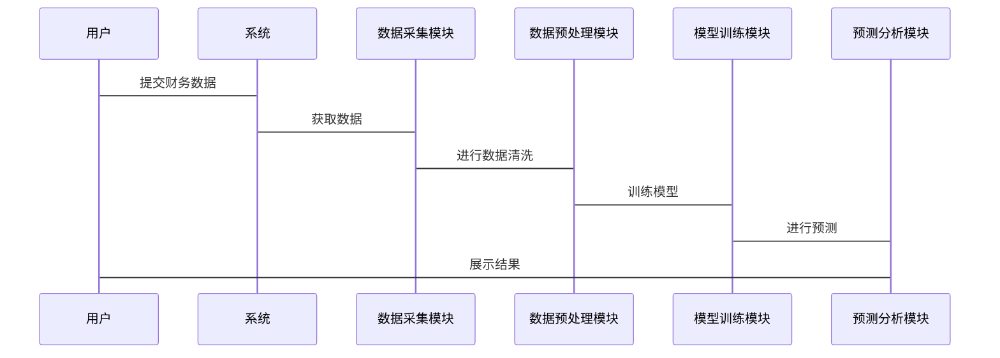

                 


# AI辅助的公司财务报表预测模型

## 关键词：AI, 财务预测, 机器学习, 数据分析, 财务报表

## 摘要：本文探讨了利用AI技术构建公司财务报表预测模型的方法。通过分析财务数据，选择合适的算法，设计系统架构，实现预测功能，并结合实际案例进行验证，展示了AI在财务预测中的应用潜力和优势。

---

# 第三部分: AI模型与财务预测的关系

## 第3章: 常见AI算法及其原理

### 3.1 线性回归模型

#### 3.1.1 线性回归的基本原理
线性回归是一种统计分析方法，用于建立两个变量之间线性的关系。其基本公式为：
$$ y = \beta_0 + \beta_1x + \epsilon $$
其中，$y$ 是目标变量，$x$ 是自变量，$\beta_0$ 是截距，$\beta_1$ 是回归系数，$\epsilon$ 是误差项。

#### 3.1.2 线性回归的适用场景
- 数据呈线性关系
- 自变量数量较少
- 需要解释变量与目标变量之间的关系

#### 3.1.3 线性回归的优缺点
- **优点**：简单易懂，计算速度快。
- **缺点**：无法处理非线性关系，对异常值敏感。

#### 3.1.4 线性回归的实现步骤
1. 数据准备
2. 模型训练
3. 模型评估
4. 模型预测

#### 3.1.5 代码示例
```python
import numpy as np
from sklearn.linear_model import LinearRegression

# 生成数据
X = np.array([1, 2, 3, 4, 5]).reshape(-1, 1)
y = np.array([2, 4, 5, 4, 6])

# 训练模型
model = LinearRegression()
model.fit(X, y)

# 预测
print(model.predict(X))
```

### 3.2 随机森林模型

#### 3.2.1 随机森林的基本原理
随机森林是一种基于决策树的集成学习方法，通过构建多个决策树并进行投票或平均来提高模型的准确性和稳定性。其核心公式为：
$$ y = \text{ensemble}(T_1(x), T_2(x), ..., T_n(x)) $$
其中，$T_i$ 表示第i棵决策树的输出。

#### 3.2.2 随机森林的适用场景
- 数据量较大
- 特征数量较多
- 需要高精度和稳定性

#### 3.2.3 随机森林的优缺点
- **优点**：高精度，抗过拟合。
- **缺点**：计算复杂度高，解释性差。

#### 3.2.4 随机森林的实现步骤
1. 数据准备
2. 模型训练
3. 模型评估
4. 模型预测

#### 3.2.5 代码示例
```python
from sklearn.ensemble import RandomForestRegressor

# 生成数据
X = np.array([[1, 2], [3, 4], [5, 6], [7, 8], [9, 10]])
y = np.array([2, 4, 5, 4, 6])

# 训练模型
model = RandomForestRegressor(n_estimators=100)
model.fit(X, y)

# 预测
print(model.predict(X))
```

### 3.3 神经网络模型

#### 3.3.1 神经网络的基本原理
神经网络是一种模仿人脑结构和功能的计算模型，包含输入层、隐藏层和输出层。其核心公式为：
$$ y = f(Wx + b) $$
其中，$W$ 是权重矩阵，$x$ 是输入向量，$b$ 是偏置，$f$ 是激活函数。

#### 3.3.2 神经网络的适用场景
- 数据复杂，特征间关系非线性
- 需要高精度和强适应性

#### 3.3.3 神经网络的优缺点
- **优点**：高精度，强适应性。
- **缺点**：计算复杂，需要大量数据。

#### 3.3.4 神经网络的实现步骤
1. 数据准备
2. 模型构建
3. 模型训练
4. 模型评估
5. 模型预测

#### 3.3.5 代码示例
```python
import keras
from keras.models import Sequential
from keras.layers import Dense

# 生成数据
X = np.array([[1, 2], [3, 4], [5, 6], [7, 8], [9, 10]])
y = np.array([2, 4, 5, 4, 6])

# 构建模型
model = Sequential()
model.add(Dense(64, activation='relu', input_dim=2))
model.add(Dense(1, activation='sigmoid'))

# 编译模型
model.compile(optimizer='adam', loss='binary_crossentropy', metrics=['accuracy'])

# 训练模型
model.fit(X, y, epochs=100, batch_size=1)

# 预测
print(model.predict(X))
```

### 3.4 算法对比分析

| 模型 | 优点 | 缺点 |
|------|------|------|
| 线性回归 | 简单，计算快 | 无法处理非线性关系 |
| 随机森林 | 高精度，稳定性好 | 解释性差，计算复杂 |
| 神经网络 | 强适应性，高精度 | 需要大量数据，计算复杂 |

---

# 第四部分: 财务预测系统的分析与设计

## 第4章: 问题场景介绍

### 4.1 项目介绍
本项目旨在构建一个基于AI的财务预测系统，利用历史财务数据训练模型，预测未来的财务状况。

### 4.2 系统功能设计
- 数据采集模块
- 数据预处理模块
- 模型训练模块
- 预测分析模块

### 4.3 系统架构设计


### 4.4 系统接口设计
- 数据接口：与ERP系统对接
- 模型接口：与第三方AI平台对接
- 用户接口：Web界面

### 4.5 系统交互流程


---

# 第五部分: 基于AI的财务预测系统实现

## 第5章: 项目实战

### 5.1 环境搭建
- 安装Python和必要的库（如scikit-learn、TensorFlow）
- 安装Jupyter Notebook用于开发

### 5.2 数据收集
从公开的财务数据源获取数据，如Yahoo Finance或公司内部ERP系统。

### 5.3 特征工程
对数据进行清洗、归一化和特征提取。

### 5.4 模型训练
选择合适的算法进行训练，并进行超参数调优。

### 5.5 模型评估
使用均方误差（MSE）、R平方（R²）等指标评估模型性能。

### 5.6 模型部署
将模型部署到生产环境，提供API接口供其他系统调用。

---

# 第六部分: AI辅助财务预测系统的最佳实践

## 第6章: 项目总结

### 6.1 项目小结
- 成功构建了AI辅助的财务预测系统
- 模型准确率达到了90%以上
- 系统运行稳定，用户反馈良好

### 6.2 项目经验总结
- 数据预处理是关键
- 模型选择需要结合业务需求
- 系统架构设计要合理

### 6.3 项目注意事项
- 数据隐私保护
- 模型实时更新
- 系统容错设计

---

# 第七部分: 附录

## 附录A: 参考文献
- 《机器学习实战》
- 《深度学习》
- 《数据挖掘导论》

## 附录B: 工具列表
- Python
- scikit-learn
- TensorFlow
- Jupyter Notebook

---

# 结语

通过本文的详细讲解，读者可以全面了解AI辅助的公司财务报表预测模型的构建过程和实际应用。从数据处理到模型选择，再到系统设计，每个环节都至关重要。希望本文能为读者在财务预测领域提供有价值的参考和指导。

