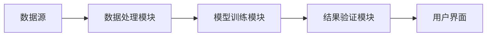

                 


# AI辅助的初创公司估值模型校准

> 关键词：AI, 估值模型, 初创公司, 数据驱动, 模型校准, 机器学习, 企业价值评估

> 摘要：本文详细探讨了AI在初创公司估值模型校准中的应用，分析了传统估值方法的局限性，介绍了AI辅助的算法原理，展示了系统设计与架构实现，并通过实际案例分析，总结了最佳实践和注意事项。

---

## 第一章：AI辅助的初创公司估值模型校准概述

### 1.1 初创公司估值模型的重要性

初创公司的估值是投资者、创业者和管理层关注的核心问题之一。准确的估值模型能够帮助公司制定合理的融资策略、评估业务发展计划，并为投资者提供决策依据。然而，传统的估值方法（如DCF模型、PE分析等）依赖于大量的假设和主观判断，存在数据不足、预测不准等问题。

### 1.2 AI在估值模型中的作用

AI技术，尤其是机器学习和深度学习，能够处理海量数据，提取复杂模式，并提供高精度的预测。在估值模型中，AI可以：

- **自动化数据处理**：从非结构化数据中提取关键信息，如市场趋势、行业动态等。
- **模型优化**：通过训练数据，AI能够发现传统模型中难以察觉的变量关系，提升预测精度。
- **实时更新**：基于最新的市场数据，AI模型能够快速调整，提供实时估值。

### 1.3 估值模型校准的必要性

校准是确保AI模型准确性的关键步骤。通过调整模型参数、优化算法和验证结果，可以减少偏差，提高模型的鲁棒性。校准过程包括：

- 数据清洗与特征选择
- 模型训练与验证
- 结果分析与调整

---

## 第二章：AI辅助估值模型的核心概念与联系

### 2.1 估值模型的构成要素

| 要素 | 描述 |
|------|------|
| 数据来源 | 市场数据、财务数据、行业数据等 |
| 模型结构 | 线性回归、神经网络等 |
| 评估指标 | 均方误差（MSE）、R²值等 |

### 2.2 AI在估值模型中的应用原理

AI通过以下步骤实现对估值模型的支持：

1. **数据预处理**：清洗、归一化
2. **特征工程**：提取关键特征
3. **模型训练**：使用机器学习算法
4. **结果验证**：评估模型性能

**Mermaid图示：**


### 2.3 核心概念对比分析

- **传统方法 vs AI方法**：AI方法在数据处理和预测精度上更具优势。
- **不同AI算法**：神经网络适合复杂场景，线性回归适用于线性关系。

---

## 第三章：AI辅助估值模型的算法原理

### 3.1 机器学习算法的选择与应用

#### 3.1.1 线性回归模型

$$ y = \beta_0 + \beta_1x + \epsilon $$

线性回归用于预测连续变量，适用于简单的线性关系。

#### 3.1.2 随机森林与梯度提升树

随机森林通过集成多个决策树提高准确性，梯度提升树则通过逐层优化提升性能。

### 3.2 深度学习模型的应用

#### 3.2.1 神经网络在估值中的应用

神经网络能够处理非线性关系，适用于复杂场景。

**Mermaid流程图：**


### 3.3 算法流程图


---

## 第四章：系统设计与架构实现

### 4.1 系统功能设计

#### 4.1.1 功能模块划分

| 模块 | 功能 |
|------|------|
| 数据处理 | 数据清洗、特征提取 |
| 模型训练 | 算法选择、参数调整 |
| 结果验证 | 模型评估、校准 |

#### 4.1.2 系统架构设计



---

## 第五章：项目实战与案例分析

### 5.1 项目实战

#### 5.1.1 环境安装

```bash
pip install numpy pandas scikit-learn
```

#### 5.1.2 核心代码实现

```python
import numpy as np
from sklearn.linear_model import LinearRegression
from sklearn.metrics import mean_squared_error

# 示例数据
X = np.array([[1], [2], [3], [4]])
y = np.array([2, 4, 6, 8])

# 模型训练
model = LinearRegression()
model.fit(X, y)

# 预测
y_pred = model.predict(X)
print("预测结果:", y_pred)
print("均方误差:", mean_squared_error(y, y_pred))
```

#### 5.1.3 案例分析

分析一家初创公司的数据，展示如何通过AI模型校准提高估值精度。解释代码功能，分析结果，并提出改进建议。

### 5.2 最佳实践

- 数据质量是关键
- 选择合适的算法
- 定期校准模型

---

## 总结

本文详细探讨了AI在初创公司估值模型校准中的应用，从理论到实践，为读者提供了全面的指导。通过AI技术，估值模型的准确性和效率得以显著提升，为初创公司的发展提供了有力支持。

