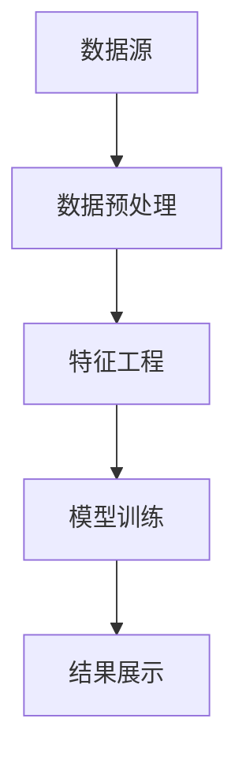
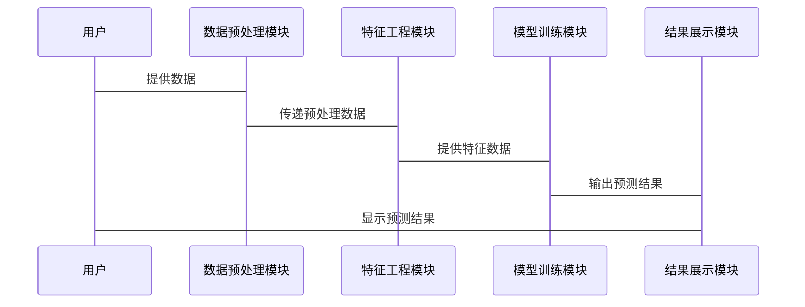

                 


# AI辅助的宏观经济指标预测与情景分析

**关键词**：宏观经济预测、人工智能、机器学习、情景分析、大数据

**摘要**：本文探讨了如何利用人工智能技术辅助宏观经济指标的预测与情景分析。通过分析宏观经济指标的特征及其与AI技术的结合，介绍了多种机器学习算法的原理与实现，并结合实际案例展示了AI在宏观经济预测中的应用价值。文章旨在为读者提供一个全面的视角，帮助其理解AI在宏观经济分析中的潜力与挑战。

---

# 第1章 宏观经济指标预测的背景与挑战

## 1.1 宏观经济指标预测的背景

### 1.1.1 宏观经济指标的基本概念

宏观经济指标是反映一个国家或地区经济运行状况的核心数据，主要包括国内生产总值（GDP）、失业率、通货膨胀率、工业增加值、消费指数等。这些指标能够帮助政策制定者、经济学家和投资者更好地理解经济趋势，从而做出更明智的决策。

### 1.1.2 宏观经济预测的重要性

准确的宏观经济预测对于政策制定、投资决策和企业规划具有重要意义。例如，政府可以根据GDP增长预测调整财政政策，企业可以根据通货膨胀预期制定生产和库存计划。然而，宏观经济预测的复杂性使得传统的统计方法往往难以满足需求。

### 1.1.3 传统经济预测方法的局限性

传统的宏观经济预测方法主要依赖于统计数据和经济学模型，如时间序列分析和计量经济模型。这些方法在处理复杂性和不确定性时存在局限性，尤其是在面对非线性关系和外部冲击时，预测结果往往不够准确。

---

## 1.2 AI在宏观经济预测中的作用

### 1.2.1 AI技术的特点与优势

人工智能技术通过机器学习算法能够处理海量数据，发现传统方法难以捕捉的模式和关系。AI的优势在于其强大的数据处理能力和自适应性，能够实时更新模型以应对数据的变化。

### 1.2.2 AI在宏观经济预测中的应用场景

AI技术可以应用于多种宏观经济预测场景，如GDP预测、通货膨胀预测、失业率预测等。通过自然语言处理（NLP）技术，AI还可以从新闻、社交媒体等非结构化数据中提取信息，辅助预测。

### 1.2.3 AI辅助预测的潜在价值

AI辅助预测能够提高预测的准确性和及时性，为政策制定者和投资者提供更可靠的决策依据。此外，AI还可以帮助分析多种情景，评估不同政策的潜在影响。

---

## 1.3 本书的目标与结构

### 1.3.1 本书的核心目标

本书旨在探讨如何利用人工智能技术辅助宏观经济指标的预测与情景分析，帮助读者理解AI在宏观经济分析中的潜力与应用。

### 1.3.2 本书的主要内容

本书将从宏观经济指标的基本概念入手，分析AI技术的特点与优势，介绍多种机器学习算法的原理与实现，并结合实际案例展示AI在宏观经济预测中的应用。

### 1.3.3 本书的读者群体

本书适合对宏观经济分析和人工智能技术感兴趣的读者，包括经济学学生、数据科学家、政策制定者以及对宏观经济预测感兴趣的投资者。

---

## 1.4 本章小结

本章介绍了宏观经济指标预测的背景与挑战，分析了AI技术在宏观经济预测中的作用，并简要概述了本书的内容与目标。

---

# 第2章 宏观经济指标预测的核心概念与联系

## 2.1 宏观经济指标的分类与属性

### 2.1.1 主要宏观经济指标的分类

宏观经济指标可以分为总量指标、结构指标和价格指标。总量指标包括GDP、失业率等；结构指标包括行业分布、消费结构等；价格指标包括通货膨胀率、CPI等。

### 2.1.2 各类指标的特征对比

通过对比不同指标的特征，我们可以更好地理解它们之间的关系。例如，GDP增长率与失业率通常呈负相关关系，而CPI与货币政策密切相关。

### 2.1.3 指标之间的相互关系

宏观经济指标之间往往存在复杂的相互关系。例如，GDP增长可能导致通货膨胀上升，同时可能伴随着失业率下降。

---

## 2.2 AI辅助预测的核心原理

### 2.2.1 数据驱动的预测方法

数据驱动的方法依赖于大量历史数据，通过机器学习算法发现数据中的模式和关系。

### 2.2.2 模型驱动的预测方法

模型驱动的方法基于经济学理论，利用数学模型描述变量之间的关系。

### 2.2.3 数据与模型的结合

AI辅助预测的核心在于数据与模型的结合，通过不断优化模型参数来提高预测的准确性。

---

## 2.3 宏观经济指标预测的系统架构

### 2.3.1 数据流的处理流程

数据流的处理流程包括数据采集、预处理、特征提取和模型训练等步骤。

### 2.3.2 模型训练的逻辑

模型训练的逻辑包括数据输入、模型选择、参数优化和结果评估等步骤。

### 2.3.3 结果输出的展示方式

结果输出可以通过图表、报告等形式展示，帮助用户更好地理解预测结果。

---

## 2.4 本章小结

本章详细介绍了宏观经济指标的分类与属性，分析了AI辅助预测的核心原理，并描述了宏观经济指标预测的系统架构。

---

# 第3章 常见预测算法的原理与实现

## 3.1 线性回归模型

### 3.1.1 线性回归的基本原理

线性回归是一种简单而有效的预测方法，通过最小化预测值与实际值之间的平方差来优化模型参数。

### 3.1.2 普通最小二乘法的数学公式

线性回归的数学公式为：
$$ y = \beta_0 + \beta_1 x + \epsilon $$

### 3.1.3 算法的优缺点分析

线性回归的优点是简单易懂，计算效率高；缺点是无法处理非线性关系，预测精度有限。

---

## 3.2 随机森林模型

### 3.2.1 随机森林的原理

随机森林是一种基于决策树的集成学习方法，通过随机选择特征和样本进行多次训练，最终通过投票或平均的方式得到预测结果。

### 3.2.2 随机森林的数学表达

随机森林的数学表达较为复杂，但其核心在于通过集成多个决策树模型来提高预测的准确性和稳定性。

### 3.2.3 算法的适用场景

随机森林适用于特征较多且数据分布较为复杂的场景，能够有效处理非线性关系。

---

## 3.3 神经网络模型

### 3.3.1 神经网络的基本结构

神经网络由输入层、隐藏层和输出层组成，通过多层感知机（MLP）结构实现非线性关系的建模。

### 3.3.2 网络训练的数学模型

神经网络的训练过程涉及正向传播和反向传播，通过链式法则优化权重参数。

$$ L = -\sum_{i=1}^{n} y_i \log(a_i) + (1 - y_i)\log(1 - a_i) $$

### 3.3.3 算法的优缺点分析

神经网络具有强大的非线性建模能力，但训练过程复杂，需要大量的计算资源。

---

## 3.4 本章小结

本章介绍了几种常见的预测算法，包括线性回归、随机森林和神经网络，并分析了它们的优缺点。

---

# 第4章 系统分析与架构设计方案

## 4.1 问题场景介绍

### 4.1.1 项目介绍

本项目旨在开发一个基于AI的宏观经济指标预测系统，帮助用户进行经济预测和政策分析。

### 4.1.2 系统功能设计

系统功能包括数据采集、特征工程、模型训练和结果展示。

### 4.1.3 领域模型（领域模型Mermaid类图）



---

## 4.2 系统架构设计

### 4.2.1 系统架构（系统架构Mermaid架构图）


---

## 4.3 系统接口设计

### 4.3.1 系统接口

系统接口包括数据输入接口、模型训练接口和结果输出接口。

---

## 4.4 系统交互流程

### 4.4.1 系统交互（系统交互Mermaid序列图）



---

## 4.5 本章小结

本章详细介绍了宏观经济指标预测系统的架构设计，包括功能模块、接口设计和交互流程。

---

# 第5章 项目实战：基于AI的宏观经济指标预测

## 5.1 环境安装与配置

### 5.1.1 Python环境的安装

安装Python 3.8及以上版本，并配置虚拟环境。

### 5.1.2 数据科学库的安装

安装必要的库，如numpy、pandas、scikit-learn、keras等。

---

## 5.2 系统核心实现

### 5.2.1 数据预处理代码

```python
import pandas as pd
import numpy as np

# 加载数据
data = pd.read_csv('macro_economy.csv')

# 删除缺失值
data.dropna(inplace=True)

# 标准化处理
from sklearn.preprocessing import StandardScaler
scaler = StandardScaler()
data_scaled = scaler.fit_transform(data)
```

### 5.2.2 特征工程代码

```python
from sklearn.feature_selection import SelectKBest
from sklearn.feature_selection import chi2

selector = SelectKBest(score_func=chi2, k=5)
selected_features = selector.fit_transform(data_scaled, target)
```

### 5.2.3 模型训练代码

```python
from sklearn.ensemble import RandomForestRegressor
from sklearn.metrics import mean_squared_error

model = RandomForestRegressor(n_estimators=100, random_state=42)
model.fit(X_train, y_train)

y_pred = model.predict(X_test)
print('均方误差:', mean_squared_error(y_test, y_pred))
```

---

## 5.3 代码应用解读与分析

### 5.3.1 代码功能解读

上述代码展示了数据预处理、特征工程和模型训练的主要步骤。数据预处理包括缺失值处理和标准化，特征工程使用了卡方检验选择特征，模型训练使用了随机森林回归器。

### 5.3.2 案例分析

以GDP增长预测为例，代码展示了如何利用AI技术进行预测，并输出预测结果的均方误差。

---

## 5.4 项目小结

本章通过一个实际项目展示了AI在宏观经济指标预测中的应用，从环境配置到代码实现，详细讲解了整个过程。

---

# 第6章 最佳实践与注意事项

## 6.1 最佳实践 tips

### 6.1.1 数据质量的重要性

确保数据的完整性和准确性是提高预测精度的关键。

### 6.1.2 模型调优的必要性

通过交叉验证和网格搜索优化模型参数，可以显著提高预测精度。

### 6.1.3 选择合适的算法

根据具体场景选择合适的算法，避免盲目使用复杂模型。

---

## 6.2 注意事项

### 6.2.1 数据隐私问题

在处理宏观经济数据时，需要注意数据隐私和合规性。

### 6.2.2 模型的可解释性

复杂的模型可能难以解释，需要权衡模型的准确性和可解释性。

### 6.2.3 实时更新与维护

宏观经济指标受多种因素影响，需要定期更新模型和数据。

---

## 6.3 拓展阅读

### 6.3.1 经济学中的时间序列分析

时间序列分析是宏观经济预测的重要方法，值得深入学习。

### 6.3.2 最新AI技术的发展

了解AI领域的最新进展，能够更好地应用于宏观经济预测。

---

## 6.4 本章小结

本章总结了AI辅助宏观经济指标预测的最佳实践，提出了需要注意的事项，并给出了拓展阅读的方向。

---

# 结语

人工智能技术为宏观经济指标的预测与情景分析提供了新的可能性。通过结合先进的算法和大数据技术，AI能够帮助我们更准确地预测经济趋势，制定更有效的政策和投资策略。希望本文能够为读者提供有价值的参考，激发更多思考与实践。

--- 

**注**：由于篇幅限制，本文未展示所有代码细节和图表，具体内容可根据实际需求进一步扩展与完善。

