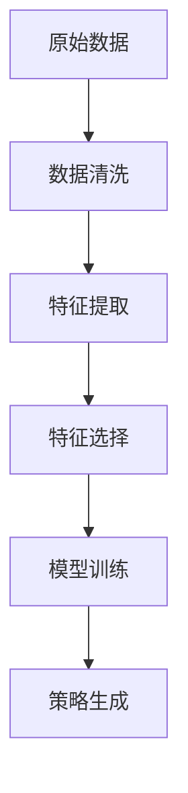
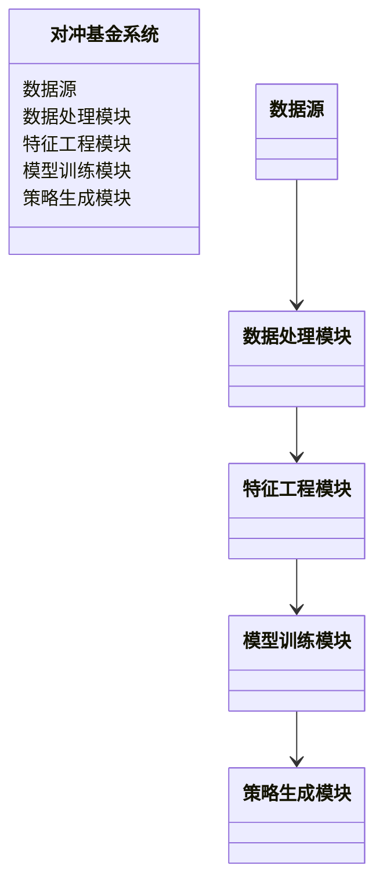
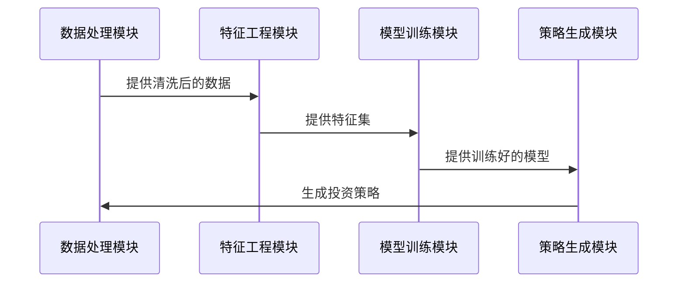

                 


# AI辅助的对冲基金策略分析

> 关键词：AI，对冲基金，策略分析，机器学习，金融投资

> 摘要：本文探讨了人工智能在对冲基金策略分析中的应用，详细介绍了数据处理、特征工程、算法选择、系统架构设计以及项目实战等内容，结合实际案例，分析了AI如何优化对冲基金的投资决策过程。

---

# 第一部分: 引言

## 第1章: 对冲基金与AI概述

### 1.1 对冲基金的基本概念

#### 1.1.1 对冲基金的定义与运作模式

对冲基金是一种通过多种投资策略来对冲市场风险、追求绝对收益的金融工具。其核心目标是通过多空头寸的组合，降低市场波动性的影响，实现稳定的投资回报。

- **对冲基金的定义**：对冲基金是一种集合投资工具，通过杠杆操作、多空头寸和衍生品投资，追求绝对收益。
- **运作模式**：对冲基金通常采用多种策略，如股票多空、套利、事件驱动等，以应对不同市场环境下的投资机会。

#### 1.1.2 对冲基金的主要策略类型

- **股票多空策略**：通过买入低估股票和卖空高估股票，赚取价差。
- **套利策略**：利用市场价差，通过同时买入低估资产和卖出高估资产获利。
- **事件驱动策略**：基于公司并购、重组等事件，进行短期套利。
- **对冲基金策略的多样性**：不同策略适用于不同的市场环境，对冲基金通过灵活调整策略组合应对市场变化。

#### 1.1.3 对冲基金的市场影响与风险

- **市场影响**：对冲基金通过高频交易和复杂策略，对市场流动性产生重大影响，甚至可能导致市场波动。
- **风险**：对冲基金策略的高度杠杆化和复杂性使其面临较高的风险，尤其是系统性风险和流动性风险。

### 1.2 AI在金融领域的应用现状

#### 1.2.1 AI在金融分析中的应用

- **AI技术在金融分析中的应用**：AI技术通过自然语言处理、机器学习等方法，帮助分析财务报表、新闻舆情，预测市场走势。
- **数据处理与特征提取**：AI能够处理海量金融数据，提取有效的特征，用于投资决策。

#### 1.2.2 AI在投资决策中的作用

- **投资决策优化**：AI通过分析历史数据，识别潜在的投资机会和风险，优化投资组合。
- **交易策略自动化**：AI驱动的算法交易能够快速响应市场变化，提高交易效率。

#### 1.2.3 AI在风险控制中的应用

- **风险预测与管理**：AI能够预测市场风险，帮助对冲基金更好地管理风险敞口。
- **组合优化**：通过AI算法，优化投资组合的构成，降低风险，提高收益。

### 1.3 AI辅助对冲基金策略的必要性

#### 1.3.1 对冲基金策略的复杂性

- **复杂市场环境**：金融市场环境复杂多变，传统的对冲基金策略难以应对各种极端情况。
- **数据驱动决策**：AI技术能够处理大量数据，帮助对冲基金做出更精准的投资决策。

#### 1.3.2 AI在策略优化中的优势

- **数据处理能力**：AI能够快速处理和分析海量数据，提取有价值的信息。
- **算法优化**：通过机器学习算法，AI可以不断优化投资策略，适应市场变化。

#### 1.3.3 结合AI的对冲基金未来趋势

- **智能化投资**：未来的对冲基金将更加依赖AI技术，实现智能化投资决策。
- **人机协作**：AI与人类投资经理的结合，将提升对冲基金的投资效率和准确性。

### 1.4 本书的结构与目标

#### 1.4.1 本书的主要内容

- **内容概述**：本书将详细探讨AI在对冲基金策略分析中的应用，包括数据处理、特征工程、算法选择、系统架构设计以及项目实战等内容。

#### 1.4.2 本书的目标读者

- **目标读者**：本书适合金融从业者、数据科学家、对冲基金从业者以及对AI技术感兴趣的读者阅读。

#### 1.4.3 本书的组织结构

- **结构安排**：本书分为四大部分，包括引言、AI辅助对冲基金策略的核心概念、项目实战以及最佳实践与未来展望。

---

# 第二部分: AI辅助对冲基金策略的核心概念

## 第2章: 数据处理与特征工程

### 2.1 数据处理的基本原理

#### 2.1.1 数据清洗与预处理

- **数据清洗**：对原始数据进行去噪、填补缺失值、处理异常值。
- **数据预处理**：对数据进行标准化、归一化处理，以便后续分析。

#### 2.1.2 数据标准化与归一化

- **标准化**：通过z-score标准化，将数据转化为均值为0，方差为1的分布。
- **归一化**：通过min-max归一化，将数据压缩到0到1的范围。

#### 2.1.3 时间序列数据的特殊处理

- **时间序列特征提取**：提取数据的均值、方差、自相关系数等特征。
- **数据平滑处理**：使用移动平均法或指数平滑法处理时间序列数据。

### 2.2 特征工程的核心方法

#### 2.2.1 特征选择与降维

- **特征选择**：通过相关性分析、逐步回归等方法，选择重要特征。
- **降维方法**：使用主成分分析（PCA）等技术，减少特征维度。

#### 2.2.2 特征提取与构建

- **特征提取**：从原始数据中提取有用的特征，如技术指标、市场情绪指标等。
- **特征构建**：根据投资策略需求，构建新的特征，如动量因子、价值因子等。

#### 2.2.3 数据增强与特征优化

- **数据增强**：通过数据生成技术，增加数据多样性。
- **特征优化**：通过遗传算法等方法，优化特征组合，提高模型性能。

### 2.3 数据流图与系统架构

#### 2.3.1 数据流图



#### 2.3.2 系统架构图



---

## 第3章: 算法原理与系统架构设计

### 3.1 算法原理

#### 3.1.1 线性回归

- **线性回归模型**：通过最小二乘法，拟合最佳直线，预测目标变量。
- **数学公式**：
  $$ y = \beta_0 + \beta_1x_1 + \beta_2x_2 + ... + \beta_nx_n $$

#### 3.1.2 支持向量机

- **SVM原理**：通过构建超平面，将数据分为两类，实现分类或回归。
- **数学公式**：
  $$ y = \text{sign}(\beta_0 + \beta_1x_1 + ... + \beta_nx_n) $$

#### 3.1.3 随机森林

- **随机森林原理**：通过构建多个决策树，集成预测结果，降低模型过拟合风险。

### 3.2 系统架构设计

#### 3.2.1 系统功能设计

- **功能模块划分**：数据处理模块、特征工程模块、模型训练模块、策略生成模块。
- **模块交互流程**：
  1. 数据处理模块接收原始数据，进行清洗和预处理。
  2. 特征工程模块提取和选择特征，构建特征集。
  3. 模型训练模块基于特征集训练机器学习模型。
  4. 策略生成模块根据模型输出生成投资策略。

#### 3.2.2 系统架构图



---

## 第4章: 项目实战与代码实现

### 4.1 项目环境安装

- **安装Python环境**：使用Anaconda或虚拟环境，安装必要的Python包，如pandas、numpy、scikit-learn、xgboost等。

### 4.2 核心代码实现

#### 4.2.1 数据处理代码

```python
import pandas as pd
import numpy as np

# 数据清洗
df = pd.read_csv('data.csv')
df.dropna(inplace=True)
df = df[~df.duplicated()]
```

#### 4.2.2 特征工程代码

```python
from sklearn.preprocessing import StandardScaler

# 特征标准化
scaler = StandardScaler()
X_scaled = scaler.fit_transform(X)
```

#### 4.2.3 模型训练代码

```python
from sklearn.ensemble import RandomForestRegressor
from sklearn.metrics import mean_squared_error

# 随机森林模型训练
model = RandomForestRegressor(n_estimators=100, random_state=42)
model.fit(X_train, y_train)
y_pred = model.predict(X_test)
print('MSE:', mean_squared_error(y_test, y_pred))
```

---

## 第5章: 最佳实践与未来展望

### 5.1 最佳实践

- **数据质量**：确保数据的完整性和准确性，避免数据偏差。
- **模型解释性**：选择具有较高解释性的模型，便于理解和优化。
- **风险控制**：结合AI技术，建立有效的风险预警机制，降低投资风险。

### 5.2 小结

- **总结**：AI技术为对冲基金策略分析提供了强大的工具，能够提高投资决策的效率和准确性。
- **未来展望**：随着AI技术的不断发展，对冲基金将更加依赖智能化的投资策略，人机协作将成为主流。

---

# 结语

通过本文的详细介绍，读者可以全面了解AI在对冲基金策略分析中的应用，从数据处理到模型训练，再到策略生成，掌握AI辅助对冲基金的核心技术。希望本文能够为读者提供有价值的参考和启发，帮助他们在金融投资领域取得更大的成功。

--- 

**End of Article**

