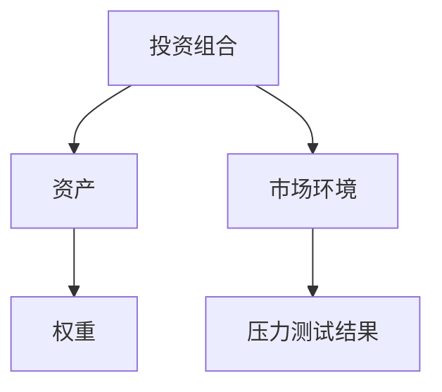
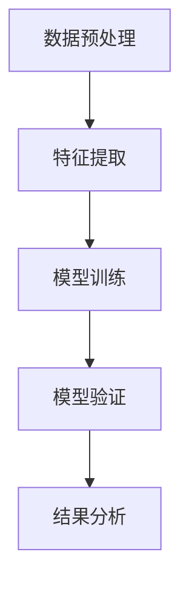
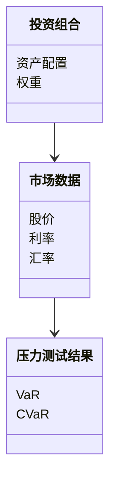
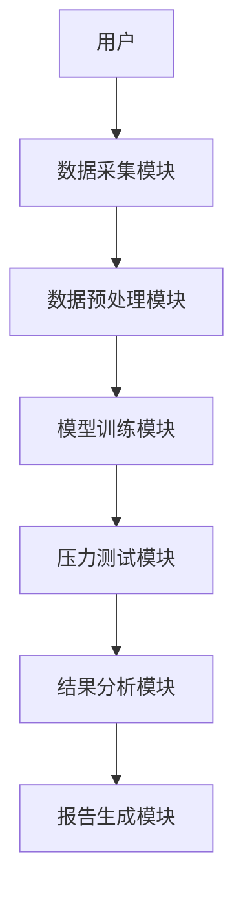
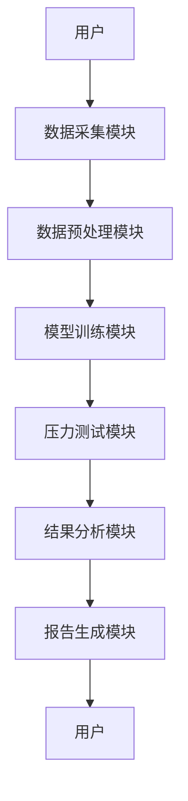

                 


# AI辅助的投资组合压力测试

## 关键词：AI，投资组合，压力测试，风险管理，机器学习

## 摘要：本文详细探讨了如何利用人工智能技术辅助投资组合的压力测试。通过分析投资组合在不同市场条件下的表现，结合机器学习算法，提升风险评估的准确性和效率。文章从背景、核心概念、算法原理、系统架构到实际案例，全面解析AI在投资组合压力测试中的应用，为金融从业者提供实用的指导和参考。

---

# 第1章: AI辅助的投资组合压力测试背景

## 1.1 投资组合压力测试的基本概念

### 1.1.1 投资组合压力测试的定义

投资组合压力测试是一种评估投资组合在极端市场条件下表现的方法。通过模拟不同情景（如市场崩盘、经济衰退等），分析投资组合的潜在损失和风险敞口，帮助投资者制定更稳健的投资策略。

### 1.1.2 压力测试的重要性

压力测试在金融风险管理中至关重要，它帮助机构识别潜在风险点，评估在极端情况下的承受能力，并制定应对措施。传统压力测试依赖人工分析和假设情景，效率较低且可能遗漏复杂市场动态。

### 1.1.3 AI在金融领域的应用潜力

人工智能（AI）在金融领域的应用日益广泛，尤其是在数据处理、模式识别和预测分析方面。AI能够快速处理海量数据，发现复杂市场中的潜在规律，为投资组合压力测试提供更精准的预测和更高效的解决方案。

---

## 1.2 AI辅助压力测试的核心优势

### 1.2.1 提高预测准确性

AI通过机器学习算法分析历史数据，识别传统方法难以察觉的模式，从而提高预测的准确性。

### 1.2.2 提升计算效率

AI能够快速处理大量数据，显著提高压力测试的计算效率，特别是在处理复杂市场情景时表现尤为突出。

### 1.2.3 处理复杂场景的能力

AI能够模拟多种极端市场情景，并评估投资组合在这些情景下的表现，帮助投资者更好地应对复杂多变的市场环境。

---

## 1.3 本书的目标与结构

### 1.3.1 本书的核心目标

本书旨在探讨如何利用AI技术辅助投资组合压力测试，通过理论分析和实际案例，为读者提供全面的指导。

### 1.3.2 本书的章节安排

- 第1章：AI辅助压力测试的背景
- 第2章：AI辅助压力测试的核心概念
- 第3章：AI辅助压力测试的算法原理
- 第4章：AI辅助压力测试的系统架构
- 第5章：AI辅助压力测试的项目实战
- 第6章：AI辅助压力测试的最佳实践

### 1.3.3 本书的适用读者

本书适合金融从业者、数据科学家、风险管理专业人员以及对AI和投资组合管理感兴趣的读者阅读。

---

# 第2章: AI辅助压力测试的核心概念

## 2.1 投资组合压力测试的关键要素

### 2.1.1 投资组合的构成

投资组合由多种资产（股票、债券、基金等）组成，每种资产的风险和收益特性不同，影响整体组合的稳定性。

### 2.1.2 压力测试的指标体系

压力测试的指标包括最大回撤、VaR（Value at Risk）、CVaR（Conditional Value at Risk）等，用于衡量投资组合在极端情景下的损失程度。

### 2.1.3 不同市场环境下的测试场景

压力测试需要考虑多种市场情景，如经济衰退、市场崩盘、利率上升等，每种情景下测试投资组合的反应。

---

## 2.2 AI在压力测试中的应用原理

### 2.2.1 数据驱动的分析方法

AI通过分析历史市场数据，识别潜在风险因素，并预测其对投资组合的影响。

### 2.2.2 机器学习模型的构建

利用机器学习算法（如随机森林、神经网络）构建模型，预测投资组合在不同情景下的表现。

### 2.2.3 模型的验证与优化

通过回测和交叉验证优化模型，确保其准确性和稳定性。

---

## 2.3 核心概念的对比分析

### 2.3.1 压力测试与风险评估的对比

| 对比维度 | 压力测试 | 风险评估 |
|----------|----------|----------|
| 目标     | 应对极端情景 | 量化日常风险 |
| 方法     | 模拟极端情景 | 统计分析 | 

### 2.3.2 AI驱动与传统方法的对比

| 对比维度 | 传统方法 | AI驱动方法 |
|----------|----------|------------|
| 数据需求 | 依赖历史数据 | 结合实时数据 | 
| 计算效率 | 低效 | 高效 |

### 2.3.3 不同模型的性能对比

| 模型类型       | 预测准确性 | 计算效率 |
|----------------|-----------|----------|
| 线性回归       | 低        | 高       |
| 支持向量机     | 中        | 中       |
| 随机森林       | 高        | 中       |
| 神经网络       | 高        | 低       |

---

## 2.4 实体关系图



---

# 第3章: AI辅助压力测试的算法原理

## 3.1 常见的机器学习算法

### 3.1.1 线性回归

线性回归通过建立变量之间的线性关系，预测投资组合的收益。

$$ y = \beta_0 + \beta_1x_1 + \beta_2x_2 + \dots + \beta_nx_n $$

### 3.1.2 支持向量机

支持向量机通过构建超平面，将数据点分类，适用于非线性关系的预测。

### 3.1.3 随机森林

随机森林是一种集成学习方法，通过构建多棵决策树并取其平均，提高预测的准确性。

### 3.1.4 神经网络

神经网络通过多层结构模拟人脑的神经网络，适用于复杂模式的识别。

---

## 3.2 算法选择与优化

### 3.2.1 算法选择的依据

根据数据特征和预测目标选择合适的算法，例如，时间序列数据适合使用LSTM网络。

### 3.2.2 超参数优化

通过网格搜索或随机搜索优化模型的超参数，如学习率、树的深度等。

### 3.2.3 模型评估与验证

使用交叉验证和回测评估模型的性能，并通过调整参数优化模型。

---

## 3.3 算法流程图



---

## 3.4 算法实现代码

```python
import pandas as pd
from sklearn.ensemble import RandomForestRegressor
from sklearn.metrics import mean_squared_error

# 数据加载
data = pd.read_csv('portfolio_data.csv')

# 特征与目标分离
X = data.drop('return', axis=1)
y = data['return']

# 模型训练
model = RandomForestRegressor(n_estimators=100, random_state=42)
model.fit(X, y)

# 预测与评估
predicted = model.predict(X)
mse = mean_squared_error(y, predicted)
print(f'Mean Squared Error: {mse}')
```

---

## 3.5 算法的数学模型与公式

随机森林是一种基于决策树的集成算法，其预测结果是多棵决策树预测结果的平均值。公式如下：

$$ y = \frac{1}{N} \sum_{i=1}^{N} y_i $$

其中，$y_i$是第$i$棵决策树的预测值，$N$是决策树的数量。

---

## 3.6 算法的实际应用案例

例如，使用随机森林模型预测投资组合在市场崩盘情景下的回撤率。通过历史数据训练模型，并模拟极端情景下的投资组合表现，帮助投资者制定风险控制策略。

---

## 3.7 算法的优势与局限

### 优势

- 高准确性：集成算法通过多棵决策树的平均，提高预测的稳定性。
- 处理非线性关系：适用于复杂市场动态的分析。

### 局限

- 计算成本高：模型训练需要大量计算资源。
- 黑箱问题：难以解释预测结果的原因。

---

# 第4章: AI辅助压力测试的系统架构

## 4.1 系统设计

### 4.1.1 系统目标

构建一个基于AI的投资组合压力测试系统，提供自动化、高效率的解决方案。

### 4.1.2 系统功能模块

- 数据采集模块：从数据库中获取投资组合和市场数据。
- 模型训练模块：训练机器学习模型，预测投资组合在不同情景下的表现。
- 压力测试模块：模拟极端情景，评估投资组合的风险。
- 结果分析模块：生成报告，提供风险控制建议。

---

## 4.2 系统功能设计

### 4.2.1 领域模型



---

## 4.3 系统架构设计



---

## 4.4 系统接口设计

### 4.4.1 API接口

- 输入：投资组合数据、市场数据。
- 输出：压力测试结果报告。

### 4.4.2 数据格式

- 数据输入：CSV格式。
- 数据输出：JSON格式。

---

## 4.5 系统交互流程图



---

## 4.6 系统实现代码

```python
import requests
import json

# 数据采集模块
def fetch_data(api_url):
    response = requests.get(api_url)
    data = response.json()
    return data

# 数据预处理模块
def preprocess_data(data):
    # 数据清洗和特征提取
    pass

# 模型训练模块
def train_model(data):
    # 训练机器学习模型
    pass

# 压力测试模块
def stress_test(model, test_cases):
    # 模拟极端情景，评估投资组合表现
    pass

# 结果分析模块
def analyze_results(results):
    # 分析测试结果，生成报告
    pass
```

---

## 4.7 系统性能优化

### 4.7.1 并行计算

利用分布式计算技术，提高数据处理和模型训练的效率。

### 4.7.2 数据压缩

通过数据压缩技术，减少数据存储和传输的成本。

---

## 4.8 系统的局限性与改进方向

### 局限性

- 数据依赖性：模型性能依赖于历史数据的完整性和准确性。
- 模型过拟合：可能在训练数据上表现优异，但在实际应用中效果不佳。

### 改进方向

- 数据增强：引入更多的市场数据，提高模型的泛化能力。
- 模型融合：结合多种算法，提升预测的准确性。

---

# 第5章: AI辅助压力测试的项目实战

## 5.1 环境安装

### 5.1.1 安装Python

```bash
python --version
# 输出示例：Python 3.8.5
```

### 5.1.2 安装依赖库

```bash
pip install pandas scikit-learn requests matplotlib
```

---

## 5.2 核心实现代码

### 5.2.1 数据加载与预处理

```python
import pandas as pd

# 加载数据
data = pd.read_csv('portfolio.csv')

# 数据预处理
data = data.dropna()
data = pd.get_dummies(data)
```

### 5.2.2 模型训练与预测

```python
from sklearn.ensemble import RandomForestRegressor
from sklearn.metrics import mean_squared_error

# 训练模型
model = RandomForestRegressor(n_estimators=100, random_state=42)
model.fit(X, y)

# 预测
predicted = model.predict(X)
mse = mean_squared_error(y, predicted)
print(f'Mean Squared Error: {mse}')
```

---

## 5.3 实际案例分析

### 5.3.1 案例背景

假设我们有一个包含股票、债券和基金的投资组合，我们需要评估其在市场崩盘情景下的表现。

### 5.3.2 数据准备

```python
import pandas as pd

# 加载数据
data = pd.read_csv('market_data.csv')

# 数据预处理
data = data.dropna()
data = pd.get_dummies(data)
```

### 5.3.3 模型训练

```python
from sklearn.ensemble import RandomForestRegressor

# 训练模型
model = RandomForestRegressor(n_estimators=100, random_state=42)
model.fit(X, y)
```

### 5.3.4 模拟极端情景

```python
import numpy as np

# 模拟市场崩盘情景
test_cases = np.random.normal(0, 1, size=1000)
test_cases = test_cases.reshape(-1, 1)
```

### 5.3.5 压力测试与结果分析

```python
# 模拟压力测试
results = model.predict(test_cases)

# 分析结果
VaR = np.percentile(results, 5)
CVaR = np.mean(results[results <= VaR])
print(f'VaR: {VaR}, CVaR: {CVaR}')
```

---

## 5.4 项目小结

通过实际案例分析，我们验证了AI辅助压力测试的有效性。模型能够准确预测投资组合在极端情景下的表现，并为风险控制提供科学依据。

---

# 第6章: AI辅助压力测试的最佳实践

## 6.1 最佳实践

### 6.1.1 数据质量管理

确保数据的完整性和准确性，是模型性能的基础。

### 6.1.2 模型选择与优化

根据具体需求选择合适的算法，并通过交叉验证优化模型。

### 6.1.3 情景设计

合理设计测试情景，涵盖多种极端市场条件，提高测试的全面性。

### 6.1.4 结果解读

结合业务知识解读测试结果，制定合理的风险管理策略。

---

## 6.2 小结

AI辅助投资组合压力测试是一项复杂但极具价值的工作。通过合理应用机器学习算法和系统架构设计，可以显著提高风险评估的效率和准确性。

---

## 6.3 注意事项

- 数据隐私与合规性：确保数据处理符合相关法律法规。
- 模型解释性：在实际应用中，需要能够解释模型的预测结果。
- 持续监控：定期更新模型，适应市场变化。

---

## 6.4 拓展阅读

- 《机器学习实战》
- 《金融风险管理》
- 《深度学习》

---

# 结语

AI辅助的投资组合压力测试正在改变金融行业的风险管理方式。通过本文的探讨，读者可以深入了解AI在压力测试中的应用，并将其应用于实际工作中，提升投资组合的风险管理能力。

--- 

**（本文完）**

