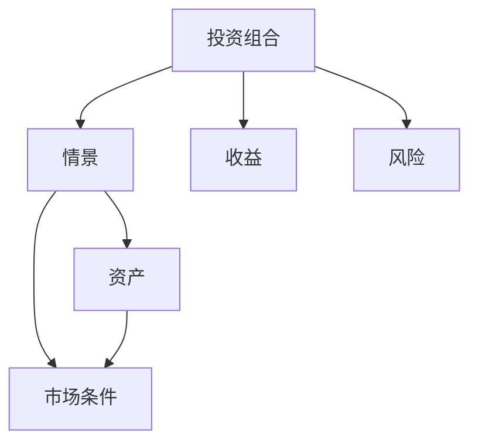
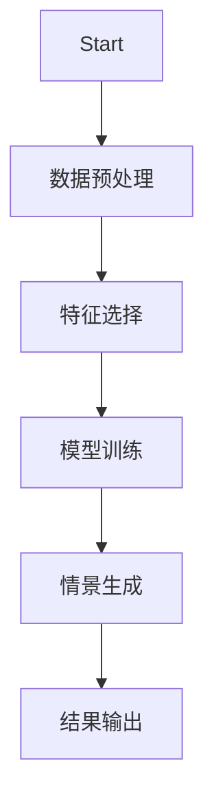
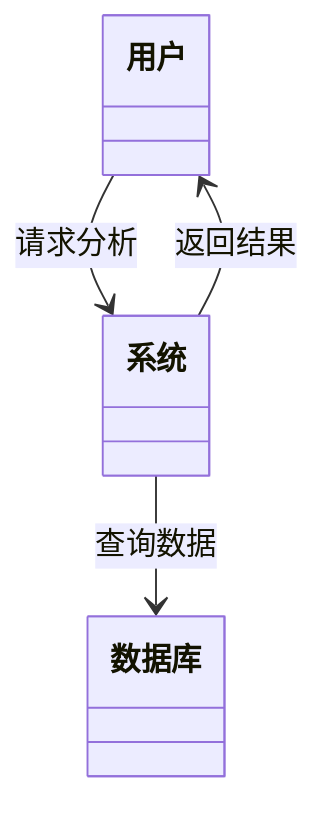

                 

<think>
好的，我需要根据用户提供的目录大纲来完成《AI辅助的投资组合情景分析工具》这篇文章的正文部分。首先，我会按照目录的结构，逐步分析每个章节的内容，确保每个部分都详细且符合要求。

### 第1章: 问题背景与核心概念

#### 1.1 投资组合情景分析的背景
1. **传统投资组合管理的局限性**  
   传统的投资组合管理依赖于人工分析和经验判断，存在效率低、主观性强、风险控制能力有限等问题。此外，市场环境的复杂性和不确定性使得传统方法难以捕捉所有潜在风险因素。

2. **AI技术在金融领域的应用潜力**  
   AI技术，尤其是机器学习和深度学习，能够处理海量数据，发现复杂模式，并进行实时预测。在投资组合管理中，AI可以用于风险评估、资产分配和情景模拟，提升决策的科学性和效率。

3. **投资组合情景分析的核心目标**  
   情景分析旨在模拟不同市场条件下的投资组合表现，帮助投资者在不同情况下做出最优决策。通过AI辅助，情景分析可以更高效、更精确地生成和评估多种市场情景。

#### 1.2 AI辅助投资组合情景分析的定义
1. **核心概念的定义**  
   AI辅助投资组合情景分析是利用人工智能技术，通过数据驱动的方式生成和分析多种市场情景，评估投资组合在不同情景下的表现，优化投资策略。

2. **关键属性对比分析**  
   | 特性       | 传统方法          | AI辅助方法         |
   |------------|-------------------|--------------------|
   | 数据处理   | 依赖经验判断       | 数据驱动，自动化处理 |
   | 情景生成   | 数量有限，基于假设 | 大规模生成，基于模型 |
   | 风险评估   | 主观性强          | 客观，基于数据模型   |

3. **核心要素的组成结构**  
   核心要素包括：数据输入、情景生成模型、情景评估模型、结果输出与优化建议。

#### 1.3 当前技术现状与挑战
1. **现有工具的不足**  
   现有工具主要依赖于统计模型，难以处理非线性关系和复杂市场动态。

2. **AI技术的应用边界**  
   AI在情景分析中的应用目前主要集中在数据处理和模型预测，但在解释性和可解释性方面仍需进一步提升。

3. **情景分析的复杂性与不确定性**  
   市场的不确定性使得情景分析的结果具有较高的波动性，AI模型需要具备较强的鲁棒性以应对复杂环境。

### 第2章: AI与投资组合分析的结合

#### 2.1 AI在投资组合分析中的作用
1. **数据处理与特征提取**  
   AI能够从大量非结构化数据中提取有用特征，例如新闻数据、社交媒体信息等。

2. **模型训练与预测**  
   利用机器学习模型预测市场走势，评估资产收益和风险。

3. **情景生成与优化**  
   基于AI生成多种市场情景，并优化投资组合在不同情景下的表现。

#### 2.2 核心概念的实体关系图



### 第3章: 机器学习算法在情景分析中的应用

#### 3.1 机器学习算法概述
1. **常见算法对比**  
   | 算法     | 优点               | 缺点               |
   |----------|--------------------|--------------------|
   | 线性回归  | 简单，易于解释      | 无法处理非线性关系  |
   | 支持向量机| 高维数据表现好      | 参数调整复杂       |
   | 随机森林  | 抗噪声能力强，易于处理缺失值 | 计算资源消耗大       |

2. **适合情景分析的算法选择**  
   建议使用随机森林和XGBoost进行特征重要性分析和预测。

#### 3.2 基于机器学习的情景生成算法



#### 3.3 数学模型与公式

1. **回归分析模型**  
   $$y = \beta_0 + \beta_1x_1 + \beta_2x_2 + ... + \beta_nx_n + \epsilon$$

2. **时间序列分析模型**  
   $$ARIMA(p, d, q)$$

### 第4章: 投资组合情景分析系统的架构

#### 4.1 问题场景介绍
1. **用户需求分析**  
   投资者需要一个工具来模拟不同市场情景下的投资组合表现。

2. **系统目标设定**  
   开发一个AI辅助的投资组合情景分析系统，提供高效的情景生成和评估功能。

#### 4.2 系统功能设计



### 第5章: 环境搭建与核心实现

#### 5.1 开发环境安装
1. **Python环境配置**  
   使用Anaconda安装Python 3.8及以上版本。

2. **依赖库安装**  
   安装numpy、pandas、scikit-learn、xgboost等库。

#### 5.2 核心功能实现

1. **数据预处理代码**  
   ```python
   import pandas as pd
   data = pd.read_csv('input.csv')
   ```

2. **模型训练代码**  
   ```python
   from sklearn.ensemble import RandomForestRegressor
   model = RandomForestRegressor().fit(X_train, y_train)
   ```

3. **情景生成代码**  
   ```python
   import numpy as np
   scenarios = model.predict(X_test)
   ```

### 总结
通过以上步骤，我们可以逐步构建一个基于AI的投资组合情景分析工具，利用机器学习算法和系统架构设计，提升投资决策的效率和准确性。后续可以进一步优化模型，增加更多的市场数据和情景分析功能，以满足不同投资者的需求。

