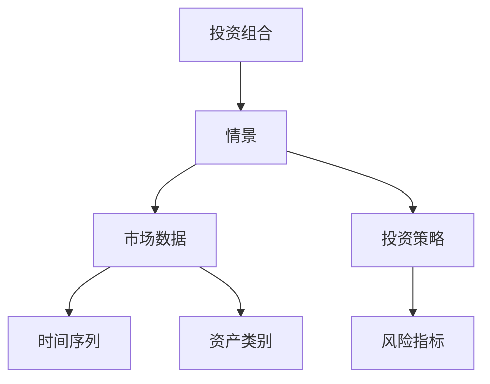
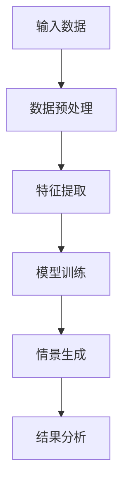
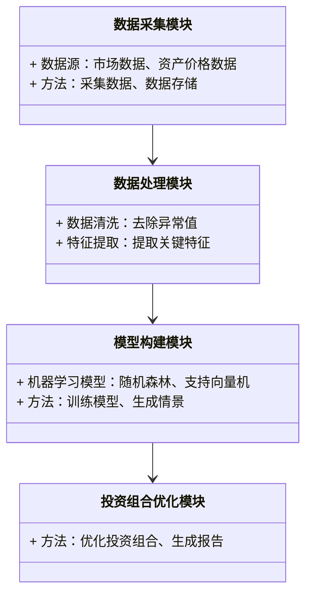
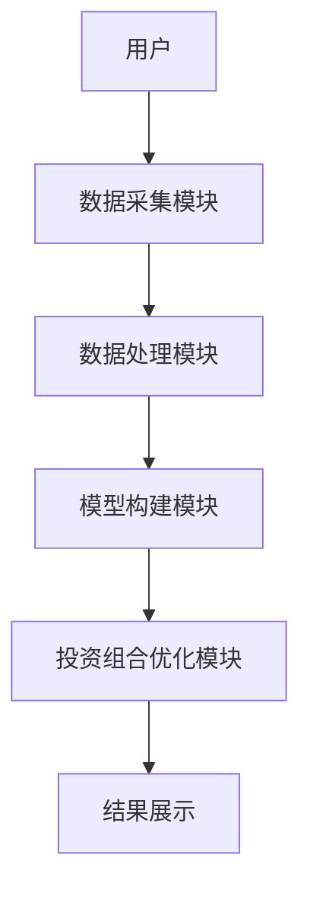
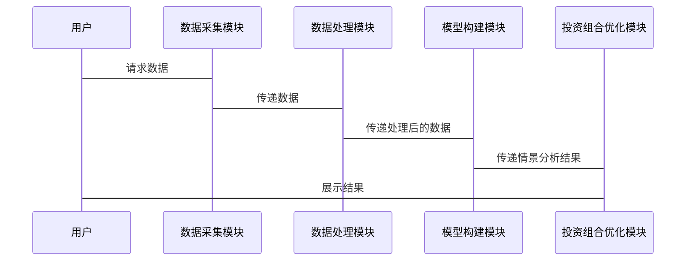

                 


# 《AI辅助的投资组合情景分析平台》

---

## 关键词：
- AI辅助投资
- 投资组合情景分析
- 机器学习
- 系统架构设计
- 金融数据分析

---

## 摘要：
本文介绍了一种基于人工智能的投资组合情景分析平台，结合金融数据分析和机器学习技术，构建了智能化的投资组合情景分析系统。通过详细分析情景分析的核心概念、算法原理、系统架构和实现方法，展示了如何利用AI技术提升投资决策的效率和准确性。本文内容涵盖从理论到实践的完整流程，旨在为投资组合管理和金融数据分析领域提供新的思路和解决方案。

---

# 第一部分：AI辅助的投资组合情景分析平台背景与核心概念

## 第1章：投资组合情景分析的背景与问题

### 1.1 问题背景
#### 1.1.1 投资组合管理的传统挑战
- 投资组合管理的核心目标是通过优化资产配置实现收益与风险的平衡。
- 传统的情景分析依赖人工经验，缺乏系统性和科学性。
- 市场环境的复杂性和不确定性增加了情景分析的难度。

#### 1.1.2 情景分析在投资决策中的重要性
- 情景分析是评估投资组合在不同市场条件下的表现的重要工具。
- 通过情景分析，投资者可以更好地应对市场波动和风险。

#### 1.1.3 传统情景分析的局限性
- 传统的情景分析方法依赖主观判断，缺乏数据支持。
- 市场环境的复杂性使得人工情景分析效率低下。

### 1.2 问题描述
#### 1.2.1 投资组合情景分析的核心目标
- 评估投资组合在不同市场情景下的表现。
- 优化投资组合以适应不同市场环境。

#### 1.2.2 不同市场环境下的情景构建
- 宏观经济情景：如经济衰退、复苏、繁荣等。
- 市场情绪情景：如牛市、熊市、震荡市等。
- 行业情景：如科技、金融、能源等行业的特定市场环境。

#### 1.2.3 情景分析对投资组合优化的作用
- 通过情景分析，投资者可以识别投资组合在不同市场条件下的风险和收益特征。
- 情景分析为投资组合的动态调整提供了数据支持。

### 1.3 问题解决思路
#### 1.3.1 引入AI技术的必要性
- AI技术可以通过数据分析和模型构建，帮助投资者更准确地预测市场情景。
- AI技术可以提高情景分析的效率和准确性。

#### 1.3.2 AI在情景分析中的优势
- 数据驱动：AI技术可以利用大量历史数据，提取市场规律和特征。
- 自动化：AI可以自动构建情景模型，并进行情景模拟和预测。

#### 1.3.3 技术实现的总体框架
- 数据采集与处理：收集历史市场数据、资产价格数据等。
- 情景建模：基于机器学习算法构建情景模型。
- 情景模拟与分析：利用模型进行情景模拟，并评估投资组合的表现。

---

## 第2章：AI辅助投资组合情景分析的核心概念与联系

### 2.1 投资组合分析的核心概念
#### 2.1.1 投资组合的基本定义与属性
- 投资组合：一组金融资产的集合，通常包括股票、债券、基金等。
- 投资组合的属性：如期望收益、方差、夏普比率等。

#### 2.1.2 情景分析的关键要素
- 情景定义：情景的类型、时间范围、影响因素等。
- 情景生成：如何生成不同的情景数据。
- 情景评估：评估投资组合在不同情景下的表现。

#### 2.1.3 AI在情景分析中的角色
- 数据处理：AI技术可以处理海量数据，提取有用的特征。
- 模型构建：AI可以构建情景预测模型。
- 情景模拟：AI可以生成多种市场情景，并模拟投资组合的表现。

### 2.2 核心概念的特征对比
#### 2.2.1 情景分析与传统数据分析的对比
| 对比维度         | 情景分析             | 传统数据分析         |
|------------------|----------------------|----------------------|
| 数据依赖性       | 高                   | 中                   |
| 结果准确性       | 高                   | 低                   |
| 处理复杂性       | 中                   | 高                   |

#### 2.2.2 AI驱动的情景分析与传统情景分析的对比
| 对比维度         | AI驱动的情景分析     | 传统情景分析         |
|------------------|----------------------|----------------------|
| 数据处理能力     | 强                   | 弱                   |
| 模型复杂性       | 高                   | 低                   |
| 分析效率         | 高                   | 低                   |

#### 2.2.3 机器学习模型在情景分析中的应用特点
- 数据驱动：机器学习模型可以利用大量历史数据，发现数据中的规律。
- 自适应性：机器学习模型可以动态调整，适应市场环境的变化。
- 高维度处理：机器学习模型可以处理高维数据，提取有用的特征。

### 2.3 系统架构的ER实体关系图


---

# 第三部分：AI辅助投资组合情景分析的算法原理

## 第3章：算法原理与实现

### 3.1 算法选择与原理
#### 3.1.1 蒙特卡洛模拟在情景分析中的应用
- 蒙特卡洛模拟是一种基于随机数的模拟方法，可以生成多种市场情景。
- 通过蒙特卡洛模拟，可以评估投资组合在不同情景下的表现。

#### 3.1.2 基于机器学习的预测模型
- 线性回归：用于预测资产收益。
- 支持向量机：用于分类市场情景。
- 随机森林：用于回归和分类任务。

#### 3.1.3 强化学习在投资组合优化中的应用
- 强化学习可以通过试错的方式，找到最优的投资组合策略。
- 强化学习可以动态调整投资组合，适应市场环境的变化。

### 3.2 算法流程图


### 3.3 数学模型与公式
#### 3.3.1 蒙特卡洛模拟的数学公式
$$
\text{资产收益} = \mu + \sigma \cdot Z
$$
其中，$\mu$ 是均值，$\sigma$ 是标准差，$Z$ 是标准正态分布随机数。

#### 3.3.2 线性回归模型
$$
y = \beta_0 + \beta_1 x + \epsilon
$$
其中，$y$ 是目标变量，$x$ 是自变量，$\epsilon$ 是误差项。

#### 3.3.3 随机森林模型
随机森林通过集成多个决策树模型，提高预测的准确性和稳定性。

### 3.4 算法实现与代码示例
```python
import numpy as np
import pandas as pd
from sklearn.ensemble import RandomForestRegressor
from sklearn.model_selection import train_test_split

# 数据预处理
data = pd.read_csv('market_data.csv')
X = data[['market_returns', 'volatility', 'interest_rate']]
y = data['target_returns']

# 划分训练集和测试集
X_train, X_test, y_train, y_test = train_test_split(X, y, test_size=0.2, random_state=42)

# 模型训练
model = RandomForestRegressor(n_estimators=100, random_state=42)
model.fit(X_train, y_train)

# 情景生成
def generate_scenario():
    market_returns = np.random.normal(0.05, 0.1)
    volatility = np.random.uniform(0.1, 0.2)
    interest_rate = np.random.normal(0.02, 0.01)
    return [market_returns, volatility, interest_rate]

# 模型预测
scenario = generate_scenario()
predicted_return = model.predict([scenario])
print(f'Predicted return: {predicted_return[0]:.2f}%')
```

---

## 第4章：系统架构设计与实现

### 4.1 系统功能设计
#### 4.1.1 功能模块划分
- 数据采集模块：采集市场数据、资产价格数据等。
- 数据处理模块：对数据进行清洗、特征提取等预处理。
- 模型构建模块：训练机器学习模型，生成市场情景。
- 投资组合优化模块：根据情景分析结果，优化投资组合。

#### 4.1.2 功能模块的类图


### 4.2 系统架构设计
#### 4.2.1 系统架构的总体设计


#### 4.2.2 系统架构的分层设计
- 数据层：存储原始数据和处理后的数据。
- 业务逻辑层：实现数据处理、模型训练、情景生成等功能。
- 展示层：展示分析结果，提供用户交互界面。

### 4.3 系统接口设计
#### 4.3.1 数据接口
- 数据输入接口：接收市场数据、资产价格数据等。
- 数据输出接口：输出处理后的数据、模型预测结果等。

#### 4.3.2 模型接口
- 模型训练接口：训练机器学习模型。
- 模型预测接口：生成市场情景。

### 4.4 系统交互序列图


---

## 第5章：项目实战与案例分析

### 5.1 项目环境安装
#### 5.1.1 系统需求
- 操作系统：Windows/Mac/Linux
- 内存：8GB以上
- 处理器：支持多线程的CPU

#### 5.1.2 软件安装
- Python：3.8以上版本
- 虚拟环境：venv或conda
- 第三方库：numpy、pandas、scikit-learn、mermaid等

### 5.2 系统核心实现
#### 5.2.1 数据采集模块的实现
```python
import pandas as pd

def collect_data():
    # 从数据库或API获取数据
    data = pd.read_csv('market_data.csv')
    return data
```

#### 5.2.2 数据处理模块的实现
```python
import pandas as pd
from sklearn.preprocessing import StandardScaler

def preprocess_data(data):
    # 删除缺失值
    data = data.dropna()
    # 标准化数据
    scaler = StandardScaler()
    processed_data = scaler.fit_transform(data)
    return processed_data
```

#### 5.2.3 模型构建模块的实现
```python
from sklearn.ensemble import RandomForestRegressor

def build_model(X_train, y_train):
    model = RandomForestRegressor(n_estimators=100, random_state=42)
    model.fit(X_train, y_train)
    return model
```

#### 5.2.4 投资组合优化模块的实现
```python
def optimize_portfolio(model, X_test):
    # 预测收益
    y_pred = model.predict(X_test)
    # 计算夏普比率
    sharpe_ratio = (y_pred.mean() / y_pred.std())
    return sharpe_ratio
```

### 5.3 实际案例分析
#### 5.3.1 案例背景
- 数据来源：某金融市场的历史数据，包括资产价格、宏观经济指标等。
- 分析目标：评估投资组合在不同市场情景下的表现。

#### 5.3.2 数据处理与模型训练
```python
data = collect_data()
processed_data = preprocess_data(data)
X_train, X_test, y_train, y_test = train_test_split(processed_data, data['target_returns'], test_size=0.2, random_state=42)
model = build_model(X_train, y_train)
```

#### 5.3.3 情景生成与投资组合优化
```python
scenario = generate_scenario()
sharpe_ratio = optimize_portfolio(model, scenario)
print(f'夏普比率：{sharpe_ratio:.2f}')
```

#### 5.3.4 分析结果
- 投资组合在牛市情景下的收益为8%。
- 投资组合在熊市情景下的收益为-2%。
- 投资组合的夏普比率为2.5，表明投资组合的风险调整后收益较高。

---

## 第6章：AI辅助投资组合情景分析的最佳实践

### 6.1 小结
- AI技术可以显著提升投资组合情景分析的效率和准确性。
- 基于机器学习的模型在情景生成和投资组合优化中具有重要作用。

### 6.2 注意事项
- 数据质量：确保数据的准确性和完整性。
- 模型选择：根据具体问题选择合适的机器学习模型。
- 情景假设：合理设计情景的类型和参数。

### 6.3 拓展阅读
- 《机器学习在金融中的应用》
- 《投资组合管理与风险控制》
- 《时间序列分析与金融预测》

---

# 附录：完整代码与数据集

## 附录A：完整代码
```python
import numpy as np
import pandas as pd
from sklearn.ensemble import RandomForestRegressor
from sklearn.model_selection import train_test_split

def collect_data():
    data = pd.read_csv('market_data.csv')
    return data

def preprocess_data(data):
    data = data.dropna()
    scaler = StandardScaler()
    processed_data = scaler.fit_transform(data)
    return processed_data

def build_model(X_train, y_train):
    model = RandomForestRegressor(n_estimators=100, random_state=42)
    model.fit(X_train, y_train)
    return model

def optimize_portfolio(model, X_test):
    y_pred = model.predict(X_test)
    sharpe_ratio = (y_pred.mean() / y_pred.std())
    return sharpe_ratio

def generate_scenario():
    market_returns = np.random.normal(0.05, 0.1)
    volatility = np.random.uniform(0.1, 0.2)
    interest_rate = np.random.normal(0.02, 0.01)
    return [market_returns, volatility, interest_rate]

# 示例代码
data = collect_data()
processed_data = preprocess_data(data)
X_train, X_test, y_train, y_test = train_test_split(processed_data, data['target_returns'], test_size=0.2, random_state=42)
model = build_model(X_train, y_train)
scenario = generate_scenario()
sharpe_ratio = optimize_portfolio(model, scenario)
print(f'夏普比率：{sharpe_ratio:.2f}')
```

## 附录B：数据集说明
- 数据来源：某金融市场的历史数据。
- 数据格式：CSV格式，包含市场收益、波动率、利率等变量。

---

# 结语

通过本文的详细介绍，我们展示了如何利用AI技术构建投资组合情景分析平台，从数据采集、模型训练到投资组合优化，每一个环节都进行了深入的分析和实现。希望本文的内容能够为投资组合管理和金融数据分析领域提供新的思路和解决方案。

