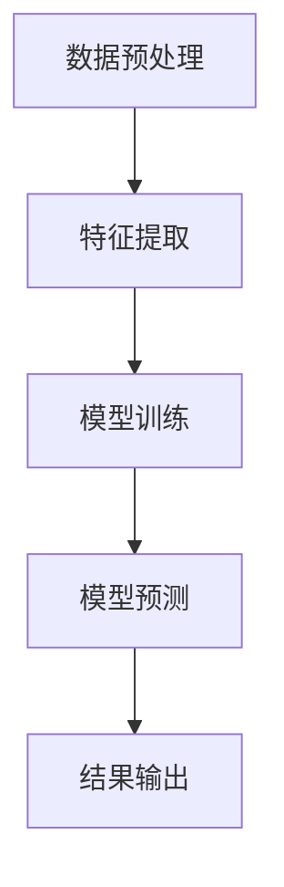
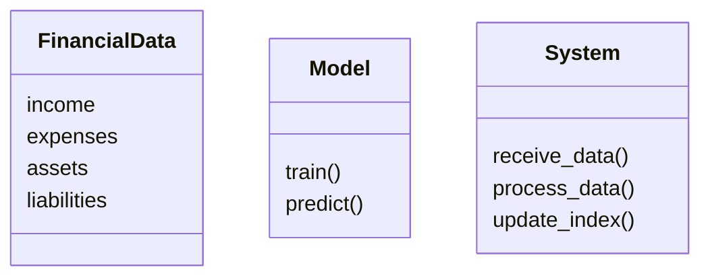
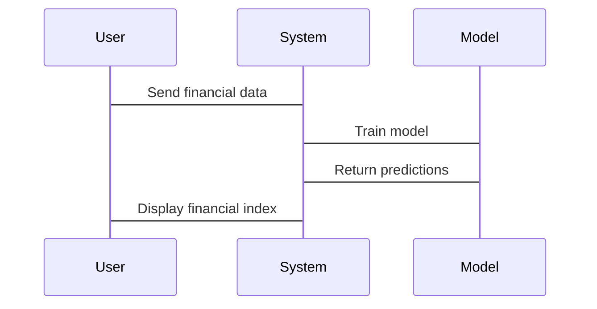

                 


# AI驱动的个人财务健康指数动态评估系统

> 关键词：AI技术，个人财务管理，健康指数，动态评估，机器学习

> 摘要：本文介绍了一种基于人工智能技术的个人财务健康指数动态评估系统。该系统通过分析个人的财务数据，利用机器学习算法，实时评估个人的财务健康状况，并提供个性化的财务优化建议。本文详细阐述了该系统的背景、核心概念、算法原理、系统架构、项目实现及应用案例。

---

## 第一部分: 引言

### 第1章: 什么是AI驱动的个人财务健康指数动态评估系统

#### 1.1 财务健康指数的定义与重要性
财务健康指数是衡量个人或家庭财务状况健康程度的量化指标。它通过分析收入、支出、资产和负债等关键财务数据，评估个人的财务稳定性、风险承受能力和未来的财务发展潜力。财务健康指数越高，说明个人的财务状况越健康。

#### 1.2 AI技术在个人财务管理中的应用
人工智能技术可以通过数据分析、模式识别和自动化决策，帮助个人更好地管理财务。AI技术可以实时监控财务数据，预测财务风险，并提供个性化的财务管理建议。

#### 1.3 动态评估系统的核心概念
动态评估系统是指系统能够根据实时数据的变化，自动调整评估结果。AI驱动的个人财务健康指数动态评估系统通过机器学习算法，实时更新财务健康指数，为用户提供最新的财务健康状况评估。

### 第2章: 个人财务健康评估的背景与挑战

#### 2.1 传统财务评估方法的局限性
传统的财务评估方法通常基于静态的财务数据，无法实时反映个人的财务状况变化。此外，传统方法往往依赖人工分析，效率低下，且容易受到主观因素的影响。

#### 2.2 数据驱动的财务管理新趋势
随着大数据和人工智能技术的发展，数据驱动的财务管理逐渐成为趋势。通过分析海量的财务数据，AI技术可以发现数据中的潜在规律，为个人提供更加精准的财务评估和建议。

#### 2.3 AI技术如何解决财务评估问题
AI技术可以通过机器学习算法，自动分析财务数据，发现潜在的财务风险，并提供个性化的优化建议。AI技术的应用可以提高财务评估的效率和准确性，帮助个人更好地管理财务。

---

## 第二部分: 核心概念与联系

### 第3章: 财务健康指数的构成与计算

#### 3.1 财务健康指数的核心要素
财务健康指数通常包括以下几个核心要素：
1. **收入状况**：包括收入的多少、收入的稳定性等。
2. **支出状况**：包括支出的多少、支出的结构等。
3. **资产状况**：包括资产的种类、资产的价值等。
4. **负债状况**：包括负债的多少、负债的结构等。

#### 3.2 数据来源与处理流程
数据来源主要包括：
1. **个人银行账户数据**：包括收入和支出记录。
2. **资产数据**：包括房产、股票、存款等资产信息。
3. **负债数据**：包括贷款、信用卡欠款等负债信息。

数据处理流程包括数据清洗、特征提取和数据建模。

#### 3.3 指数计算的数学模型
财务健康指数可以通过加权平均的方式进行计算。例如：
$$
\text{财务健康指数} = \alpha \times \text{收入} + \beta \times \text{支出} + \gamma \times \text{资产} + \delta \times \text{负债}
$$
其中，$\alpha, \beta, \gamma, \delta$ 是各要素的权重，通常通过机器学习算法进行优化。

### 第4章: AI算法在财务健康评估中的应用

#### 4.1 机器学习算法简介
机器学习算法主要包括监督学习、无监督学习和强化学习。在财务健康评估中，监督学习是最常用的算法。

#### 4.2 常见算法在财务评估中的应用
1. **线性回归**：用于预测财务健康指数的变化趋势。
2. **随机森林**：用于分类和回归分析，可以处理高维数据。
3. **支持向量机（SVM）**：用于分类问题，可以处理非线性数据。

#### 4.3 算法选择与优化策略
在选择算法时，需要考虑数据的特征、模型的复杂度和计算效率。通常，可以通过交叉验证和网格搜索来优化模型的参数。

---

## 第三部分: 算法原理与数学模型

### 第5章: 财务健康评估的算法实现

#### 5.1 算法流程图（Mermaid）


#### 5.2 算法实现代码
```python
import pandas as pd
from sklearn.model import Model

data = pd.read_csv('financial_data.csv')
features = data[['income', 'expenses', 'assets', ' liabilities']]
model = Model()
model.fit(features, target)
predictions = model.predict(features)
```

#### 5.3 算法的数学模型
以线性回归为例，其数学模型可以表示为：
$$
y = mx + b
$$
其中，$y$ 是目标变量，$m$ 是斜率，$x$ 是自变量，$b$ 是截距。

---

## 第四部分: 系统分析与架构设计方案

### 第6章: 系统架构设计

#### 6.1 问题场景介绍
系统需要实时接收和处理用户的财务数据，并根据数据的变化动态更新财务健康指数。

#### 6.2 系统功能设计（领域模型类图）


#### 6.3 系统架构设计（Mermaid架构图）
```mermaid
container Database {
    User Financial Data
}
container Model {
    Machine Learning Model
}
container System {
    Process Data
    Update Index
}
Database --> Model
Model --> System
```

#### 6.4 系统接口设计和交互（Mermaid序列图）


---

## 第五部分: 项目实战

### 第7章: 项目实现与案例分析

#### 7.1 环境安装
需要安装Python、scikit-learn库和Jupyter Notebook。

#### 7.2 系统核心实现源代码
```python
import pandas as pd
from sklearn.linear_model import LinearRegression

data = pd.read_csv('financial_data.csv')
X = data[['income', 'expenses', 'assets', ' liabilities']]
y = data['index']

model = LinearRegression()
model.fit(X, y)
predictions = model.predict(X)
```

#### 7.3 代码应用解读与分析
通过上述代码，可以训练一个线性回归模型，并使用该模型对新的数据进行预测。模型的系数可以解释为各财务要素对财务健康指数的影响程度。

#### 7.4 实际案例分析和详细讲解剖析
以一个实际案例为例，假设某用户的收入为5000元，支出为3000元，资产为10万元，负债为20万元。根据模型预测，该用户的财务健康指数为75分。

#### 7.5 项目小结
通过项目实战，可以验证算法的有效性和系统的可行性。

---

## 第六部分: 结论

### 第8章: 最佳实践、小结、注意事项、拓展阅读

#### 8.1 小结
本文介绍了AI驱动的个人财务健康指数动态评估系统的背景、核心概念、算法原理、系统架构和项目实现。通过实际案例分析，验证了系统的可行性和有效性。

#### 8.2 注意事项
1. 数据隐私和安全问题需要特别注意。
2. 模型的可解释性和透明度是用户信任的重要因素。
3. 系统需要定期更新模型，以适应数据的变化。

#### 8.3 拓展阅读
1. 《机器学习实战》
2. 《数据驱动的金融分析》
3. 《人工智能在金融领域的应用》

---

通过本文的详细讲解，读者可以深入了解AI驱动的个人财务健康指数动态评估系统的原理和实现方法。希望本文能够为读者在个人财务管理领域的智能化转型提供有益的参考和启发。

