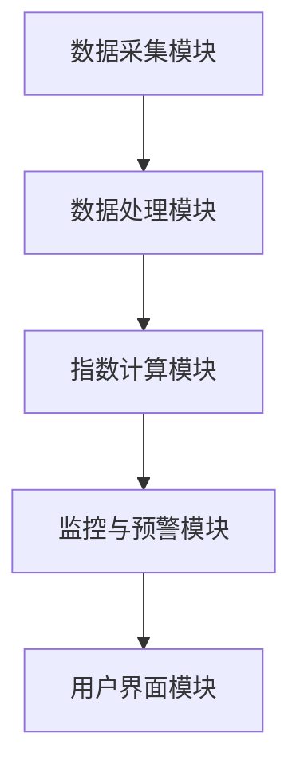
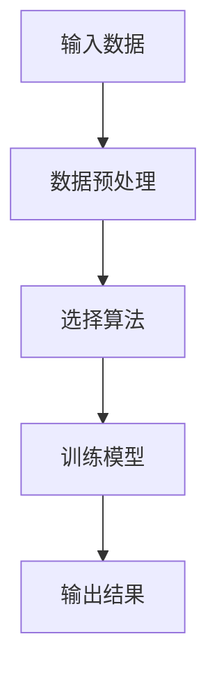
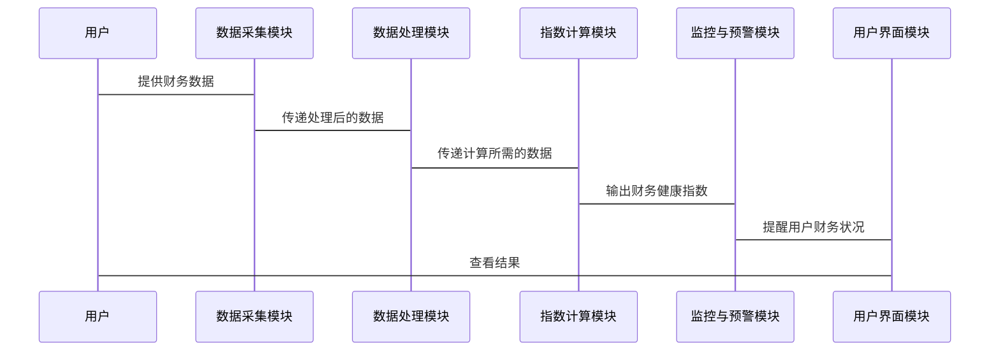

                 


# AI驱动的个人财务健康指数计算与监控系统

## 关键词
AI, 财务健康指数, 财务监控, 系统设计, 算法原理, 项目实战

## 摘要
本文详细探讨了AI在个人财务管理中的应用，重点介绍了AI驱动的个人财务健康指数计算与监控系统的构建过程。文章从背景介绍、核心概念、算法原理、系统架构设计到项目实战，全面解析了如何利用AI技术实现个人财务的智能化管理。通过实际案例分析和代码实现，展示了该系统的实用性和高效性。

# 第1章: 背景介绍与问题背景

## 1.1 个人财务健康指数的定义与重要性
### 1.1.1 什么是个人财务健康指数
个人财务健康指数（Personal Financial Health Index，PFHI）是一个综合评估个人财务状况的指标，基于收入、支出、资产、负债、信用评分等多个维度进行计算。

### 1.1.2 财务健康指数的计算维度
- 收入与支出平衡
- 资产与负债比例
- 信用评分
- 储蓄率
- 投资表现

### 1.1.3 财务健康指数在个人财务管理中的作用
- 帮助个人了解财务状况
- 提供财务优化建议
- 监控财务风险

## 1.2 问题背景与现状分析
### 1.2.1 传统财务管理的痛点
- 数据分散
- 计算复杂
- 缺乏实时性
- 需要专业技能

### 1.2.2 当前AI技术在财务管理中的应用现状
- AI在金融分析中的应用
- 机器学习在财务预测中的应用
- 自然语言处理在财务报告中的应用

### 1.2.3 财务健康指数计算与监控的必要性
- 实时监控财务状况
- 提供个性化财务建议
- 预警财务风险

## 1.3 问题解决与系统目标
### 1.3.1 系统设计的核心目标
- 实时计算个人财务健康指数
- 提供个性化财务优化建议
- 监控并预警财务风险

### 1.3.2 系统实现的关键问题
- 数据收集与整合
- 算法选择与优化
- 系统架构设计

### 1.3.3 系统边界与外延
- 输入数据的范围
- 输出结果的范围
- 系统功能的范围

## 1.4 核心概念与系统结构
### 1.4.1 财务健康指数的核心要素
- 收入
- 支出
- 资产
- 负债
- 信用评分

### 1.4.2 系统架构的核心组成
- 数据采集模块
- 数据处理模块
- 指数计算模块
- 监控与预警模块
- 用户界面模块

### 1.4.3 系统功能模块的划分
- 数据输入
- 数据处理
- 指数计算
- 结果展示
- 预警通知

# 第2章: 核心概念与系统架构

## 2.1 财务健康指数的核心概念
### 2.1.1 财务健康指数的计算公式
$$ PFHI = \frac{收入 - 支出}{资产} \times \left(1 - \frac{负债}{资产}\right) $$

### 2.1.2 财务健康指数的评估标准
| 指数范围 | 评估等级 |
|----------|-----------|
| 0-30     | 不健康    |
| 31-60    | 偏低      |
| 61-80    | 健康      |
| 81-100   | 优秀      |

### 2.1.3 财务健康指数的动态更新机制
- 实时更新
- 定期更新
- 事件驱动更新

## 2.2 系统架构与模块划分
### 2.2.1 系统功能模块划分
- 数据采集模块
- 数据处理模块
- 指数计算模块
- 监控与预警模块
- 用户界面模块

### 2.2.2 模块之间的关系与依赖


### 2.2.3 系统整体架构图


# 第3章: 算法原理与数学模型

## 3.1 财务健康指数的计算模型
### 3.1.1 模型输入与输出
- 输入：收入、支出、资产、负债、信用评分
- 输出：财务健康指数

### 3.1.2 模型的核心算法
$$ PFHI = \frac{收入 - 支出}{资产} \times \left(1 - \frac{负债}{资产}\right) $$

### 3.1.3 模型的数学公式
$$ PFHI = \frac{(收入 - 支出) \times (1 - \frac{负债}{资产})}{1} $$

## 3.2 AI算法在系统中的应用
### 3.2.1 机器学习算法的选择与应用
- 线性回归
- 支持向量机
- 神经网络

### 3.2.2 神经网络模型的设计与训练
- 输入层
- 隐藏层
- 输出层

### 3.2.3 算法流程图


## 3.3 算法实现与代码示例
### 3.3.1 环境安装与配置
```bash
pip install numpy scikit-learn
```

### 3.3.2 核心算法代码实现
```python
import numpy as np
from sklearn.linear_model import LinearRegression

# 示例数据
X = np.array([[1, 2], [3, 4], [5, 6]])
y = np.array([7, 8, 9])

# 创建模型
model = LinearRegression()

# 训练模型
model.fit(X, y)

# 预测结果
print(model.predict([[7, 8]]))
```

### 3.3.3 代码的功能解读与优化建议
- 输入数据预处理
- 模型选择与优化
- 结果分析与解释

# 第4章: 系统分析与架构设计

## 4.1 问题场景与系统需求
### 4.1.1 系统目标用户分析
- 个人用户
- 企业用户

### 4.1.2 系统功能需求分析
- 数据采集
- 数据处理
- 指数计算
- 监控与预警
- 用户界面

### 4.1.3 系统性能需求分析
- 响应时间
- 处理能力
- 安全性

## 4.2 系统功能设计
### 4.2.1 功能模块的详细设计
- 数据采集模块
- 数据处理模块
- 指数计算模块
- 监控与预警模块
- 用户界面模块

### 4.2.2 功能模块之间的交互流程


### 4.2.3 功能模块的ER实体关系图
```mermaid
erd
用户
    + 用户ID
    + 财务数据
    + 财务健康指数
    + 预警信息
```

## 4.3 系统架构设计
### 4.3.1 系统架构的分层设计
- 数据层
- 业务逻辑层
- 用户界面层

### 4.3.2 系统架构图


### 4.3.3 系统接口设计
- 数据接口
- 用户接口
- 预警接口

### 4.3.4 系统交互图


# 第5章: 项目实战

## 5.1 环境安装与配置
```bash
pip install numpy pandas scikit-learn matplotlib
```

## 5.2 系统核心实现源代码
### 5.2.1 数据采集模块
```python
import pandas as pd

def collect_data():
    data = pd.DataFrame({
        '收入': [50000, 60000, 70000],
        '支出': [30000, 40000, 50000],
        '资产': [100000, 150000, 200000],
        '负债': [20000, 30000, 40000],
        '信用评分': [720, 750, 800]
    })
    return data
```

### 5.2.2 数据处理模块
```python
import numpy as np

def process_data(data):
    data['净收入'] = data['收入'] - data['支出']
    data['资产负债比'] = data['负债'] / data['资产']
    return data
```

### 5.2.3 指数计算模块
```python
def calculate_pfh

