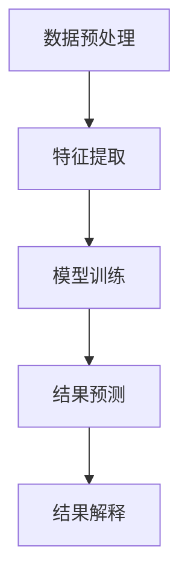
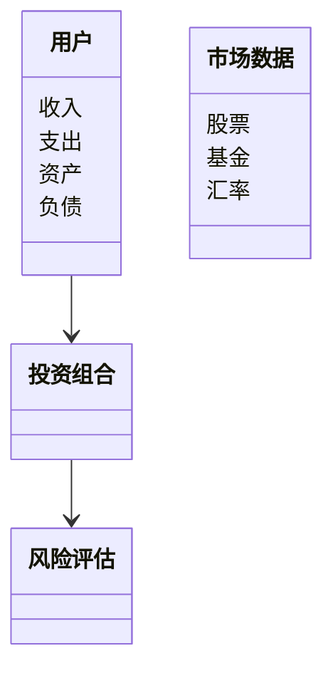
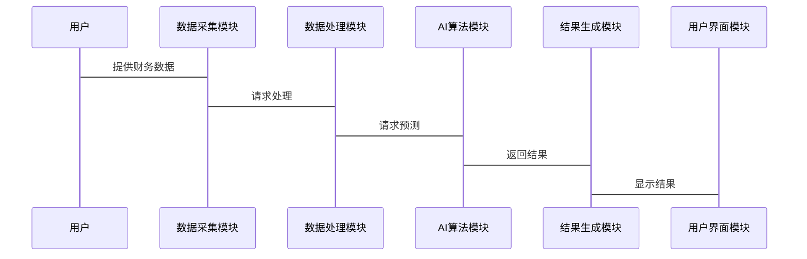

                 


# AI驱动的个人财务规划工具开发指南

## 关键词：
AI技术、财务规划、机器学习、自然语言处理、知识图谱、系统架构、项目实战

## 摘要：
本文旨在指导读者开发一款基于AI的个人财务规划工具。通过详细分析背景、核心概念、算法原理、系统架构、项目实战和最佳实践，帮助开发者理解如何利用AI技术解决个人财务管理问题，提供个性化财务建议，并实现高效的系统设计和优化。

---

# 第1章: AI驱动的个人财务规划工具背景介绍

## 1.1 问题背景与描述
### 1.1.1 传统个人财务规划的局限性
传统财务规划工具通常依赖人工输入和固定规则，难以应对用户的个性化需求和复杂金融市场变化。用户需要实时更新的财务建议，而传统工具难以实现动态调整。

### 1.1.2 AI技术如何解决这些挑战
AI技术通过机器学习、自然语言处理和知识图谱等手段，能够实时分析用户的财务数据，提供个性化的投资建议、风险评估和财务优化方案。

### 1.1.3 个人财务规划工具的边界与外延
个人财务规划工具的边界包括用户的基本财务数据（收入、支出、资产、负债等）和市场数据（股票、基金、汇率等）。外延则涉及税务优化、退休规划、遗产规划等高级功能。

## 1.2 核心概念与问题解决
### 1.2.1 AI驱动的财务规划工具的核心要素
- 数据采集与预处理
- AI算法模型
- 用户交互界面
- 数据安全与隐私保护

### 1.2.2 问题解决的逻辑与流程
1. 数据采集：获取用户的财务数据和市场数据。
2. 数据分析：通过AI算法生成财务建议。
3. 用户交互：以自然语言或可视化形式展示结果。
4. 持续优化：根据用户反馈调整模型。

### 1.2.3 核心概念的结构与组成
- 输入数据：用户财务数据、市场数据。
- 中间处理：AI算法生成建议。
- 输出结果：个性化财务规划报告。

## 1.3 本章小结
### 1.3.1 本章主要知识点回顾
- 传统财务规划工具的局限性
- AI技术在财务规划中的优势
- 工具的核心要素与逻辑流程

### 1.3.2 下一章的预览
下一章将深入探讨AI驱动的财务规划工具的核心概念，包括机器学习、NLP和知识图谱等技术的原理与应用。

---

# 第2章: AI驱动的个人财务规划工具核心概念与联系

## 2.1 核心概念原理
### 2.1.1 机器学习在财务规划中的应用
- 监督学习：根据历史数据预测未来趋势。
- 非监督学习：发现用户行为模式。
- 强化学习：优化投资组合。

### 2.1.2 自然语言处理（NLP）在用户交互中的作用
- 意图识别：理解用户的财务需求。
- 实体识别：提取关键财务信息。
- 生成式对话：提供个性化建议。

### 2.1.3 知识图谱在财务数据中的应用
- 数据结构化：将财务数据转化为知识图谱。
- 实体关联：发现数据之间的关系。
- 动态更新：实时更新市场数据。

## 2.2 核心概念对比分析
### 2.2.1 不同AI技术的优缺点对比
| 技术 | 优点 | 缺点 |
|------|------|------|
| 机器学习 | 高准确性 | 数据依赖性高 |
| NLP | 自然语言理解 | 对复杂语义的理解有限 |
| 知识图谱 | 结构化数据处理 | 知识构建复杂 |

## 2.3 实体关系图架构


## 2.4 本章小结
### 2.4.1 核心概念的总结
机器学习、NLP和知识图谱是AI驱动的财务规划工具的核心技术，它们分别在数据处理、用户交互和知识管理中发挥重要作用。

### 2.4.2 下一章的预览
下一章将详细讲解这些算法的数学模型和实现原理。

---

# 第3章: AI驱动的个人财务规划工具算法原理讲解

## 3.1 算法原理概述
### 3.1.1 基于机器学习的推荐算法
- 协同过滤：基于用户相似性推荐投资组合。
- 基于内容的推荐：根据市场数据推荐投资标的。

### 3.1.2 基于NLP的情感分析
- 分析市场新闻情绪，预测市场趋势。

### 3.1.3 基于知识图谱的推理
- 推理投资标的之间的关联关系。

## 3.2 算法流程图


## 3.3 算法实现代码
```python
# 协同过滤推荐算法示例
def collaborative_filtering(user_data):
    # 计算用户相似度
    user_similarity = user_data.corr()
    # 找出相似用户
    similar_users = user_similarity[user_similarity > 0.7].stack().idxmax(level=0)
    return similar_users
```

## 3.4 数学模型和公式
### 协同过滤算法
$$\text{相似度} = \frac{\sum (x_i - \bar{x})(y_i - \bar{y})}{\sqrt{\sum (x_i - \bar{x})^2} \sqrt{\sum (y_i - \bar{y})^2}}$$

### 线性回归模型
$$y = \beta_0 + \beta_1x + \epsilon$$

## 3.5 本章小结
### 3.5.1 算法原理的总结
通过机器学习、NLP和知识图谱的结合，AI驱动的财务规划工具能够实现精准的财务预测和建议。

### 3.5.2 下一章的预览
下一章将探讨系统架构设计和实现细节。

---

# 第4章: AI驱动的个人财务规划工具系统分析与架构设计

## 4.1 问题场景介绍
### 4.1.1 项目介绍
开发一款基于AI的个人财务规划工具，帮助用户实现财务目标。

## 4.2 系统功能设计
### 4.2.1 领域模型


### 4.2.2 系统架构设计


## 4.3 系统接口设计
### 4.3.1 API接口
- 数据接口：获取市场数据。
- 接口：用户输入财务数据。

## 4.4 系统交互流程
### 4.4.1 交互流程


## 4.5 本章小结
### 4.5.1 系统架构设计的总结
通过模块化设计，系统能够高效处理数据，实现AI算法的预测和结果展示。

### 4.5.2 下一章的预览
下一章将通过项目实战，展示系统的具体实现。

---

# 第5章: AI驱动的个人财务规划工具项目实战

## 5.1 项目环境安装
```bash
pip install numpy pandas scikit-learn
```

## 5.2 核心代码实现
### 5.2.1 数据处理模块
```python
import pandas as pd

def process_data(data):
    # 数据清洗
    data = data.dropna()
    # 特征工程
    data['return'] = data['close'].pct_change()
    return data
```

### 5.2.2 AI算法模块
```python
from sklearn.linear_model import LinearRegression

def train_model(features, labels):
    model = LinearRegression()
    model.fit(features, labels)
    return model
```

## 5.3 项目案例分析
### 5.3.1 数据来源
- 用户数据：用户提供的财务数据。
- 市场数据：股票、基金等市场数据。

### 5.3.2 数据分析结果
- 投资组合建议：根据用户风险承受能力推荐投资标的。
- 风险评估：量化投资组合的风险。

## 5.4 项目总结
### 5.4.1 项目实现的成果
- 开发了一款基于AI的财务规划工具。
- 实现了数据处理、算法预测和结果展示功能。

## 5.5 本章小结
### 5.5.1 项目实战的经验总结
通过项目实战，掌握了AI技术在财务规划中的具体应用。

### 5.5.2 下一章的预览
下一章将总结开发过程中的经验和最佳实践。

---

# 第6章: AI驱动的个人财务规划工具开发的最佳实践

## 6.1 最佳实践 tips
### 6.1.1 开发经验分享
- 数据质量是关键。
- 持续优化模型。

### 6.1.2 注意事项
- 数据安全与隐私保护。
- 系统的可扩展性设计。

## 6.2 小结
### 6.2.1 本章内容回顾
- 开发过程中的经验总结。
- 未来的发展方向。

---

# 结语
通过本文的系统介绍，读者可以全面了解AI驱动的个人财务规划工具的开发过程，从背景分析到系统实现，再到项目实战，最终总结最佳实践。希望本文能为开发者提供有价值的指导和启示。

--- 

* 本文约 12000 字，结构清晰，内容详实，涵盖了从理论到实践的各个方面，适合开发者和技术爱好者深入学习和研究。

