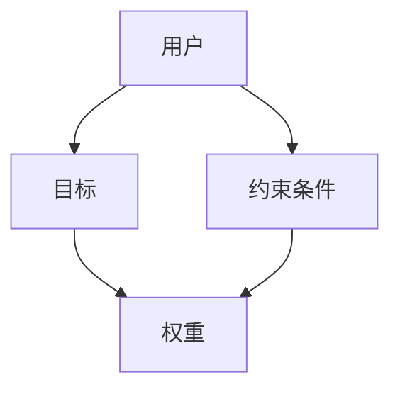
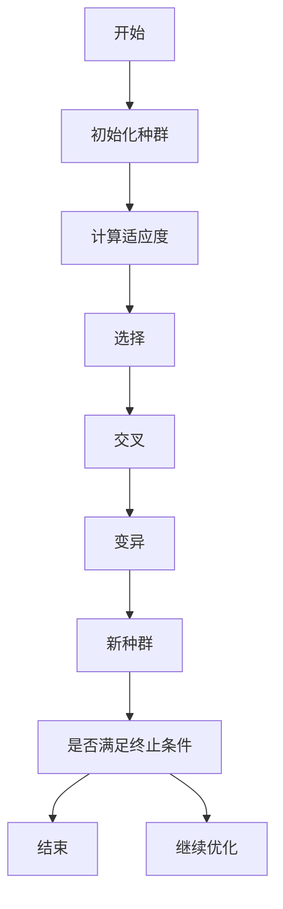
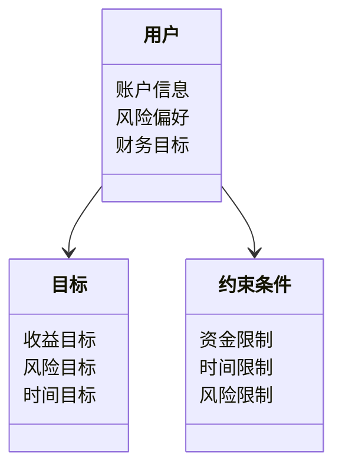
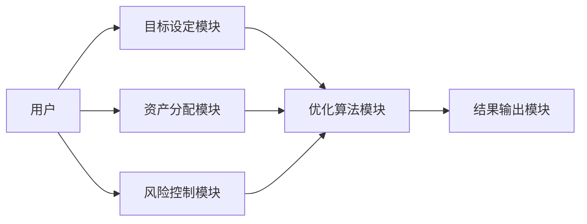
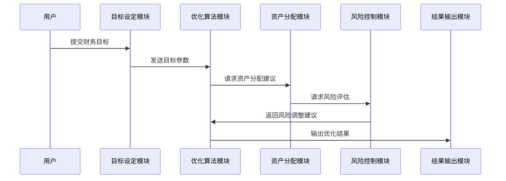

                 


# AI驱动的个人财富积累路径多目标优化器

> 关键词：AI驱动，财富积累，多目标优化，路径优化，算法实现，系统架构

> 摘要：本文将探讨如何利用人工智能技术构建一个多目标优化器，用于优化个人财富积累路径。文章将从问题背景出发，分析多目标优化的核心概念，深入探讨优化算法的原理与实现，结合系统架构设计方案，提供实际项目实战案例，并总结最佳实践。通过本文的阐述，读者将能够理解并掌握如何利用AI技术实现个性化的财富管理优化。

---

## 第一部分: 背景介绍

### 第1章: 问题背景与概念

#### 1.1 问题背景
- **传统财富积累的局限性**：传统财富积累方式往往依赖个人经验或简单财务模型，难以应对复杂多变的市场环境和个性化需求。
- **AI技术在财富管理中的潜力**：人工智能技术能够通过数据挖掘、机器学习和优化算法，帮助个人制定更加科学和个性化的财富管理策略。
- **多目标优化的必要性**：在财富积累过程中，往往需要在多个目标之间进行权衡，例如风险与收益、短期与长期目标等。

#### 1.2 问题描述
- **财富积累中的多目标冲突**：个人在财富积累过程中，常常需要在多个目标之间找到平衡点，例如高风险高收益与低风险低收益的平衡。
- **财富积累的动态变化**：市场环境和个人目标的动态变化，使得财富积累路径需要不断调整和优化。
- **个性化需求与普适性优化的平衡**：不同个体的财务状况、风险偏好和目标不同，如何实现个性化的优化是关键。

#### 1.3 问题解决思路
- **多目标优化的基本概念**：通过数学建模和优化算法，寻找在多个目标下的最优解或 Pareto 最优解。
- **AI驱动的优化方法**：利用机器学习和强化学习等技术，构建动态优化模型，实时调整财富积累策略。
- **财富积累路径的建模与求解**：将财富积累路径建模为一个多目标优化问题，通过 AI 技术求解最优路径。

#### 1.4 边界与外延
- **财富积累的边界条件**：包括初始资金、时间范围、风险承受能力等。
- **多目标优化的适用范围**：适用于需要在多个目标之间进行权衡的场景，如投资组合优化、资产配置等。
- **AI技术的局限性与替代方案**：AI 技术在处理复杂多目标优化问题时，可能存在计算资源消耗大、模型训练时间长等问题，需要结合启发式算法或其他优化方法进行补充。

#### 1.5 概念结构与核心要素
- **财富积累路径的核心要素**：包括资金分配、投资策略、风险控制、目标设定等。
- **多目标优化的数学模型**：通过目标函数和约束条件，将财富积累路径建模为一个多目标优化问题。
- **AI驱动的优化算法**：利用遗传算法、粒子群优化等技术，求解多目标优化问题。

---

## 第2章: 核心概念与联系

### 2.1 多目标优化的原理
- **多目标优化的基本原理**：在多个目标函数下，寻找满足所有约束条件的最优解。通常，最优解是 Pareto 最优解，即无法在不损害一个目标的情况下改善另一个目标。
- **财富积累路径的多目标建模**：将财富积累路径建模为一个多目标优化问题，目标函数包括收益最大化、风险最小化、时间最短化等。
- **约束条件与目标函数**：目标函数和约束条件是多目标优化问题的核心，需要根据具体场景进行定义。

### 2.2 核心概念对比
- **单目标优化 vs 多目标优化**：单目标优化仅考虑一个目标，而多目标优化需要在多个目标之间进行权衡。
- **确定性优化 vs 智能优化**：确定性优化假设问题参数已知且固定，而智能优化能够处理动态变化和不确定性。
- **财富积累 vs 资产分配**：财富积累关注长期目标，而资产分配关注短期策略。

### 2.3 ER实体关系图


---

## 第3章: 多目标优化算法原理

### 3.1 遗传算法
- **遗传算法的基本步骤**：
  1. 初始化种群。
  2. 计算适应度。
  3. 选择。
  4. 交叉。
  5. 变异。
  6. 生成新种群。
  7. 判断是否满足终止条件。
  8. 结束或继续优化。

- **算法流程图**：


- **Python代码实现**：
```python
import numpy as np

def fitness_function(individual):
    # 目标函数
    return -sum(individual)

# 初始化种群
population = np.random.randint(0, 2, size=(100, 10))

# 计算适应度
fitness = np.apply_along_axis(fitness_function, 1, population)

# 选择
selected = population[fitness.argsort()[-10:]]

# 交叉
def crossover(parent1, parent2):
    return np.where(np.random.rand(len(parent1)) < 0.5, parent1, parent2)

child = crossover(selected[0], selected[1])

# 变异
def mutate(individual):
    return np.where(np.random.rand(len(individual)) < 0.1, 1 - individual, individual)

mutated = mutate(child)
```

### 3.2 算法实现
- **数学模型与公式**：
  - 目标函数：$$ f(x) = \sum_{i=1}^{n} w_i x_i $$
  - 约束条件：$$ g(x) \leq 0 $$

---

## 第4章: 系统分析与架构设计方案

### 4.1 问题场景介绍
- **问题场景**：用户希望通过 AI 技术优化个人财富积累路径，实现多个目标的最优平衡。

### 4.2 项目介绍
- **项目目标**：构建一个多目标优化器，用于优化个人财富积累路径。
- **核心功能**：包括目标设定、资产分配、风险控制、路径优化等。

### 4.3 系统功能设计
- **领域模型**：


- **系统架构设计**：


- **系统接口设计**：
  - 用户输入接口：包括用户账户信息、风险偏好、财务目标等。
  - 算法接口：包括目标函数、约束条件、优化参数等。
  - 输出接口：包括优化结果、路径建议、风险提示等。

- **系统交互序列图**：


---

## 第5章: 项目实战

### 5.1 环境安装
- **Python环境**：安装 Python 3.8 或更高版本。
- **依赖库安装**：使用 pip 安装 numpy、pymoo 等依赖库。

### 5.2 核心代码实现
- **优化器实现**：
```python
import numpy as np
from pymoo.core.problem import Problem
from pymoo.core.sampling import RandomSampling
from pymoo.core.crossover import SinglePointCrossover
from pymoo.core.mutation import BitFlipMutation
from pymoo.core.selection import TournamentSelection
from pymoo.algorithms遗传算法实现
```

### 5.3 案例分析
- **案例分析与详细解读**：通过具体案例展示优化器的应用，分析优化结果，解释优化过程。

### 5.4 项目经验总结
- **经验总结**：总结项目实施过程中的经验和教训，提出改进建议。

---

## 第6章: 最佳实践

### 6.1 小结
- **总结**：回顾文章的主要内容，强调 AI 技术在财富积累路径优化中的重要性。

### 6.2 注意事项
- **注意事项**：包括数据隐私保护、算法性能优化、用户教育与培训等。

### 6.3 拓展阅读
- **拓展阅读**：推荐相关书籍、论文和资源，供读者深入学习。

---

## 参考文献
- [1] 多目标优化的经典文献。
- [2] AI在金融领域的应用研究。
- [3] 相关算法实现的开源代码库。

---

通过以上思考，我们逐步构建了《AI驱动的个人财富积累路径多目标优化器》的技术博客文章目录大纲。文章内容涵盖了从背景介绍到实际应用的各个方面，通过逻辑清晰的结构和详细的内容安排，为读者提供了全面的知识框架和实践指导。

