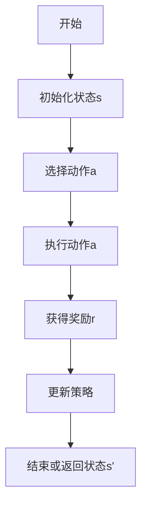
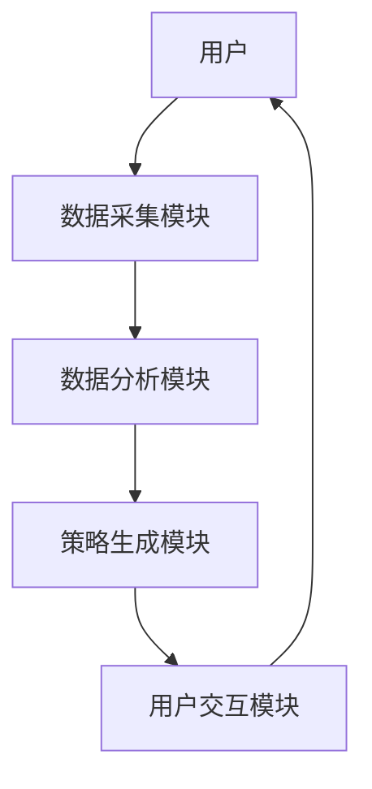

                 


# AI驱动的个人财富管理策略生成器

## 关键词：AI、财富管理、投资策略、强化学习、系统架构

## 摘要：本文探讨了如何利用AI技术生成个人财富管理策略，从背景、核心概念、算法原理到系统架构和项目实战，详细阐述了AI在财富管理中的应用，为读者提供从理论到实践的全面指导。

## 目录大纲

# 第一部分：AI驱动的个人财富管理背景与核心概念

## 第1章：AI驱动的财富管理背景

### 1.1 个人财富管理的现状与挑战

#### 1.1.1 传统财富管理方式的局限性
- 人工依赖：依赖经验和直觉，主观性强，难以标准化。
- 信息滞后：数据处理效率低，难以实时捕捉市场动态。
- 资源消耗：需要大量人工分析，成本高。

#### 1.1.2 数字化与智能化趋势
- 数据爆炸：金融数据剧增，人工处理难度加大。
- 技术进步：AI和大数据技术的发展为自动化决策提供了可能。
- 用户需求：个性化投资需求增长，传统服务难以满足。

#### 1.1.3 AI技术在财富管理中的潜力
- 精准分析：通过大数据分析，实现个性化投资建议。
- 实时监控：利用AI实时跟踪市场动态，及时调整策略。
- 风险控制：通过模型预测和模拟，优化投资组合，降低风险。

### 1.2 AI驱动的财富管理核心问题

#### 1.2.1 个性化投资策略的需求
- 投资目标多样化：不同用户的财务目标和风险承受能力差异大。
- 市场变化快：需要快速响应市场波动，及时调整策略。
- 资产配置优化：在不同资产类别间进行动态配置，最大化收益。

#### 1.2.2 数据驱动的决策支持
- 数据的全面性：整合市场数据、用户行为数据、经济指标等多维数据。
- 数据的实时性：及时更新数据，捕捉市场变化。
- 数据的准确性：确保数据来源可靠，处理过程无误。

#### 1.2.3 风险控制与收益优化的平衡
- 风险预测：利用AI预测市场风险，制定风险管理策略。
- 稳定收益：通过模型优化，平衡风险与收益，实现长期稳定的回报。
- 策略调整：根据市场变化和用户需求，动态调整投资策略。

## 第2章：AI驱动的财富管理核心概念

### 2.1 数据驱动的财富分析

#### 2.1.1 数据来源与特征
- 数据来源：市场数据（股票、基金、债券等）、用户数据（投资目标、风险偏好、财务状况）、经济指标（GDP、利率、通货膨胀率等）、新闻数据（市场情绪分析）。
- 数据特征：实时性、多样性、海量性、动态性。

#### 2.1.2 数据预处理与特征工程
- 数据清洗：处理缺失值、异常值，标准化数据。
- 特征提取：使用NLP技术分析文本数据，提取关键词和情感指标。
- 特征选择：通过相关性分析和主成分分析，选择关键特征。

#### 2.1.3 数据分析与可视化
- 数据分析：利用统计分析和机器学习方法，识别数据中的模式和趋势。
- 数据可视化：使用图表展示数据，帮助用户和分析师直观理解数据。

### 2.2 智能决策模型

#### 2.2.1 机器学习在财富管理中的应用
- 监督学习：用于分类（如预测股票涨跌）和回归（如预测股票价格）。
- 非监督学习：用于聚类分析，发现市场中的隐含结构。
- 半监督学习：处理部分标记数据，适用于数据标注困难的情况。

#### 2.2.2 强化学习与策略生成
- 强化学习：通过试错机制，学习最优投资策略。
- 策略生成：基于状态和动作，生成最优投资组合。
- 动态调整：根据市场反馈，实时调整投资策略。

#### 2.2.3 深度学习在市场预测中的应用
- 卷积神经网络（CNN）：用于处理时间序列数据，捕捉市场波动。
- 循环神经网络（RNN）：用于分析序列数据，预测未来走势。
- Transformer架构：用于长序列分析，提升预测准确性。

### 2.3 个性化服务与用户体验

#### 2.3.1 用户画像与需求分析
- 用户画像：基于用户数据，构建详细的用户画像。
- 需求分析：分析用户的财务目标、风险偏好和投资期限。

#### 2.3.2 个性化投资组合设计
- 投资组合构建：根据用户画像，设计个性化的资产配置。
- 风险调整：根据用户的承受能力，优化投资组合的风险收益比。

#### 2.3.3 服务交互与反馈优化
- 人机交互：通过自然语言处理技术，实现智能对话服务。
- 反馈机制：收集用户反馈，持续优化服务流程和策略。

# 第二部分：AI驱动的财富管理策略生成算法

## 第3章：基于强化学习的策略生成算法

### 3.1 强化学习基础

#### 3.1.1 强化学习的基本概念
- 状态（State）：环境中的当前情况，如当前的市场状况和用户的投资组合。
- 动作（Action）：AI根据当前状态决定的下一步操作，如买入、卖出或持有某资产。
- 奖励（Reward）：根据动作的结果获得的反馈，通常表现为收益或损失。

#### 3.1.2 状态、动作与奖励的定义
- 状态空间：市场指数、用户资产配置、宏观经济指标等。
- 动作空间：买入某只股票、卖出部分债券、调整资产比例等。
- 奖励函数：根据投资收益、风险水平等指标定义，通常为投资组合的收益减去风险成本。

#### 3.1.3 策略与价值函数的数学模型
- 策略函数：$\pi(a|s)$，表示在状态$s$下选择动作$a$的概率。
- 价值函数：$V(s)$，表示在状态$s$下，未来收益的期望值。

### 3.2 策略生成算法实现

#### 3.2.1 算法流程图（使用mermaid）


#### 3.2.2 算法数学模型
- 状态转移：$s' = P(s, a)$，表示在状态$s$和动作$a$下，转移到状态$s'$的概率。
- 价值函数更新：$V(s) = \max_{a} [ r + V(s') ]$，其中$r$是奖励，$s'$是新的状态。
- 策略优化：$\pi_{new}(a|s) = \arg\max_{a} [ Q(s,a) ]$，其中$Q(s,a)$是动作值函数。

#### 3.2.3 算法实现步骤
1. 初始化策略和价值函数。
2. 在当前状态下，选择一个动作（探索与利用策略）。
3. 执行该动作，获得新的状态和奖励。
4. 更新价值函数和策略。
5. 重复上述步骤，直到满足终止条件。

### 3.3 基于深度强化学习的策略优化

#### 3.3.1 深度强化学习框架
- 使用深度神经网络近似策略和价值函数。
- 网络结构：输入层（市场数据）、隐藏层（特征提取）、输出层（策略和价值）。

#### 3.3.2 算法改进
- 使用经验回放（Experience Replay）减少样本偏差。
- 引入目标网络（Target Network）稳定训练过程。

#### 3.3.3 实验结果与分析
- 对比传统策略和强化学习策略的收益和风险。
- 通过回测分析策略的有效性和稳定性。

# 第三部分：系统架构与实现

## 第4章：AI驱动的财富管理系统架构

### 4.1 系统设计

#### 4.1.1 系统功能设计
- 数据采集模块：实时采集市场数据和用户数据。
- 数据分析模块：进行数据处理和特征提取。
- 策略生成模块：基于强化学习生成投资策略。
- 用户交互模块：提供个性化服务和用户反馈。

#### 4.1.2 系统架构设计
- 分层架构：数据层、服务层、应用层。
- 模块化设计：各模块相对独立，便于维护和扩展。

#### 4.1.3 系统交互设计
- 用户登录与注册：身份验证。
- 策略生成请求：用户输入需求，系统生成策略。
- 策略执行与监控：实时跟踪策略执行情况，及时反馈结果。

### 4.2 系统架构图（使用mermaid）



### 4.3 接口设计与交互流程

#### 4.3.1 接口设计
- 数据接口：与数据源（如交易所API）对接，获取实时数据。
- 用户接口：通过网页或APP与用户交互，获取用户需求和反馈。

#### 4.3.2 交互流程
1. 用户提交投资需求。
2. 系统采集相关数据。
3. 数据分析模块处理数据。
4. 策略生成模块生成策略。
5. 用户交互模块反馈结果。

## 第5章：系统实现与项目实战

### 5.1 项目环境安装

#### 5.1.1 环境要求
- Python 3.8+
- 安装必要的库：numpy、pandas、tensorflow、keras、scikit-learn。

#### 5.1.2 安装命令示例
```bash
pip install numpy pandas tensorflow scikit-learn
```

### 5.2 核心代码实现

#### 5.2.1 数据采集模块
- 使用API获取市场数据，如使用Yahoo Finance API。
- 示例代码：
```python
import pandas_datareader as pdr
import datetime

start = datetime.datetime(2020, 1, 1)
end = datetime.datetime(2023, 12, 31)
data = pdr.get_data_yahoo('AAPL', start, end)
```

#### 5.2.2 强化学习算法实现
- 使用Keras构建深度强化学习模型。
- 示例代码：
```python
from tensorflow.keras.models import Sequential
from tensorflow.keras.layers import Dense, LSTM

model = Sequential()
model.add(LSTM(64, input_shape=(timesteps, features)))
model.add(Dense(1))
model.compile(loss='mean_squared_error', optimizer='adam')
```

#### 5.2.3 策略生成与执行
- 根据模型输出生成投资组合。
- 示例代码：
```python
def generate_strategy(data):
    # 数据预处理
    # 模型预测
    predictions = model.predict(data)
    # 生成策略
    strategy = []
    for i in range(len(predictions)):
        if predictions[i] > 0.5:
            strategy.append('Buy')
        else:
            strategy.append('Hold')
    return strategy
```

### 5.3 项目测试与优化

#### 5.3.1 测试用例设计
- 测试策略生成的准确性。
- 测试系统响应时间和稳定性。

#### 5.3.2 性能优化
- 使用分布式计算加速处理。
- 优化模型结构，提升预测准确性。

## 第6章：扩展与展望

### 6.1 扩展内容

#### 6.1.1 多目标优化
- 在风险可控的前提下，最大化收益。
- 考虑多个时间尺度的投资策略。

#### 6.1.2 智能组合优化
- 优化投资组合的多样性和平衡性。
- 考虑动态市场环境下的组合调整。

### 6.2 未来展望

#### 6.2.1 技术进步
- 更先进的AI算法的应用，如GPT-4在文本分析中的应用。
- 联合学习和联邦学习在数据隐私保护中的应用。

#### 6.2.2 市场变化
- 更多金融数据的开放和共享。
- 个性化服务的深化，如根据用户的实时需求动态调整策略。

#### 6.2.3 用户教育与接受度
- 提高用户的AI信任度。
- 提供更透明的解释和更直观的可视化。

## 第7章：最佳实践与总结

### 7.1 最佳实践

#### 7.1.1 数据管理
- 确保数据的高质量和及时性。
- 数据隐私保护和合规性。

#### 7.1.2 系统维护
- 定期更新模型和策略。
- 监控系统运行状态，及时处理异常。

### 7.2 总结与展望

#### 7.2.1 核心观点回顾
- AI在财富管理中的巨大潜力。
- 强化学习在策略生成中的应用价值。

#### 7.2.2 未来挑战
- 模型的可解释性。
- 数据隐私和安全问题。
- 算法的实时性和适应性。

#### 7.2.3 结论
AI驱动的财富管理策略生成器是未来趋势，随着技术进步和数据积累，AI将发挥越来越重要的作用，为用户提供更智能、更个性化的财富管理服务。

---

通过以上详细的大纲，我们可以看到《AI驱动的个人财富管理策略生成器》将从背景、核心概念、算法实现、系统架构到项目实战，全面系统地探讨如何利用AI技术生成个人财富管理策略。本文不仅提供理论知识，还结合实际案例和代码实现，帮助读者从零开始理解和实现AI驱动的财富管理策略生成器。

