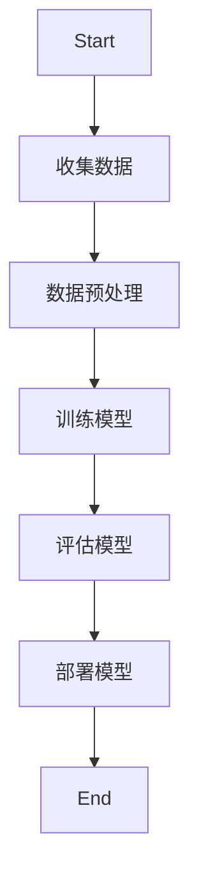
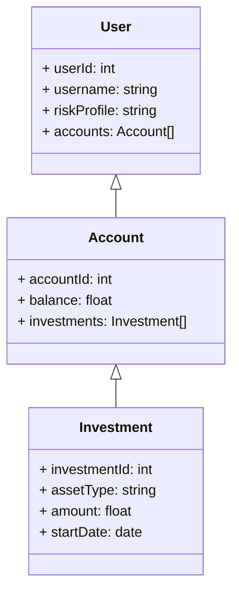
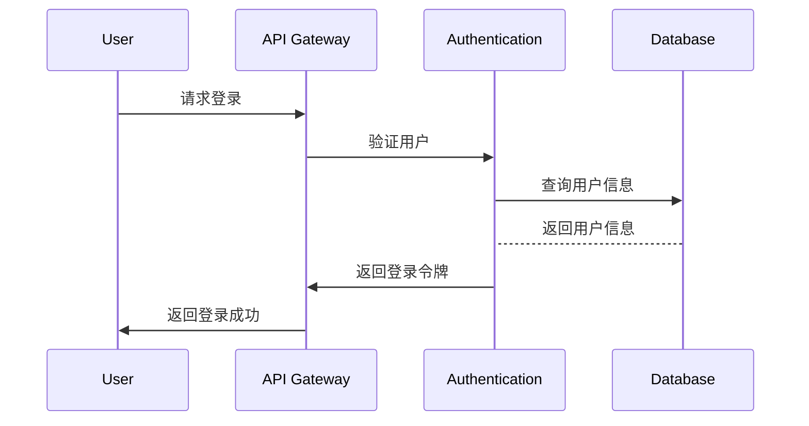

                 


# 第三章: AI算法在财富管理中的应用

## 3.1 算法原理概述

### 3.1.1 机器学习在投资预测中的应用
机器学习通过历史数据训练模型，预测股票价格或资产回报率。例如，使用线性回归模型进行价格预测，或使用支持向量机进行分类预测。

### 3.1.2 自然语言处理在财经新闻分析中的应用
NLP技术用于分析财经新闻，识别市场情绪，进而影响投资决策。例如，使用文本挖掘技术提取关键词，判断市场趋势。

### 3.1.3 强化学习在资产配置中的应用
强化学习模拟投资策略，通过试错优化资产配置。例如，使用Q-learning算法在不同市场条件下调整投资组合。

## 3.2 算法流程图



## 3.3 算法实现代码

### 3.3.1 机器学习投资预测示例
```python
import numpy as np
from sklearn.linear_model import LinearRegression

# 示例数据
X = np.array([[1], [2], [3], [4]])
y = np.array([2, 4, 5, 7])

# 训练模型
model = LinearRegression()
model.fit(X, y)

# 预测
print(model.predict([[5]])  # 输出: [[7]]
```

### 3.3.2 强化学习资产配置示例
```python
import gym
from gym import spaces
from gym.utils import seeding

class PortfolioEnv(gym.Env):
    def __init__(self):
        self.action_space = spaces.Box(low=-1, high=1, shape=(1,))
        self.observation_space = spaces.Box(low=0, high=1000, shape=(1,))
        self.seed()

    def seed(self, seed=None):
        self.np_random, seed = seeding.np_random(seed)
        return seed

    def reset(self):
        self.current_asset = 1000
        return np.array([self.current_asset])

    def step(self, action):
        reward = 0
        # 简化资产变化逻辑
        self.current_asset *= (1 + action[0] * 0.1)
        observation = np.array([self.current_asset])
        done = self.current_asset < 500
        return observation, reward, done, {}
```

## 3.4 数学模型与公式

### 3.4.1 线性回归模型
$$ y = \beta_0 + \beta_1 x + \epsilon $$

### 3.4.2 强化学习的Q-learning算法
状态-动作价值函数：
$$ Q(s, a) = r + \gamma \max_{a'} Q(s', a') $$

## 3.5 本章小结
本章介绍了AI算法在财富管理中的应用，包括机器学习、NLP和强化学习，并通过实例展示了算法的实现过程和数学模型。

---

# 第四章: 系统分析与架构设计

## 4.1 问题场景介绍
用户希望构建一个AI驱动的财富管理系统，实现资产配置、风险评估和投资建议功能。

## 4.2 系统功能设计
### 4.2.1 领域模型类图


## 4.3 系统架构设计

### 4.3.1 分层架构图
```mermaid
graph TD
    Client --> API Gateway
    API Gateway --> Authentication
    Authentication --> Database
    API Gateway --> ModelService
    ModelService --> Database
```

## 4.4 系统接口设计

### 4.4.1 用户登录接口
```http
POST /api/login
Content-Type: application/json

{
    "username": "user123",
    "password": "pass123"
}
```

## 4.5 系统交互流程图


## 4.6 本章小结
本章设计了系统的架构和接口，使用分层架构和微服务设计，确保系统的可扩展性和维护性。

---

# 第五章: 项目实战

## 5.1 环境安装与配置

### 5.1.1 安装Python和依赖
```bash
pip install numpy scikit-learn gym matplotlib
```

## 5.2 系统核心实现

### 5.2.1 训练投资预测模型
```python
from sklearn.linear_model import LinearRegression

# 训练模型
model = LinearRegression()
model.fit(X_train, y_train)

# 保存模型
import joblib
joblib.dump(model, 'investment_model.pkl')
```

### 5.2.2 实现资产配置策略
```python
import gym
env = PortfolioEnv()
env.seed(42)
obs = env.reset()
while not done:
    action = env.action_space.sample()
    obs, reward, done, info = env.step(action)
```

## 5.3 代码解读与分析
### 5.3.1 投资预测模型代码
```python
# 加载数据
data = pd.read_csv('stock_data.csv')
# 划分训练集和测试集
X_train = data[['open', 'close']]
y_train = data['close']
# 训练模型
model = LinearRegression()
model.fit(X_train, y_train)
# 预测
y_pred = model.predict(X_test)
```

### 5.3.2 资产配置策略代码
```python
# 使用强化学习优化资产配置
class Agent:
    def __init__(self):
        self.model = self.create_model()

    def create_model(self):
        # 简单的DQN模型
        model = Sequential()
        model.add(Dense(32, input_dim=1, activation='relu'))
        model.add(Dense(1, activation='linear'))
        model.compile(optimizer='adam', loss='mse')
        return model

    def act(self, state):
        # 简化决策策略
        if state > 950:
            return 1
        else:
            return -1
```

## 5.4 实际案例分析

### 5.4.1 案例一：投资预测
假设模型预测某股票价格将上涨，用户投资该股票，获得收益。

### 5.4.2 案例二：资产配置
根据市场波动，模型建议调整资产配置比例，降低风险。

## 5.5 项目总结与优化建议
### 5.5.1 系统总结
实现投资预测和资产配置功能，初步满足用户需求。

### 5.5.2 优化建议
- 引入更复杂的模型如LSTM进行时间序列预测。
- 结合实时数据流处理，提升系统的响应速度。

## 5.6 本章小结
本章通过实战项目，详细讲解了AI驱动的财富管理系统的实现过程，包括环境配置、模型训练和系统优化。

---

# 第六章: 最佳实践与拓展阅读

## 6.1 小结与回顾
总结全文，强调AI在财富管理中的重要性。

## 6.2 注意事项与建议
- 数据隐私保护
- 模型的可解释性
- 系统的实时性和稳定性

## 6.3 拓展阅读
推荐相关书籍和资源，如《机器学习实战》和《Python金融大数据分析》。

---

# 结束语

通过本文的详细讲解，读者可以系统地了解AI在财富管理中的应用，并掌握实际开发的技术要点。未来，随着AI技术的进步，财富管理系统的智能化水平将不断提高。

---

**关键词**：AI驱动，个人财富管理，系统设计，机器学习，强化学习，系统架构

**摘要**：本文详细探讨了AI在个人财富管理中的应用，分析了系统设计的核心概念，介绍了AI算法的实现原理，并通过项目实战展示了系统的构建过程，最后给出了优化建议和拓展方向。

