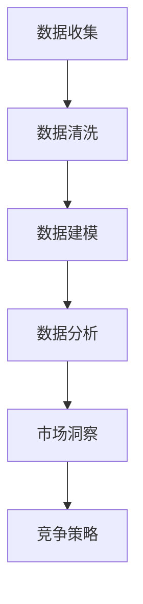
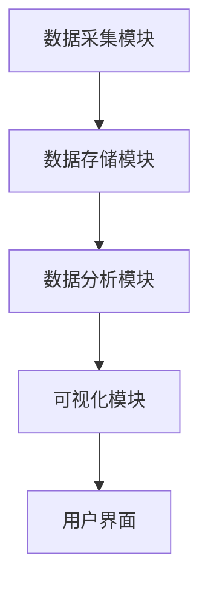
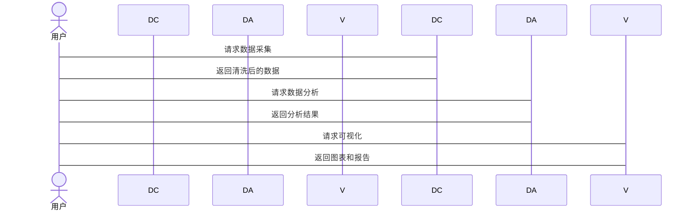

                 


# AI驱动的产业链分析：全面把握公司的市场地位

## 关键词：AI、产业链分析、市场地位、企业分析、系统架构、算法原理、项目实战

## 摘要：  
在当今快速变化的商业环境中，企业需要准确把握自身的市场地位，以制定有效的竞争策略。AI技术的应用为产业链分析提供了强大的工具，帮助企业从海量数据中提取有价值的信息，识别市场趋势和竞争态势。本文将详细介绍AI驱动的产业链分析方法，探讨其在企业战略中的应用，并通过实际案例展示如何利用AI技术提升市场洞察力。通过系统化的分析框架和实用的技术实现，本文旨在为企业提供一套高效、精准的市场地位评估体系。

---

## 第一部分：AI驱动的产业链分析基础

### 第1章：AI与产业链分析概述

#### 1.1 AI驱动的产业链分析背景
- 1.1.1 产业链分析的基本概念  
  - 产业链的定义：从原材料到最终产品的生产、分配和消费的全过程。  
  - 核心要素：企业角色、价值链环节、上下游关系。  
- 1.1.2 AI技术在产业链分析中的作用  
  - 数据处理能力：快速分析复杂产业链数据。  
  - 智能化工具：辅助企业识别市场机会和风险。  
  - 精准洞察：通过AI算法发现隐藏的市场趋势。  
- 1.1.3 企业的市场地位与产业链的关系  
  - 市场地位的定义：企业在行业中的竞争位置。  
  - 产业链分析如何影响市场地位：识别竞争优势和改进空间。  

#### 1.2 产业链分析的核心要素
- 1.2.1 产业链的结构与功能  
  - 产业链的层级结构：上游、中游、下游。  
  - 价值链的关键环节：生产、物流、销售。  
- 1.2.2 企业的市场地位评估维度  
  - 市场份额：企业在市场中的占比。  
  - 竞争对手分析：主要竞争对手的策略和能力。  
  - 产品生命周期：企业产品在市场中的发展阶段。  
- 1.2.3 产业链数据的获取与处理  
  - 数据来源：公开数据、行业报告、企业内部数据。  
  - 数据清洗：去除噪音数据，确保数据质量。  
  - 数据标准化：统一数据格式，便于分析。  

#### 1.3 AI驱动产业链分析的优势
- 1.3.1 数据处理能力的提升  
  - 大数据分析：处理海量数据，提取有价值的信息。  
  - 自然语言处理（NLP）：从文本数据中提取关键词和情感分析。  
- 1.3.2 智能化分析工具的应用  
  - 机器学习模型：预测市场趋势和企业表现。  
  - 图谱分析：可视化产业链关系，识别关键节点。  
- 1.3.3 市场洞察的精准性增强  
  - 精准定位：帮助企业找到市场空白和竞争优势。  
  - 动态监控：实时跟踪市场变化，快速调整策略。  

### 第2章：AI驱动产业链分析的核心概念与联系

#### 2.1 核心概念原理
- 2.1.1 产业链的定义与分类  
  - 产业链的分类：按行业划分（如制造业、服务业）和按区域划分（如全球、本地）。  
  - 核心概念：企业角色、价值链环节、上下游关系。  
- 2.1.2 市场地位的多维度评估  
  - 市场份额：企业在市场中的占比。  
  - 竞争优势：企业的核心竞争力和独特性。  
  - 品牌影响力：企业在消费者中的认知度和信任度。  
- 2.1.3 AI在产业链分析中的应用原理  
  - 数据驱动：通过AI算法处理和分析数据，提取洞察。  
  - 智能预测：利用机器学习模型预测市场趋势和企业表现。  
  - 可视化分析：通过图谱和仪表盘帮助企业直观理解市场地位。  

#### 2.2 核心概念属性对比表格
- 2.2.1 产业链环节与企业角色对比  
| 产业链环节 | 企业角色 | 描述 |
|------------|----------|------|
| 上游       | 供应商   | 提供原材料或零部件。 |
| 中游       | 制造商   | 进行产品生产。 |
| 下游       | 分销商   | 负责产品销售和配送。 |
| 终端       | 消费者   | 最终购买和使用产品。 |

- 2.2.2 不同市场地位的特征分析  
| 市场地位 | 特征描述                     |
|----------|------------------------------|
| 市场领导者 | 高市场份额，强大的品牌影响力。 |
| 市场挑战者 | 中等市场份额，积极挑战领导者。 |
| 市场跟随者 | 低市场份额，跟随市场趋势。  |
| 市场 niche | 专注于特定市场或产品。      |

- 2.2.3 AI技术在产业链分析中的优势对比  
| 技术         | 优势描述                     |
|--------------|------------------------------|
| 数据处理能力 | 快速处理和分析大量数据。     |
| 智能化工具   | 提供精准的市场洞察和预测。   |
| 可视化分析   | 通过图表清晰展示市场地位。   |

#### 2.3 ER实体关系图架构
- 2.3.1 产业链实体关系图
```mermaid
er
actor 产业链分析系统 {
  运营者
  分析者
  企业
  产品
  市场数据
}
关联关系：
- 运营者 -> 产业链分析系统：操作和维护系统
- 分析者 -> 产业链分析系统：进行数据分析和预测
- 企业 -> 市场数据：提供企业相关信息
- 产品 -> 市场数据：记录产品数据
```

- 2.3.2 企业市场地位的实体关系
```mermaid
er
actor 企业市场地位分析 {
  企业
  产品
  竞争对手
  市场数据
}
关联关系：
- 企业 -> 产品：生产或销售产品
- 企业 -> 竞争对手：分析竞争对手数据
- 企业 -> 市场数据：获取市场趋势和份额
```

- 2.3.3 AI驱动的分析流程关系图


### 第3章：AI驱动产业链分析的算法原理

#### 3.1 算法原理概述
- 3.1.1 数据预处理
  - 数据清洗：去除缺失值和异常值。  
  - 数据标准化：统一数据格式和单位。  
- 3.1.2 机器学习模型
  - 监督学习：用于分类和回归问题。  
  - 非监督学习：用于聚类分析。  
  - 深度学习：用于复杂模式识别。  
- 3.1.3 算法实现步骤
  1. 数据收集：获取产业链相关数据。  
  2. 数据预处理：清洗和标准化数据。  
  3. 模型训练：选择合适的算法并训练模型。  
  4. 模型评估：验证模型的准确性和效果。  
  5. 预测与分析：利用模型预测市场趋势和企业表现。  

#### 3.2 算法实现代码示例
- 使用Python实现一个简单的机器学习模型，用于预测企业的市场地位。
```python
# 导入必要的库
import pandas as pd
from sklearn.model import LinearRegression
from sklearn.metrics import accuracy_score

# 数据加载
data = pd.read_csv('market_data.csv')

# 数据预处理
X = data[['market_share', 'competitor_count']]
y = data['market_position']

# 模型训练
model = LinearRegression()
model.fit(X, y)

# 模型预测
predictions = model.predict(X)
print('预测值:', predictions)
print('真实值:', y.values)

# 模型评估
print('准确率:', accuracy_score(y, predictions))
```

#### 3.3 算法原理的数学模型
- 线性回归模型：用于预测企业的市场地位。
  $$ y = \beta_0 + \beta_1 x_1 + \beta_2 x_2 + \epsilon $$
  其中，y是市场地位，x1是市场份额，x2是竞争对手数量，β是系数，ε是误差项。

#### 3.4 算法实现的步骤解释
- 数据预处理：确保数据的准确性和一致性。  
- 模型选择：根据问题类型选择合适的算法。  
- 模型训练：利用数据训练模型，提取特征。  
- 模型评估：通过准确率、召回率等指标评估模型性能。  
- 应用预测：利用模型预测未来市场趋势和企业表现。  

## 第二部分：AI驱动的产业链分析系统架构与实现

### 第4章：系统架构与技术实现

#### 4.1 系统功能设计
- 4.1.1 数据采集模块
  - 功能：从多种数据源（如API、数据库）采集产业链数据。  
  - 输入：数据源配置。  
  - 输出：清洗后的数据。  
- 4.1.2 数据分析模块
  - 功能：利用机器学习算法分析数据，生成市场洞察。  
  - 输入：清洗后的数据。  
  - 输出：分析结果和预测报告。  
- 4.1.3 可视化模块
  - 功能：将分析结果可视化，便于用户理解和决策。  
  - 输入：分析结果。  
  - 输出：图表和仪表盘。  

#### 4.2 系统架构设计
- 4.2.1 系统架构图


- 4.2.2 系统接口设计
  - 数据接口：与数据源对接，获取产业链数据。  
  - 分析接口：调用机器学习模型，进行数据分析。  
  - 可视化接口：生成图表和报告，展示分析结果。  

#### 4.3 系统交互流程图


### 第5章：项目实战与案例分析

#### 5.1 项目背景与目标
- 案例背景：某制造业企业的市场地位分析。  
- 项目目标：利用AI技术分析企业的市场地位，制定竞争策略。  

#### 5.2 环境安装与配置
- 安装必要的Python库：numpy、pandas、scikit-learn、matplotlib。  
- 数据源准备：收集企业的市场份额、竞争对手数据和市场趋势数据。  

#### 5.3 系统核心实现代码
```python
import pandas as pd
from sklearn.ensemble import RandomForestClassifier
from sklearn.metrics import accuracy_score

# 数据加载
data = pd.read_csv('manufacturing_data.csv')

# 数据预处理
X = data[['market_share', 'competitor_strategy']]
y = data['market_position']

# 模型训练
model = RandomForestClassifier()
model.fit(X, y)

# 模型预测
predictions = model.predict(X)
print('预测值:', predictions)
print('准确率:', accuracy_score(y, predictions))
```

#### 5.4 案例分析与解读
- 数据分析结果：企业的市场份额在行业中处于中游水平。  
- 竞争对手分析：主要竞争对手在技术创新和市场推广方面具有优势。  
- 市场趋势预测：未来市场将朝着智能化和绿色制造方向发展。  

#### 5.5 项目小结
- 通过AI技术，企业能够更精准地评估市场地位，制定有效的竞争策略。  
- 系统化的分析框架和工具的应用，显著提升了市场洞察力和决策效率。  

## 第三部分：总结与展望

### 第6章：总结与展望

#### 6.1 全书总结
- AI技术为产业链分析提供了强大的工具和方法。  
- 通过系统化的分析框架，企业能够准确评估市场地位，制定有效的竞争策略。  

#### 6.2 未来展望
- 技术进步：深度学习和自然语言处理的进一步发展将提升分析的精准性和智能化。  
- 应用扩展：AI驱动的产业链分析将应用于更多行业，如医疗、金融和能源等。  
- 挑战与机遇：企业需要不断学习和适应新技术，抓住AI带来的市场机会。  

---

通过以上目录结构，我们可以系统地学习AI驱动的产业链分析方法，掌握其在企业战略中的应用，并通过实际案例理解如何利用AI技术提升市场洞察力。希望这本书能够为企业提供实用的工具和方法，帮助他们在复杂多变的市场环境中保持竞争优势。

