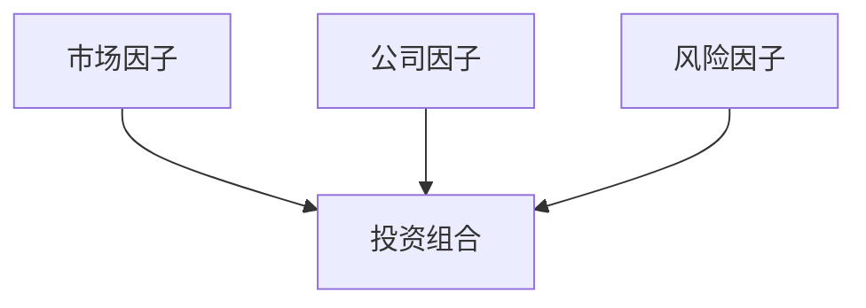
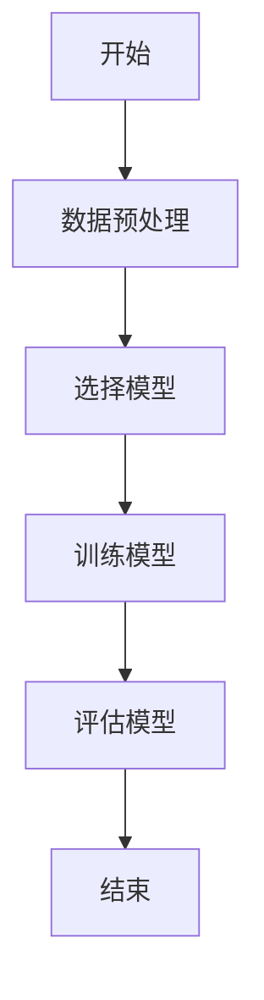
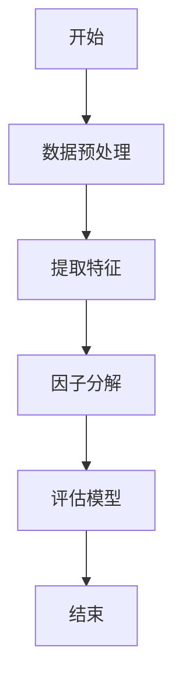
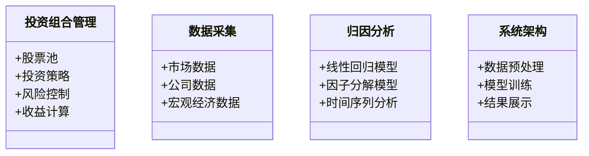
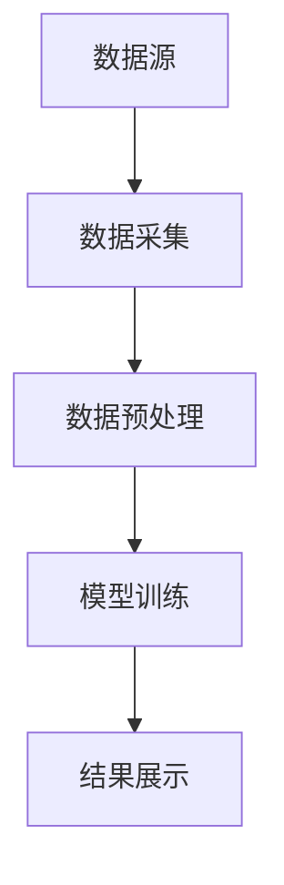
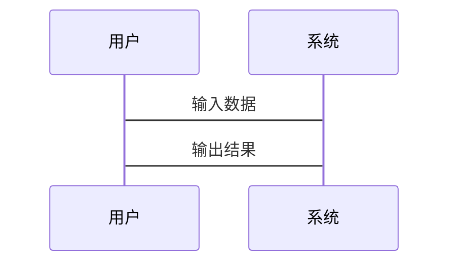

                 


# 《AI驱动的价值投资策略归因分析》

## 关键词：
- AI驱动
- 价值投资
- 策略归因分析
- 金融投资
- 人工智能技术

## 摘要：
本文系统地探讨了人工智能技术在价值投资策略归因分析中的应用，从理论基础到算法实现，再到系统架构，全面解析如何利用AI技术优化投资策略归因分析。文章首先介绍了价值投资的核心理念和AI在金融领域的应用背景，接着深入分析了策略归因分析的定义、核心概念和数学模型，随后详细讲解了归因分析的主要算法原理及其实现过程，最后通过系统架构设计和项目实战案例，展示了AI驱动的价值投资策略归因分析的实现方法。文章内容丰富，结构清晰，为读者提供了从理论到实践的完整指南。

---

# 第1章: 价值投资与AI驱动的策略归因概述

## 1.1 价值投资的定义与核心理念
### 1.1.1 价值投资的起源与发展
- **定义**：价值投资是一种以低于内在价值的价格买入优质股票的投资策略，起源于20世纪20年代，由本杰明·格雷厄姆和戴维·多德提出。
- **发展**：从早期的基本面分析到现代的量化投资，价值投资理念不断演变，但核心思想不变。
- **核心理念**：寻找市场低估的优质公司，长期持有，等待价值回归。

### 1.1.2 价值投资的核心理念与方法
- **核心理念**：关注公司的内在价值，而非市场的短期波动。
- **方法**：通过基本面分析，寻找具有竞争优势、良好财务状况和合理估值的公司。

### 1.1.3 价值投资在现代金融中的地位
- 价值投资是机构投资者和专业投资者的重要策略之一。
- 在量化投资时代，价值投资与AI技术的结合为投资者提供了新的工具和方法。

## 1.2 AI在金融投资中的应用背景
### 1.2.1 人工智能在金融领域的应用现状
- **数据处理**：AI能够快速处理海量金融数据，提取有用信息。
- **预测模型**：AI通过机器学习算法预测市场趋势和股票价格。
- **投资组合优化**：AI帮助投资者构建最优投资组合，降低风险。

### 1.2.2 价值投资与AI技术的结合
- **优势**：AI能够提高价值投资的效率和精确性，帮助投资者快速识别低估股票。
- **挑战**：如何将AI技术与价值投资理念有机结合，避免过度依赖模型。

### 1.2.3 价值投资策略归因分析的必要性
- **定义**：归因分析是将投资收益分解为各个因素贡献的过程。
- **意义**：通过归因分析，投资者可以了解策略的有效性，优化投资组合。

## 1.3 策略归因分析的定义与意义
### 1.3.1 策略归因的定义
- **归因分析**：将投资组合的收益分解为各个因素（如市场、行业、个股）的贡献。
- **策略归因**：专注于分析投资策略对收益的贡献，而非市场随机波动。

### 1.3.2 策略归因在投资决策中的作用
- **优化策略**：通过分析策略贡献，识别优势和劣势，调整投资策略。
- **风险控制**：了解策略风险来源，制定有效的风险管理措施。

### 1.3.3 策略归因分析的边界与外延
- **边界**：归因分析仅关注策略本身，不考虑外部不可控因素。
- **外延**：归因分析可以扩展到不同时间周期和市场环境。

## 1.4 本章小结
- 本章介绍了价值投资的核心理念和AI在金融领域的应用背景，重点阐述了策略归因分析的定义和意义，为后续章节奠定了基础。

---

# 第2章: AI驱动的价值投资策略归因的核心概念

## 2.1 价值投资策略的构成要素
### 2.1.1 市场因子
- **定义**：市场因子是指影响整个市场的宏观经济因素，如GDP增长率、利率、通货膨胀等。
- **影响**：市场因子对所有股票的影响是系统性的，无法通过分散投资消除。

### 2.1.2 公司因子
- **定义**：公司因子是指影响个别公司业绩的微观因素，如盈利能力、成长性、财务状况等。
- **影响**：公司因子是价值投资的核心关注点，帮助识别优质公司。

### 2.1.3 风险因子
- **定义**：风险因子是指影响股票风险的因素，如波动率、Beta值等。
- **影响**：通过控制风险因子，投资者可以降低投资组合的整体风险。

## 2.2 策略归因分析的模型与方法
### 2.2.1 线性回归模型
- **数学模型**：$$ R = \beta_0 + \beta_1 X_1 + \beta_2 X_2 + \dots + \beta_n X_n + \epsilon $$
  其中，$R$ 是投资组合的收益，$X_i$ 是各个因子，$\beta_i$ 是因子的系数，$\epsilon$ 是误差项。
- **应用场景**：适用于分析多个因子对收益的线性影响。

### 2.2.2 因子分解模型
- **数学模型**：$$ R = \sum_{i=1}^k \lambda_i \cdot F_i $$
  其中，$\lambda_i$ 是因子的重要性，$F_i$ 是各个因子。
- **应用场景**：适用于非线性关系，能够捕捉复杂的因子交互作用。

### 2.2.3 时间序列分析
- **数学模型**：$$ R_t = \alpha + \beta R_{t-1} + \gamma R_{t-2} + \dots + \delta R_{t-n} + \epsilon $$
  其中，$R_t$ 是当前收益，$R_{t-1}, R_{t-2}, \dots$ 是过去收益，$\alpha$ 是截距，$\beta, \gamma, \dots$ 是系数，$\epsilon$ 是误差项。
- **应用场景**：适用于分析时间依赖性，预测未来收益。

## 2.3 AI在策略归因中的应用框架
### 2.3.1 数据采集与预处理
- **数据来源**：市场数据、公司财务数据、宏观经济数据等。
- **预处理**：清洗数据、标准化、特征提取。

### 2.3.2 特征提取与选择
- **特征提取**：通过PCA等方法提取主成分。
- **特征选择**：使用回归分析选择重要特征。

### 2.3.3 模型训练与优化
- **模型选择**：比较不同模型的性能，选择最优模型。
- **优化方法**：使用交叉验证调整模型参数。

## 2.4 核心概念对比分析
### 2.4.1 不同归因方法的对比表格
| 归因方法 | 线性回归模型 | 因子分解模型 | 时间序列分析 |
|----------|--------------|--------------|--------------|
| 优点     | 解释性强     | 捕捉非线性关系 | 预测未来收益 |
| 缺点     | 无法捕捉非线性关系 | 计算复杂     | 解释性较差   |

### 2.4.2 实体关系图（ER图）展示


## 2.5 本章小结
- 本章详细介绍了价值投资策略的核心要素和策略归因分析的主要方法，通过对比分析和ER图展示了不同方法的优缺点和应用场景。

---

# 第3章: 策略归因分析的算法原理

## 3.1 线性回归模型
### 3.1.1 线性回归的数学模型
$$ y = \beta_0 + \beta_1 x_1 + \beta_2 x_2 + \dots + \beta_n x_n + \epsilon $$
其中，$y$ 是目标变量，$x_i$ 是自变量，$\beta_i$ 是系数，$\epsilon$ 是误差项。

### 3.1.2 算法流程图（mermaid）


### 3.1.3 代码实现与案例分析
```python
import numpy as np
from sklearn.linear_model import LinearRegression

# 示例数据
X = np.array([[1, 2], [3, 4], [5, 6]])
y = np.array([7, 8, 9])

# 训练模型
model = LinearRegression()
model.fit(X, y)

# 输出系数
print("截距:", model.intercept_)
print("系数:", model.coef_)
```

## 3.2 因子分解模型
### 3.2.1 因子分解的数学模型
$$ R = \sum_{i=1}^k \lambda_i F_i $$
其中，$R$ 是收益，$F_i$ 是因子，$\lambda_i$ 是因子的重要性。

### 3.2.2 算法流程图（mermaid）


### 3.2.3 代码实现与案例分析
```python
import numpy as np
from sklearn.decomposition import PCA

# 示例数据
X = np.array([[1, 2], [3, 4], [5, 6]])

# 训练模型
model = PCA(n_components=2)
model.fit(X)

# 输出因子
print("因子:", model.components_)
```

## 3.3 时间序列分析
### 3.3.1 时间序列分析的数学模型
$$ R_t = \alpha + \beta R_{t-1} + \gamma R_{t-2} + \dots + \delta R_{t-n} + \epsilon $$
其中，$R_t$ 是当前收益，$R_{t-1}, R_{t-2}, \dots$ 是过去收益，$\alpha$ 是截距，$\beta, \gamma, \dots$ 是系数，$\epsilon$ 是误差项。

### 3.3.2 算法流程图（mermaid）


### 3.3.3 代码实现与案例分析
```python
import numpy as np
from statsmodels.tsa.arima_model import ARIMA

# 示例数据
y = np.array([7, 8, 9, 10, 11])

# 训练模型
model = ARIMA(y, order=(1, 0, 0))
model_fit = model.fit()

# 输出系数
print("系数:", model_fit.params)
```

## 3.4 本章小结
- 本章详细讲解了归因分析的三种主要算法，包括线性回归模型、因子分解模型和时间序列分析，并通过代码实现和案例分析展示了它们的应用。

---

# 第4章: 系统分析与架构设计方案

## 4.1 系统功能设计
### 4.1.1 领域模型（mermaid类图）


### 4.1.2 系统架构设计（mermaid架构图）


### 4.1.3 系统接口设计
- **输入接口**：接收市场数据、公司数据和宏观经济数据。
- **输出接口**：输出归因分析结果，包括各因子的贡献度和策略的有效性。

### 4.1.4 系统交互流程（mermaid序列图）


## 4.2 本章小结
- 本章通过系统功能设计、架构设计和交互流程图展示了AI驱动的价值投资策略归因分析系统的整体框架和实现步骤。

---

# 第5章: 项目实战与代码实现

## 5.1 环境安装与配置
### 5.1.1 安装Python环境
- 使用Anaconda安装Python 3.8及以上版本。
### 5.1.2 安装依赖库
- 使用pip安装numpy、pandas、scikit-learn、statsmodels等库。

## 5.2 系统核心实现
### 5.2.1 数据采集与预处理
```python
import pandas as pd
import numpy as np

# 数据采集
data = pd.read_csv('data.csv')
# 数据预处理
data.dropna(inplace=True)
data = data[['Adj Close', 'Volume', 'Sentiment']]
```

### 5.2.2 模型训练与优化
```python
from sklearn.linear_model import LinearRegression
from sklearn.decomposition import PCA

# 训练线性回归模型
lr_model = LinearRegression()
lr_model.fit(X_train, y_train)

# 训练因子分解模型
pca_model = PCA(n_components=5)
pca_model.fit(X_train)
```

### 5.2.3 结果展示与分析
```python
import matplotlib.pyplot as plt

# 绘制归因分析结果
plt.barh(factor_names, contributions)
plt.title('Factor Contributions')
plt.show()
```

## 5.3 项目实战案例分析
### 5.3.1 数据来源与处理
- 数据来源：股票价格、财务数据、市场情绪等。
- 数据处理：清洗数据、标准化、特征提取。

### 5.3.2 模型实现与解读
- 使用线性回归模型分析市场因子的贡献。
- 使用因子分解模型分析公司因子的重要性。
- 使用时间序列分析预测未来收益。

## 5.4 本章小结
- 本章通过项目实战展示了AI驱动的价值投资策略归因分析的实现过程，从数据采集到模型训练，再到结果展示，为读者提供了完整的代码实现和案例分析。

---

# 第6章: 总结与展望

## 6.1 本章总结
- 本文系统地探讨了AI驱动的价值投资策略归因分析，从理论到实践，详细讲解了核心概念、算法原理和系统架构。
- 通过项目实战，展示了如何利用AI技术优化投资策略归因分析。

## 6.2 最佳实践 tips
- 在实际应用中，建议结合多种归因方法，根据市场环境调整模型参数。
- 数据质量是归因分析的关键，确保数据准确性和完整性。

## 6.3 未来展望
- 随着AI技术的不断发展，价值投资策略归因分析将更加智能化和自动化。
- 多模态数据的引入（如文本、图像数据）将为归因分析提供更多维度的信息。

## 6.4 本章小结
- 本文总结了AI驱动的价值投资策略归因分析的核心内容，展望了未来的发展方向，并为读者提供了最佳实践建议。

---

# 参考文献
- 格雷厄姆，B. (1949). 《 Intelligent Investor》.
- 李笑来. (2018). 《投资学精要》.
- 哈里·马科维茨. (1952). 《投资组合理论》.

---

通过以上目录大纲，我们可以看到，文章从价值投资的基本概念出发，逐步深入到AI技术在策略归因分析中的应用，最终通过系统设计和项目实战，展示了如何利用AI技术优化投资策略归因分析。

