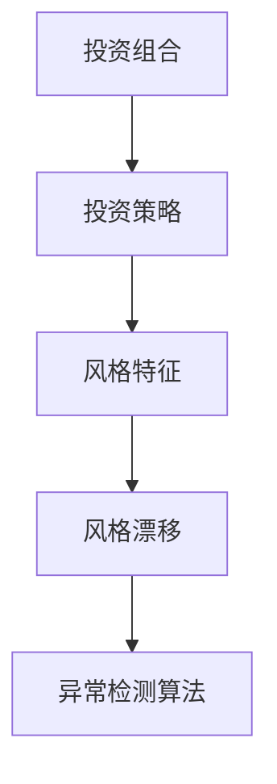
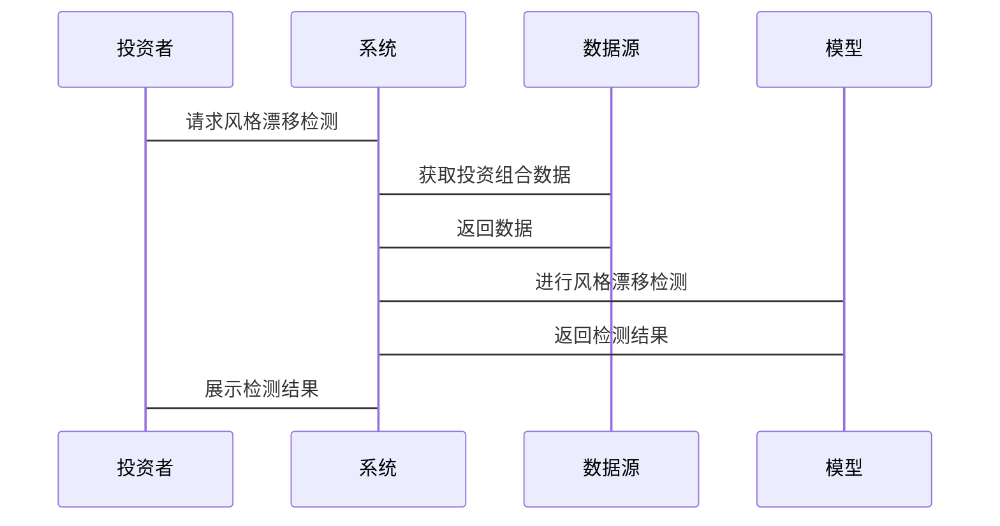

                 


```markdown
# AI驱动的价值投资策略风格漂移检测

> 关键词：价值投资，风格漂移，人工智能，投资策略，金融分析，机器学习，深度学习

> 摘要：  
本书探讨了如何利用人工智能技术检测价值投资策略中的风格漂移现象。通过深入分析价值投资的基本概念、风格漂移的定义及其对投资组合的影响，结合机器学习和时间序列分析等算法，本书提供了从理论到实践的详细指导，帮助读者理解并实现AI驱动的风格漂移检测系统。

---

# 第一部分：背景与概念

## 第1章：价值投资与风格漂移概述

### 1.1 价值投资的基本概念
- 1.1.1 价值投资的定义与核心理念
- 1.1.2 价值投资的基本策略与方法
- 1.1.3 价值投资在金融领域的应用现状

### 1.2 风格漂移的定义与影响
- 1.2.1 风格漂移的定义
- 1.2.2 风格漂移的主要表现形式
- 1.2.3 风格漂移对投资组合的影响

### 1.3 AI在金融投资中的应用前景
- 1.3.1 AI在金融领域的核心优势
- 1.3.2 AI在投资策略中的潜在应用场景
- 1.3.3 风险提示与挑战

## 1.4 本章小结

---

# 第二部分：核心概念与原理

## 第2章：价值投资策略的数学模型
- 2.1 投资组合的构建与优化
- 2.2 风险-收益平衡的数学表达
- 2.3 投资策略的动态调整模型

## 第3章：风格漂移检测的理论基础
- 3.1 时间序列分析的基本原理
- 3.2 统计套利与风格漂移检测的关系
- 3.3 机器学习在风格漂移检测中的应用

## 3.4 核心概念的ER实体关系图


---

# 第三部分：AI驱动的风格漂移检测算法

## 第4章：基于因子分析的风格漂移检测
- 4.1 因子分析的基本原理
- 4.2 主成分分析（PCA）的数学模型
- 4.3 因子分析在风格漂移检测中的应用

## 第5章：基于机器学习的风格漂移检测
- 5.1 支持向量机（SVM）的原理与实现
- 5.2 随机森林在风格漂移检测中的应用
- 5.3 深度学习模型（如LSTM）的风格漂移检测

## 5.4 算法实现的数学模型与公式
### 5.4.1 支持向量机的数学模型
$$ \text{目标函数} = \sum_{i=1}^{n} \xi_i + C \sum_{i=1}^{n} \xi_i $$
### 5.4.2 马尔可夫链的状态转移方程
$$ P(s_{t+1}|s_t) = \theta \cdot s_t + (1-\theta) $$

---

# 第四部分：系统分析与架构设计

## 第6章：风格漂移检测系统的架构设计
- 6.1 系统功能设计（领域模型）
```mermaid
classDiagram
    class 投资组合 {
        id
        资产配置
        风险评估
    }
    class 投资策略 {
        id
        策略类型
        参数设置
    }
    class 风格特征 {
        id
        特征向量
        时间戳
    }
    class 风格漂移 {
        id
        检测结果
        检测时间
    }
   抽屉关系：抽屉关系表示投资组合和投资策略之间的关联，通过策略ID关联。
   抽屉关系：抽屉关系表示风格特征和风格漂移之间的关联，通过特征向量进行关联。
```

- 6.2 系统架构设计


---

# 第五部分：项目实战

## 第7章：AI驱动的风格漂移检测系统实现

### 7.1 环境搭建与数据准备
- 7.1.1 环境安装（Python、机器学习库等）
- 7.1.2 数据来源与数据清洗

### 7.2 系统核心实现
- 7.2.1 数据采集与预处理代码
- 7.2.2 特征提取与模型训练代码
- 7.2.3 结果展示与可视化代码

### 7.3 实际案例分析
- 7.3.1 案例背景与数据介绍
- 7.3.2 模型训练与结果解读
- 7.3.3 检测结果分析与策略调整

## 7.4 项目小结

---

# 第六部分：总结与展望

## 第8章：总结与未来研究方向
- 8.1 本书的核心内容回顾
- 8.2 未来研究方向与技术趋势

---

## 致谢
感谢读者的支持与关注！
</think>

# AI驱动的价值投资策略风格漂移检测

> 关键词：价值投资，风格漂移，人工智能，投资策略，金融分析，机器学习，深度学习

> 摘要：  
本书探讨了如何利用人工智能技术检测价值投资策略中的风格漂移现象。通过深入分析价值投资的基本概念、风格漂移的定义及其对投资组合的影响，结合机器学习和时间序列分析等算法，本书提供了从理论到实践的详细指导，帮助读者理解并实现AI驱动的风格漂移检测系统。

---

# 第一部分：背景与概念

## 第1章：价值投资与风格漂移概述

### 1.1 价值投资的基本概念
- **1.1.1 价值投资的定义与核心理念**  
  价值投资是一种以内在价值为导向的投资策略，强调以低于内在价值的价格买入优质资产。其核心理念是寻找市场先生的错误定价，通过长期持有优质资产实现超额收益。

- **1.1.2 价值投资的基本策略与方法**  
  价值投资的基本策略包括基本面分析、安全边际概念、长期持有的投资哲学等。投资者通常关注企业的盈利能力、财务状况、竞争优势等因素，以识别被低估的投资标的。

- **1.1.3 价值投资在金融领域的应用现状**  
  价值投资在金融领域已有百年历史，被广泛应用于股票、房地产和其他资产的投资中。近年来，随着金融市场的复杂化，价值投资策略也在不断演变，结合现代技术手段（如AI）进行优化。

### 1.2 风格漂移的定义与影响
- **1.2.1 风格漂移的定义**  
  风格漂移（Style Drift）是指投资组合的实际投资风格与其最初的策略目标发生偏离的现象。这种偏离可能会影响投资组合的风险收益特征，导致投资者无法获得预期的回报。

- **1.2.2 风格漂移的主要表现形式**  
  风格漂移通常表现为投资组合的资产配置偏离初始计划、行业或地区分布超出预期、风险敞口增加等。这种漂移可能导致投资组合的风险增加或收益下降。

- **1.2.3 风格漂移对投资组合的影响**  
  风格漂移可能导致投资组合的实际表现与预期目标不符，增加投资者的损失。此外，风格漂移还可能引发合规问题，尤其是在受严格监管的机构投资者中。

### 1.3 AI在金融投资中的应用前景
- **1.3.1 AI在金融领域的核心优势**  
  AI技术在金融领域的优势在于其强大的数据处理能力、模式识别能力和自动化决策能力。通过AI技术，投资者可以更高效地分析市场数据，识别投资机会和风险。

- **1.3.2 AI在投资策略中的潜在应用场景**  
  AI技术可以应用于投资组合管理、风险控制、市场预测、风格漂移检测等多个方面。特别是在风格漂移检测中，AI可以通过复杂的算法和模型，实时监控投资组合的风格变化，提供预警和调整建议。

- **1.3.3 风险提示与挑战**  
  尽管AI在金融领域的应用前景广阔，但也面临数据质量、模型过拟合、黑箱问题等挑战。投资者在应用AI技术时需要谨慎，确保模型的可靠性和可解释性。

## 1.4 本章小结  
本章介绍了价值投资的基本概念和风格漂移的定义及影响，探讨了AI在金融投资中的应用前景。通过这些内容，读者可以理解为什么在现代投资管理中，利用AI技术检测风格漂移是必要的。

---

# 第二部分：核心概念与原理

## 第2章：价值投资策略的数学模型

### 2.1 投资组合的构建与优化
- **投资组合的构建**  
  投资组合的构建通常基于投资者的风险承受能力、投资目标和市场状况。通过优化模型，投资者可以在不同资产之间进行配置，以实现风险和收益的最佳平衡。

- **投资组合优化的数学模型**  
  Markowitz的有效前沿理论是投资组合优化的基础。其数学模型如下：
  $$ \min_{w} w^T \Sigma w $$
  $$ \text{s.t. } w^T \mu = \text{target return} $$
  $$ w^T 1 = 1 $$

- **动态调整模型**  
  随着市场环境的变化，投资组合需要定期进行动态调整。这种调整可以通过马尔可夫链模型来模拟，以反映市场的随机性。

### 2.2 风险-收益平衡的数学表达
- **风险-收益平衡的定义**  
  风险-收益平衡是指在投资组合中，风险和收益之间达到一种最优状态，使得投资者在可接受的风险水平下获得最大收益。

- **风险-收益平衡的数学模型**  
  风险通常用方差或标准差衡量，收益可以用期望收益衡量。投资组合的优化目标可以表示为：
  $$ \max_{w} w^T \mu $$
  $$ \text{s.t. } w^T \Sigma w \leq \text{risk tolerance} $$

### 2.3 投资策略的动态调整模型
- **动态调整的必要性**  
  金融市场是动态变化的，投资策略需要根据市场环境的变化进行调整，以保持其有效性。

- **动态调整的数学模型**  
  动态调整模型可以通过时间序列分析实现，例如ARIMA模型。其基本形式为：
  $$ y_t = c + \phi_1 y_{t-1} + \theta_1 \epsilon_{t-1} + \epsilon_t $$

## 第3章：风格漂移检测的理论基础

### 3.1 时间序列分析的基本原理
- **时间序列分析的定义**  
  时间序列分析是一种通过观察数据随时间变化的模式，预测未来趋势的方法。在风格漂移检测中，时间序列分析可以帮助识别投资组合风格的变化趋势。

- **时间序列分析的主要方法**  
  时间序列分析的主要方法包括移动平均法、指数平滑法、ARIMA模型等。这些方法可以帮助投资者识别数据中的趋势、周期性和随机性。

- **时间序列分析在风格漂移检测中的应用**  
  通过分析投资组合的风格特征随时间的变化，投资者可以识别风格漂移的发生。

### 3.2 统计套利与风格漂移检测的关系
- **统计套利的定义**  
  统计套利是一种利用资产价格短期偏差的投资策略，通过套利机会获利。在风格漂移检测中，统计套利可以帮助识别资产价格的变化是否偏离其长期趋势。

- **统计套利在风格漂移检测中的应用**  
  统计套利模型可以通过分析资产价格的变化，识别风格漂移的发生。例如，通过构建资产价格的回归模型，识别回归系数的变化是否偏离预期。

### 3.3 机器学习在风格漂移检测中的应用
- **机器学习的定义**  
  机器学习是一种通过数据驱动的方法，训练模型进行预测或分类的技术。在风格漂移检测中，机器学习模型可以用于识别投资组合风格的变化。

- **机器学习在风格漂移检测中的应用**  
  常见的机器学习算法包括支持向量机（SVM）、随机森林和深度学习模型（如LSTM）。这些算法可以通过训练数据，识别投资组合风格的变化趋势。

## 3.4 核心概念的ER实体关系图


---

# 第三部分：AI驱动的风格漂移检测算法

## 第4章：基于因子分析的风格漂移检测

### 4.1 因子分析的基本原理
- **因子分析的定义**  
  因子分析是一种统计方法，用于识别数据中的潜在因素。在风格漂移检测中，因子分析可以帮助识别投资组合风格的主要驱动因素。

- **因子分析在风格漂移检测中的应用**  
  通过因子分析，投资者可以识别投资组合风格的主要因素，并监控这些因素的变化情况。

### 4.2 主成分分析（PCA）的数学模型
- **主成分分析的定义**  
  主成分分析是一种降维技术，通过线性变换将原始数据映射到更低维的空间中。其数学模型如下：
  $$ Y = X \cdot P $$
  其中，$Y$ 是降维后的数据，$X$ 是原始数据，$P$ 是降维矩阵。

- **主成分分析在风格漂移检测中的应用**  
  通过主成分分析，投资者可以识别投资组合风格的主要变化方向，并监控这些方向的变化情况。

### 4.3 因子分析在风格漂移检测中的应用
- **因子分析在风格漂移检测中的优势**  
  因子分析可以帮助投资者识别投资组合风格的主要驱动因素，并通过监控这些因素的变化情况，及时发现风格漂移。

- **因子分析的具体实现步骤**  
  1. 数据预处理：对投资组合的历史数据进行清洗和标准化。  
  2. 因子分析：识别投资组合风格的主要驱动因素。  
  3. 风格漂移检测：监控这些因素的变化情况，识别风格漂移。

## 第5章：基于机器学习的风格漂移检测

### 5.1 支持向量机（SVM）的原理与实现
- **支持向量机的定义**  
  支持向量机是一种监督学习算法，用于分类和回归问题。在风格漂移检测中，SVM可以用于识别投资组合风格的变化。

- **支持向量机的数学模型**  
  SVM的目标函数如下：
  $$ \min_{w, b, \xi} \frac{1}{2} w^T w + C \sum_{i=1}^{n} \xi_i $$
  $$ \text{s.t. } y_i (w^T x_i + b) \geq 1 - \xi_i $$
  $$ \xi_i \geq 0 $$

- **支持向量机在风格漂移检测中的应用**  
  通过将投资组合的风格特征输入SVM模型，投资者可以识别风格漂移的发生。

### 5.2 随机森林在风格漂移检测中的应用
- **随机森林的定义**  
  随机森林是一种基于决策树的集成学习算法，通过随机采样数据和特征，构建多个决策树，并通过投票或平均的方式进行预测。

- **随机森林在风格漂移检测中的应用**  
  通过将投资组合的风格特征输入随机森林模型，投资者可以识别风格漂移的发生，并通过模型的特征重要性分析，识别影响风格漂移的关键因素。

### 5.3 深度学习模型（如LSTM）的风格漂移检测
- **LSTM的定义**  
  长短期记忆网络（LSTM）是一种时间序列模型，能够有效捕捉数据中的时间依赖性。在风格漂移检测中，LSTM可以用于识别投资组合风格的变化趋势。

- **LSTM的数学模型**  
  LSTM的基本单元包括输入门、遗忘门和输出门。其数学模型如下：
  $$ i_t = \sigma(W_i x_t + U_i h_{t-1} + b_i) $$
  $$ f_t = \sigma(W_f x_t + U_f h_{t-1} + b_f) $$
  $$ o_t = \sigma(W_o x_t + U_o h_{t-1} + b_o) $$
  $$ h_t = i_t \cdot \tanh(W_c x_t + U_c h_{t-1} + b_c) $$
  $$ s_t = f_t \cdot s_{t-1} + i_t \cdot h_t $$

- **LSTM在风格漂移检测中的应用**  
  通过将投资组合的风格特征输入LSTM模型，投资者可以识别风格漂移的发生，并通过模型的时序预测能力，预测未来风格的变化趋势。

## 5.4 算法实现的数学模型与公式
- **支持向量机的数学模型**  
  $$ \text{目标函数} = \sum_{i=1}^{n} \xi_i + C \sum_{i=1}^{n} \xi_i $$
- **马尔可夫链的状态转移方程**  
  $$ P(s_{t+1}|s_t) = \theta \cdot s_t + (1-\theta) $$

---

# 第四部分：系统分析与架构设计

## 第6章：风格漂移检测系统的架构设计

### 6.1 系统功能设计（领域模型）
```mermaid
classDiagram
    class 投资组合 {
        id
        资产配置
        风险评估
    }
    class 投资策略 {
        id
        策略类型
        参数设置
    }
    class 风格特征 {
        id
        特征向量
        时间戳
    }
    class 风格漂移 {
        id
        检测结果
        检测时间
    }
   抽屉关系：抽屉关系表示投资组合和投资策略之间的关联，通过策略ID关联。
   抽屉关系：抽屉关系表示风格特征和风格漂移之间的关联，通过特征向量进行关联。
```

### 6.2 系统架构设计


### 6.3 系统接口设计
- **数据接口**  
  系统需要从数据源获取投资组合的历史数据，包括资产配置、风险评估等信息。

- **模型接口**  
  系统需要调用机器学习模型进行风格漂移检测，输出检测结果。

### 6.4 系统交互设计


---

# 第五部分：项目实战

## 第7章：AI驱动的风格漂移检测系统实现

### 7.1 环境搭建与数据准备
- **环境安装**  
  需要安装Python、NumPy、Pandas、Scikit-learn、TensorFlow等库。

- **数据准备**  
  数据可以从金融数据供应商（如Yahoo Finance）获取，包括股票价格、资产配置、财务指标等。

### 7.2 系统核心实现
- **数据采集与预处理代码**  
  ```python
  import pandas as pd
  import numpy as np

  # 从Yahoo Finance获取数据
  df = pd.read_csv('data.csv')
  df['date'] = pd.to_datetime(df['date'])
  df.set_index('date', inplace=True)
  df = df.sort_index()
  ```

- **特征提取与模型训练代码**  
  ```python
  from sklearn.decomposition import PCA
  from sklearn.svm import SVC
  from sklearn.ensemble import RandomForestClassifier
  from keras.models import Sequential
  from keras.layers import LSTM, Dense

  # 特征提取
  features = df[['return', 'volatility', 'market_cap']]
  features = (features - features.mean()) / features.std()

  # 模型训练
  model_svm = SVC()
  model_svm.fit(features, labels)

  model_rf = RandomForestClassifier()
  model_rf.fit(features, labels)

  model_lstm = Sequential()
  model_lstm.add(LSTM(64, input_shape=(timesteps, features.shape[1])))
  model_lstm.add(Dense(1, activation='sigmoid'))
  model_lstm.compile(loss='binary_crossentropy', optimizer='adam', metrics=['accuracy'])
  model_lstm.fit(X_train, y_train, epochs=10, batch_size=32)
  ```

- **结果展示与可视化代码**  
  ```python
  import matplotlib.pyplot as plt

  # 绘制风格漂移检测结果
  plt.figure(figsize=(10, 6))
  plt.plot(results, label='风格漂移检测结果')
  plt.xlabel('时间')
  plt.ylabel('检测结果')
  plt.legend()
  plt.show()
  ```

### 7.3 实际案例分析
- **案例背景与数据介绍**  
  以某投资组合的历史数据为例，展示如何通过AI技术检测风格漂移。

- **模型训练与结果解读**  
  通过训练支持向量机、随机森林和LSTM模型，识别投资组合的风格漂移情况。

- **检测结果分析与策略调整**  
  根据检测结果，调整投资组合的资产配置，以保持其风格与初始策略一致。

## 7.4 项目小结  
通过本章的实战项目，读者可以掌握AI驱动的风格漂移检测系统的实现步骤，从数据准备到模型训练，再到结果展示，全面理解如何利用AI技术优化投资策略。

---

# 第六部分：总结与展望

## 第8章：总结与未来研究方向

### 8.1 本书的核心内容回顾
- 本书系统介绍了AI驱动的价值投资策略风格漂移检测的理论与实践。
- 通过详细的数学模型和算法实现，帮助读者理解风格漂移检测的核心技术。
- 通过实战项目，展示了如何利用AI技术优化投资策略。

### 8.2 未来研究方向与技术趋势
- **多模态数据融合**  
  结合文本、图像等多种数据源，提升风格漂移检测的准确性。

- **强化学习的应用**  
  利用强化学习技术，优化投资组合的动态调整策略。

- **可解释性AI（XAI）**  
  提升AI模型的可解释性，帮助投资者更好地理解风格漂移的成因。

---

## 致谢
感谢读者的支持与关注！
--- 

这个目录大纲涵盖了从理论到实践的各个方面，结合了技术深度和实践指导，适合希望深入理解AI在金融领域应用的读者。

