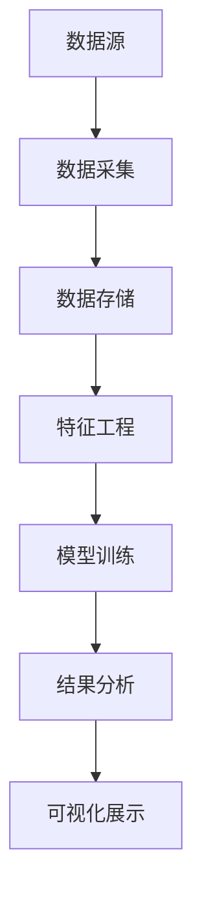

                 


## 《AI驱动的价值投资组合压力测试优化》

### 关键词：人工智能，投资组合，压力测试，机器学习，风险管理，金融建模

### 摘要：本文探讨了人工智能在价值投资组合压力测试中的应用，通过详细分析AI算法、系统架构和实际案例，展示了如何利用AI优化投资组合的风险评估，提升压力测试的效率和准确性。

---

# 引言

在金融领域，压力测试是评估投资组合在极端市场条件下的表现的关键工具。传统方法依赖于历史数据和假设情景，而人工智能的引入显著提升了压力测试的精确性和效率。本文将系统地介绍AI驱动的压力测试优化方法，从基础概念到实际应用，帮助读者理解其原理和优势。

---

## 第一部分：背景与概述

### 第1章：AI驱动的压力测试概述

#### 1.1 价值投资组合与压力测试

- **价值投资组合**：指通过基本面分析选择低估资产，长期持有的投资策略。其核心在于识别被市场低估的企业，长期获得超额收益。
- **压力测试的重要性**：通过模拟极端市场环境，评估投资组合在不利条件下的表现，确保其稳健性。
- **AI的优势**：利用机器学习算法，AI能够处理海量数据，识别复杂模式，提供更精准的压力测试结果。

#### 1.2 人工智能在金融中的应用

- **机器学习**：在金融数据中的应用，如预测市场趋势、评估信用风险。
- **自然语言处理（NLP）**：分析新闻、财报，辅助投资决策。
- **强化学习**：用于算法交易，优化投资策略。

#### 1.3 本书的目标与结构

- **目标**：提供AI驱动压力测试的理论基础和实践指导。
- **结构**：从基础概念到算法实现，再到系统架构，逐步展开。

---

## 第二部分：AI驱动压力测试的核心概念

### 第2章：机器学习基础

#### 2.1 机器学习的基本概念

- **监督学习**：通过标记数据训练模型，预测新数据。例如，线性回归用于预测资产价格。
- **无监督学习**：识别数据中的模式，如聚类分析用于客户分群。
- **强化学习**：通过试错优化决策，应用于动态投资组合调整。

#### 2.2 投资组合分析的基础

- **风险与收益**：投资组合的风险由波动性、VaR、CVaR等指标衡量。
- **压力测试的数学模型**：传统方法包括历史情景测试和情景分析。

#### 2.3 AI驱动压力测试的方法

- **机器学习模型**：如随机森林用于预测市场崩盘的概率。
- **深度学习**：神经网络识别复杂市场信号，优化压力测试模型。

### 第3章：压力测试方法与AI结合

#### 3.1 传统压力测试方法

- **历史情景测试**：基于历史事件模拟极端情况。
- **情景分析法**：人为设定情景，评估投资组合表现。
- **方差-协方差法**：基于资产波动性和相关性评估风险。

#### 3.2 AI驱动的压力测试方法

- **基于机器学习的风险预测**：利用历史数据预测极端市场事件。
- **深度学习的应用**：神经网络处理非结构化数据，如新闻文本，预测市场走势。
- **强化学习优化投资组合**：通过试错调整投资组合，降低风险。

---

## 第三部分：算法与数学模型

### 第4章：AI驱动压力测试的算法实现

#### 4.1 常用算法概述

- **线性回归**：用于资产价格预测。
- **支持向量机（SVM）**：分类市场状态。
- **随机森林**：集成学习，预测市场崩盘概率。

#### 4.2 算法流程图

- **数据预处理**：清洗、特征提取。
- **模型训练**：选择算法，调整参数。
- **结果评估**：准确率、召回率等指标评估模型性能。

### 第5章：数学模型与公式

#### 5.1 投资组合风险模型

- **风险价值（VaR）**：
  $$ VaR = \mu + z \times \sigma $$
  其中，$\mu$ 是平均回报，$z$ 是标准正态分布的分位数，$\sigma$ 是标准差。
- **条件风险价值（CVaR）**：
  $$ CVaR = \frac{1}{1-\alpha} \sum_{i=\alpha}^{n} (x_i - \mu) $$
  其中，$\alpha$ 是置信水平，$x_i$ 是排序后的数据点。

#### 5.2 压力测试的数学模型

- **蒙特卡洛模拟**：
  $$ P(L \leq x) = \frac{1}{N} \sum_{i=1}^{N} I(L_i \leq x) $$
  其中，$L_i$ 是第$i$次模拟的损失，$I$ 是指示函数。

---

## 第四部分：系统架构与实现

### 第6章：系统架构设计

#### 6.1 数据流与模块划分

- **数据采集模块**：收集市场数据、新闻等。
- **特征工程模块**：提取关键特征，如波动率、相关性。
- **模型训练模块**：训练机器学习模型，进行压力测试。
- **结果展示模块**：可视化压力测试结果。

#### 6.2 系统架构图



#### 6.3 系统接口设计

- **输入接口**：接收市场数据和参数。
- **输出接口**：提供压力测试结果和报告。

---

## 第五部分：项目实战

### 第7章：项目实战与案例分析

#### 7.1 环境安装

- **Python环境**：安装Anaconda。
- **依赖库**：安装numpy、pandas、scikit-learn、keras等。

#### 7.2 核心代码实现

```python
import numpy as np
import pandas as pd
from sklearn.ensemble import RandomForestClassifier
from sklearn.metrics import accuracy_score

# 数据加载
data = pd.read_csv('market_data.csv')
X = data.drop('target', axis=1)
y = data['target']

# 数据分割
X_train, X_test, y_train, y_test = train_test_split(X, y, test_size=0.2)

# 模型训练
model = RandomForestClassifier(n_estimators=100)
model.fit(X_train, y_train)

# 模型评估
y_pred = model.predict(X_test)
print("准确率:", accuracy_score(y_test, y_pred))
```

#### 7.3 案例分析

- **案例背景**：2020年新冠疫情对投资组合的影响。
- **模型应用**：利用AI预测市场崩盘，优化投资组合，降低损失。

---

## 第六部分：高级主题与扩展

### 第8章：AI驱动压力测试的高级主题

#### 8.1 模型解释性

- **可解释性问题**：黑箱模型的解释性不足。
- **解决方案**：使用SHAP值分析模型决策。

#### 8.2 模型的鲁棒性与可扩展性

- **鲁棒性**：模型在数据分布变化中的表现。
- **可扩展性**：处理更大规模数据的能力。

#### 8.3 结合区块链技术

- **数据安全**：区块链确保数据完整性和隐私性。
- **智能合约**：自动化执行投资策略。

---

## 结论与展望

AI驱动的价值投资组合压力测试优化显著提升了金融风险管理的效率和准确性。通过机器学习、深度学习和强化学习等技术，投资者能够更精准地评估投资组合在极端情况下的表现。未来，随着AI技术的进一步发展，压力测试将更加智能化，助力金融市场的稳健发展。

---

以上内容涵盖了从基础概念到系统实现的各个方面，为读者提供了全面的指导和深入的分析。

