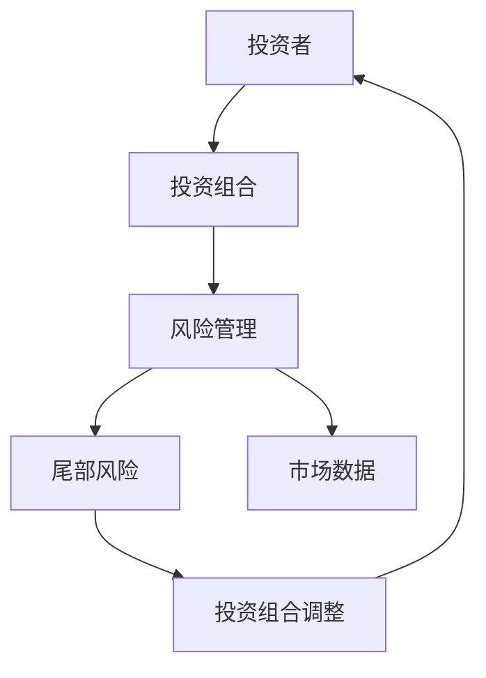
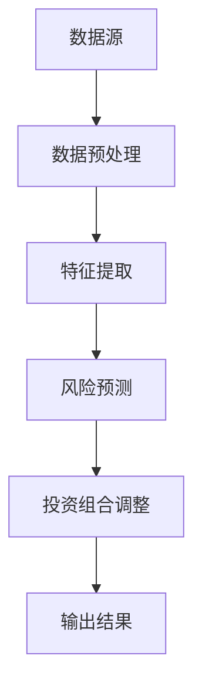
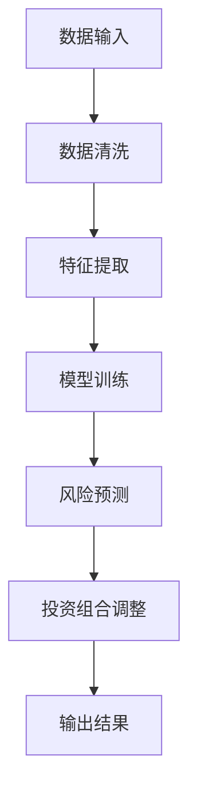
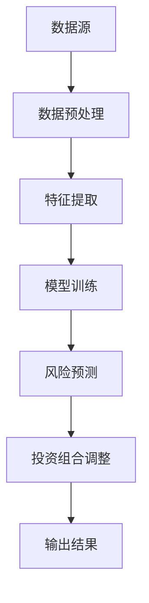

                 


# AI驱动的价值投资组合尾部风险管理

**关键词**：价值投资、风险管理、人工智能、尾部风险、投资组合优化、量化分析

**摘要**：  
本文深入探讨了如何利用人工智能技术优化投资组合的尾部风险管理。通过结合金融学理论和机器学习算法，提出了一种基于AI的尾部风险识别与控制方法，旨在提升投资组合的稳健性和抗风险能力。文章从背景介绍、核心概念、算法原理、系统架构到项目实战，全面阐述了AI驱动的价值投资组合风险管理的实现路径和应用价值。

---

# 第一部分：AI驱动的价值投资组合尾部风险管理背景介绍

## 第1章：问题背景与问题描述

### 1.1 投资组合风险管理的重要性  
#### 1.1.1 投资组合风险管理的基本概念  
投资组合风险管理是指通过分析和控制投资组合中的各种风险因素，以实现风险最小化和收益最大化的管理过程。  
#### 1.1.2 尾部风险管理的定义与特征  
尾部风险管理是指在投资组合中识别和控制那些可能导致重大损失的极端事件风险。尾部风险具有低概率、高影响的特征，传统方法难以有效捕捉和应对。  
#### 1.1.3 尾部风险对投资组合的影响  
尾部风险事件（如市场崩盘、黑天鹅事件等）往往会对投资组合造成毁灭性打击，因此尾部风险管理是投资组合管理中的重中之重。  

### 1.2 传统尾部风险管理的局限性  
#### 1.2.1 传统风险管理方法的优缺点  
传统方法依赖历史数据分析和统计模型，但难以捕捉非线性关系和复杂市场动态。  
#### 1.2.2 尾部风险事件的不可预测性  
尾部风险事件往往具有突发性和不可预测性，传统方法在极端情况下表现不佳。  
#### 1.2.3 传统方法在极端事件中的失效问题  
传统方法通常假设市场符合正态分布，但现实中尾部事件的概率远高于正态分布的预测值。  

## 第2章：问题解决与边界外延  

### 2.1 AI技术在风险管理中的应用潜力  
#### 2.1.1 机器学习在风险预测中的优势  
机器学习能够处理海量数据，发现非线性关系，提高风险预测的准确性。  
#### 2.1.2 自然语言处理在市场情绪分析中的作用  
NLP技术可以实时分析新闻、社交媒体等非结构化数据，捕捉市场情绪变化。  
#### 2.1.3 深度学习在复杂风险建模中的应用  
深度学习模型能够捕捉复杂的市场动态，提高对尾部风险的识别能力。  

### 2.2 AI驱动尾部风险管理的核心要素  
#### 2.2.1 数据驱动的特征提取  
通过AI技术提取投资组合中潜在的尾部风险特征，如波动率、相关性等。  
#### 2.2.2 智能算法的风险预测  
利用机器学习算法预测尾部风险事件的发生概率和影响程度。  
#### 2.2.3 自适应优化的投资组合调整  
基于AI的风险预测结果，动态调整投资组合，降低尾部风险的影响。  

### 2.3 问题的边界与外延  
#### 2.3.1 AI驱动风险管理的适用范围  
适用于复杂金融市场的尾部风险识别与控制，但对某些特定市场或资产可能效果有限。  
#### 2.3.2 方法的局限性与适用场景  
AI方法依赖数据质量和模型训练，可能在数据不足或模型过拟合的情况下表现不佳。  
#### 2.3.3 与其他风险管理方法的结合  
AI方法可以与传统方法结合，形成互补优势，提升整体风险管理能力。  

## 第3章：核心概念与概念结构  

### 3.1 核心概念的定义与属性  
#### 3.1.1 AI驱动风险管理的定义  
通过人工智能技术对投资组合中的尾部风险进行识别、预测和控制。  
#### 3.1.2 尾部风险的识别与预测  
利用机器学习模型识别潜在的尾部风险事件，并预测其发生概率。  
#### 3.1.3 投资组合优化的目标  
通过动态调整投资组合，降低尾部风险对投资组合的负面影响。  

### 3.2 核心概念的属性特征对比  

| 特性       | 传统方法         | AI驱动方法         |
|------------|------------------|--------------------|
| 数据依赖   | 依赖历史数据     | 依赖实时数据和非结构化数据 |
| 模型假设   | 假设市场正态分布 | 不依赖正态分布假设   |
| 预测能力   | 低准确性         | 高准确性           |
| 反应速度   | 较慢            | 快速               |

### 3.3 实体关系图  



---

# 第二部分：AI驱动的价值投资组合尾部风险管理的核心概念与联系

## 第4章：AI驱动风险管理的核心原理  

### 4.1 机器学习在尾部风险管理中的应用  
#### 4.1.1 无监督学习的特征提取  
使用聚类算法识别投资组合中潜在的尾部风险特征。  
#### 4.1.2 监督学习的风险预测  
基于历史数据训练分类模型，预测尾部风险事件的发生概率。  

### 4.2 深度学习在复杂市场建模中的优势  
#### 4.2.1 卷积神经网络（CNN）在时间序列分析中的应用  
利用CNN捕捉市场数据中的时空关联性。  
#### 4.2.2 循环神经网络（RNN）在序列预测中的优势  
利用RNN预测市场趋势和风险事件。  

### 4.3 自然语言处理（NLP）在市场情绪分析中的作用  
#### 4.3.1 文本数据的特征提取  
通过NLP技术分析新闻、社交媒体等文本数据，提取市场情绪指标。  
#### 4.3.2 市场情绪与尾部风险的关系  
市场情绪可以作为尾部风险的重要预测因子。  

## 第5章：AI驱动风险管理的系统架构设计  

### 5.1 系统功能设计  
#### 5.1.1 数据采集模块  
从多种数据源（如股票价格、新闻、社交媒体等）获取实时数据。  
#### 5.1.2 特征提取模块  
利用AI算法提取投资组合中的尾部风险特征。  
#### 5.1.3 风险预测模块  
基于机器学习模型预测尾部风险事件的发生概率。  
#### 5.1.4 投资组合调整模块  
根据风险预测结果，动态调整投资组合，降低尾部风险的影响。  

### 5.2 系统架构图  



---

# 第三部分：AI驱动的价值投资组合尾部风险管理的算法原理

## 第6章：AI驱动风险管理的算法实现  

### 6.1 算法流程图  



### 6.2 算法实现的数学模型  

#### 6.2.1 风险预测模型  
$$ P(\text{尾部风险发生}) = f(X) $$  
其中，$X$ 是输入特征，$f$ 是机器学习模型。  

#### 6.2.2 投资组合优化模型  
$$ \text{目标函数} = \min \{ w^T \Sigma w \} $$  
$$ \text{约束条件} = \sum w_i = 1 $$  
其中，$w$ 是投资权重，$\Sigma$ 是协方差矩阵。  

---

# 第四部分：AI驱动的价值投资组合尾部风险管理的系统架构设计

## 第7章：系统分析与架构设计方案  

### 7.1 系统应用场景  
#### 7.1.1 金融市场的实时风险管理  
通过AI系统实时监控市场动态，快速识别尾部风险。  
#### 7.1.2 投资组合的动态调整  
根据AI预测结果，动态调整投资组合，降低尾部风险影响。  

### 7.2 系统功能设计  

#### 7.2.1 数据采集模块  
- 从多种数据源获取实时数据，包括股票价格、新闻、社交媒体等。  
#### 7.2.2 特征提取模块  
- 使用NLP技术提取文本特征，使用统计方法提取数值特征。  
#### 7.2.3 模型训练模块  
- 使用机器学习算法训练尾部风险预测模型。  
#### 7.2.4 投资组合调整模块  
- 根据预测结果，优化投资组合权重。  

### 7.3 系统架构图  



---

# 第五部分：AI驱动的价值投资组合尾部风险管理的项目实战

## 第8章：项目实战  

### 8.1 环境安装与配置  
- 安装Python、TensorFlow、Keras、Numpy、Pandas等工具。  

### 8.2 核心代码实现  

#### 8.2.1 数据预处理代码  

```python
import pandas as pd
import numpy as np

# 读取数据
data = pd.read_csv('market_data.csv')

# 数据清洗
data = data.dropna()
data = data.iloc[:1000]  # 取前1000条数据
```

#### 8.2.2 特征提取代码  

```python
from sklearn.feature_extraction.text import TfidfVectorizer

# 文本特征提取
vectorizer = TfidfVectorizer()
text_features = vectorizer.fit_transform(data['news'])
```

#### 8.2.3 模型训练代码  

```python
from sklearn.ensemble import RandomForestClassifier

# 训练模型
model = RandomForestClassifier()
model.fit(X_train, y_train)
```

#### 8.2.4 风险预测代码  

```python
# 预测尾部风险概率
y_pred = model.predict_proba(X_test)
```

### 8.3 代码解读与分析  
- 数据预处理：清洗数据，提取特征。  
- 模型训练：使用随机森林算法训练尾部风险预测模型。  
- 风险预测：基于模型预测尾部风险概率。  

### 8.4 实际案例分析  
- 假设市场发生黑天鹅事件，AI系统能够提前识别并触发预警，帮助投资者及时调整投资组合。  

---

# 第六部分：AI驱动的价值投资组合尾部风险管理的最佳实践

## 第9章：最佳实践  

### 9.1 小结  
AI技术在尾部风险管理中的应用具有显著优势，能够提高风险预测的准确性和投资组合的稳健性。  

### 9.2 注意事项  
- 数据质量对模型性能影响重大，需确保数据的完整性和准确性。  
- 模型的可解释性是实际应用中的重要考量，需避免“黑箱”模型。  
- 需结合市场实际情况，动态调整模型和策略。  

### 9.3 拓展阅读  
- 《机器学习在金融风险管理中的应用》  
- 《深度学习与投资组合优化》  

---

通过以上分析，我们可以看到，AI技术在价值投资组合尾部风险管理中的应用潜力巨大。未来，随着技术的不断发展，AI驱动的风险管理将在金融领域发挥越来越重要的作用。

