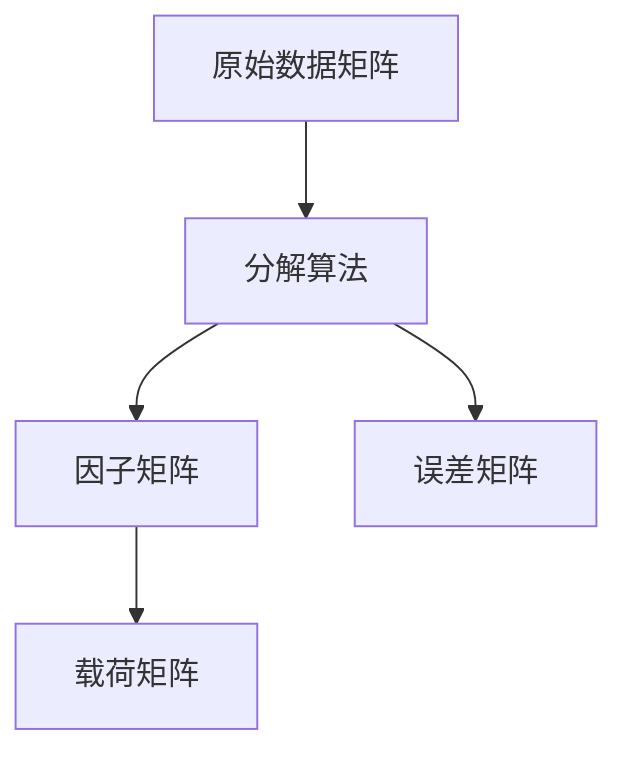
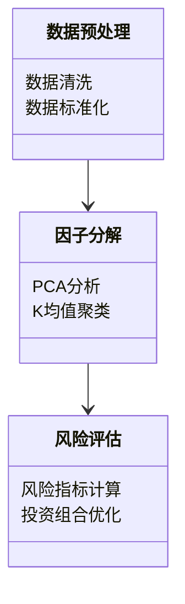
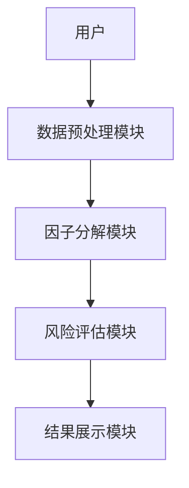
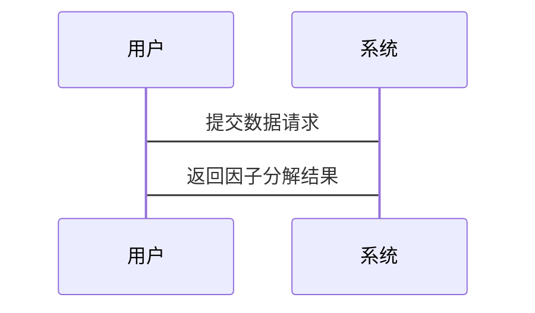

                 


# AI驱动的价值投资风险因子分解

## 关键词：价值投资、风险因子、人工智能、因子分解、投资组合

## 摘要：本文详细探讨了AI在价值投资中的应用，特别是如何通过风险因子分解来优化投资决策。文章从背景介绍、核心概念、算法原理、系统设计到项目实战，系统地分析了AI驱动的风险因子分解方法，结合实际案例，展示了如何利用这些方法提升投资组合的管理效率和风险控制能力。

---

# 第1章 价值投资与风险因子概述

## 1.1 价值投资的基本概念

### 1.1.1 价值投资的定义
价值投资是一种投资策略，强调购买那些市场价格低于其内在价值的股票，长期持有，等待其价值回归。这种方法的核心在于识别被市场低估的资产。

### 1.1.2 价值投资的核心理念
- **内在价值**：资产的真实价值，不完全取决于市场情绪。
- **安全边际**：购买价格低于内在价值，以降低风险。
- **长期视角**：关注企业的长期表现，而非短期波动。

### 1.1.3 价值投资与其它投资策略的区别
- **技术分析**：基于价格和成交量的短期波动。
- **趋势投资**：跟随市场趋势进行买卖。
- **价值投资**：侧重于基本面分析，寻找低估资产。

## 1.2 风险因子的基本概念

### 1.2.1 风险因子的定义
风险因子是影响资产价格波动的因素，反映了资产对系统性风险的敏感性。例如，市场整体波动、利率变化、通货膨胀等。

### 1.2.2 风险因子的分类
- **系统性风险**：影响整个市场的因素，如经济衰退。
- **非系统性风险**：特定于个别资产或行业的风险。

### 1.2.3 风险因子在投资中的作用
通过分解风险因子，投资者可以识别和量化不同风险来源，从而优化投资组合，降低整体风险。

## 1.3 AI驱动的分析方法

### 1.3.1 AI在金融分析中的应用
- 数据挖掘：从大量数据中提取有用信息。
- 预测模型：利用机器学习预测市场趋势。
- 自动化交易：基于AI算法进行实时交易决策。

### 1.3.2 AI驱动的风险因子分析的优势
- 高效性：快速处理和分析大量数据。
- 精准性：通过复杂算法捕捉细微的风险因素。
- 智能性：能够适应市场变化，动态调整分析模型。

### 1.3.3 AI驱动的价值投资的未来趋势
随着AI技术的不断发展，价值投资将更加依赖于数据驱动的决策，AI在风险因子分解中的应用将更加广泛和深入。

---

# 第2章 风险因子分解的核心方法

## 2.1 统计套利方法

### 2.1.1 统计套利的定义
统计套利是一种利用资产价格短期偏离均值的策略，通过同时买入低估资产和卖出高估资产来获利。

### 2.1.2 统计套利的核心步骤
1. 数据收集：获取相关资产的历史价格数据。
2. 计算价差：确定资产之间的相对价差。
3. 建立模型：识别价差回归均值的可能性。
4. 执行交易：在价差偏离较大时进行买卖。

### 2.1.3 统计套利与风险因子分解的关系
统计套利利用了资产之间的相关性，而风险因子分解则进一步分析这些相关性的来源，帮助识别潜在的风险因素。

## 2.2 机器学习方法

### 2.2.1 机器学习在风险因子分解中的应用
- **监督学习**：用于分类和回归问题，如预测资产的信用风险。
- **无监督学习**：用于聚类分析，发现数据中的隐含结构。

### 2.2.2 常见的机器学习算法及其特点

| 算法名称 | 特点 | 应用场景 |
|----------|------|----------|
| 主成分分析（PCA） | 降维技术，提取主要因素 | 用于识别资产的主要风险来源 |
| K均值聚类 | 分组技术，发现数据中的自然分组 | 用于将资产分为不同类别，分析其风险特征 |
| 线性回归 | 预测关系 | 预测资产价格与风险因子的关系 |

### 2.2.3 机器学习方法的优势
- **灵活性**：能够适应复杂的数据模式。
- **高效性**：处理大量数据时表现优异。
- **准确性**：通过特征提取和模型优化，提高风险因子识别的准确性。

---

# 第3章 算法原理讲解

## 3.1 矩阵分解方法

### 3.1.1 矩阵分解的定义
矩阵分解是将一个矩阵分解为多个低维矩阵的乘积，常用于降维和特征提取。

### 3.1.2 矩阵分解的核心步骤



### 3.1.3 矩阵分解的数学模型

$$ X = U \Sigma V^T $$

其中：
- \( X \) 是原始数据矩阵。
- \( U \) 是左奇异向量矩阵。
- \( \Sigma \) 是奇异值对角矩阵。
- \( V^T \) 是右奇异向量矩阵转置。

---

# 第4章 系统分析与架构设计方案

## 4.1 项目场景介绍

### 4.1.1 项目目标
开发一个基于AI的风险因子分解系统，帮助投资者优化投资组合，降低风险。

### 4.1.2 项目范围
- 数据收集与预处理
- 风险因子分解算法实现
- 投资组合优化与风险评估

## 4.2 系统功能设计

### 4.2.1 领域模型



### 4.2.2 系统架构设计



## 4.3 接口设计与交互流程

### 4.3.1 接口设计



---

# 第5章 项目实战

## 5.1 环境安装

### 5.1.1 安装必要的库
```bash
pip install numpy pandas scikit-learn matplotlib
```

## 5.2 核心代码实现

### 5.2.1 数据预处理

```python
import numpy as np
import pandas as pd

# 示例数据加载
data = pd.read_csv('assets.csv')

# 数据清洗
data.dropna()
data = data.astype(float)

# 数据标准化
data_normalized = (data - data.mean()) / data.std()
```

### 5.2.2 因子分解实现

```python
from sklearn.decomposition import PCA

# PCA分解
pca = PCA(n_components=3)
principal_components = pca.fit_transform(data_normalized)

print("主成分个数：", pca.n_components_)
print("方差贡献率：", pca.explained_variance_ratio_)
```

## 5.3 案例分析与结果解读

### 5.3.1 案例分析

假设我们有一个包含10只股票的数据集，我们进行了PCA分解，提取了3个主成分。分析结果显示，第一个主成分解释了60%的方差，第二个解释了25%，第三个解释了10%。这表明前两个主成分是主要的风险因子。

### 5.3.2 结果解读
通过主成分分析，我们识别出主要影响资产风险的因素，从而可以优化投资组合，降低整体风险。

---

# 第6章 总结与展望

## 6.1 总结
本文详细探讨了AI在价值投资中的应用，特别是风险因子分解的方法。通过统计套利和机器学习技术，我们可以更高效、准确地识别和管理投资风险。

## 6.2 未来展望
随着AI技术的不断进步，风险因子分解将更加智能化和自动化。未来的研究方向可能包括更复杂的模型和多模态数据的分析。

## 6.3 最佳实践 tips
- 数据质量是关键，确保数据准确和完整。
- 定期调优模型，适应市场变化。
- 结合多策略进行风险控制，降低投资组合的波动性。

---

通过以上步骤，您可以系统地理解和应用AI驱动的价值投资风险因子分解方法，提升投资决策的科学性和有效性。

