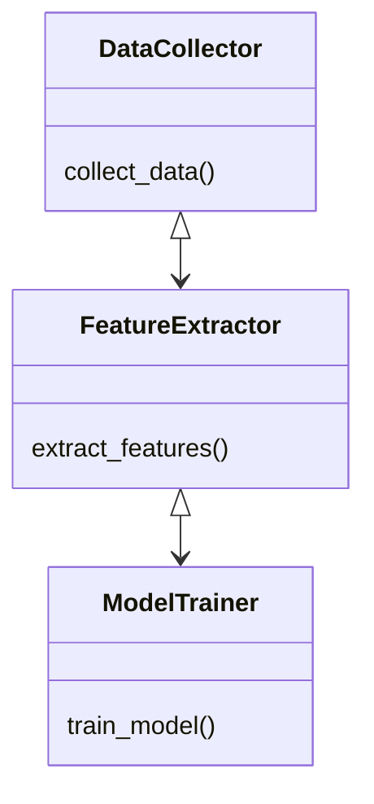
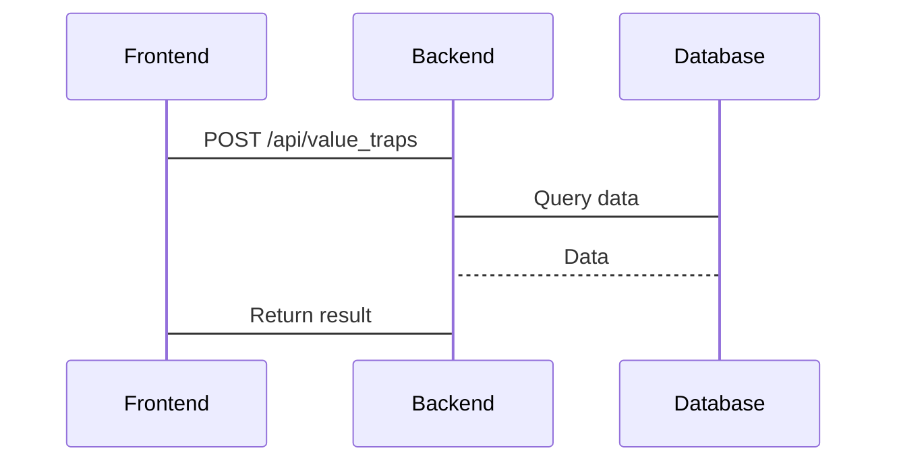

                 


## 《AI驱动的价值陷阱识别与规避》

---

### 关键词：
AI驱动，价值陷阱，风险识别，机器学习，金融分析

---

### 摘要：
本文探讨了利用人工智能技术识别和规避价值陷阱的方法，通过分析价值陷阱的定义、分类及AI的优势，结合数据特征分析、模式识别和风险预测模型，详细讲解了AI在识别价值陷阱中的应用。文章还通过对比传统方法和AI方法，提供了系统设计、算法实现和实战案例，帮助读者掌握利用AI技术进行价值陷阱识别的能力。

---

### 第5章：算法原理

#### 5.1 监督学习算法
在监督学习中，我们使用有标签的数据来训练模型，以识别价值陷阱。以下是一个典型的分类任务的Python代码示例：

```python
import pandas as pd
from sklearn.model_selection import train_test_split
from xgboost import XGBClassifier
from sklearn.metrics import accuracy_score

# 加载数据
data = pd.read_csv('value_traps.csv')
X = data.drop('is_trap', axis=1)
y = data['is_trap']

# 数据分割
X_train, X_test, y_train, y_test = train_test_split(X, y, test_size=0.2, random_state=42)

# 训练模型
model = XGBClassifier()
model.fit(X_train, y_train)

# 预测与评估
y_pred = model.predict(X_test)
print("Accuracy:", accuracy_score(y_test, y_pred))
```

**模型评估：**
- 准确率（Accuracy）：模型正确预测的比例。
- 精确率（Precision）：预测为陷阱的样本中实际确实是陷阱的比例。
- 召回率（Recall）：实际为陷阱的样本中被正确预测的比例。

数学模型中，XGBoost使用的是正则化的损失函数：

$$
\text{Loss} = \sum_{i=1}^{n} [ -\log(p_i) - \log(1-p_i) ]
$$

其中，\( p_i \) 是样本i的预测概率。

#### 5.2 无监督学习算法
无监督学习适用于无标签数据，常用聚类算法识别潜在陷阱。以下是K-Means的实现：

```python
from sklearn.cluster import KMeans
from sklearn.metrics import silhouette_score

# 加载数据
data = pd.read_csv('value_traps.csv')
X = data.drop('is_trap', axis=1)

# 聚类分析
model = KMeans(n_clusters=2, random_state=42)
model.fit(X)

# 评估聚类效果
score = silhouette_score(X, model.labels_)
print("Silhouette Score:", score)
```

**数学模型：**
K-Means的目标是最小化平方误差：

$$
\text{Error} = \sum_{i=1}^{k} \sum_{j=1}^{n_i} (x_j - c_i)^2
$$

其中，\( k \) 是聚类数，\( n_i \) 是第i个聚类的样本数，\( c_i \) 是第i个聚类的中心。

---

### 第6章：系统设计

#### 6.1 项目背景与目标
我们开发一个AI驱动的价值陷阱识别系统，旨在帮助投资者识别潜在风险。系统目标包括：
- 实时监控市场数据。
- 自动识别价值陷阱。
- 提供规避建议。

#### 6.2 功能设计
- 数据采集模块：收集财务数据、市场数据。
- 特征提取模块：提取关键特征如财务指标、市场指标。
- 模型训练模块：训练分类模型。

**领域模型类图：**


#### 6.3 系统架构设计
- 前端：数据可视化界面。
- 后端：API接口，接收请求并返回结果。
- 数据层：存储原始数据和模型。

**系统架构图：**


#### 6.4 接口设计与交互流程
- API接口：`POST /api/value_traps`
- 数据流：
  1. 前端发送查询请求。
  2. 后端处理数据并返回结果。

**交互流程图：**


---

### 第7章：实战分析

#### 7.1 环境安装
安装必要的库：
```bash
pip install pandas scikit-learn xgboost
```

#### 7.2 核心代码实现
以下是价值陷阱识别的代码实现：

```python
import pandas as pd
from sklearn.model_selection import train_test_split
from xgboost import XGBClassifier
from sklearn.metrics import classification_report

# 加载数据
data = pd.read_csv('value_traps.csv')
X = data.drop('is_trap', axis=1)
y = data['is_trap']

# 数据分割
X_train, X_test, y_train, y_test = train_test_split(X, y, test_size=0.2, random_state=42)

# 训练模型
model = XGBClassifier()
model.fit(X_train, y_train)

# 预测与评估
y_pred = model.predict(X_test)
print(classification_report(y_test, y_pred))
```

**代码解读：**
- 数据加载：读取CSV文件。
- 数据分割：将数据分为训练集和测试集。
- 模型训练：使用XGBoost训练分类器。
- 模型评估：输出分类报告，包括准确率、精确率、召回率。

#### 7.3 实际案例分析
假设我们分析一家公司的财务数据，模型预测其为价值陷阱。通过特征重要性分析，发现现金流和收入增长率异常，提示潜在风险。

---

### 第8章：最佳实践

#### 8.1 小结
本文详细介绍了AI在识别价值陷阱中的应用，从算法原理到系统设计，再到实战分析，提供了全面的方法论。

#### 8.2 注意事项
- 数据质量：确保数据准确无误。
- 模型调优：选择合适的参数和算法。
- 持续学习：定期更新模型，适应市场变化。

#### 8.3 未来趋势
- 结合NLP技术，分析新闻和报告。
- 利用强化学习，优化投资策略。

---

### 总结
通过AI技术，我们可以更高效地识别和规避价值陷阱，提升投资决策的准确性。本文提供了从理论到实践的全面指导，帮助读者掌握这一前沿技术。

