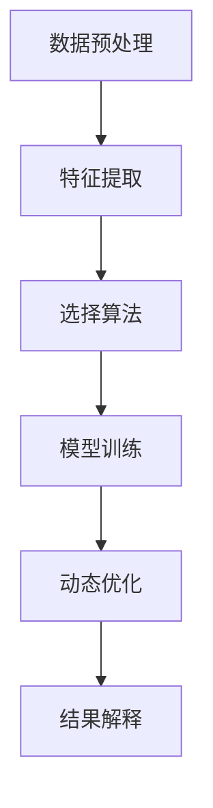
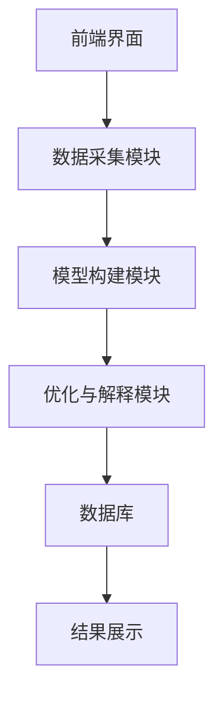
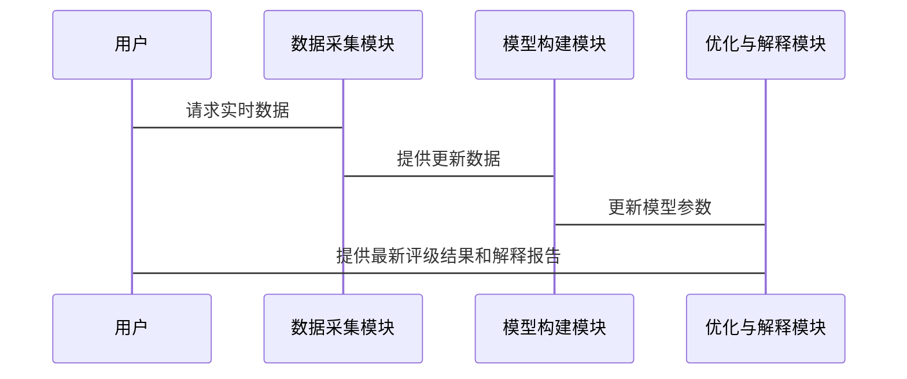

                 


# 《AI驱动的企业信用评级模型可解释性动态优化系统》

## 关键词：AI驱动、企业信用评级、可解释性、动态优化系统、机器学习、信用评分、金融风险

## 摘要：  
随着人工智能技术的快速发展，企业信用评级模型在金融领域的重要性日益凸显。传统的信用评级模型存在诸多局限性，例如可解释性差、动态适应性不足等。本文深入探讨了如何利用AI技术构建一个可解释性动态优化的企业信用评级系统，结合机器学习算法和动态优化策略，解决了传统模型的痛点，提高了信用评级的准确性和实时性。通过系统的架构设计、算法实现和实际案例分析，展示了该系统的优越性和应用前景。

---

# 第一部分：AI驱动的企业信用评级模型概述

# 第1章：企业信用评级模型的背景与挑战

## 1.1 企业信用评级的定义与意义  
### 1.1.1 企业信用评级的基本概念  
企业信用评级是通过对企业财务状况、经营能力、偿债能力等多维度的分析，对其信用风险进行量化评估的过程。信用评级结果直接影响企业的融资成本和市场信任度。  

### 1.1.2 信用评级在金融领域的核心作用  
- 为金融机构提供风险评估依据。  
- 降低金融交易中的不确定性。  
- 优化资源配置，促进市场健康发展。  

### 1.1.3 企业信用评级的重要性与挑战  
- 信用评级是企业融资的重要门槛。  
- 传统评级方法依赖人工经验，效率低且主观性强。  
- 随着经济环境的快速变化，静态模型难以适应动态风险。  

---

## 1.2 传统信用评级模型的局限性  
### 1.2.1 传统信用评级模型的特点  
- 主要依赖财务指标和历史数据。  
- 评级过程复杂且耗时。  
- 无法实时捕捉市场动态变化。  

### 1.2.2 传统模型的局限性与不足  
- 可解释性差：复杂的计算过程难以向企业解释评级结果。  
- 动态适应性弱：难以应对市场环境的快速变化。  
- 数据维度有限：无法充分利用非结构化数据（如文本、图像）。  

### 1.2.3 传统模型在实际应用中的问题  
- 评级结果可能滞后于实际情况。  
- 人工干预过多，主观性较强。  
- 高昂的评估成本限制了其广泛应用。  

---

## 1.3 AI驱动的信用评级模型的优势  
### 1.3.1 AI技术在信用评级中的应用潜力  
- 数据处理能力强：可以处理海量结构化和非结构化数据。  
- 自动学习能力：能够从数据中提取复杂特征。  
- 实时性高：可以动态更新模型，适应市场变化。  

### 1.3.2 AI驱动模型的核心优势  
- 可解释性增强：通过算法透明化，提供更直观的解释。  
- 动态优化能力强：能够实时调整模型参数，提升准确性。  
- 效率大幅提升：自动化处理流程显著降低人工成本。  

### 1.3.3 AI驱动模型的未来发展  
- 结合区块链技术，提升信用数据的安全性和可信度。  
- 利用自然语言处理（NLP）技术，分析非结构化数据，如企业新闻、社交媒体信息。  
- 结合物联网（IoT）数据，实时监控企业的运营状况。  

---

## 1.4 本章小结  
本章通过分析企业信用评级的背景、传统模型的局限性以及AI驱动模型的优势，为后续章节的探讨奠定了基础。AI驱动的信用评级模型通过技术革新，解决了传统模型的痛点，为金融行业带来了新的发展机遇。

---

# 第2章：可解释性动态优化系统的核心概念  

## 2.1 可解释性动态优化系统的定义  
### 2.1.1 可解释性的定义与重要性  
可解释性是指模型的决策过程和结果能够被人类理解。在信用评级中，可解释性是确保企业信任和合规性的关键。  

### 2.1.2 动态优化的基本概念  
动态优化是指系统能够根据实时数据和环境变化，自动调整模型参数，以提升预测精度和适应性。  

### 2.1.3 系统的核心目标  
- 实时更新模型，捕捉市场动态变化。  
- 提供可解释的决策依据，增强用户信任。  
- 优化评级结果，降低金融风险。  

---

## 2.2 可解释性动态优化系统的组成  
### 2.2.1 数据采集模块  
- 采集企业财务数据、市场数据、行业趋势等多源数据。  
- 处理非结构化数据，如新闻、社交媒体信息。  

### 2.2.2 模型构建模块  
- 基于机器学习算法，构建基础信用评级模型。  
- 引入可解释性解释方法（如SHAP值），确保模型决策的透明性。  

### 2.2.3 优化与解释模块  
- 根据实时数据，动态调整模型参数，优化预测结果。  
- 提供可视化解释报告，帮助用户理解评级结果。  

---

## 2.3 系统的核心原理  
### 2.3.1 数据驱动的动态优化  
- 系统通过实时数据流，不断更新模型参数，确保评级结果的动态适应性。  
- 使用反馈机制，根据实际结果调整模型权重。  

### 2.3.2 AI算法的可解释性实现  
- 采用可解释性机器学习算法（如线性回归、逻辑回归）。  
- 使用SHAP值或LIME方法，直观展示每个特征对评级结果的影响。  

### 2.3.3 系统的实时更新机制  
- 设置数据更新频率，定期重新训练模型。  
- 采用增量学习方法，实时更新模型参数。  

---

## 2.4 本章小结  
本章详细介绍了可解释性动态优化系统的核心概念，包括系统的组成、工作原理和优化机制。通过数据驱动和AI技术的结合，系统实现了信用评级的动态优化和可解释性，为后续章节的实现提供了理论基础。

---

# 第3章：可解释性动态优化系统的算法原理  

## 3.1 基于机器学习的信用评级模型  
### 3.1.1 机器学习在信用评级中的应用  
- 监督学习：用于分类（如违约与非违约）和回归（如信用评分）。  
- 无监督学习：用于聚类分析，发现潜在风险群体。  

### 3.1.2 常见的机器学习算法选择  
- 线性回归：简单直观，适合线性关系。  
- 逻辑回归：适用于二分类问题。  
- 支持向量机（SVM）：适合高维数据分类。  
- 随机森林：通过特征重要性提供可解释性。  

---

## 3.2 动态优化算法的实现  
### 3.2.1 动态优化的基本原理  
- 在线学习：模型在数据流中实时更新。  
- 参数优化：通过梯度下降等方法调整权重。  

### 3.2.2 基于梯度下降的优化方法  
- 使用小批量梯度下降（SGD），提升优化效率。  
- 调整学习率，平衡收敛速度和精度。  

### 3.2.3 参数更新策略  
- 定期保存模型快照，便于回溯和比较。  
- 设置更新频率，平衡实时性和计算成本。  

---

## 3.3 算法实现的Mermaid流程图  


---

## 3.4 算法实现的Python代码示例  
```python
import pandas as pd
from sklearn.model_selection import train_test_split
from sklearn.ensemble import RandomForestClassifier
from sklearn.metrics import accuracy_score
from sklearn.inspection import permutation_importance

# 加载数据
data = pd.read_csv('credit_data.csv')
X = data.drop('target', axis=1)
y = data['target']

# 数据分割
X_train, X_test, y_train, y_test = train_test_split(X, y, test_size=0.2)

# 模型训练
model = RandomForestClassifier()
model.fit(X_train, y_train)

# 模型预测
y_pred = model.predict(X_test)
print("准确率:", accuracy_score(y_test, y_pred))

# 特征重要性分析
result = permutation_importance(model, X_test, y_test, n_repeats=10)
importance = result.importances_mean
print("特征重要性:", importance)
```

---

## 3.5 算法的数学模型和公式  
### 3.5.1 线性回归模型  
$$ y = \beta_0 + \beta_1 x_1 + \beta_2 x_2 + ... + \beta_n x_n + \epsilon $$  

### 3.5.2 逻辑回归模型  
$$ P(y=1|x) = \frac{1}{1 + e^{-(\beta_0 + \beta_1 x_1 + ... + \beta_n x_n)}} $$  

### 3.5.3 随机森林模型  
随机森林通过集成学习，将多个决策树的预测结果进行投票或平均，公式如下：  
$$ y = \text{多数投票}(\text{树}_1(y), \text{树}_2(y), ..., \text{树}_n(y)) $$  

---

## 3.6 本章小结  
本章通过具体的算法实现和数学模型，详细讲解了可解释性动态优化系统的算法原理。通过Python代码示例和数学公式的结合，读者可以更好地理解和实现该系统的核心算法。

---

# 第4章：可解释性动态优化系统的系统分析与架构设计  

## 4.1 问题场景介绍  
企业信用评级系统需要实时处理海量数据，动态调整模型参数，并提供可解释的评级结果。  

---

## 4.2 系统功能设计  
### 4.2.1 领域模型设计（Mermaid类图）  


---

## 4.3 系统架构设计  
### 4.3.1 系统架构图（Mermaid架构图）  


---

## 4.4 系统接口设计  
- 数据接口：与企业数据源对接，获取实时数据。  
- 模型接口：提供API服务，供其他系统调用评级结果。  
- 用户接口：提供可视化界面，展示评级结果和解释报告。  

---

## 4.5 系统交互设计（Mermaid序列图）  


---

## 4.6 本章小结  
本章通过系统分析和架构设计，明确了可解释性动态优化系统的功能模块、数据流和交互流程，为后续的系统实现提供了清晰的指导。

---

# 第5章：可解释性动态优化系统的项目实战  

## 5.1 环境安装与配置  
- 安装Python、机器学习库（如scikit-learn、XGBoost）。  
- 配置数据存储环境，如MySQL或MongoDB。  

---

## 5.2 系统核心功能实现  
### 5.2.1 数据预处理  
```python
import pandas as pd
data = pd.read_csv('credit_data.csv')
data = data.dropna()
```

### 5.2.2 模型训练与优化  
```python
from sklearn.ensemble import RandomForestClassifier
model = RandomForestClassifier()
model.fit(X_train, y_train)
```

### 5.2.3 动态更新机制  
```python
import time
while True:
    # 获取新数据
    new_data = get_realtime_data()
    # 更新模型
    model.partial_fit(new_data)
    time.sleep(3600)  # 每小时更新一次
```

---

## 5.3 系统功能解读与分析  
- 数据采集模块：确保数据的实时性和准确性。  
- 模型构建模块：通过可解释性算法，确保评级结果的透明性。  
- 优化与解释模块：动态调整模型参数，并提供可视化解释报告。  

---

## 5.4 实际案例分析  
### 5.4.1 案例背景  
某企业由于原材料价格上涨，面临短期流动性风险。  

### 5.4.2 数据分析  
- 财务数据：现金流下降，应收账款增加。  
- 市场数据：行业整体景气度下降。  

### 5.4.3 模型预测与解释  
- 模型预测该企业信用等级下调一级。  
- 关键影响因素：现金流和应收账款增长率。  

---

## 5.5 本章小结  
通过实际案例分析，展示了可解释性动态优化系统的实际应用价值。系统能够实时捕捉市场变化，提供准确的评级结果和清晰的解释，帮助企业及时调整经营策略。

---

# 第6章：可解释性动态优化系统的总结与展望  

## 6.1 总结  
本章总结了可解释性动态优化系统的核心内容，包括系统背景、算法实现、系统架构和项目实战。通过系统的优化设计，解决了传统信用评级模型的痛点，提升了评级结果的准确性和可解释性。  

---

## 6.2 展望  
未来，随着AI技术的不断发展，可解释性动态优化系统将在金融领域发挥更大的作用。以下是几点展望：  
1. **结合区块链技术**：提升信用数据的安全性和可信度。  
2. **引入NLP技术**：分析非结构化数据，如企业新闻和社交媒体信息。  
3. **实时监控与预警**：通过IoT数据，实时监控企业的运营状况，提前发现潜在风险。  

---

## 6.3 最佳实践 Tips  
- 定期更新模型，确保评级结果的动态适应性。  
- 使用可解释性算法，提升用户的信任度。  
- 结合多源数据，增强模型的鲁棒性和准确性。  

---

## 6.4 本章小结  
本章通过总结和展望，强调了可解释性动态优化系统的重要性和未来发展潜力。同时，提供了实际应用中的最佳实践建议，帮助读者更好地理解和应用该系统。

---

# 结语  
可解释性动态优化系统通过AI技术的引入，显著提升了企业信用评级的效率和准确性。随着技术的不断进步，该系统将在金融领域发挥越来越重要的作用，为企业的健康发展和金融市场的稳定提供有力支持。

