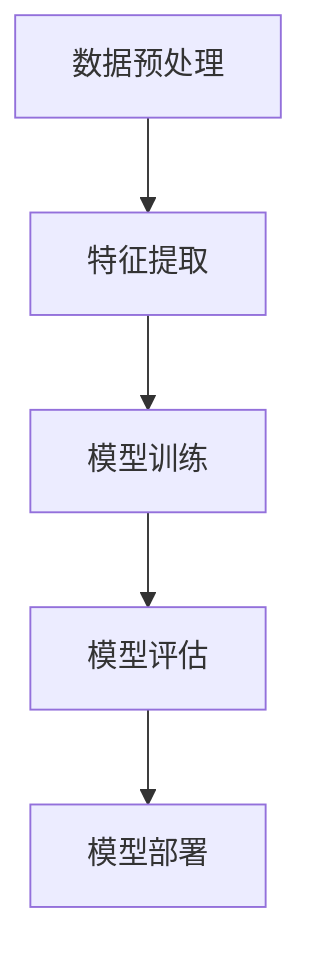

                 


# AI驱动的企业信用评级模型性能监控系统

> 关键词：AI驱动、企业信用评级、模型性能监控、机器学习、深度学习、实时监控

> 摘要：本文将详细探讨AI驱动的企业信用评级模型性能监控系统的构建与应用。通过分析传统信用评级模型的局限性，介绍AI驱动模型的核心概念与算法原理，并结合系统架构设计、项目实战和最佳实践，为读者提供一个全面的技术指南。

---

## 第一部分: AI驱动的企业信用评级模型性能监控系统背景介绍

### 第1章: 问题背景与问题描述

#### 1.1 企业信用评级的重要性
企业信用评级是衡量企业信用状况的重要指标，直接影响企业的融资能力、市场信任度和金融市场的稳定性。传统评级方法依赖于财务数据和人工经验，存在数据依赖性强、模型稳定性差、可解释性低等问题，难以应对复杂多变的市场环境。

#### 1.2 传统信用评级模型的局限性
- 数据依赖性问题：传统模型主要依赖财务数据，难以捕捉非结构化数据（如社交媒体、新闻）中的潜在风险信号。
- 模型稳定性与可解释性问题：传统模型在面对市场波动时容易出现漂移，且难以解释评分结果的合理性。
- 人工监控的低效性与误差：人工监控不仅效率低下，还容易因主观判断出现误差。

#### 1.3 AI驱动信用评级模型的优势
- 数据处理能力的提升：AI能够处理海量数据，包括结构化和非结构化数据，捕捉更多风险信号。
- 模型自适应与优化能力：AI模型能够实时更新和优化，适应市场变化，减少漂移现象。
- 实时监控与异常检测：AI驱动的监控系统可以实时分析数据，快速识别异常情况，提高风险预警能力。

#### 1.4 问题解决与边界定义
- 核心目标：构建一个基于AI的信用评级模型，并设计一个实时监控系统，确保模型性能稳定、风险预警及时。
- 边界与外延：系统主要关注企业信用评级模型的性能监控，不涉及具体的评级结果输出。
- 核心要素：包括数据采集、模型训练、性能评估、实时监控和异常检测。

#### 1.5 本章小结
通过分析传统信用评级模型的局限性，提出了AI驱动信用评级模型的必要性，并明确了系统的边界和核心要素。

---

## 第二部分: AI驱动的企业信用评级模型核心概念与联系

### 第2章: 核心概念与原理

#### 2.1 AI驱动信用评级模型的定义
- 模型的核心要素：基于机器学习或深度学习算法，结合企业内外部数据进行信用评分。
- 模型的输入与输出：输入为多源异构数据，输出为企业的信用评分和风险预警信息。
- 模型的训练与部署：通过历史数据训练模型，部署后实时更新和优化。

#### 2.2 核心概念原理
- 机器学习在信用评级中的应用：监督学习（如逻辑回归、随机森林）和无监督学习（如聚类分析）。
- 深度学习在信用评级中的优势：神经网络能够捕捉非线性关系，适合处理复杂数据。

#### 2.3 核心概念对比分析
| 特性             | 传统信用评级模型         | AI驱动信用评级模型       |
|------------------|--------------------------|--------------------------|
| 数据来源         | 主要依赖财务数据         | 结构化+非结构化数据       |
| 模型复杂性       | 简单线性模型             | 复杂非线性模型           |
| 可解释性         | 较高                    | 较低                    |
| 更新频率         | 定期更新                | 实时更新                |

#### 2.4 ER实体关系图
```mermaid
er
    企业
    数据源
    模型
    监控系统
    风险预警

    企业 --> 数据源: 提供数据
    数据源 --> 模型: 输入数据
    模型 --> 监控系统: 输出评分
    监控系统 --> 风险预警: 发布预警
```

#### 2.5 本章小结
通过对比分析和ER图，明确了AI驱动信用评级模型的核心概念和其与传统模型的主要区别。

---

## 第三部分: AI驱动的企业信用评级模型算法原理

### 第3章: 算法原理与实现

#### 3.1 算法选择与原理
- 选择基于XGBoost的机器学习模型，结合LSTM进行时间序列分析。
- XGBoost适用于分类任务，LSTM适合处理时间相关数据。

#### 3.2 算法流程


#### 3.3 数学模型与公式
- 损失函数：$$ L(y, \hat{y}) = \sum_{i=1}^n (y_i - \hat{y}_i)^2 $$
- 准确率计算：$$ \text{Accuracy} = \frac{\text{正确预测数}}{\text{总预测数}} $$

#### 3.4 代码实现
```python
import pandas as pd
from xgboost import XGBClassifier
from sklearn.metrics import accuracy_score

# 数据加载与预处理
data = pd.read_csv('credit_data.csv')
X = data.drop('label', axis=1)
y = data['label']

# 模型训练
model = XGBClassifier()
model.fit(X, y)

# 模型预测
y_pred = model.predict(X)

# 模型评估
print(accuracy_score(y, y_pred))
```

#### 3.5 本章小结
详细讲解了AI驱动信用评级模型的算法选择、实现流程和数学原理，并提供了具体的代码示例。

---

## 第四部分: 系统分析与架构设计

### 第4章: 系统架构设计

#### 4.1 系统功能模块
- 数据采集模块：收集企业内外部数据。
- 模型训练模块：基于历史数据训练AI模型。
- 监控模块：实时监控模型性能，识别异常。

#### 4.2 系统架构图


#### 4.3 接口设计
- 数据接口：RESTful API，用于数据源和系统的交互。
- 监控接口：实时反馈模型性能指标，如准确率、召回率。

#### 4.4 交互流程
```mermaid
sequence
    客户端 -> 数据源: 请求数据
    数据源 -> 数据采集模块: 返回数据
    数据采集模块 -> 数据预处理模块: 数据预处理完成
    数据预处理模块 -> 模型训练模块: 数据输入
    模型训练模块 -> 模型评估模块: 模型评估完成
    模型评估模块 -> 监控模块: 更新监控指标
    监控模块 -> 风险预警模块: 发布预警
```

#### 4.5 本章小结
通过系统架构设计，明确了各功能模块的交互流程和接口设计。

---

## 第五部分: 项目实战

### 第5章: 项目实战与案例分析

#### 5.1 环境安装与配置
```bash
pip install xgboost pandas scikit-learn
```

#### 5.2 核心代码实现
```python
import pandas as pd
from xgboost import XGBClassifier
from sklearn.metrics import accuracy_score
from datetime import datetime

# 数据加载与预处理
data = pd.read_csv('credit_data.csv')
X = data.drop('label', axis=1)
y = data['label']

# 模型训练
model = XGBClassifier()
model.fit(X, y)

# 实时监控
while True:
    current_time = datetime.now().strftime("%Y-%m-%d %H:%M:%S")
    y_pred = model.predict(X)
    accuracy = accuracy_score(y, y_pred)
    print(f"{current_time} - Accuracy: {accuracy}")
    # 监控指标更新与异常检测
    # ...
```

#### 5.3 案例分析
通过实际数据集训练模型，并实时监控模型的准确率变化，分析模型性能的波动情况，优化模型参数。

#### 5.4 本章小结
通过项目实战，展示了AI驱动信用评级模型的实现过程和监控系统的应用。

---

## 第六部分: 最佳实践与总结

### 第6章: 最佳实践与小结

#### 6.1 最佳实践
- 数据清洗与特征工程是关键，需谨慎处理缺失值和异常值。
- 定期更新模型，避免模型漂移，建议每周至少一次模型再训练。
- 监控系统需实时反馈，确保风险预警的及时性。

#### 6.2 小结
本文详细介绍了AI驱动的企业信用评级模型性能监控系统的构建过程，从算法原理到系统架构，再到项目实战，为读者提供了一个完整的解决方案。

#### 6.3 注意事项
- 数据隐私和安全需严格把控，避免数据泄露风险。
- 模型解释性不足，需结合业务知识进行调整。

#### 6.4 拓展阅读
- 《机器学习实战》
- 《深度学习入门》
- 《实时数据分析与可视化》

---

## 结语

AI驱动的企业信用评级模型性能监控系统通过结合机器学习和实时监控技术，显著提升了信用评级的准确性和效率。未来，随着AI技术的不断发展，信用评级模型将更加智能化和自动化，为企业和金融市场提供更可靠的支持。

---

感谢您的阅读，如需进一步探讨，请随时联系。

