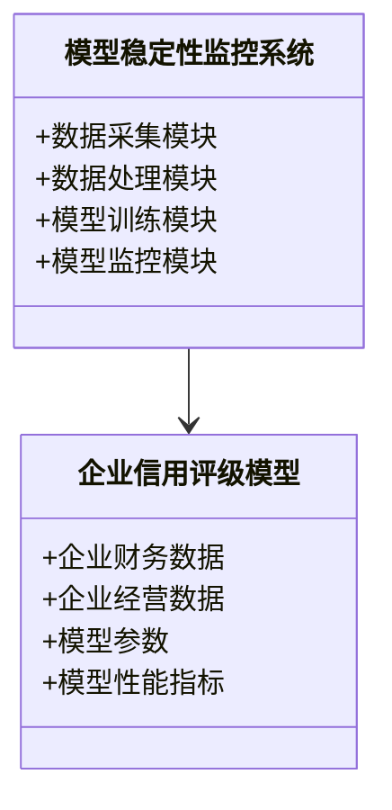
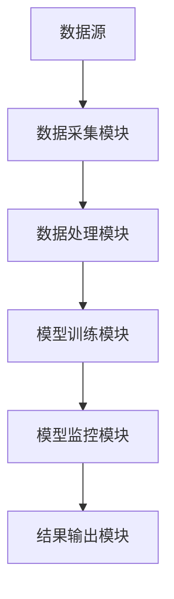
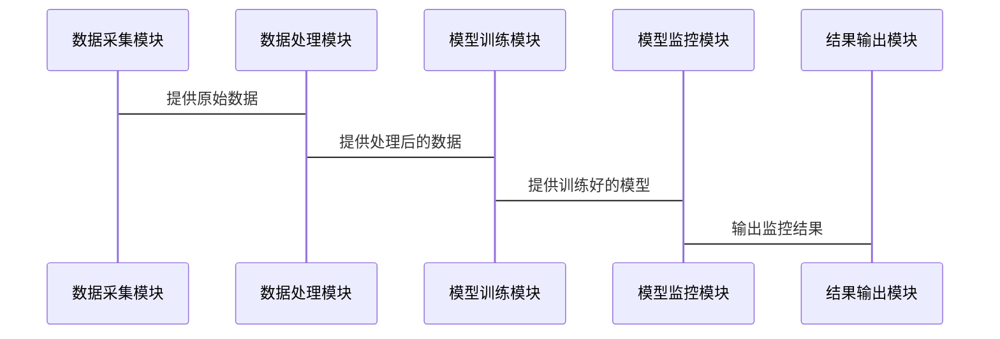

                 


# AI驱动的企业信用评级模型稳定性监控系统

> **关键词**：AI，企业信用评级，模型稳定性，监控系统，深度学习，机器学习

> **摘要**：随着人工智能技术的快速发展，企业信用评级模型的准确性和稳定性变得至关重要。本文深入探讨了AI驱动的企业信用评级模型稳定性监控系统的构建与应用，从模型稳定性监控的背景、核心概念、算法原理到系统架构设计、项目实战，再到最佳实践，为读者提供全面的指导和见解。

---

## 第1章 企业信用评级与AI技术的结合

### 1.1 企业信用评级的基本概念

#### 1.1.1 信用评级的定义与作用
企业信用评级是通过对企业的财务状况、经营能力、偿债能力等多方面因素进行综合评估，确定其信用等级的过程。信用评级的结果直接影响企业的融资成本和市场信任度，是企业经营中的重要决策依据。

#### 1.1.2 传统信用评级方法的局限性
传统的信用评级方法依赖于经验丰富的专家进行人工分析，存在以下问题：
- **主观性**：专家的主观判断可能导致评级结果的不一致。
- **效率低**：人工分析耗时长，难以应对海量数据的处理需求。
- **覆盖面有限**：难以全面考虑企业的多维度信息。

#### 1.1.3 AI技术在信用评级中的优势
AI技术通过机器学习、深度学习等方法，能够高效地处理海量数据，发现传统方法难以察觉的模式和规律。AI技术的优势包括：
- **高效性**：自动化处理大量数据，提高评级效率。
- **准确性**：通过数据驱动的方法，减少人为误差，提高评级的准确性。
- **可扩展性**：能够处理不同规模和类型的企业数据。

### 1.2 企业信用评级模型的稳定性问题

#### 1.2.1 模型稳定性的定义
模型稳定性是指在数据分布或环境发生变化时，模型预测结果的持续一致性和准确性。一个稳定的模型能够在不同时间、不同数据集上保持一致的性能。

#### 1.2.2 模型不稳定的表现形式
模型不稳定的表现形式包括：
- **预测结果波动**：在相似输入下，模型输出结果出现不一致。
- **性能下降**：在新的数据集上，模型性能显著降低。
- **错误率增加**：模型在特定场景下的错误率上升。

#### 1.2.3 模型稳定性对企业信用评级的影响
模型稳定性直接影响信用评级的准确性和可靠性。一个不稳定的模型可能导致错误的评级结果，进而影响企业的融资能力和市场信任度。

---

## 第2章 AI驱动的企业信用评级模型

### 2.1 AI在信用评级中的应用

#### 2.1.1 机器学习在信用评级中的应用
机器学习通过训练模型从历史数据中学习信用评级的规律。常用算法包括逻辑回归、支持向量机（SVM）、随机森林等。这些算法能够处理结构化数据，如企业的财务数据和经营数据。

#### 2.1.2 深度学习在信用评级中的应用
深度学习通过多层神经网络结构，能够从非结构化数据中提取特征，如企业的新闻、社交媒体数据等。常用模型包括卷积神经网络（CNN）、循环神经网络（RNN）和长短期记忆网络（LSTM）。

#### 2.1.3 自然语言处理在信用评级中的应用
自然语言处理技术（NLP）能够从企业的文本数据中提取情感、关键词等信息，用于补充传统的财务数据，提高评级的准确性。

### 2.2 企业信用评级模型的构建

#### 2.2.1 数据采集与处理
- **数据来源**：包括企业的财务报表、行业数据、新闻报道、社交媒体等。
- **数据清洗**：去除缺失值、异常值，处理数据格式问题。
- **数据标注**：根据企业的实际信用等级对数据进行标注。

#### 2.2.2 特征提取与选择
- **特征提取**：从数据中提取有用的特征，如财务指标、市场指标等。
- **特征选择**：通过相关性分析、LASSO回归等方法选择重要特征。

#### 2.2.3 模型训练与优化
- **模型训练**：使用训练数据对模型进行训练，调整模型参数。
- **模型优化**：通过交叉验证、网格搜索等方法优化模型性能。

---

## 第3章 模型稳定性监控的重要性

### 3.1 模型漂移的概念

#### 3.1.1 数据分布变化对模型的影响
数据分布的变化（数据漂移）可能导致模型性能下降。例如，新数据中某特征的分布发生了变化，而模型未能适应这种变化。

#### 3.1.2 模型性能变化的监测
通过监控模型在新数据上的性能指标，如准确率、召回率等，发现模型性能的变化。

#### 3.1.3 模型稳定性的评估指标
常用的模型稳定性评估指标包括：
- **稳定性系数**：衡量模型在不同数据集上的性能一致性。
- **变化检测指标**：如KL散度、JS散度等，用于检测数据分布的变化。

### 3.2 模型稳定性监控的必要性

#### 3.2.1 保障信用评级的准确性
模型稳定性监控能够及时发现模型性能下降的问题，避免错误的评级结果。

#### 3.2.2 提高模型的鲁棒性
通过监控模型稳定性，可以发现模型的弱点，进行针对性优化，提高模型的鲁棒性。

#### 3.2.3 降低模型风险
模型稳定性监控有助于降低模型在实际应用中的风险，确保信用评级系统的稳定运行。

---

## 第4章 模型稳定性监控的核心概念与联系

### 4.1 模型稳定性监控的理论基础

#### 4.1.1 模型稳定性监控的数学基础
模型稳定性监控涉及统计学、概率论等数学基础。例如，通过统计测试检测数据分布的变化。

#### 4.1.2 模型稳定性监控的算法原理
常用的算法包括：
- **分布变化检测**：如Kolmogorov-Smirnov检验、KL散度等。
- **性能变化检测**：如监控模型在不同时间点的准确率变化。

#### 4.1.3 模型稳定性监控的实现步骤
1. 数据采集与预处理
2. 建立基准模型
3. 监控数据变化
4. 评估模型性能
5. 及时反馈与调整

### 4.2 模型稳定性监控的核心要素

#### 4.2.1 数据特征的变化
- **特征分布变化**：如某特征的均值、方差发生变化。
- **特征重要性变化**：某些特征的重要性在数据变化后显著降低。

#### 4.2.2 模型性能的变化
- **准确率下降**：模型在新数据上的准确率显著降低。
- **召回率下降**：模型在新数据上的召回率显著降低。

#### 4.2.3 模型参数的变化
- **权重变化**：模型参数的变化反映了数据分布的变化。
- **激活函数变化**：模型内部的激活函数行为发生变化。

---

## 第5章 模型稳定性监控的实现方法

### 5.1 数据驱动的模型稳定性监控

#### 5.1.1 数据分布变化的检测
通过统计测试（如Kolmogorov-Smirnov检验）或机器学习方法（如自动编码器）检测数据分布的变化。

#### 5.1.2 数据特征变化的分析
通过可视化工具（如箱线图）分析特征分布的变化，识别异常特征。

#### 5.1.3 数据变化对模型性能的影响评估
通过对比模型在新数据和旧数据上的性能指标，评估数据变化对模型的影响。

### 5.2 模型性能驱动的稳定性监控

#### 5.2.1 模型性能变化的监测
通过实时监控模型在新数据上的性能指标，发现性能下降的迹象。

#### 5.2.2 模型性能变化的原因分析
结合数据变化和模型参数变化，分析性能下降的原因。

#### 5.2.3 模型性能恢复的策略
根据分析结果，采取重新训练模型、调整模型参数等策略恢复模型性能。

---

## 第6章 系统分析与架构设计方案

### 6.1 问题场景介绍

#### 6.1.1 企业信用评级模型的应用场景
- 企业融资决策
- 投资决策
- 供应链管理

#### 6.1.2 模型稳定性监控的挑战
- 数据量大，实时性要求高
- 模型类型多样，监控方法复杂

### 6.2 系统功能设计

#### 6.2.1 领域模型设计


#### 6.2.2 系统架构设计


#### 6.2.3 接口和交互设计


---

## 第7章 项目实战

### 7.1 环境安装

#### 7.1.1 安装Python
```bash
python --version
pip install --upgrade pip
```

#### 7.1.2 安装依赖库
```bash
pip install numpy pandas scikit-learn tensorflow matplotlib
```

### 7.2 核心代码实现

#### 7.2.1 数据处理代码
```python
import pandas as pd
import numpy as np

# 数据加载
data = pd.read_csv('credit_data.csv')

# 数据清洗
data.dropna(inplace=True)
data = data[~data.duplicated()]
```

#### 7.2.2 模型训练代码
```python
from sklearn.model_selection import train_test_split
from sklearn.linear_model import LogisticRegression

# 数据分割
X_train, X_test, y_train, y_test = train_test_split(data.drop('rating', axis=1), data['rating'], test_size=0.2)

# 模型训练
model = LogisticRegression()
model.fit(X_train, y_train)
```

#### 7.2.3 模型监控代码
```python
import tensorflow as tf
from tensorflow.keras import layers

# 模型定义
model = tf.keras.Sequential([
    layers.Dense(64, activation='relu'),
    layers.Dense(1, activation='sigmoid')
])

# 模型训练
model.compile(optimizer='adam', loss='binary_crossentropy', metrics=['accuracy'])
model.fit(X_train, y_train, epochs=10, batch_size=32)
```

### 7.3 案例分析与应用解读

#### 7.3.1 数据变化检测
通过监控数据分布的变化，及时发现数据漂移，防止模型性能下降。

#### 7.3.2 模型性能监控
通过实时监控模型在新数据上的准确率，发现性能下降的迹象，及时采取调整措施。

---

## 第8章 最佳实践

### 8.1 小结
AI驱动的企业信用评级模型稳定性监控系统是保障信用评级准确性和可靠性的重要工具。通过实时监控模型稳定性，能够及时发现并解决问题，确保模型的高效运行。

### 8.2 注意事项
- **数据质量**：确保数据的准确性和完整性。
- **模型更新**：定期更新模型，适应数据分布的变化。
- **监控频率**：根据业务需求，设置合理的监控频率。

### 8.3 拓展阅读
- 《机器学习实战》
- 《深度学习入门：基于Python》
- 《自然语言处理入门》

---

通过以上内容，读者可以全面了解AI驱动的企业信用评级模型稳定性监控系统的构建与应用，掌握其实现方法和最佳实践，为实际应用提供有力支持。

