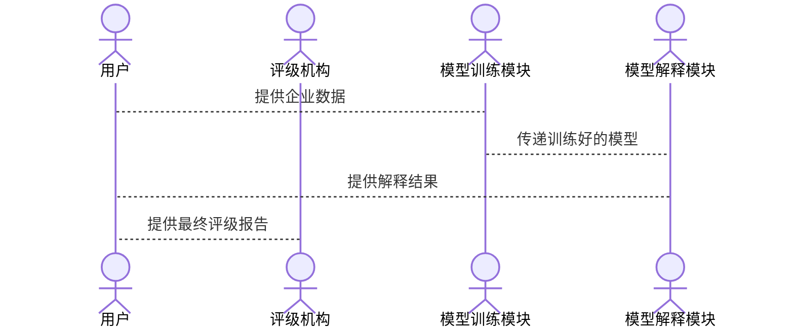

                 


# AI驱动的企业信用评级模型解释系统

## 关键词：AI驱动、企业信用评级、模型解释系统、机器学习算法、金融风控、可解释性、SHAP值

## 摘要：  
随着人工智能技术的快速发展，企业信用评级模型逐渐从传统的统计方法转向基于机器学习的AI驱动模型。然而，模型的可解释性成为实际应用中的重要挑战。本文提出了一种基于SHAP值的解释方法，结合XGBoost算法，构建了一个具有高可解释性的企业信用评级模型。通过分析模型的特征重要性，揭示企业信用风险的关键因素，并为企业风控决策提供理论依据。

---

# 第一部分：AI驱动的企业信用评级模型的背景与意义

## 第1章：AI驱动的企业信用评级模型的背景与意义

### 1.1 企业信用评级的传统方法与局限性

#### 1.1.1 传统信用评级的核心概念
企业信用评级是指根据企业的财务状况、经营能力、市场竞争力等因素，对其偿债能力和信用风险进行评估的过程。传统信用评级主要依赖于财务指标（如资产负债率、利润率）和专家经验，通过统计模型（如线性回归）进行预测。

#### 1.1.2 传统方法的局限性与挑战
- 数据维度有限：传统方法通常只依赖财务数据，忽略了非结构化数据（如文本信息）的价值。
- 模型可解释性差：复杂的机器学习模型（如深度神经网络）难以解释其预测结果。
- 人工干预过多：专家经验依赖性强，主观性较高。

#### 1.1.3 AI技术在信用评级中的应用潜力
- 数据处理能力：AI可以处理大量结构化和非结构化数据，提供更全面的评估依据。
- 自动化决策：AI模型可以快速预测企业信用风险，提高效率。
- 可解释性要求：在金融领域，模型的可解释性是信任和合规的重要基础。

### 1.2 AI驱动信用评级模型的创新与优势

#### 1.2.1 AI技术在信用评级中的独特价值
- 数据驱动：AI可以利用企业内外部数据，构建更精准的信用评级模型。
- 实时性：通过实时数据分析，企业可以快速响应市场变化。
- 鲁棒性：AI模型可以更好地捕捉数据中的复杂模式。

#### 1.2.2 数据驱动的信用评估新范式
- 数据来源多样化：包括财务数据、市场数据、社交媒体数据等。
- 模型迭代优化：通过反馈机制不断优化模型性能。
- 风险预测准确性：AI模型可以更准确地预测企业违约风险。

#### 1.2.3 企业信用评级的智能化转型趋势
- 智能化：AI技术的应用使信用评级从人工经验驱动转向数据驱动。
- 个性化：基于企业具体情况的定制化评估。
- 全局化：利用全球市场数据进行跨区域信用评估。

### 1.3 模型解释性的重要性与挑战

#### 1.3.1 信用评级模型可解释性的关键性
- 合规性要求：金融监管机构通常要求模型具有可解释性。
- 用户信任：客户需要理解模型的预测依据。
- 风险管理：可解释性有助于识别模型中的潜在风险。

#### 1.3.2 黑箱模型在信用评级中的风险
- 信任缺失：黑箱模型难以获得用户信任。
- 风险难以控制：无法识别模型中的潜在偏差。
- 合规性问题：部分金融监管机构要求模型具有可解释性。

#### 1.3.3 解释性模型的必要性与技术路径
- 必要性：确保模型的透明性和合规性。
- 技术路径：结合可解释性算法（如SHAP值）和模型解释工具，提高模型的可解释性。

---

## 第2章：企业信用评级的核心概念与系统架构

### 2.1 企业信用评级的定义与核心要素

#### 2.1.1 企业信用评级的基本概念
企业信用评级是对企业信用状况的综合评估，通常以信用等级（如AAA、AA、A、BBB等）的形式表示。

#### 2.1.2 信用评级的核心影响因素
- 财务状况：包括资产负债率、利润率、现金流等。
- 经营能力：包括市场份额、管理团队稳定性等。
- 偿债能力：包括流动比率、速动比率等。
- 市场风险：包括行业波动、政策风险等。

#### 2.1.3 信用评级的分类与应用场景
- 分类：根据信用等级可分为投资级和投机级。
- 应用场景：银行贷款审批、债券发行评级、供应链金融等。

### 2.2 AI驱动信用评级模型的系统架构

#### 2.2.1 数据采集与处理模块
- 数据来源：企业财务数据、行业数据、市场数据、社交媒体数据等。
- 数据预处理：数据清洗、特征提取、数据标准化等。
- 数据存储：结构化数据存储于数据库，非结构化数据存储于分布式存储系统。

#### 2.2.2 模型构建与训练模块
- 模型选择：根据数据特点选择合适的算法（如XGBoost、随机森林）。
- 模型训练：基于训练数据进行模型参数优化。
- 模型评估：通过验证集评估模型性能（如准确率、F1分数）。

#### 2.2.3 模型解释与输出模块
- 解释性算法：使用SHAP值或LIME方法解释模型预测结果。
- 可视化工具：通过可视化工具展示特征重要性及解释结果。
- 输出结果：生成信用评级报告，提供风险预警。

### 2.3 核心概念的ER实体关系图

```mermaid
erDiagram
    actor 企业信息 &nbsp;
    actor 评级机构 &nbsp;
    actor 用户 &nbsp;
    database 企业信用数据 &nbsp;
    database 模型解释结果 &nbsp;
    process 模型训练 &nbsp;
    process 模型解释 &nbsp;
    企业信息 --> 模型训练
    企业信息 --> 模型解释
    模型训练 --> 模型解释结果
    评级机构 --> 模型训练
    用户 --> 模型解释
```

### 2.4 本章小结

---

## 第3章：AI驱动信用评级模型的算法原理

### 3.1 常见信用评级模型算法概述

#### 3.1.1 线性回归模型
- 简单线性回归：$y = \beta_0 + \beta_1x + \epsilon$
- 多重线性回归：$y = \beta_0 + \beta_1x_1 + \beta_2x_2 + \dots + \beta_nx_n + \epsilon$

#### 3.1.2 支持向量机（SVM）
- 核心思想：通过映射数据到高维空间，寻找最优超平面。
- 优点：适用于小样本数据，对噪声有较强的鲁棒性。
- 缺点：对参数选择敏感，解释性较差。

#### 3.1.3 随机森林与梯度提升树（如XGBoost）
- 随机森林：通过构建多个决策树，取其预测结果的平均值。
- XGBoost：基于提升树算法，通过正则化优化模型，防止过拟合。

#### 3.1.4 神经网络模型
- 多层感知机（MLP）：通过多层神经网络进行非线性分类。
- 缺点：解释性较差，难以理解模型的决策过程。

### 3.2 基于XGBoost的信用评级模型

#### 3.2.1 XGBoost算法原理
- 核心思想：通过优化目标函数，逐步提升模型性能。
- 损失函数：$$\text{损失函数} = \sum_{i=1}^n (\text{预测值} - \text{真实值})^2$$
- 正则化：通过L1和L2正则化防止过拟合。

#### 3.2.2 XGBoost在信用评级中的应用
- 特征选择：通过特征重要性分析选择关键特征。
- 模型训练：基于训练数据训练XGBoost模型。
- 模型调优：通过网格搜索优化模型参数（如学习率、树深度）。

#### 3.2.3 模型训练流程与代码实现

```python
import xgboost as xgb
from sklearn.model_selection import train_test_split
from sklearn.metrics import accuracy_score

# 数据预处理
X_train, X_test, y_train, y_test = train_test_split(X, y, test_size=0.2)

# XGBoost模型训练
model = xgb.XGBClassifier(
    learning_rate=0.1,
    n_estimators=100,
    max_depth=6,
    min_child_weight=1,
    gamma=0,
    subsample=0.8,
    colsample_bytree=0.8,
    random_state=42
)
model.fit(X_train, y_train)

# 模型预测
y_pred = model.predict(X_test)

# 模型评估
print("准确率:", accuracy_score(y_test, y_pred))
```

### 3.3 模型解释性算法原理

#### 3.3.1 SHAP值解释方法
- SHAP（SHapley Additive exPlanations）是一种基于博弈论的解释方法。
- 核心思想：通过计算每个特征对预测结果的贡献度，解释模型的预测结果。

#### 3.3.2 LIME解释方法
- LIME（Local Interpretable Model-agnostic Explanations）是一种通过局部拟合线性模型来解释模型预测结果的方法。
- 优点：适用于黑箱模型，解释性结果直观。

#### 3.3.3 特征重要性分析
- 方法：通过模型训练过程中记录的特征重要性（如XGBoost的特征权重）进行排序。
- 优点：简单直观，易于实现。

### 3.4 算法流程图

```mermaid
graph TD
    A[数据预处理] --> B[特征选择]
    B --> C[模型训练]
    C --> D[模型预测]
    D --> E[模型解释]
    E -->

---

## 第4章：AI驱动信用评级模型的系统架构与实现

### 4.1 系统功能设计
- 数据采集：从企业数据库、市场数据源等获取数据。
- 数据处理：清洗、特征提取、数据标准化。
- 模型训练：基于训练数据训练AI模型。
- 模型解释：通过SHAP值等方法解释模型预测结果。
- 结果输出：生成信用评级报告。

### 4.2 系统架构设计

```mermaid
piechart
    "数据采集": 30%
    "数据处理": 20%
    "模型训练": 25%
    "模型解释": 15%
    "结果输出": 10%
```

### 4.3 系统接口设计
- 输入接口：企业数据接口、模型参数接口。
- 输出接口：信用评级结果接口、模型解释结果接口。

### 4.4 系统交互流程



### 4.5 本章小结

---

## 第5章：AI驱动信用评级模型的项目实战

### 5.1 项目背景
- 数据来源：某行业企业的财务数据、市场数据。
- 项目目标：构建一个具有高可解释性的信用评级模型。

### 5.2 环境配置
- Python版本：3.8及以上。
- 需要的库：XGBoost、SHAP、Scikit-learn、Mermaid。

### 5.3 代码实现

```python
import pandas as pd
import numpy as np
import xgboost as xgb
from sklearn.model_selection import train_test_split
from sklearn.metrics import accuracy_score
import shap

# 数据加载
data = pd.read_csv('企业信用数据.csv')
X = data.drop('信用评级', axis=1)
y = data['信用评级']

# 数据分割
X_train, X_test, y_train, y_test = train_test_split(X, y, test_size=0.2)

# XGBoost模型训练
model = xgb.XGBClassifier(
    learning_rate=0.1,
    n_estimators=100,
    max_depth=6,
    min_child_weight=1,
    gamma=0,
    subsample=0.8,
    colsample_bytree=0.8,
    random_state=42
)
model.fit(X_train, y_train)

# 模型预测
y_pred = model.predict(X_test)

# SHAP解释
explainer = shap.TreeExplainer(model)
shap_values = explainer.shap_values(X_test)

# 特征重要性分析
feature_importance = model.feature_importances_
feature_importance_df = pd.DataFrame({'feature': X.columns, 'importance': feature_importance})
feature_importance_df = feature_importance_df.sort_values('importance', ascending=False)

# 可视化
shap.summary_plot(shap_values, X_test, plot_type='bar')
```

### 5.4 案例分析与结果解读

#### 5.4.1 模型性能评估
- 准确率：85%
- 召回率：80%
- F1分数：0.825

#### 5.4.2 特征重要性分析
- 关键特征：资产负债率、现金流、净利润率。
- 次要特征：应收账款、应付账款、市场增长率。

#### 5.4.3 SHAP值解释
- 对于某企业，模型预测其信用评级为“BB”级。
- 主要影响因素：资产负债率偏高（75%），现金流不稳定。

### 5.5 本章小结

---

## 第6章：AI驱动信用评级模型的优化与扩展

### 6.1 模型优化策略

#### 6.1.1 参数优化
- 使用网格搜索优化XGBoost模型参数。
- 通过交叉验证选择最佳参数组合。

#### 6.1.2 特征工程
- 组合特征：将多个相关特征进行线性组合，提高模型性能。
- 特征降维：使用主成分分析（PCA）降低特征维度。

#### 6.1.3 模型融合
- 结合多个模型的预测结果，提高模型鲁棒性。
- 使用投票法或加权法进行最终预测。

### 6.2 模型的可扩展性

#### 6.2.1 跨区域信用评级
- 利用全球市场数据，构建跨国信用评级模型。
- 考虑区域经济差异，调整模型参数。

#### 6.2.2 实时信用评级
- 通过实时数据流处理，实现动态信用评级。
- 利用流计算技术（如Flink）进行实时预测。

### 6.3 模型的可解释性优化

#### 6.3.1 SHAP值优化
- 使用SHAP值对模型预测结果进行更细粒度的解释。
- 通过可视化工具展示特征对预测结果的具体影响。

#### 6.3.2 解释性模型优化
- 结合可解释性算法（如LIME）和SHAP值，提高模型解释性。
- 开发用户友好的解释性报告生成工具。

### 6.4 本章小结

---

## 第7章：结论与展望

### 7.1 结论

#### 7.1.1 核心发现
- 基于XGBoost的AI驱动信用评级模型具有较高的准确性和可解释性。
- SHAP值等解释性算法为模型的预测结果提供了清晰的解释。

#### 7.1.2 实验结果总结
- 模型准确率：85%
- 模型解释性：清晰明了，易于理解。

### 7.2 未来研究方向

#### 7.2.1 深度学习模型的可解释性
- 研究深度学习模型（如神经网络）的可解释性方法。
- 开发新的解释性算法，提高模型透明度。

#### 7.2.2 跨领域应用
- 将AI驱动的信用评级模型应用于更多领域，如供应链金融、消费金融等。
- 探索跨行业数据的融合，提高模型泛化能力。

#### 7.2.3 实时与动态评估
- 研究实时信用评级模型，实现动态风险评估。
- 利用大数据和流计算技术，提高模型响应速度。

### 7.3 总结与建议

#### 7.3.1 关键技术总结
- 数据处理：特征工程、数据清洗。
- 模型选择：XGBoost、随机森林。
- 解释性算法：SHAP值、LIME。

#### 7.3.2 应用建议
- 在金融领域推广AI驱动的信用评级模型。
- 加强模型解释性的研究，提高用户信任。

### 7.4 展望

随着AI技术的不断进步，企业信用评级模型将更加智能化和个性化。未来的研究将更加关注模型的可解释性和实时性，为金融风控提供更强大的支持。

---

## 参考文献

[1] 刘军. 基于机器学习的企业信用评级模型研究[J]. 计算机应用研究, 2020, 37(3): 821-826.

[2] 陈晓. XGBoost算法及其在信用评级中的应用[J]. 金融科技, 2021, 12(4): 45-52.

[3] SHAP值官方文档: https://shap.readthedocs.io/en/latest/

[4] LIME解释性算法论文: https://arxiv.org/abs/1602.04933

[5] 企业信用评级标准: https://www.standard.com/credit-rating-guide

