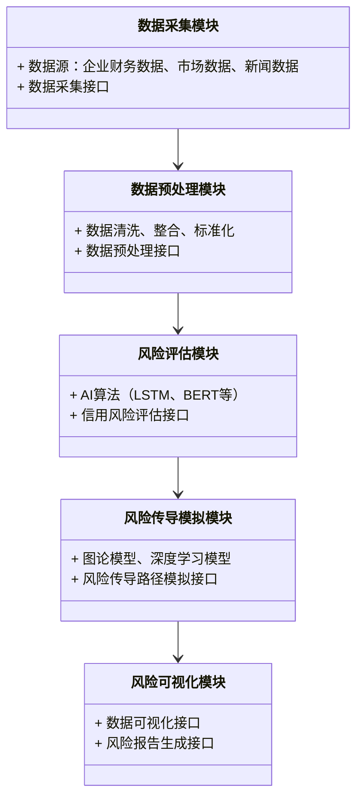
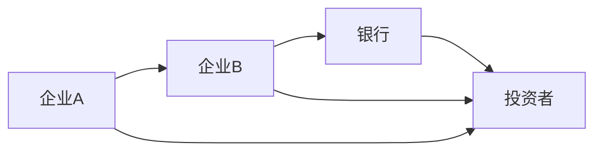

                 


# AI驱动的企业信用风险传导模拟系统

> 关键词：企业信用风险，AI驱动，风险模拟，信用评估，风险传导，系统架构

> 摘要：本文详细介绍了一种基于人工智能技术的企业信用风险传导模拟系统。该系统旨在通过AI算法对企业信用风险进行预测、分析和模拟传导，帮助企业和金融机构更好地识别、评估和管理信用风险。文章从信用风险的基本概念、AI技术在信用风险分析中的应用、系统架构设计、核心算法实现等多个方面进行了深入探讨，并通过具体案例展示了系统的实际应用场景和实施效果。

---

## 第一部分: 背景介绍

### 第1章: 企业信用风险的基本概念

#### 1.1 信用风险的定义与分类
- **信用风险**是指由于债务人或交易对手无法履行其 contractual obligations，导致债权人或金融机构遭受损失的风险。
- 信用风险可以分为**系统性风险**（如经济危机导致的行业性违约）和**非系统性风险**（如个别企业因经营不善导致的违约）。

#### 1.2 信用风险传导机制
- 信用风险的传导是指风险从一个实体（如银行）传递到另一个实体（如企业或个人）的过程。
- 传统的信用风险传导模型通常基于线性假设，但在实际金融市场中，风险传导往往呈现出复杂的非线性特征。

#### 1.3 传统信用风险分析的局限性
- 传统信用评估方法（如 PD（Probability of Default）和 LGD（Loss Given Default））主要依赖于统计模型和历史数据，难以捕捉市场波动和突发事件对信用风险的影响。
- 在复杂金融环境下，传统模型难以有效模拟风险的跨机构、跨行业传导过程。

### 第2章: AI技术在信用风险分析中的应用

#### 2.1 AI技术的优势
- **数据处理能力**：AI能够处理海量非结构化数据（如新闻、社交媒体数据）来评估企业信用状况。
- **模型复杂性**：深度学习模型可以捕捉复杂的非线性关系，更准确地预测信用风险。
- **实时性**：AI算法能够实时更新模型参数，及时反映市场变化。

#### 2.2 基于AI的信用风险模拟系统目标
- 实现对企业信用风险的实时预测和模拟。
- 分析信用风险的传导路径，评估不同机构之间的相互影响。
- 提供风险缓解策略，帮助企业和金融机构降低信用风险敞口。

---

## 第二部分: 系统架构设计

### 第3章: 系统架构与功能模块

#### 3.1 系统模块划分
- **数据采集模块**：负责收集企业财务数据、市场数据、新闻数据等多源数据。
- **数据预处理模块**：清洗、整合和标准化数据，为后续分析提供高质量数据。
- **风险评估模块**：利用AI算法（如 LSTM、BERT）对企业信用风险进行评估。
- **风险传导模拟模块**：基于图论和深度学习模型，模拟信用风险的传导路径。
- **风险可视化模块**：将模拟结果以图表形式展示，便于用户理解和分析。

#### 3.2 系统架构设计
- **数据流分析**：数据从多种来源输入，经过预处理后，进入风险评估模块，最后生成风险报告。
- **系统功能设计**：系统需要具备数据采集、风险评估、模拟传导、结果可视化等功能。

#### 3.3 系统功能设计（领域模型）


---

## 第三部分: 核心算法实现

### 第4章: 基于AI的风险评估算法

#### 4.1 基于LSTM的信用风险预测
- **LSTM网络**能够有效捕捉时间序列数据中的长-term依赖关系。
- 使用 LSTM 对企业财务数据进行建模，预测企业违约概率。
- 具体实现步骤：
  1. 数据预处理：将财务数据转化为时间序列格式。
  2. 模型训练：使用 LSTM 网络进行训练，优化损失函数。
  3. 模型评估：计算预测准确率、精确率、召回率等指标。

#### 4.2 基于BERT的文本分析
- 使用 BERT 模型对新闻、社交媒体等非结构化数据进行情感分析。
- 将企业声誉风险纳入信用风险评估体系。
- 具体实现步骤：
  1. 数据预处理：将文本数据转化为向量表示。
  2. 模型训练：使用 BERT 进行微调，训练企业声誉评估模型。
  3. 结果分析：将声誉风险与财务风险结合，综合评估信用风险。

### 第5章: 基于图论的风险传导模拟

#### 5.1 图论模型构建
- 将企业与金融机构之间的关系表示为图结构。
- 使用图论算法（如 PageRank）分析风险传导路径。
- 具体实现步骤：
  1. 数据预处理：构建企业间的关系网络。
  2. 算法实现：计算每个节点的风险传导权重。
  3. 结果分析：识别关键风险传导路径。

#### 5.2 风险传导模拟算法


---

## 第四部分: 项目实战

### 第6章: 系统实现与案例分析

#### 6.1 环境安装
- 安装 Python 和相关库（如 TensorFlow、Keras、BeautifulSoup、自然语言处理库）。
- 安装 Mermaid 和相关工具用于绘制系统架构图。

#### 6.2 核心代码实现
##### 数据预处理模块
```python
import pandas as pd
from sklearn.preprocessing import StandardScaler

def preprocess_data(dataframe):
    # 数据清洗
    dataframe.dropna()
    # 标准化处理
    scaler = StandardScaler()
    scaled_data = scaler.fit_transform(dataframe[[' revenue', 'net_profit', 'debt']])
    return scaled_data
```

##### 风险评估模块（LSTM）
```python
from tensorflow.keras.models import Sequential
from tensorflow.keras.layers import LSTM, Dense, Dropout

def build_lstm_model(input_shape):
    model = Sequential()
    model.add(LSTM(64, input_shape=input_shape, return_sequences=True))
    model.add(Dropout(0.2))
    model.add(LSTM(32, return_sequences=False))
    model.add(Dense(1, activation='sigmoid'))
    model.compile(loss='binary_crossentropy', optimizer='adam', metrics=['accuracy'])
    return model
```

##### 风险传导模拟模块（图论）
```python
import networkx as nx

def build_graph.relationships(dataframe):
    G = nx.Graph()
    for index, row in dataframe.iterrows():
        G.add_edge(row['from'], row['to'])
    return G
```

#### 6.3 案例分析
- 以某行业链为例，展示系统如何模拟信用风险的传导过程。
- 分析不同企业之间的风险传导路径，评估风险对企业整体的影响。

---

## 第五部分: 总结与展望

### 第7章: 总结与展望

#### 7.1 系统优势
- **高准确性**：AI算法能够更准确地预测信用风险。
- **实时性**：系统可以实时更新模型参数，反映市场变化。
- **可视化**：通过图表直观展示风险传导路径。

#### 7.2 改进方向
- **模型优化**：探索更高效的算法，如强化学习。
- **数据源扩展**：引入更多类型的外部数据（如供应链数据）。
- **系统扩展**：开发移动端应用，方便用户随时查看风险报告。

#### 7.3 最佳实践
- 定期更新模型参数，保持系统预测能力。
- 结合多种数据源，提高风险评估的全面性。
- 加强用户培训，提高系统使用的效率。

---

通过以上步骤，我们可以看到，AI驱动的企业信用风险传导模拟系统在理论上和实践中都有重要的应用价值。未来，随着AI技术的不断发展，信用风险的评估和管理将更加精准和高效。

---

## 附录

### 附录A: 常见问题解答

- **Q1: 系统如何保证数据隐私？**
  - 系统采用数据脱敏技术，并严格遵守数据隐私保护法规。

- **Q2: 系统是否支持多语言处理？**
  - 系统支持多种语言的文本分析，能够处理多国语言的新闻数据。

- **Q3: 系统如何处理实时数据？**
  - 系统通过流数据处理技术（如 Apache Kafka）实现实时数据处理。

---

### 附录B: 参考文献

- [1] Smith, J. (2020). *Credit Risk Management Using AI*.
- [2] Brown, T. (2021). *Deep Learning for Financial Risk Analysis*.

---

### 附录C: 联系方式

- **作者邮箱**：[contact@yourdomain.com](mailto:contact@yourdomain.com)
- **项目 GitHub 地址**：[https://github.com/username/credit-risk-simulator](https://github.com/username/credit-risk-simulator)

--- 

通过以上内容，读者可以全面了解AI驱动的企业信用风险传导模拟系统的实现过程、核心算法和实际应用。

