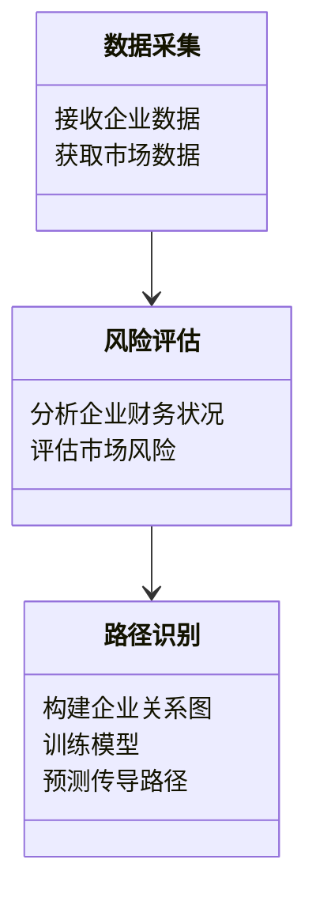
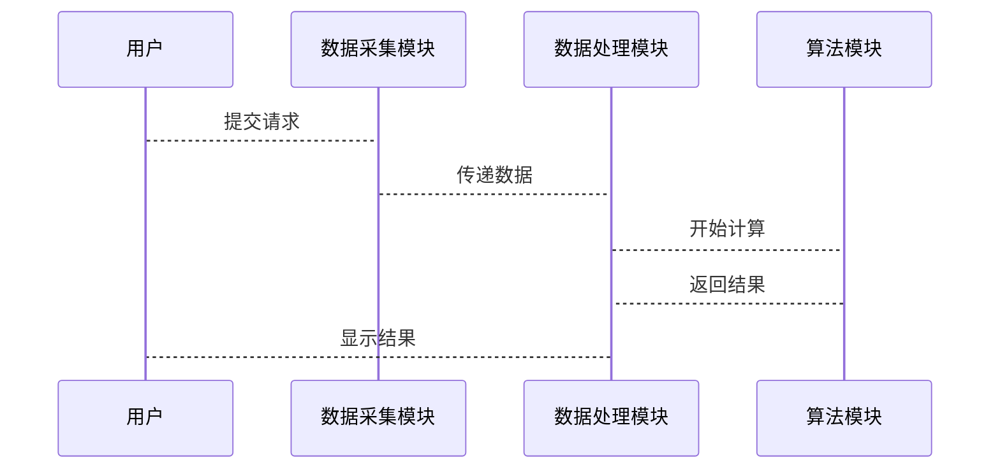

                 


# AI驱动的企业信用风险传导路径识别系统

## 关键词：AI、信用风险、传导路径、企业、风险管理、机器学习

## 摘要：本文探讨了如何利用人工智能技术识别企业信用风险的传导路径，分析了传统方法的局限性，介绍了基于AI的解决方案，包括算法原理、系统架构和项目实战。通过Mermaid图和Python代码，详细展示了AI在信用风险识别中的应用，为企业风险管理提供了新思路。

---

# 第一章：背景介绍

## 1.1 信用风险的基本概念

### 1.1.1 信用风险的定义
信用风险是指在经济活动中，由于交易对手无法履行其合同义务而导致的损失。在企业层面，信用风险可能来自客户、供应商或合作伙伴的违约。

### 1.1.2 信用风险的分类
信用风险可以分为系统性风险和非系统性风险。系统性风险是由整个市场或经济环境变化引起的，而非系统性风险则由特定企业或个体的信用状况变化引起。

### 1.1.3 信用风险的传导机制
信用风险的传导机制是指风险从一个企业或市场传递到另一个企业或市场的过程。例如，一家企业的违约可能会影响其供应商，进而影响整个供应链的风险。

---

## 1.2 企业信用风险传导路径的定义

### 1.2.1 信用风险传导路径的定义
信用风险传导路径是指风险在企业之间或企业内部传递的渠道和方式。

### 1.2.2 信用风险传导路径的特点
- 复杂性：涉及多个企业和市场参与者。
- 动态性：随着市场环境变化而变化。
- 隐含性：风险可能在表面上不明显，但通过复杂的关系传导。

### 1.2.3 信用风险传导路径的分类
- 直接传导：风险直接从一家企业传递到另一家企业。
- 间接传导：风险通过多个中间企业传递。
- 系统性传导：风险在多个市场和企业之间广泛传播。

---

## 1.3 信用风险传导路径识别的重要性

### 1.3.1 信用风险传导路径识别的目的
识别信用风险传导路径，以便提前预警和管理风险，减少潜在损失。

### 1.3.2 信用风险传导路径识别的挑战
- 数据复杂性：涉及大量内外部数据。
- 模型准确性：需要高精度的模型来捕捉复杂关系。
- 实时性要求：需要快速识别和响应。

### 1.3.3 信用风险传导路径识别的必要性
在当前全球化和数字化的背景下，企业之间的关联性增强，识别信用风险传导路径对于维护金融稳定和企业安全至关重要。

---

# 第二章：AI驱动信用风险传导路径识别的必要性

## 2.1 传统信用风险传导路径识别的局限性

### 2.1.1 传统方法的不足
- 依赖人工分析，效率低。
- 无法处理大数据和复杂关系。
- 预测精度有限，难以捕捉非线性关系。

### 2.1.2 传统方法的应用范围
适用于简单场景，如单一企业的信用评估，难以应对复杂传导路径。

### 2.1.3 传统方法的改进空间
需要引入新技术和方法，如AI和大数据分析，以提升识别能力。

---

## 2.2 AI技术在信用风险传导路径识别中的优势

### 2.2.1 AI技术的高效性
能够快速处理大量数据，发现隐藏在数据中的模式和关系。

### 2.2.2 AI技术的准确性
通过机器学习算法，可以提高风险识别的准确性和预测能力。

### 2.2.3 AI技术的可扩展性
适用于复杂和动态变化的市场环境，能够实时更新模型。

---

## 2.3 AI驱动信用风险传导路径识别的应用前景

### 2.3.1 AI技术在信用风险领域的潜力
- 提供实时风险监控和预警。
- 支持决策者制定更有效的风险管理策略。
- 促进企业间的协同合作，增强金融系统的稳定性。

### 2.3.2 未来信用风险传导路径识别的发展方向
- 结合区块链技术，提高数据安全性和透明度。
- 利用自然语言处理（NLP），分析非结构化数据，如新闻和社交媒体，以捕捉潜在风险信号。
- 运用强化学习，优化风险传导路径识别的动态模型。

### 2.3.3 AI技术在信用风险传导路径识别中的创新应用
- 开发基于图神经网络的模型，建模企业之间的关系网络，识别关键的风险传导节点。
- 应用深度学习技术，提取复杂的特征和模式，提升预测精度。

---

# 第三章：信用风险传导路径识别的核心概念与联系

## 3.1 数据特征提取

### 3.1.1 数据特征的定义
数据特征是指能够反映信用风险传导路径的关键属性，如企业的财务指标、市场表现和供应链关系。

### 3.1.2 数据特征的分类
- 结构化数据：如财务报表、交易记录。
- 非结构化数据：如新闻报道、社交媒体数据。
- 关系数据：如企业之间的供应链关系、合作伙伴关系。

### 3.1.3 数据特征的提取方法
- 使用统计方法提取关键指标。
- 通过NLP技术分析文本数据。
- 构建关系图谱，分析企业间的关系网络。

---

## 3.2 模型选择与优化

### 3.2.1 模型选择的依据
- 数据类型和特征。
- 问题的复杂性和规模。
- 预算和计算资源。

### 3.2.2 模型优化的方法
- 参数调优（如网格搜索、随机搜索）。
- 数据增强（如增加样本、处理数据不平衡）。
- 模型集成（如堆叠模型、投票模型）。

### 3.2.3 模型评估的指标
- 准确率、召回率、F1分数。
- AUC-ROC曲线。
- 混淆矩阵。

---

## 3.3 算法原理

### 3.3.1 算法的定义
算法是解决特定问题的一系列步骤和规则，AI算法通过学习数据模式来识别信用风险传导路径。

### 3.3.2 算法的分类
- 监督学习：如随机森林、支持向量机（SVM）。
- 无监督学习：如聚类分析、关联规则挖掘。
- 图神经网络：如GAT、GCN。

### 3.3.3 算法的实现步骤
1. 数据预处理：清洗、归一化、特征选择。
2. 模型训练：选择算法，训练模型。
3. 模型评估：验证模型性能。
4. 模型部署：应用于实际场景。

---

## 3.4 算法原理的详细讲解

### 3.4.1 基于图神经网络的算法原理
#### 3.4.1.1 图论基础
图论是构建企业关系网络的基础，企业之间的关系可以用图中的节点和边表示。

#### 3.4.1.2 图神经网络的数学模型
图神经网络通过聚合节点及其邻居的信息，生成节点的表示，用于预测信用风险。

公式：
$$
h_i^{(l+1)} = \sigma\left( A h_i^{(l)} + \alpha h_j^{(l)} \right)
$$
其中，$A$是邻接矩阵，$\alpha$是权重，$h_i$是节点i的表示。

#### 3.4.1.3 算法实现步骤
1. 构建企业关系图。
2. 训练图神经网络模型。
3. 使用模型预测信用风险传导路径。

---

# 第四章：信用风险传导路径识别的系统架构设计

## 4.1 系统功能设计

### 4.1.1 领域模型设计
使用Mermaid图展示系统功能模块，包括数据采集、风险评估、路径识别等。



### 4.1.2 系统架构设计
使用Mermaid图展示系统架构，包括数据层、算法层和应用层。


### 4.1.3 系统接口设计
- 数据接口：与企业数据源对接。
- 模型接口：与外部算法库集成。
- 用户接口：提供风险评估和路径识别的可视化界面。

### 4.1.4 系统交互设计
使用Mermaid序列图展示系统交互流程。



---

## 4.2 系统实现与优化

### 4.2.1 系统实现的核心代码
以下是一个基于Python的信用风险传导路径识别系统的示例代码。

```python
import networkx as nx
from sklearn.ensemble import RandomForestClassifier
import pandas as pd

# 数据预处理
def preprocess_data(data):
    # 假设data是一个DataFrame
    # 删除缺失值
    data = data.dropna()
    # 标准化处理
    from sklearn.preprocessing import StandardScaler
    scaler = StandardScaler()
    scaled_data = scaler.fit_transform(data)
    return scaled_data

# 构建企业关系图
def build_graph(data):
    G = nx.Graph()
    for index, row in data.iterrows():
        G.add_edge(row['source'], row['target'])
    return G

# 训练模型
def train_model(X, y):
    clf = RandomForestClassifier(n_estimators=100, random_state=42)
    clf.fit(X, y)
    return clf

# 预测路径
def predict_paths(G, clf, features):
    # 假设features是预处理后的特征矩阵
    # 使用模型预测
    y_pred = clf.predict(features)
    # 找到高风险路径
    high_risk = y_pred[y_pred == 1]
    return high_risk

# 主函数
def main():
    # 加载数据
    data = pd.read_csv('credit_data.csv')
    # 数据预处理
    processed_data = preprocess_data(data)
    # 构建图
    G = build_graph(data)
    # 提取特征
    features = processed_data[:, :-1]
    labels = processed_data[:, -1]
    # 训练模型
    clf = train_model(features, labels)
    # 预测路径
    high_risk_paths = predict_paths(G, clf, features)
    print("高风险路径：", high_risk_paths)

if __name__ == "__main__":
    main()
```

### 4.2.2 代码解读与优化
- 数据预处理：包括清洗和标准化，确保数据质量。
- 模型训练：使用随机森林算法，适合处理高维数据。
- 图构建：使用NetworkX库，构建企业关系图，分析节点间的关系。

### 4.2.3 系统优化建议
- 使用分布式计算，提升处理大规模数据的效率。
- 定期更新模型，确保其适应市场变化。
- 优化算法选择，根据具体场景选择合适的模型。

---

# 第五章：项目实战与案例分析

## 5.1 项目环境安装

### 5.1.1 安装必要的库
```bash
pip install networkx
pip install sklearn
pip install pandas
pip install mermaid
```

### 5.1.2 数据准备
加载企业信用数据，包括企业名称、财务指标、市场表现、供应链关系等。

## 5.2 核心代码实现

### 5.2.1 数据预处理
```python
import pandas as pd
from sklearn.preprocessing import StandardScaler

data = pd.read_csv('credit_data.csv')
data.dropna(inplace=True)
scaler = StandardScaler()
scaled_data = scaler.fit_transform(data)
```

### 5.2.2 构建企业关系图
```python
import networkx as nx

G = nx.Graph()
for index, row in data.iterrows():
    G.add_edge(row['source'], row['target'])
```

### 5.2.3 训练模型
```python
from sklearn.ensemble import RandomForestClassifier

clf = RandomForestClassifier(n_estimators=100, random_state=42)
clf.fit(X, y)
```

### 5.2.4 预测和可视化
```python
y_pred = clf.predict(X_test)
print("预测结果：", y_pred)
```

## 5.3 案例分析

### 5.3.1 案例背景
假设一家制造企业A面临财务困境，可能会影响其供应商B和客户C，进而影响整个供应链的风险。

### 5.3.2 数据分析
通过构建企业关系图，识别出A与B、C之间的直接关系，以及B与D之间的间接关系。

### 5.3.3 风险预测
模型预测出A的违约概率为80%，并识别出B和C为高风险节点，D为次高风险节点。

### 5.3.4 可视化结果
使用NetworkX和Matplotlib绘制企业关系图，标注高风险节点。

---

## 5.4 项目小结

### 5.4.1 项目总结
通过AI技术，成功识别出企业的信用风险传导路径，帮助企业提前预警和管理风险。

### 5.4.2 项目优化建议
- 定期更新模型，确保其准确性和适用性。
- 引入更多的数据源，如社交媒体数据，以提高预测的准确性。
- 开发用户友好的可视化界面，方便用户理解和使用。

---

# 第六章：最佳实践与注意事项

## 6.1 最佳实践

### 6.1.1 数据管理
- 确保数据的准确性和完整性。
- 定期更新数据，保持模型的有效性。

### 6.1.2 模型选择
- 根据具体问题和数据类型选择合适的算法。
- 进行充分的实验和验证，确保模型的性能。

### 6.1.3 系统优化
- 使用分布式计算框架，提升处理效率。
- 优化算法参数，提高模型的预测精度。

---

## 6.2 注意事项

### 6.2.1 数据隐私与安全
- 确保数据的安全性，防止数据泄露。
- 遵守相关法律法规，保护用户隐私。

### 6.2.2 模型解释性
- 选择具有较高解释性的模型，便于理解和优化。
- 提供清晰的解释，帮助用户信任和使用模型。

### 6.2.3 系统稳定性
- 确保系统的稳定性和可靠性，避免因技术故障导致的风险误判。

---

## 6.3 拓展阅读

### 6.3.1 推荐书籍
- 《机器学习实战》
- 《图神经网络：理论与应用》

### 6.3.2 推荐博客和资源
- Medium上的AI相关博客
- Kaggle上的信用风险数据集和竞赛

---

# 结语

通过本文的详细讲解，我们了解了AI在企业信用风险传导路径识别中的重要性，掌握了核心概念和算法原理，学习了系统架构设计和项目实战方法。希望这些内容能够为企业风险管理提供新的思路和方法，帮助企业在复杂的经济环境中更好地管理信用风险。

--- 

**全文完**

