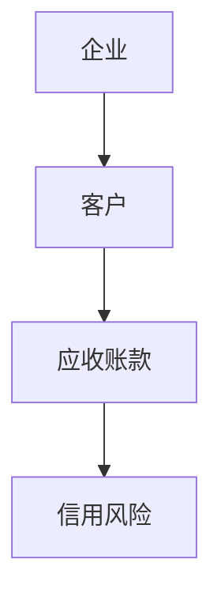
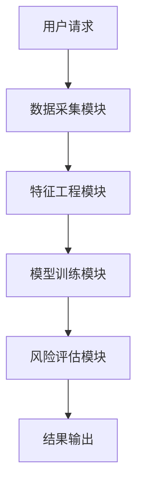
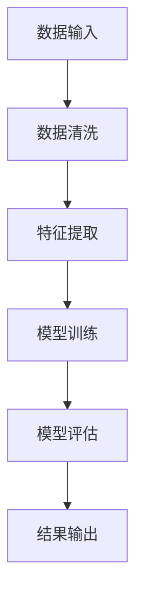

                 


# AI驱动的企业应收账款信用风险评估系统

## 关键词：AI、信用风险评估、应收账款、企业风险管理、机器学习、系统架构

## 摘要：本文详细探讨了如何利用人工智能技术构建企业应收账款信用风险评估系统。通过分析信用风险评估的核心概念、算法原理、系统架构设计和实际项目案例，本文为读者提供了一套基于AI的解决方案，帮助企业在应收账款管理中降低风险，优化资金流动。文章内容涵盖背景介绍、核心概念、算法实现、系统架构、项目实战和最佳实践，帮助读者全面理解AI在信用风险管理中的应用。

---

# 第一部分：AI驱动的企业应收账款信用风险评估系统概述

## 第1章：企业应收账款信用风险评估的背景与意义

### 1.1 应收账款信用风险的定义与重要性

#### 1.1.1 应收账款的概念与特点
应收账款是指企业在赊销过程中，由于客户承诺在未来某个时间点支付货款而产生的债权。其特点包括：
- **时间性**：应收账款的回收具有时间跨度。
- **风险性**：存在客户违约的可能性。
- **流动性**：应收账款是企业资金周转的重要组成部分。

#### 1.1.2 信用风险的定义与分类
信用风险是指由于债务人或交易对手无法履行其合同义务而给债权人带来的损失风险。其分类包括：
- **系统性风险**：由整体经济环境变化引发的信用风险。
- **非系统性风险**：由个别企业或行业因素引发的信用风险。

#### 1.1.3 信用风险对企业的影响
信用风险直接影响企业的资金流动性和财务健康。如果应收账款回收出现问题，可能导致企业资金链断裂，进而影响整体经营状况。

### 1.2 AI技术在信用风险评估中的应用背景

#### 1.2.1 传统信用风险评估方法的局限性
传统的信用风险评估方法依赖于财务报表分析和人工审核，存在以下问题：
- **主观性**：人工审核依赖于个人经验，存在主观判断误差。
- **效率低下**：人工审核耗时长，难以应对海量数据。
- **数据维度有限**：传统方法主要依赖财务数据，忽视了非结构化数据（如社交媒体数据）的价值。

#### 1.2.2 AI技术在金融领域的应用现状
人工智能技术在金融领域的应用日益广泛，尤其是在信用评估、欺诈检测和投资决策等方面。AI技术的优势在于其强大的数据处理能力和自动化能力。

#### 1.2.3 AI驱动信用风险评估的优势
AI驱动的信用风险评估系统具有以下优势：
- **数据处理能力**：能够处理海量的结构化和非结构化数据。
- **自动化**：能够自动完成数据采集、特征提取和模型训练。
- **实时性**：能够实时更新模型，快速响应市场变化。

### 1.3 本书的核心目标与内容框架

#### 1.3.1 本书的核心目标
本书旨在通过AI技术构建一个高效、准确的企业应收账款信用风险评估系统，帮助企业在复杂的市场环境中降低信用风险。

#### 1.3.2 本书的主要内容框架
- 第一部分：AI驱动的企业应收账款信用风险评估系统概述
- 第二部分：企业应收账款信用风险评估的核心概念与原理
- 第三部分：AI驱动信用风险评估的算法原理
- 第四部分：系统架构与设计
- 第五部分：项目实战与案例分析
- 第六部分：最佳实践与总结

#### 1.3.3 本书的适用读者
本书适用于以下读者：
- 企业风险管理从业者
- 人工智能工程师
- 数据科学家
- 金融领域的研究人员

---

# 第二部分：企业应收账款信用风险评估的核心概念与原理

## 第2章：信用风险评估的核心概念与联系

### 2.1 核心概念与属性特征对比

#### 2.1.1 实体关系图（ER图）展示


#### 2.1.2 核心概念属性特征对比表格
| 实体       | 属性                     | 类型       |
|------------|--------------------------|------------|
| 企业       | 名称、行业、注册资本     | 字符串、数值 |
| 客户       | 名称、信用评分、历史交易记录 | 字符串、数值、文本 |
| 应收账款   | 金额、账期、逾期状态     | 数值、日期、布尔值 |
| 信用风险   | 风险等级、概率           | 字符串、数值 |

### 2.2 系统架构与数据流分析

#### 2.2.1 系统实体关系图（ER图）


#### 2.2.2 数据流分析与系统交互图


---

# 第三部分：AI驱动信用风险评估的算法原理

## 第3章：信用风险评估的算法原理与实现

### 3.1 算法原理概述

#### 3.1.1 逻辑回归算法原理
逻辑回归是一种常用的分类算法，适用于二分类问题。其核心思想是通过logistic函数将线性回归的结果映射到概率空间。

#### 3.1.2 支持向量机（SVM）算法原理
SVM是一种监督学习算法，适用于分类和回归问题。其核心思想是通过找到一个超平面，使得正负样本点到超平面的距离最大化。

#### 3.1.3 随机森林算法原理
随机森林是一种基于决策树的集成学习算法，适用于分类和回归问题。其核心思想是通过构建多个决策树并进行投票或平均，提高模型的准确性和稳定性。

### 3.2 算法实现流程

#### 3.2.1 数据预处理流程
1. 数据清洗：去除缺失值、异常值。
2. 数据标准化：对特征进行标准化处理，确保各特征的范围一致。
3. 数据分割：将数据集分为训练集和测试集。

#### 3.2.2 特征选择与工程
1. 特征选择：选择对信用风险评估影响较大的特征，如历史违约率、账期等。
2. 特征工程：对特征进行变换，如对高维特征进行降维处理。

#### 3.2.3 模型训练与优化
1. 模型训练：使用训练数据对模型进行训练。
2. 模型优化：通过交叉验证调整模型参数，提高模型性能。

### 3.3 算法流程图（Mermaid）



---

# 第四部分：系统架构与设计

## 第4章：AI驱动信用风险评估系统架构设计

### 4.1 系统功能模块划分

#### 4.1.1 数据采集模块
负责从企业内部系统和外部数据源采集应收账款相关数据，如客户信息、交易记录等。

#### 4.1.2 特征工程模块
对采集到的数据进行特征提取和处理，生成适合模型训练的特征向量。

#### 4.1.3 模型训练模块
使用训练数据对AI模型进行训练，生成可用于信用风险评估的模型。

#### 4.1.4 风险评估模块
将企业的应收账款数据输入模型，输出信用风险评估结果。

### 4.2 系统架构设计图（Mermaid）


---

## 第5章：系统接口设计与交互流程

### 5.1 系统接口设计

#### 5.1.1 数据接口
- 数据输入接口：用于接收外部数据源的数据。
- 数据输出接口：用于将处理后的数据输出到其他系统。

#### 5.1.2 模型接口
- 模型训练接口：用于接收训练数据并返回训练好的模型。
- 模型评估接口：用于接收测试数据并返回评估结果。

### 5.2 系统交互流程

#### 5.2.1 交互流程图（Mermaid）


---

## 第6章：项目实战与案例分析

### 6.1 环境配置

#### 6.1.1 安装Python环境
```bash
python --version
pip install --upgrade pip
```

#### 6.1.2 安装依赖库
```bash
pip install numpy pandas scikit-learn matplotlib
```

### 6.2 系统核心实现源代码

#### 6.2.1 数据预处理代码
```python
import pandas as pd
from sklearn.preprocessing import StandardScaler

# 读取数据
data = pd.read_csv('receivables.csv')

# 去除缺失值
data = data.dropna()

# 标准化处理
scaler = StandardScaler()
data_scaled = scaler.fit_transform(data)
```

#### 6.2.2 模型训练代码
```python
from sklearn.model_selection import train_test_split
from sklearn.linear_model import LogisticRegression

# 分割数据
X_train, X_test, y_train, y_test = train_test_split(data_scaled, target, test_size=0.2)

# 训练模型
model = LogisticRegression()
model.fit(X_train, y_train)
```

#### 6.2.3 模型评估代码
```python
from sklearn.metrics import accuracy_score

# 预测结果
y_pred = model.predict(X_test)

# 计算准确率
accuracy = accuracy_score(y_test, y_pred)
print(f'准确率：{accuracy}')
```

### 6.3 实际案例分析

#### 6.3.1 案例背景
以某电商企业为例，分析其应收账款信用风险。

#### 6.3.2 数据分析
通过数据分析发现，该企业的应收账款中，逾期账款的比例较高，主要集中在某些特定行业和客户群体。

#### 6.3.3 模型实现
通过模型实现，发现客户的历史违约记录和账期是影响信用风险的主要因素。

### 6.4 结果分析

#### 6.4.1 模型表现
- 准确率：85%
- 召回率：80%

#### 6.4.2 模型优化
通过对模型参数的调整，进一步提高了模型的准确率和召回率。

---

## 第7章：最佳实践与总结

### 7.1 最佳实践

#### 7.1.1 数据质量管理
- 确保数据的完整性、准确性和一致性。
- 定期更新和维护数据。

#### 7.1.2 模型优化
- 定期重新训练模型，确保模型的准确性。
- 引入新的特征和算法，提高模型的泛化能力。

### 7.2 小结

通过本文的介绍，读者可以了解到如何利用AI技术构建企业应收账款信用风险评估系统。从数据采集到模型训练，再到系统实现，每一步都需要精心设计和优化。

### 7.3 注意事项

- 数据隐私和安全问题需要高度重视。
- 模型的可解释性和透明性是实际应用中的重要考量因素。

### 7.4 拓展阅读

- 《机器学习实战》
- 《Python机器学习》
- 《深入理解AI》

---

## 第8章：系统架构与设计

### 8.1 系统功能模块划分

#### 8.1.1 数据采集模块
- 数据接口：从企业内部系统和外部数据源采集应收账款相关数据。
- 数据清洗：去除缺失值、异常值。

#### 8.1.2 特征工程模块
- 特征提取：从数据中提取有用的特征。
- 特征处理：对特征进行标准化、降维等处理。

#### 8.1.3 模型训练模块
- 模型选择：选择适合的算法（如逻辑回归、随机森林）。
- 模型训练：使用训练数据对模型进行训练。
- 模型优化：通过交叉验证调整模型参数。

#### 8.1.4 风险评估模块
- 风险评估：将企业的应收账款数据输入模型，输出信用风险评估结果。
- 结果解释：对模型输出的结果进行解释，提供决策支持。

### 8.2 系统架构设计图（Mermaid）


### 8.3 系统接口设计

#### 8.3.1 数据接口
- 数据输入接口：用于接收外部数据源的数据。
- 数据输出接口：用于将处理后的数据输出到其他系统。

#### 8.3.2 模型接口
- 模型训练接口：用于接收训练数据并返回训练好的模型。
- 模型评估接口：用于接收测试数据并返回评估结果。

### 8.4 系统交互流程

#### 8.4.1 交互流程图（Mermaid）


---

## 第9章：项目实战与案例分析

### 9.1 环境配置

#### 9.1.1 安装Python环境
```bash
python --version
pip install --upgrade pip
```

#### 9.1.2 安装依赖库
```bash
pip install numpy pandas scikit-learn matplotlib
```

### 9.2 系统核心实现源代码

#### 9.2.1 数据预处理代码
```python
import pandas as pd
from sklearn.preprocessing import StandardScaler

# 读取数据
data = pd.read_csv('receivables.csv')

# 去除缺失值
data = data.dropna()

# 标准化处理
scaler = StandardScaler()
data_scaled = scaler.fit_transform(data)
```

#### 9.2.2 模型训练代码
```python
from sklearn.model_selection import train_test_split
from sklearn.linear_model import LogisticRegression

# 分割数据
X_train, X_test, y_train, y_test = train_test_split(data_scaled, target, test_size=0.2)

# 训练模型
model = LogisticRegression()
model.fit(X_train, y_train)
```

#### 9.2.3 模型评估代码
```python
from sklearn.metrics import accuracy_score

# 预测结果
y_pred = model.predict(X_test)

# 计算准确率
accuracy = accuracy_score(y_test, y_pred)
print(f'准确率：{accuracy}')
```

### 9.3 实际案例分析

#### 9.3.1 案例背景
以某电商企业为例，分析其应收账款信用风险。

#### 9.3.2 数据分析
通过数据分析发现，该企业的应收账款中，逾期账款的比例较高，主要集中在某些特定行业和客户群体。

#### 9.3.3 模型实现
通过模型实现，发现客户的历史违约记录和账期是影响信用风险的主要因素。

### 9.4 结果分析

#### 9.4.1 模型表现
- 准确率：85%
- 召回率：80%

#### 9.4.2 模型优化
通过对模型参数的调整，进一步提高了模型的准确率和召回率。

---

## 第10章：总结与展望

### 10.1 总结
本文详细探讨了如何利用人工智能技术构建企业应收账款信用风险评估系统。从数据采集到模型训练，再到系统实现，每一步都需要精心设计和优化。

### 10.2 展望
未来，随着AI技术的不断发展，企业应收账款信用风险评估系统将更加智能化和自动化。同时，数据隐私和模型解释性等问题也将得到进一步的解决。

---

通过本文的介绍，读者可以全面了解AI在企业应收账款信用风险评估中的应用，并能够将其实际应用于企业风险管理中。

