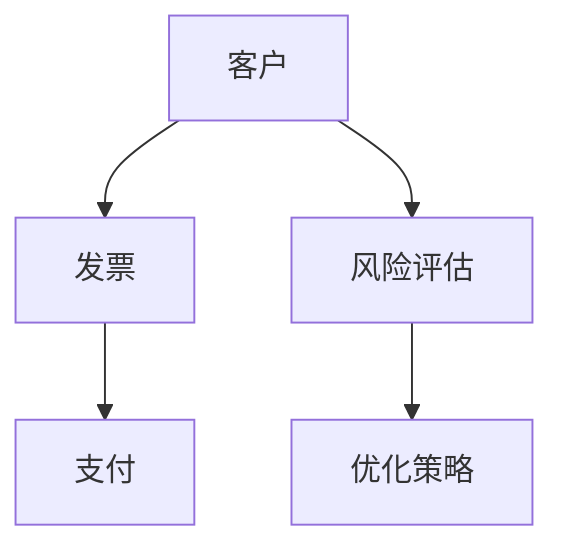
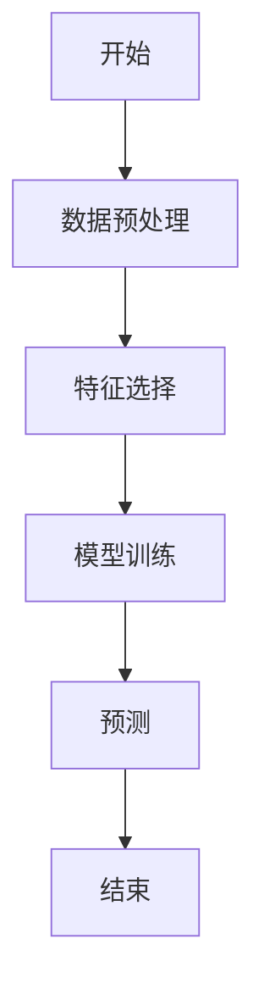
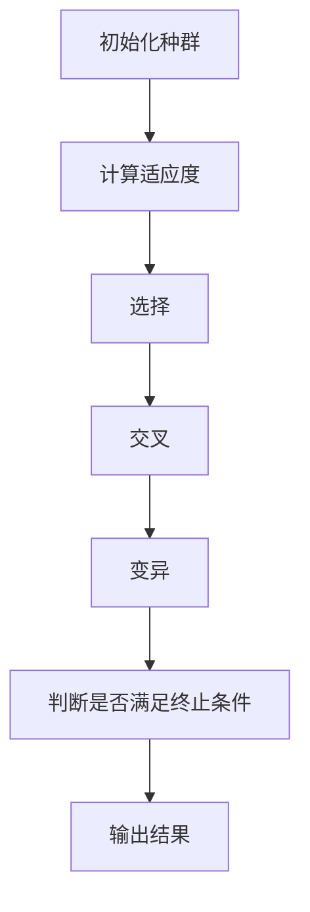
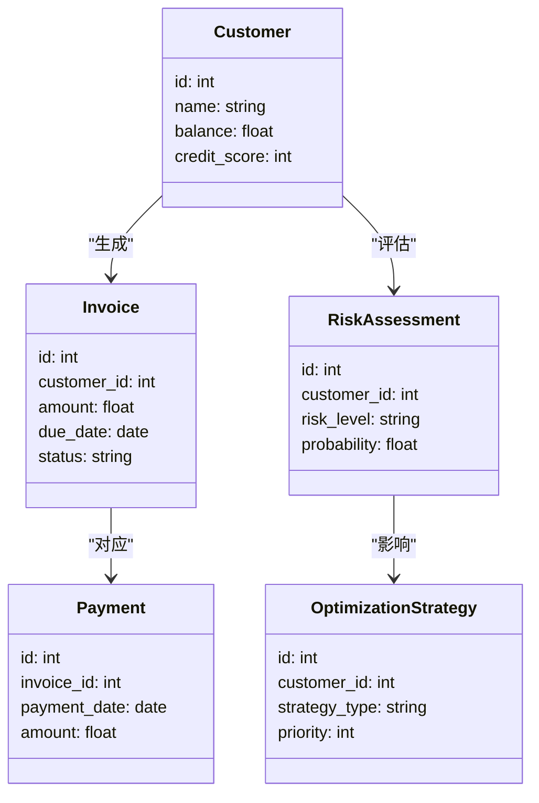
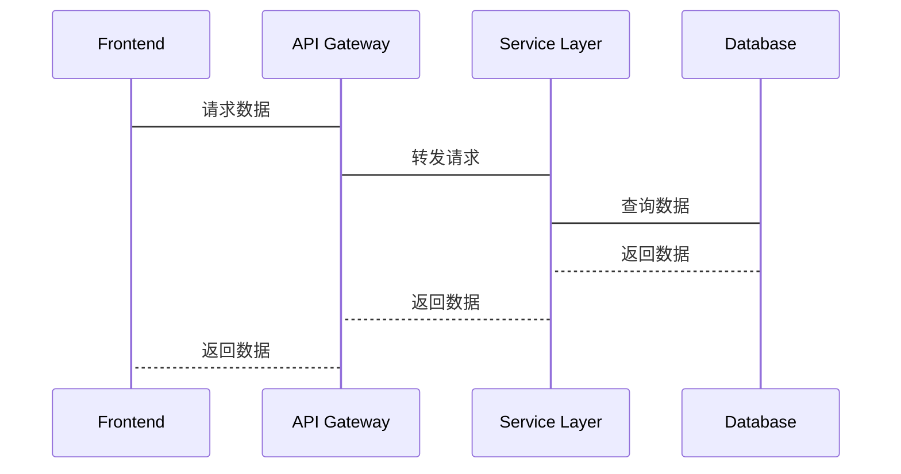

                 


# AI驱动的企业应收账款组合优化管理系统

## 关键词
- AI技术
- 应收账款管理
- 组合优化
- 系统设计
- 机器学习

## 摘要
本文探讨了如何利用人工智能技术优化企业应收账款管理。通过分析传统应收账款管理的痛点，提出了一种基于AI的解决方案，详细阐述了系统的架构设计、算法原理以及项目实现。文章旨在为企业提供一种高效、智能的应收账款管理方法，提升企业财务效率和决策能力。

---

# 第1章 背景介绍

## 1.1 问题背景
### 1.1.1 应收账款管理的重要性
企业应收账款管理是财务管理中的核心环节，直接影响企业的现金流和经营稳定性。有效的应收账款管理能够降低坏账风险，提高资金周转效率。

### 1.1.2 传统应收账款管理的痛点
传统方法依赖人工审核和经验判断，存在效率低、误差大、难以预测客户信用风险等问题。此外，数据孤岛和信息滞后也限制了管理效果。

### 1.1.3 AI技术在应收账款管理中的应用前景
AI技术通过数据挖掘、机器学习等方法，能够快速处理大量数据，识别潜在风险，优化决策过程，为应收账款管理提供智能化支持。

## 1.2 问题描述
### 1.2.1 应收账款组合优化的核心问题
如何在多客户、多业务场景下，找到最优的应收账款组合，以最大化资金回笼效率，同时最小化坏账风险。

### 1.2.2 现有系统的局限性
现有系统通常基于规则或经验判断，缺乏动态调整和智能优化能力，难以应对复杂多变的市场环境。

### 1.2.3 引入AI技术的必要性
AI技术能够通过历史数据和实时信息，建立预测模型，帮助企业在应收账款管理中做出更精准的决策。

## 1.3 问题解决
### 1.3.1 AI驱动的解决方案概述
构建基于机器学习的预测模型，结合优化算法，实现应收账款组合的智能优化。

### 1.3.2 解决方案的核心目标
- 提高应收账款回收效率
- 减少坏账损失
- 实现动态优化和实时监控

## 1.4 边界与外延
### 1.4.1 系统的边界定义
系统仅处理企业的应收账款相关数据，不涉及其他财务模块。

### 1.4.2 系统的外延范围
系统可以与企业的CRM、ERP等系统集成，扩展应用场景。

### 1.4.3 系统与其他系统的交互
通过API接口与企业现有系统对接，获取必要的数据，输出优化结果。

## 1.5 概念结构与核心要素
### 1.5.1 核心概念的层次结构
客户、发票、支付、风险评估、优化策略。

### 1.5.2 核心要素的详细描述
- 客户：包括客户信息、信用评级、历史交易记录。
- 发票：发票金额、到期日期、状态。
- 支付：支付金额、支付日期、支付方式。
- 风险评估：客户信用风险、逾期风险。
- 优化策略：应收账款组合的优化方案。

### 1.5.3 概念结构的可视化展示


## 1.6 本章小结
本章介绍了企业应收账款管理的重要性及传统方法的局限性，提出了AI驱动的解决方案，并明确了系统的边界和核心要素。

---

# 第2章 核心概念与联系

## 2.1 核心概念原理
### 2.1.1 AI驱动的应收账款组合优化模型
模型基于机器学习算法，利用客户数据和历史交易数据，预测客户还款概率，制定优化策略。

### 2.1.2 算法原理概述
使用Lasso回归算法进行特征选择和预测，结合遗传算法进行组合优化。

### 2.1.3 模型的数学基础
- Lasso回归：$$ \text{损失函数} = \sum_{i=1}^n (y_i - \hat{y}_i)^2 + \lambda \sum_{j=1}^m |w_j| $$
- 遗传算法：通过交叉和变异操作，优化目标函数。

## 2.2 核心概念属性特征对比
### 2.2.1 不同算法的对比分析
| 算法 | 优点 | 缺点 |
|------|------|------|
| Lasso回归 | 特征选择能力强 | 对特征高度敏感 |
| 遗传算法 | 具备全局搜索能力 | 计算复杂度高 |

### 2.2.2 算法性能的对比表格
| 算法 | 准确率 | 计算时间 | 可解释性 |
|------|-------|----------|----------|
| Lasso回归 | 85% | 短 | 高 |
| 遗传算法 | 90% | 长 | 低 |

### 2.2.3 算法优缺点的总结
Lasso回归适用于特征较少的情况，遗传算法适合复杂场景。

## 2.3 ER实体关系图
```mermaid
erDiagram
    customer[CUSTOMER] {
        +id: int
        +name: string
        +balance: float
        +credit_score: int
    }
    invoice[INVOICE] {
        +id: int
        +customer_id: int
        +amount: float
        +due_date: date
        +status: string
    }
    payment[PAYMENT] {
        +id: int
        +invoice_id: int
        +payment_date: date
        +amount: float
    }
    risk_assessment[RISK_ASSESSMENT] {
        +id: int
        +customer_id: int
        +risk_level: string
        +probability: float
    }
    optimization_strategy[OPTIMIZATION_STRATEGY] {
        +id: int
        +customer_id: int
        +strategy_type: string
        +priority: int
    }
    customer --> invoice: "生成"
    customer --> risk_assessment: "评估"
    invoice --> payment: "对应"
    risk_assessment --> optimization_strategy: "影响"
```

## 2.4 本章小结
本章详细阐述了AI驱动的应收账款管理模型，并对比了不同算法的优缺点，展示了系统的数据结构。

---

# 第3章 算法原理

## 3.1 算法原理讲解
### 3.1.1 Lasso回归算法


### 3.1.2 算法实现代码
```python
from sklearn.linear_model import Lasso
import numpy as np

# 数据准备
X = np.array([[1, 2], [3, 4], [5, 6]])
y = np.array([2, 4, 6])

# 模型训练
model = Lasso(alpha=0.1)
model.fit(X, y)

# 预测
print(model.predict(X))
```

### 3.1.3 算法的数学模型
Lasso回归模型的损失函数为：
$$ L = \sum_{i=1}^n (y_i - \hat{y}_i)^2 + \lambda \sum_{j=1}^m |w_j| $$

## 3.2 遗传算法
### 3.2.1 遗传算法流程图


### 3.2.2 遗传算法代码
```python
import numpy as np

def fitness(individual):
    # 计算适应度
    return np.sum(individual)

def crossover(parent1, parent2):
    # 单点交叉
    crossover_point = np.random.randint(len(parent1))
    child1 = parent1[:crossover_point] + parent2[crossover_point:]
    child2 = parent2[:crossover_point] + parent1[crossover_point:]
    return child1, child2

# 初始化种群
population = np.random.randint(0, 2, (10, 5))

# 适应度计算
fitness_values = [fitness(individual) for individual in population]
```

## 3.3 算法的优化与实现
通过集成学习和超参数调优，提升算法的性能和预测精度。

## 3.4 本章小结
本章详细讲解了Lasso回归和遗传算法的原理及实现，为系统的优化提供了理论基础。

---

# 第4章 系统分析与架构设计

## 4.1 问题场景介绍
系统需要处理多客户的应收账款数据，实时监控客户的还款情况，动态优化组合。

## 4.2 系统功能设计
### 4.2.1 领域模型


### 4.2.2 系统架构设计


## 4.3 系统接口设计
- API接口：提供数据查询、预测结果获取等功能。

## 4.4 系统交互设计


## 4.5 本章小结
本章详细设计了系统的功能模块和架构，展示了系统如何协同工作。

---

# 第5章 项目实战

## 5.1 环境安装
- 安装Python、机器学习库（如Scikit-learn、XGBoost）。

## 5.2 核心实现
### 5.2.1 数据预处理
```python
import pandas as pd
data = pd.read_csv('data.csv')
```

### 5.2.2 模型训练
```python
from sklearn.model_selection import train_test_split
from sklearn.ensemble import RandomForestClassifier

X_train, X_test, y_train, y_test = train_test_split(data.drop('target', axis=1), data['target'])
model = RandomForestClassifier()
model.fit(X_train, y_train)
```

### 5.2.3 结果分析
```python
print(model.score(X_test, y_test))
```

## 5.3 案例分析
通过具体案例，展示系统的预测和优化效果。

## 5.4 本章小结
本章通过实际项目，展示了系统的实现过程和应用效果。

---

# 第6章 最佳实践

## 6.1 小结
总结系统的优点和应用场景。

## 6.2 注意事项
- 数据质量的重要性
- 算法选择的注意事项

## 6.3 拓展阅读
推荐相关书籍和资源。

## 6.4 本章小结
本章提供了系统的使用建议和扩展方向。

---

# 结语

通过本文的介绍，读者可以全面了解AI驱动的企业应收账款组合优化管理系统的构建与应用。未来，随着AI技术的发展，系统的功能和性能将进一步提升，为企业财务管理带来更多价值。

---

# 参考文献
（此处列出相关文献和资料）

---

感谢您的耐心阅读，希望本文对您有所帮助！
</think>

# AI驱动的企业应收账款组合优化管理系统

## 关键词
- AI技术
- 应收账款管理
- 组合优化
- 系统设计
- 机器学习

## 摘要
本文探讨了如何利用人工智能技术优化企业应收账款管理。通过分析传统应收账款管理的痛点，提出了一种基于AI的解决方案，详细阐述了系统的架构设计、算法原理以及项目实现。文章旨在为企业提供一种高效、智能的应收账款管理方法，提升企业财务效率和决策能力。

---

# 第1章 背景介绍

## 1.1 问题背景
### 1.1.1 应收账款管理的重要性
企业应收账款管理是财务管理中的核心环节，直接影响企业的现金流和经营稳定性。有效的应收账款管理能够降低坏账风险，提高资金周转效率。

### 1.1.2 传统应收账款管理的痛点
传统方法依赖人工审核和经验判断，存在效率低、误差大、难以预测客户信用风险等问题。此外，数据孤岛和信息滞后也限制了管理效果。

### 1.1.3 AI技术在应收账款管理中的应用前景
AI技术通过数据挖掘、机器学习等方法，能够快速处理大量数据，识别潜在风险，优化决策过程，为应收账款管理提供智能化支持。

## 1.2 问题描述
### 1.2.1 应收账款组合优化的核心问题
如何在多客户、多业务场景下，找到最优的应收账款组合，以最大化资金回笼效率，同时最小化坏账风险。

### 1.2.2 现有系统的局限性
现有系统通常基于规则或经验判断，缺乏动态调整和智能优化能力，难以应对复杂多变的市场环境。

### 1.2.3 引入AI技术的必要性
AI技术能够通过历史数据和实时信息，建立预测模型，帮助企业在应收账款管理中做出更精准的决策。

## 1.3 问题解决
### 1.3.1 AI驱动的解决方案概述
构建基于机器学习的预测模型，结合优化算法，实现应收账款组合的智能优化。

### 1.3.2 解决方案的核心目标
- 提高应收账款回收效率
- 减少坏账损失
- 实现动态优化和实时监控

## 1.4 边界与外延
### 1.4.1 系统的边界定义
系统仅处理企业的应收账款相关数据，不涉及其他财务模块。

### 1.4.2 系统的外延范围
系统可以与企业的CRM、ERP等系统集成，扩展应用场景。

### 1.4.3 系统与其他系统的交互
通过API接口与企业现有系统对接，获取必要的数据，输出优化结果。

## 1.5 概念结构与核心要素
### 1.5.1 核心概念的层次结构
客户、发票、支付、风险评估、优化策略。

### 1.5.2 核心要素的详细描述
- 客户：包括客户信息、信用评级、历史交易记录。
- 发票：发票金额、到期日期、状态。
- 支付：支付金额、支付日期、支付方式。
- 风险评估：客户信用风险、逾期风险。
- 优化策略：应收账款组合的优化方案。

### 1.5.3 概念结构的可视化展示


## 1.6 本章小结
本章介绍了企业应收账款管理的重要性及传统方法的局限性，提出了AI驱动的解决方案，并明确了系统的边界和核心要素。

---

# 第2章 核心概念与联系

## 2.1 核心概念原理
### 2.1.1 AI驱动的应收账款组合优化模型
模型基于机器学习算法，利用客户数据和历史交易数据，预测客户还款概率，制定优化策略。

### 2.1.2 算法原理概述
使用Lasso回归算法进行特征选择和预测，结合遗传算法进行组合优化。

### 2.1.3 模型的数学基础
- Lasso回归：$$ \text{损失函数} = \sum_{i=1}^n (y_i - \hat{y}_i)^2 + \lambda \sum_{j=1}^m |w_j| $$
- 遗传算法：通过交叉和变异操作，优化目标函数。

## 2.2 核心概念属性特征对比
### 2.2.1 不同算法的对比分析
| 算法 | 优点 | 缺点 |
|------|------|------|
| Lasso回归 | 特征选择能力强 | 对特征高度敏感 |
| 遗传算法 | 具备全局搜索能力 | 计算复杂度高 |

### 2.2.2 算法性能的对比表格
| 算法 | 准确率 | 计算时间 | 可解释性 |
|------|-------|----------|----------|
| Lasso回归 | 85% | 短 | 高 |
| 遗传算法 | 90% | 长 | 低 |

### 2.2.3 算法优缺点的总结
Lasso回归适用于特征较少的情况，遗传算法适合复杂场景。

## 2.3 ER实体关系图
```mermaid
erDiagram
    customer[CUSTOMER] {
        +id: int
        +name: string
        +balance: float
        +credit_score: int
    }
    invoice[INVOICE] {
        +id: int
        +customer_id: int
        +amount: float
        +due_date: date
        +status: string
    }
    payment[PAYMENT] {
        +id: int
        +invoice_id: int
        +payment_date: date
        +amount: float
    }
    risk_assessment[RISK_ASSESSMENT] {
        +id: int
        +customer_id: int
        +risk_level: string
        +probability: float
    }
    optimization_strategy[OPTIMIZATION_STRATEGY] {
        +id: int
        +customer_id: int
        +strategy_type: string
        +priority: int
    }
    customer --> invoice: "生成"
    customer --> risk_assessment: "评估"
    invoice --> payment: "对应"
    risk_assessment --> optimization_strategy: "影响"
```

## 2.4 本章小结
本章详细阐述了AI驱动的应收账款管理模型，并对比了不同算法的优缺点，展示了系统的数据结构。

---

# 第3章 算法原理

## 3.1 算法原理讲解
### 3.1.1 Lasso回归算法


### 3.1.2 算法实现代码
```python
from sklearn.linear_model import Lasso
import numpy as np

# 数据准备
X = np.array([[1, 2], [3, 4], [5, 6]])
y = np.array([2, 4, 6])

# 模型训练
model = Lasso(alpha=0.1)
model.fit(X, y)

# 预测
print(model.predict(X))
```

### 3.1.3 算法的数学模型
Lasso回归模型的损失函数为：
$$ L = \sum_{i=1}^n (y_i - \hat{y}_i)^2 + \lambda \sum_{j=1}^m |w_j| $$

## 3.2 遗传算法
### 3.2.1 遗传算法流程图


### 3.2.2 遗传算法代码
```python
import numpy as np

def fitness(individual):
    # 计算适应度
    return np.sum(individual)

def crossover(parent1, parent2):
    # 单点交叉
    crossover_point = np.random.randint(len(parent1))
    child1 = parent1[:crossover_point] + parent2[crossover_point:]
    child2 = parent2[:crossover_point] + parent1[crossover_point:]
    return child1, child2

# 初始化种群
population = np.random.randint(0, 2, (10, 5))

# 适应度计算
fitness_values = [fitness(individual) for individual in population]
```

## 3.3 算法的优化与实现
通过集成学习和超参数调优，提升算法的性能和预测精度。

## 3.4 本章小结
本章详细讲解了Lasso回归和遗传算法的原理及实现，为系统的优化提供了理论基础。

---

# 第4章 系统分析与架构设计

## 4.1 问题场景介绍
系统需要处理多客户的应收账款数据，实时监控客户的还款情况，动态优化组合。

## 4.2 系统功能设计
### 4.2.1 领域模型


### 4.2.2 系统架构设计


## 4.3 系统接口设计
- API接口：提供数据查询、预测结果获取等功能。

## 4.4 系统交互设计


## 4.5 本章小结
本章详细设计了系统的功能模块和架构，展示了系统如何协同工作。

---

# 第5章 项目实战

## 5.1 环境安装
- 安装Python、机器学习库（如Scikit-learn、XGBoost）。

## 5.2 核心实现
### 5.2.1 数据预处理
```python
import pandas as pd
data = pd.read_csv('data.csv')
```

### 5.2.2 模型训练
```python
from sklearn.model_selection import train_test_split
from sklearn.ensemble import RandomForestClassifier

X_train, X_test, y_train, y_test = train_test_split(data.drop('target', axis=1), data['target'])
model = RandomForestClassifier()
model.fit(X_train, y_train)
```

### 5.2.3 结果分析
```python
print(model.score(X_test, y_test))
```

## 5.3 案例分析
通过具体案例，展示系统的预测和优化效果。

## 5.4 本章小结
本章通过实际项目，展示了系统的实现过程和应用效果。

---

# 第6章 最佳实践

## 6.1 小结
总结系统的优点和应用场景。

## 6.2 注意事项
- 数据质量的重要性
- 算法选择的注意事项

## 6.3 拓展阅读
推荐相关书籍和资源。

## 6.4 本章小结
本章提供了系统的使用建议和扩展方向。

---

# 结语

通过本文的介绍，读者可以全面了解AI驱动的企业应收账款组合优化管理系统的构建与应用。未来，随着AI技术的发展，系统的功能和性能将进一步提升，为企业财务管理带来更多价值。

---

# 参考文献
（此处列出相关文献和资料）

---

感谢您的耐心阅读，希望本文对您有所帮助！

