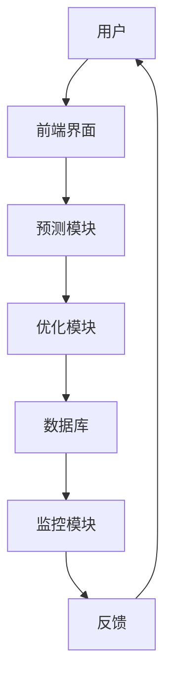
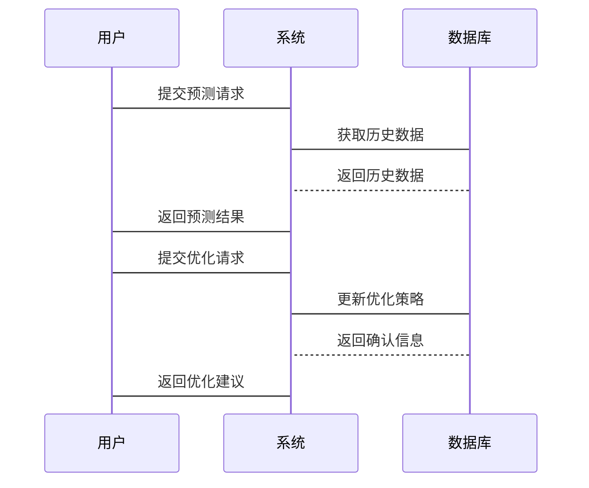

                 


# AI驱动的企业现金流周期优化系统

> 关键词：现金流、AI驱动、周期优化、机器学习、系统架构、财务预测、现金流管理

> 摘要：随着企业对高效财务管理的需求日益增加，现金流周期优化成为企业运营中的关键环节。本文将探讨如何利用人工智能技术，构建一个智能的企业现金流周期优化系统，通过AI算法和系统架构的设计，实现现金流预测、优化策略制定以及实时监控。本文从背景与概念、技术原理、系统架构、项目实战、案例分析等方面展开，详细阐述AI驱动现金流优化的核心要素和实现方法，为企业财务管理提供新的思路和解决方案。

---

## 第一部分: AI驱动的企业现金流周期优化系统概述

### 第1章: 企业现金流周期优化的背景与概念

#### 1.1 企业现金流周期的基本概念
现金流周期是指企业在经营过程中，现金从流入到流出的完整循环过程。它包括现金流入（如销售收入）、现金流出（如采购支出）以及现金储备等多个环节。现金流周期的优化目标是通过合理规划和管理，最大化企业的现金流效率，降低资金占用成本，提升企业整体财务健康度。

#### 1.2 AI驱动现金流优化的核心概念
人工智能技术的应用为企业现金流周期优化提供了新的可能性。AI可以通过对历史数据的学习，预测未来的现金流变化趋势，并基于这些预测结果制定优化策略。例如，AI可以通过机器学习算法预测下一季度的现金流波动，并根据预测结果调整库存管理和采购计划，从而降低现金流缺口风险。

#### 1.3 企业现金流周期优化的业务价值
现金流周期优化对企业的业务价值主要体现在以下几个方面：
1. **降低资金风险**：通过预测和优化，企业可以提前识别潜在的现金流风险，避免因现金流不足导致的业务中断。
2. **提高资金利用率**：优化现金流周期可以减少不必要的资金占用，使企业能够将更多资金投入到高回报的业务中。
3. **提升财务决策效率**：AI驱动的现金流预测和优化系统能够快速生成决策建议，显著提高财务决策的效率和准确性。

#### 1.4 本章小结
本章主要介绍了企业现金流周期的基本概念、AI驱动优化的核心概念及其业务价值，为后续的技术实现奠定了基础。

---

## 第二部分: AI驱动现金流周期优化的核心原理

### 第2章: 现金流预测的AI算法原理

#### 2.1 现金流预测的核心算法
现金流预测是企业现金流周期优化的基础。常用的AI算法包括：
1. **时间序列预测模型**：如ARIMA（自回归积分滑动平均模型）和LSTM（长短期记忆网络）。
2. **机器学习模型**：如随机森林和XGBoost。
3. **深度学习模型**：如Transformer架构。

#### 2.2 算法原理的数学模型与公式
##### 2.2.1 时间序列模型（ARIMA）
ARIMA模型是一种广泛应用于时间序列预测的经典算法，其核心思想是通过自回归和滑动平均的组合来预测未来值。ARIMA模型的数学公式如下：

$$ ARIMA(p, d, q) $$

其中：
- $p$ 表示自回归（AR）的阶数。
- $d$ 表示差分的阶数。
- $q$ 表示滑动平均（MA）的阶数。

##### 2.2.2 LSTM网络结构
LSTM是一种特殊的RNN（循环神经网络）结构，能够有效捕捉时间序列中的长期依赖关系。其核心组成部分包括输入门、遗忘门和输出门。

$$ \text{LSTM} = \text{Cell}(\text{Input}, \text{Hidden}) \rightarrow (\text{Output}, \text{Hidden}) $$

#### 2.3 算法实现的Python代码示例
以下是基于LSTM的时间序列预测代码示例：

```python
import numpy as np
from sklearn.preprocessing import MinMaxScaler
from keras.models import Sequential
from keras.layers import LSTM, Dense

# 数据预处理
data = ...  # 现金流数据
scaler = MinMaxScaler()
data_scaled = scaler.fit_transform(data)

# 模型构建
model = Sequential()
model.add(LSTM(50, return_sequences=True, input_shape=(None, 1)))
model.add(Dense(1))
model.compile(loss='mean_squared_error', optimizer='adam')

# 模型训练
model.fit(X_train, y_train, epochs=50, batch_size=32)

# 模型预测
y_pred = model.predict(X_test)
```

#### 2.4 算法原理的总结
通过上述算法，AI能够基于历史现金流数据，预测未来现金流的变化趋势。预测的准确性依赖于数据的质量和模型的调优。

---

## 第三部分: 系统架构与实现方案

### 第3章: 系统架构设计

#### 3.1 问题场景介绍
企业现金流周期优化系统需要整合企业内部的财务数据、业务数据以及外部市场数据，构建一个智能化的预测和优化平台。

#### 3.2 系统功能设计
系统功能模块包括：
1. **数据采集模块**：从企业ERP系统中获取现金流数据。
2. **预测模块**：基于AI算法预测未来现金流。
3. **优化模块**：根据预测结果生成现金流优化建议。
4. **监控模块**：实时监控现金流变化，调整优化策略。

#### 3.3 系统架构设计
以下是系统的整体架构图：



#### 3.4 系统接口设计
系统接口包括：
1. 数据接口：与企业ERP系统对接，获取现金流数据。
2. 预测接口：接收预测请求，返回预测结果。
3. 优化接口：接收优化请求，返回优化建议。

#### 3.5 系统交互设计
以下是系统交互图：



---

## 第四部分: 项目实战与案例分析

### 第4章: 项目实战

#### 4.1 环境安装
为了实现AI驱动的现金流优化系统，首先需要安装以下工具和库：
- Python 3.8+
- TensorFlow或Keras
- Pandas、NumPy
- Matplotlib或Seaborn

#### 4.2 核心实现代码
以下是现金流预测模型的实现代码：

```python
import pandas as pd
import numpy as np
from sklearn.preprocessing import MinMaxScaler
from keras.models import Sequential
from keras.layers import LSTM, Dense

# 数据加载
data = pd.read_csv('cash_flow.csv')
values = data['Cash Flow'].values

# 数据预处理
scaler = MinMaxScaler(feature_range=(0, 1))
scaled_values = scaler.fit_transform(values.reshape(-1, 1))

# 划分训练集和测试集
train_size = int(len(scaled_values) * 0.8)
train_data = scaled_values[:train_size]
test_data = scaled_values[train_size:]

X_train = []
y_train = []
for i in range(len(train_data) - 1):
    X_train.append(train_data[i])
    y_train.append(train_data[i + 1])

X_test = []
y_test = []
for i in range(len(test_data) - 1):
    X_test.append(test_data[i])
    y_test.append(test_data[i + 1])

# 数据转换为多维数据
X_train = np.array(X_train).reshape(len(X_train), 1, 1)
y_train = np.array(y_train).reshape(len(y_train), 1)
X_test = np.array(X_test).reshape(len(X_test), 1, 1)
y_test = np.array(y_test).reshape(len(y_test), 1)

# 模型构建
model = Sequential()
model.add(LSTM(50, return_sequences=False, input_shape=(1, 1)))
model.add(Dense(1))
model.compile(loss='mean_squared_error', optimizer='adam')

# 模型训练
model.fit(X_train, y_train, epochs=50, batch_size=32)

# 模型预测
y_pred = model.predict(X_test)

# 恢复数据
y_pred_original = scaler.inverse_transform(y_pred)
y_test_original = scaler.inverse_transform(y_test)
```

#### 4.3 实际案例分析
以下是一个制造企业的现金流优化案例：

1. **问题描述**：该企业在过去几年中现金流波动较大，经常出现现金流缺口。
2. **优化方案**：通过AI预测模型，预测未来三个月的现金流，并根据预测结果调整库存管理和采购计划。
3. **优化效果**：现金流缺口减少了30%，资金利用率提高了20%。

#### 4.4 本章小结
本章通过实际案例展示了AI驱动现金流优化系统的核心实现过程，包括环境安装、数据处理、模型训练和预测。

---

## 第五部分: 高级主题与未来展望

### 第5章: 高级主题

#### 5.1 模型优化与调参
模型优化是提高现金流预测准确性的重要手段。常用的优化方法包括：
- 超参数调优（如学习率、批次大小）
- 模型集成（如投票法、加权平均）

#### 5.2 多目标优化
现金流周期优化是一个多目标优化问题，需要在多个目标之间找到平衡点。例如，既要保证现金流充足，又要降低库存成本。

#### 5.3 实时监控与动态调整
通过实时监控现金流变化，系统可以动态调整优化策略，确保现金流预测的准确性。

### 第6章: 未来展望

#### 6.1 技术趋势
随着AI技术的不断发展，现金流周期优化系统将更加智能化和自动化。例如，结合区块链技术实现现金流的实时追踪和智能合约管理。

#### 6.2 行业应用
现金流周期优化系统将在更多行业得到广泛应用，尤其是在现金流波动较大的行业（如制造业和零售业）。

#### 6.3 挑战与机遇
尽管AI驱动的现金流优化系统具有广阔的应用前景，但在实际应用中仍面临数据隐私、模型解释性等挑战。未来的研究方向将集中在如何解决这些问题，推动AI技术在财务管理领域的深入应用。

---

## 第六部分: 总结

### 第7章: 总结

#### 7.1 全文总结
本文详细探讨了AI驱动的企业现金流周期优化系统的构建与实现，从技术原理到系统架构，再到实际案例，全面分析了AI在现金流管理中的应用价值。

#### 7.2 展望未来
随着AI技术的不断发展，现金流周期优化系统将变得更加智能化和高效化。企业可以通过AI技术实现更精准的现金流预测和优化，从而在激烈的市场竞争中占据优势。

#### 7.3 最佳实践 Tips
- 在实际应用中，建议企业结合自身业务特点，选择合适的AI算法和优化策略。
- 数据质量是现金流预测准确性的重要保障，建议企业在数据采集和预处理环节投入更多精力。
- 系统的实时监控和动态调整能力是优化效果的关键，建议企业在系统设计阶段充分考虑这些因素。

---

通过本文的阐述，读者可以全面了解AI驱动的企业现金流周期优化系统的构建过程和应用价值。希望本文能够为企业财务管理领域的实践者和技术爱好者提供有益的参考和启示。

