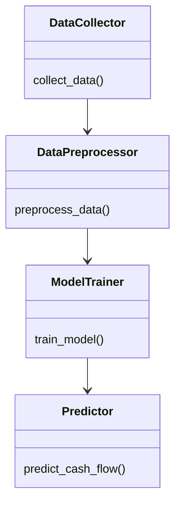

                 


# AI驱动的企业现金流预测与优化系统

> 关键词：AI、现金流预测、现金流优化、机器学习、深度学习、企业财务管理

> 摘要：本文将探讨如何利用人工智能技术驱动企业现金流预测与优化系统。通过结合时间序列分析、机器学习和深度学习算法，我们能够更精准地预测未来现金流，并制定有效的优化策略。文章将从现金流预测的背景与意义出发，详细分析AI技术在其中的核心作用，介绍相关算法原理，并通过实际案例展示如何构建和优化现金流预测与管理系统。最终，我们将总结AI驱动现金流预测与优化系统的优势，并展望其未来的发展方向。

---

# 第一部分: 企业现金流预测的背景与意义

## 第1章: 企业现金流预测的背景与意义

### 1.1 企业现金流预测的背景

现金流是企业运营的核心命脉，直接关系到企业的生存与发展。传统的现金流预测方法依赖于财务人员的经验和手工计算，存在效率低、精度差、难以应对复杂市场变化等局限性。随着人工智能技术的快速发展，基于机器学习和深度学习的现金流预测方法逐渐成为企业财务管理的重要工具。

#### 1.1.1 现金流预测的核心概念

现金流预测是指通过历史数据和市场信息，利用数学模型和算法，预测未来一段时间内企业的现金流入和流出情况。其核心在于构建一个能够准确捕捉时间序列特征、市场波动和业务模式的预测模型。

#### 1.1.2 现金流预测的挑战与痛点

- 数据维度复杂：现金流受市场、经济、企业内部管理等多方面因素影响。
- 时间序列特征：现金流预测需要处理时间依赖性数据，传统统计方法难以捕捉非线性特征。
- 预测精度要求高：企业需要高精度的预测结果以支持决策。
- 实时性需求：企业希望预测结果能够快速更新，以应对市场变化。

#### 1.1.3 AI技术在现金流预测中的潜力

人工智能技术，特别是机器学习和深度学习，能够通过大量数据训练模型，捕捉复杂的非线性关系，显著提高预测精度。此外，AI技术还可以实时更新模型，快速响应市场变化，满足企业对现金流预测的实时性需求。

---

## 第2章: AI驱动现金流预测的技术基础

### 2.1 人工智能与现金流预测的结合

人工智能技术在现金流预测中的应用主要集中在以下几个方面：

#### 2.1.1 机器学习在时间序列预测中的应用

机器学习算法，如随机森林和梯度提升树，能够通过特征工程提取有用的财务指标，建立预测模型。尽管这些算法在处理时间序列数据时存在一定局限性，但在特定场景下仍能发挥重要作用。

#### 2.1.2 深度学习在现金流预测中的优势

深度学习算法，特别是长短期记忆网络（LSTM）和双向LSTM（BLSTM），能够有效捕捉时间序列数据中的长期依赖关系，显著提高预测精度。

#### 2.1.3 自然语言处理在财务数据中的应用

自然语言处理技术可以帮助企业从财务报告、新闻公告等非结构化数据中提取有价值的信息，进一步丰富现金流预测的特征维度。

---

## 第3章: 现金流预测的数学模型与算法

### 3.1 时间序列分析基础

时间序列分析是现金流预测的核心方法之一。以下是一些常用的数学模型：

#### 3.1.1 ARIMA模型的原理与应用

ARIMA（自回归积分滑动平均）模型是一种经典的统计学方法，适用于线性时间序列数据的预测。其基本假设是数据服从平稳分布，但在实际应用中，许多现金流数据可能表现出非平稳性，因此需要通过差分等方法进行预处理。

#### 3.1.2 LSTM网络在时间序列预测中的应用

LSTM（长短期记忆网络）是一种特殊的循环神经网络（RNN），能够有效捕捉时间序列数据中的长期依赖关系。其核心在于引入记忆单元和遗忘门，避免传统RNN模型中存在的梯度消失问题。

#### 3.1.3 其他时间序列预测算法对比

以下是几种常用时间序列预测算法的对比：

| 算法名称 | 优点 | 缺点 |
|----------|------|------|
| ARIMA    | 简单易用 | 适用于线性平稳数据 |
| LSTM     | 能捕捉长期依赖关系 | 计算复杂度高 |
| GRU      | 计算效率高 | 适合较短序列预测 |
| Prophet   | 易用性高 | 适用于业务时间序列 |

---

## 第4章: 现金流预测系统的架构与设计

### 4.1 系统架构设计

现金流预测系统的设计需要综合考虑数据处理、模型训练和预测部署等多个环节。以下是一个典型的分层架构设计：

1. **数据层**：负责数据的采集、清洗和预处理。
2. **模型层**：包括特征工程、模型训练和调优。
3. **预测层**：提供实时预测服务，输出预测结果。

#### 4.1.1 数据流与组件交互设计

以下是系统架构的类图：



---

## 第5章: 现金流优化策略与应用场景

### 5.1 现金流优化的策略

现金流优化需要结合预测结果，制定合理的资金管理策略。以下是几种常见的优化策略：

#### 5.1.1 短期现金流优化策略

短期优化主要关注未来几周或几个月的现金流预测结果，帮助企业合理安排日常运营资金。

#### 5.1.2 中长期现金流优化规划

中长期优化需要结合企业战略目标，制定未来几年的现金流管理计划。

#### 5.1.3 灵活性与风险控制的平衡

在优化过程中，需要在灵活性和风险控制之间找到平衡点，避免因过度优化而导致的流动性风险。

---

## 第6章: 现金流预测的深度学习实现

### 6.1 基于LSTM的现金流预测模型

LSTM网络在时间序列预测中的优势在于其能够有效捕捉长期依赖关系。以下是LSTM网络的结构：


---

## 第7章: 项目实战与代码实现

### 7.1 环境安装与配置

以下是安装所需库的代码：

```python
# 安装所需库
pip install numpy
pip install pandas
pip install tensorflow
pip install scikit-learn
pip install matplotlib
```

### 7.2 数据采集与预处理

以下是数据预处理的代码示例：

```python
import pandas as pd
import numpy as np

# 数据加载
data = pd.read_csv('cash_flow.csv')

# 数据清洗
data.dropna(inplace=True)
data['date'] = pd.to_datetime(data['date'])
data.set_index('date', inplace=True)

# 特征工程
features = data[['revenue', 'expense', 'profit']]
labels = data['cash_flow']
```

---

## 第8章: 总结与展望

### 8.1 总结

AI技术在现金流预测与优化系统中的应用，不仅提高了预测精度，还为企业提供了实时、动态的现金流管理能力。通过结合机器学习和深度学习算法，企业能够更好地应对市场变化，优化资金管理。

### 8.2 展望

未来，随着AI技术的不断发展，现金流预测与优化系统将更加智能化和个性化。企业可以利用大数据和实时数据流，构建更加精准的预测模型，并制定更加灵活的资金管理策略。

---

# 结语

AI驱动的企业现金流预测与优化系统，不仅是企业财务管理的重要工具，更是人工智能技术在商业应用中的典型成功案例。通过本文的介绍，我们相信，随着技术的不断进步，现金流预测与优化系统将在企业运营中发挥越来越重要的作用。

