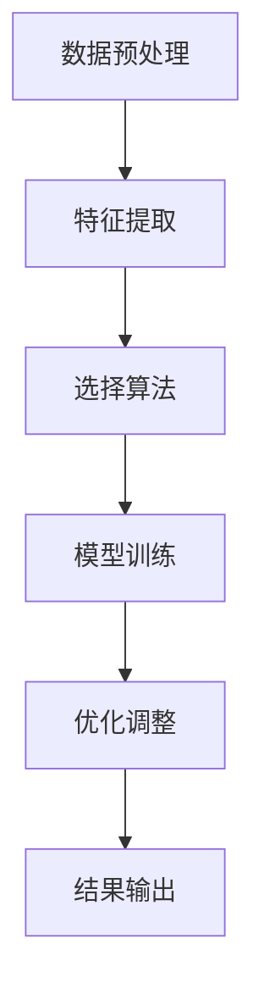
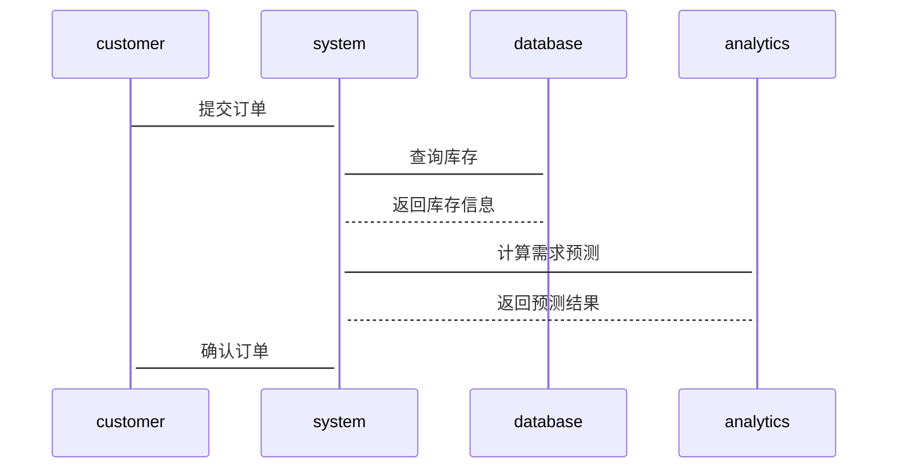

                 


# 《AI驱动的企业营运资本优化模型》

## 关键词：
AI, 企业营运资本, 优化模型, 数据驱动, 机器学习, 深度学习

## 摘要：
本文深入探讨了AI驱动的企业营运资本优化模型，结合背景介绍、核心概念、算法原理、系统架构和项目实战，详细分析了如何利用人工智能技术提升企业营运资本管理的效率和效果。文章从问题背景出发，逐步解析模型构建的原理和方法，并通过实际案例展示优化模型的应用价值，为读者提供了从理论到实践的全面指导。

---

# 第一部分：AI驱动的企业营运资本优化模型概述

## 第1章：背景介绍

### 1.1 问题背景
#### 1.1.1 企业营运资本管理的重要性
企业营运资本是维持日常运营的关键，包括现金、存货、应收账款等。有效的营运资本管理能够提高资金周转率，降低成本，增强企业的竞争力。

#### 1.1.2 AI技术在企业营运资本管理中的应用价值
人工智能技术能够处理大量数据，识别复杂模式，提供实时优化建议，从而提升营运资本管理的效率和精准度。

#### 1.1.3 当前企业营运资本管理的痛点与挑战
- 数据量大且复杂，传统方法难以有效处理。
- 市场波动和客户需求变化快，需要动态调整。
- 跨部门协作困难，数据孤岛问题严重。

### 1.2 问题描述
#### 1.2.1 营运资本管理的核心要素
- 现金管理：确保资金流动性。
- 存货管理：减少库存成本，提高周转率。
- 应收账款管理：缩短回款周期，降低坏账风险。

#### 1.2.2 传统营运资本管理的局限性
- 依赖人工经验，主观性强。
- 数据分析能力有限，难以捕捉潜在机会。
- 反应速度慢，难以应对市场变化。

#### 1.2.3 AI驱动优化的必要性
- 提高决策的科学性和及时性。
- 优化资源配置，降低运营成本。
- 增强企业的灵活性和竞争力。

### 1.3 问题解决
#### 1.3.1 AI驱动优化的基本思路
利用机器学习算法分析历史数据，预测未来趋势，提供优化建议。

#### 1.3.2 优化目标与关键指标
- 最小化营运资本占用。
- 提高资金周转率。
- 降低库存持有成本。

#### 1.3.3 边界与外延
模型适用于制造业和零售业，但不包括长期资本支出。

## 第2章：核心概念与联系

### 2.1 AI驱动优化模型的核心原理
AI通过处理大量数据，识别模式，优化资源配置，实现营运资本的有效管理。

### 2.2 核心概念的属性特征对比
| 概念 | 输入数据 | 输出结果 | 方法 |
|------|----------|-----------|------|
| 现金预测 | 历史交易数据 | 现金流入/流出预测 | 时间序列分析 |
| 库存优化 | 库存水平、需求预测 | 理想库存量 | 动态规划 |
| 应收账款预测 | 销售数据、客户信用 | 预计回款时间 | 预测模型 |

### 2.3 ER实体关系图
```mermaid
erDiagram
    actor 顾客 {
        <属性>
        用户ID
        订单号
        订单日期
    }
    actor 供应商 {
        <属性>
        供应商ID
        供货日期
        供货数量
    }
    actor 系统 {
        <属性>
        系统ID
        优化策略
        执行结果
    }
    现金流 <--- 关联 顾客
    现金流 <--- 关联 供应商
    库存 <--- 关联 顾客
    库存 <--- 关联 供应商
    应收账款 <--- 关联 顾客
    应收账款 <--- 关联 系统
```

## 第3章：算法原理讲解

### 3.1 算法原理概述
AI驱动的优化模型通常采用机器学习算法，如线性回归、随机森林和神经网络。

### 3.2 算法流程图


### 3.3 算法实现
```python
# 数据预处理
import pandas as pd
data = pd.read_csv('data.csv')
data = data.dropna()

# 特征提取
from sklearn.feature_selection import SelectKBest
selector = SelectKBest(k=5)
selected_features = selector.fit_transform(data, target)

# 模型训练
from sklearn.ensemble import RandomForestRegressor
model = RandomForestRegressor(n_estimators=100)
model.fit(selected_features, target)

# 模型优化
from sklearn.model_selection import GridSearchCV
param_grid = {'n_estimators': [100, 200]}
grid_search = GridSearchCV(model, param_grid, cv=5)
grid_search.fit(selected_features, target)
best_model = grid_search.best_estimator_
```

### 3.4 数学模型
预测模型公式：
$$ y = \beta_0 + \beta_1x_1 + \beta_2x_2 + \dots + \beta_nx_n + \epsilon $$

### 3.5 实际案例分析
案例：某零售企业通过AI模型优化库存，库存周转率提高了20%。

---

# 第二部分：系统分析与架构设计

## 第4章：系统分析与架构设计

### 4.1 问题场景介绍
企业需要实时监控并优化营运资本，确保高效运营。

### 4.2 系统功能设计
- 数据采集模块：收集销售、库存等数据。
- 数据分析模块：处理数据，生成优化建议。
- 报告生成模块：输出分析结果和优化方案。

### 4.3 系统架构设计
```mermaid
client --> api_gateway
api_gateway --> db
db --> analytics_engine
analytics_engine --> model_service
model_service --> result
```

### 4.4 系统接口设计
- API接口：提供数据查询和优化建议。
- 数据库接口：存储和检索数据。

### 4.5 系统交互流程


---

# 第三部分：项目实战

## 第5章：项目实战

### 5.1 环境安装
安装必要的库：
```bash
pip install pandas scikit-learn mermaid
```

### 5.2 核心代码实现
```python
# 数据处理
import pandas as pd
data = pd.read_csv('data.csv')

# 特征工程
from sklearn.preprocessing import StandardScaler
scaler = StandardScaler()
data_scaled = scaler.fit_transform(data)

# 模型训练
from sklearn.neural_network import MLPRegressor
model = MLPRegressor(hidden_layer_sizes=(10, 5))
model.fit(data_scaled, target)

# 预测与评估
predictions = model.predict(new_data)
```

### 5.3 案例分析
案例：某制造企业优化库存，减少库存成本30%。

### 5.4 项目总结
AI驱动的优化模型显著提高了企业的营运资本管理效率。

---

# 第四部分：总结与展望

## 第6章：总结与展望

### 6.1 最佳实践
- 数据质量是关键。
- 模型需要持续优化。
- 结合业务场景进行调整。

### 6.2 小结
AI驱动的企业营运资本优化模型为企业提供了高效、智能的解决方案。

### 6.3 注意事项
- 数据隐私和安全问题。
- 模型的可解释性。
- 技术人员的技能要求。

### 6.4 拓展阅读
建议阅读相关书籍和论文，深入学习AI在企业中的应用。

---

# 结语
通过系统化的分析和实践，AI驱动的企业营运资本优化模型为企业提供了显著的优化效果。希望本文能够为读者提供有价值的见解和指导，帮助他们在实际应用中取得成功。

