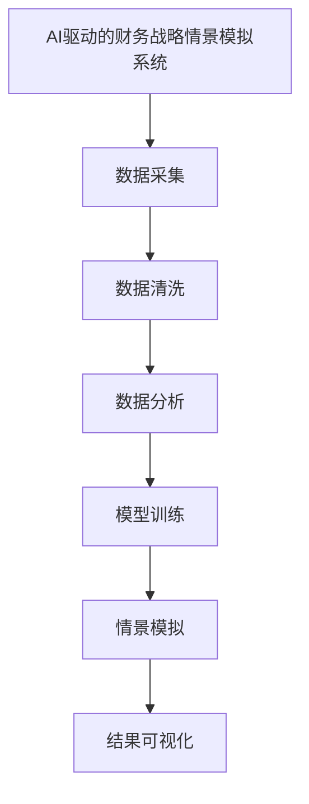
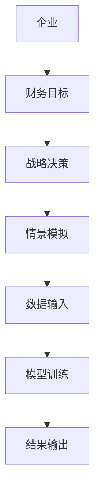
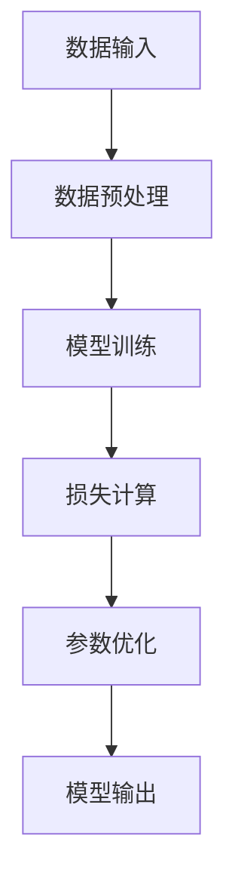
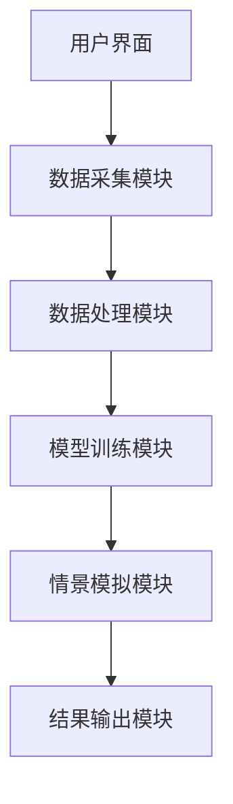
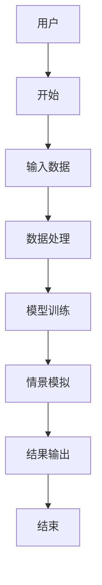

                 


# AI驱动的企业财务战略情景模拟系统

## 关键词：人工智能（AI）、财务战略、情景模拟、系统架构、算法原理

## 摘要：本文详细探讨了AI在企业财务战略情景模拟系统中的应用，从问题背景、核心概念、算法原理、系统架构到项目实战，系统性地分析了如何利用AI技术提升财务战略的制定与执行效率。通过生成式AI算法和大数据分析，构建了一个智能化的财务战略情景模拟系统，为企业提供更精准的决策支持。

---

# 第一部分: AI驱动的企业财务战略情景模拟系统背景介绍

# 第1章: 问题背景与描述

## 1.1 问题背景

### 1.1.1 传统企业财务战略的局限性
传统财务战略依赖于人工分析和经验判断，存在以下问题：
- 数据处理效率低，难以应对海量数据。
- 战略模拟的场景有限，难以覆盖复杂多变的市场环境。
- 预测结果的准确性依赖于人工经验，存在主观性。

### 1.1.2 AI技术对企业财务管理的变革
AI技术的引入，为财务管理带来了革命性的变化：
- 提高数据处理效率，实现自动化分析。
- 增强预测能力，提供更精准的财务模型。
- 优化决策过程，提升企业竞争力。

### 1.1.3 情景模拟在财务战略中的重要性
情景模拟能够帮助企业应对不确定性，制定更具前瞻性的财务策略：
- 通过模拟不同市场环境下的财务表现，优化资源配置。
- 评估多种假设条件下的战略效果，降低风险。

## 1.2 问题描述

### 1.2.1 财务战略中的不确定性问题
企业在复杂多变的市场环境中，面临诸多不确定性因素：
- 经济波动、政策变化等外部因素影响财务表现。
- 内部资源分配不当可能导致战略失败。

### 1.2.2 情景模拟的需求与应用场景
情景模拟在财务战略中的应用场景包括：
- 预测未来财务状况，制定预算计划。
- 评估投资项目的可行性。
- 分析不同战略决策对财务表现的影响。

### 1.2.3 当前解决方案的不足
现有解决方案存在以下问题：
- 数据分析能力有限，难以处理复杂场景。
- 模拟结果缺乏深度分析，难以提供有效决策支持。
- 缺乏实时性，无法应对快速变化的市场环境。

## 1.3 问题解决思路

### 1.3.1 AI驱动的解决方案概述
通过AI技术，构建智能化的情景模拟系统：
- 利用生成式AI生成多种财务场景。
- 通过深度学习模型分析财务数据，优化模拟结果。

### 1.3.2 情景模拟的核心作用
情景模拟在财务战略中的核心作用：
- 提供多维度的财务分析，帮助制定最优策略。
- 通过模拟测试，降低战略风险。

### 1.3.3 系统化解决方案的设计思路
系统化解决方案的设计思路包括：
- 整合企业内外部数据，构建统一的数据平台。
- 应用AI算法，实现智能分析与预测。
- 可视化模拟结果，提供直观的决策支持。

## 1.4 概念结构与核心要素

### 1.4.1 核心概念的层次结构
- 顶层概念：AI驱动的财务战略情景模拟系统。
- 中层概念：生成式AI、大数据分析、财务模型。
- 下层概念：数据采集、模型训练、情景模拟。

### 1.4.2 核心要素的定义与关系
- 数据采集：获取企业内外部数据，为模型训练提供基础。
- 模型训练：利用深度学习算法，构建生成式AI模型。
- 情景模拟：通过模型生成多种财务场景，评估战略效果。

### 1.4.3 概念结构图展示


---

# 第二部分: 核心概念与联系

# 第2章: 核心概念原理

## 2.1 AI在财务战略中的应用原理

### 2.1.1 生成式AI的基本原理
生成式AI通过深度学习模型，生成新的数据或内容：
- 基于训练数据，生成与训练数据相似的新内容。
- 适用于文本生成、图像生成等多种任务。

### 2.1.2 大模型在财务分析中的应用
大模型在财务分析中的应用包括：
- 自动化生成财务报告。
- 预测财务趋势。
- 分析财务数据，发现潜在问题。

### 2.1.3 情景模拟的核心算法
情景模拟的核心算法包括：
- Monte Carlo模拟：通过随机采样，生成多种财务场景。
- 假设分析：基于不同的假设条件，生成多种财务情景。

## 2.2 核心概念属性对比表
| 概念       | 生成式AI | 大数据分析 | 情景模拟 |
|------------|----------|------------|----------|
| 数据需求   | 高       | 高         | 高       |
| 计算复杂度 | 高       | 高         | 高       |
| 应用场景   | 文本生成 | 数据挖掘   | 预测与评估 |

## 2.3 ER实体关系图


---

# 第三部分: 算法原理讲解

# 第3章: 生成式AI算法原理

## 3.1 算法概述

### 3.1.1 大模型的基本架构
大模型的基本架构包括：
- 输入层：接收原始数据。
- 隐藏层：通过神经网络处理数据。
- 输出层：生成最终结果。

### 3.1.2 训练过程
训练过程包括：
- 数据预处理：清洗、归一化等。
- 模型训练：利用反向传播算法优化模型参数。
- 模型评估：验证模型性能。

### 3.1.3 模型的数学表达
模型的数学表达包括：
- 损失函数：衡量预测值与真实值的差异。
$$ L = \frac{1}{n}\sum_{i=1}^{n}(y_i - \hat{y}_i)^2 $$
- 优化器：用于更新模型参数，常用Adam优化器。
$$ \theta_{new} = \theta_{old} - \eta \cdot \nabla L $$

## 3.2 算法实现

### 3.2.1 环境安装
安装必要的库：
```bash
pip install numpy pandas torch matplotlib
```

### 3.2.2 核心代码实现
```python
import torch
import torch.nn as nn
import torch.optim as optim

class Generator(nn.Module):
    def __init__(self, input_dim, hidden_dim, output_dim):
        super(Generator, self).__init__()
        self.fc1 = nn.Linear(input_dim, hidden_dim)
        self.fc2 = nn.Linear(hidden_dim, output_dim)
    
    def forward(self, x):
        x = torch.relu(self.fc1(x))
        x = torch.sigmoid(self.fc2(x))
        return x

# 初始化模型和优化器
input_dim = 10
hidden_dim = 20
output_dim = 1
generator = Generator(input_dim, hidden_dim, output_dim)
optimizer = optim.Adam(generator.parameters(), lr=0.001)

# 训练过程
for epoch in range(100):
    for batch in data_loader:
        optimizer.zero_grad()
        inputs, labels = batch
        outputs = generator(inputs)
        loss = criterion(outputs, labels)
        loss.backward()
        optimizer.step()
```

### 3.2.3 算法流程图


---

# 第四部分: 系统分析与架构设计

# 第4章: 系统分析与架构设计

## 4.1 系统应用场景

### 4.1.1 企业财务战略规划
- 预测未来财务状况，制定预算计划。
- 分析不同战略决策对财务表现的影响。

### 4.1.2 投资项目评估
- 评估投资项目在不同市场环境下的可行性。
- 通过情景模拟，优化投资决策。

## 4.2 系统功能设计

### 4.2.1 数据采集模块
- 数据来源：企业财务数据、市场数据、行业数据。
- 数据格式：结构化数据、非结构化数据。
- 数据存储：数据库、数据仓库。

### 4.2.2 模型构建模块
- 模型类型：生成式AI模型、预测模型。
- 模型训练：利用历史数据训练模型。
- 模型评估：验证模型性能。

### 4.2.3 情景模拟模块
- 模拟场景：不同市场环境、政策变化、企业战略调整。
- 模拟结果：财务指标预测、风险评估、优化建议。

## 4.3 系统架构设计

### 4.3.1 系统架构图


### 4.3.2 接口设计
- 数据接口：数据输入、输出接口。
- API接口：提供给其他系统调用。
- 用户接口：供用户交互使用。

## 4.4 系统交互流程

### 4.4.1 用户操作流程


---

# 第五部分: 项目实战

# 第5章: 项目实战

## 5.1 环境安装

### 5.1.1 安装必要的库
```bash
pip install numpy pandas torch matplotlib seaborn
```

## 5.2 系统核心实现

### 5.2.1 数据预处理
```python
import pandas as pd
import numpy as np

data = pd.read_csv('financial_data.csv')
data = data.dropna()
data = (data - data.mean()) / data.std()
```

### 5.2.2 模型训练
```python
model = nn.Sequential(
    nn.Linear(10, 20),
    nn.ReLU(),
    nn.Linear(20, 1)
)
criterion = nn.MSELoss()
optimizer = optim.Adam(model.parameters(), lr=0.001)

for epoch in range(100):
    for batch in data_loader:
        inputs, labels = batch
        outputs = model(inputs)
        loss = criterion(outputs, labels)
        loss.backward()
        optimizer.step()
```

### 5.2.3 情景模拟
```python
def generate_scenario(model, input_data):
    with torch.no_grad():
        output = model(input_data)
        return output.numpy()

scenario_input = np.random.randn(10)
scenario_output = generate_scenario(model, scenario_input)
```

## 5.3 实际案例分析

### 5.3.1 数据分析
```python
import matplotlib.pyplot as plt

data['predicted'] = model.predict(data['input'])
plt.plot(data['input'], data['predicted'])
plt.show()
```

### 5.3.2 结果解读
- 模型预测结果与实际数据对比。
- 分析不同情景下的财务表现。

## 5.4 项目小结

### 5.4.1 核心代码实现
- 数据预处理。
- 模型训练。
- 情景模拟。

### 5.4.2 经验总结
- 数据质量对模型性能的影响。
- 模型调参的重要性。

---

# 第六部分: 总结与展望

# 第6章: 总结与展望

## 6.1 全文总结

### 6.1.1 核心内容回顾
- AI在财务战略中的应用。
- 情景模拟的核心算法。
- 系统架构设计。

### 6.1.2 最佳实践
- 数据质量管理。
- 模型优化。
- 系统安全性保障。

## 6.2 未来展望

### 6.2.1 技术发展趋势
- 大模型的持续优化。
- 多模态AI的应用。
- 自动化决策系统的普及。

### 6.2.2 应用前景
- 更多行业的应用。
- 更精准的财务预测。
- 更高效的财务管理。

---

# 第七部分: 最佳实践 Tips

## 7.1 Tips

### 7.1.1 数据质量管理
- 数据清洗：去除重复、缺失数据。
- 数据归一化：提升模型性能。
- 数据标注：确保数据准确性。

### 7.1.2 模型优化建议
- 参数调整：优化学习率、批量大小。
- 模型结构：尝试不同的网络架构。
- 正则化：防止过拟合。

## 7.2 小结
通过本文的系统性分析，我们深入了解了AI在企业财务战略情景模拟系统中的应用，掌握了核心算法与系统架构设计，为实际应用提供了理论与实践指导。

## 7.3 注意事项
- 数据隐私保护。
- 系统稳定性保障。
- 模型的可解释性。

## 7.4 拓展阅读
- 《生成式AI：原理与应用》。
- 《企业财务管理：理论与实践》。
- 《深度学习在金融中的应用》。

--- 

希望这个目录大纲能为您提供清晰的写作思路和内容框架！如果需要进一步的章节内容扩展或调整，请随时告诉我。

