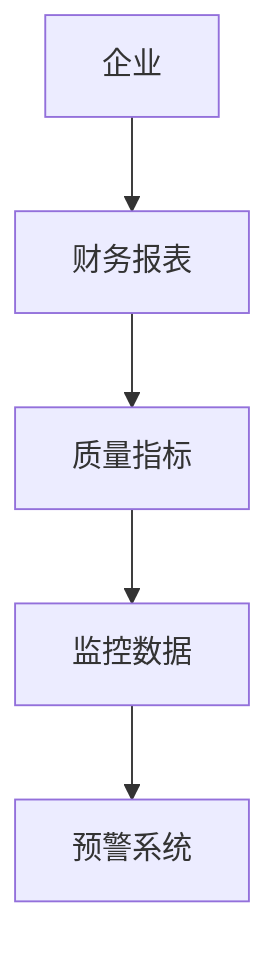
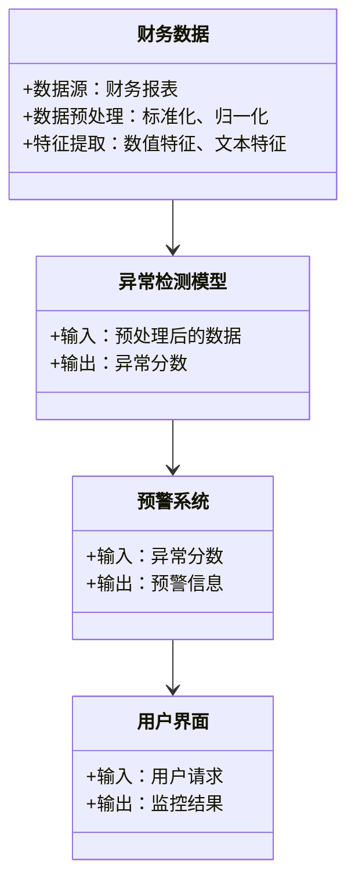
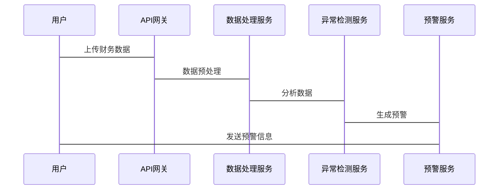

                 


# AI驱动的企业财务报表质量动态监控与预警系统

> 关键词：财务报表质量，动态监控，预警系统，人工智能，异常检测，自然语言处理

> 摘要：本文探讨了利用人工智能技术实现企业财务报表质量的动态监控与预警系统。通过分析财务数据的异常情况和潜在风险，结合先进的算法和系统架构设计，提出了一种高效的解决方案，为企业财务管理提供智能化支持。

---

## 第一部分: 背景与概念

### 第1章: 企业财务报表质量监控的重要性

#### 1.1 财务报表质量监控的背景与意义
企业财务报表是反映企业经营状况的重要工具，其准确性和及时性直接影响企业的决策和信用评级。然而，传统的财务报表监控方式依赖人工审核，存在效率低、覆盖面有限的问题。随着企业规模的扩大和数据量的增加，传统的监控方法难以满足实时性和精准性的需求。引入人工智能技术，可以通过自动化分析和实时监控，显著提升财务报表质量监控的效率和准确性。

#### 1.2 问题背景与描述
财务报表质量问题主要体现在数据造假、信息不完整、异常波动等方面。这些问题可能影响企业的财务健康状况，甚至引发法律风险。传统的财务报表监控依赖于定期审计和人工检查，这种方式不仅耗时，而且难以捕捉到实时的财务异常情况。

#### 1.3 AI驱动监控的优势与必要性
人工智能技术能够通过机器学习算法自动识别财务数据中的异常模式，并利用自然语言处理技术从文本中提取关键信息。AI驱动的监控系统可以实时分析大量财务数据，快速识别潜在风险，并提供预警，从而帮助企业及时采取措施，避免重大损失。

---

### 第2章: 核心概念与联系

#### 2.1 核心概念原理
- **财务报表质量**：指财务报表数据的准确性、完整性和合规性。
- **动态监控**：指对财务数据进行实时分析，识别潜在异常。
- **预警系统**：通过设定阈值和规则，对异常情况进行报警。

#### 2.2 核心概念对比分析
| 概念 | 描述 | 与传统监控的区别 |
|------|------|-----------------|
| 财务报表质量 | 数据的准确性与合规性 | 通过AI算法自动评估，而非人工审核。 |
| 动态监控 | 实时分析数据 | 从定期检查变为实时分析。 |
| 预警系统 | 基于阈值的报警机制 | 结合AI模型，提供更智能的报警。 |

#### 2.3 ER实体关系图


---

## 第二部分: 技术原理

### 第3章: 异常检测算法

#### 3.1 基于机器学习的异常检测
异常检测算法可以识别财务数据中的异常值，例如销售额突然下降或成本异常增加。

##### 算法流程
1. 数据预处理：标准化和归一化。
2. 模型训练：使用Isolation Forest算法。
3. 异常识别：基于模型预测结果。

##### 代码示例
```python
from sklearn.ensemble import IsolationForest

# 数据预处理
X = df[['revenue', 'cost']].values
from sklearn.preprocessing import StandardScaler
scaler = StandardScaler()
X_scaled = scaler.fit_transform(X)

# 模型训练
model = IsolationForest(n_estimators=100, random_state=42)
model.fit(X_scaled)

# 异常识别
outliers = model.predict(X_scaled)
outliers = [x for x in outliers if x == -1]
```

#### 3.2 基于深度学习的异常检测
深度学习模型（如LSTM）可以捕捉时间序列数据中的复杂模式。

##### 算法流程
1. 数据预处理：滑动窗口生成序列数据。
2. 模型训练：使用LSTM网络。
3. 异常预测：基于模型输出概率。

##### 代码示例
```python
from tensorflow.keras.models import Sequential
from tensorflow.keras.layers import LSTM, Dense

# 数据预处理
X_train = []
for i in range(len(df) - time_window):
    X_train.append(df[i:i+time_window])

X_train = np.array(X_train)

# 模型训练
model = Sequential()
model.add(LSTM(64, input_shape=(time_window, 2)))
model.add(Dense(1, activation='sigmoid'))
model.compile(optimizer='adam', loss='binary_crossentropy')
model.fit(X_train, y_train, epochs=10)
```

---

### 第4章: 自然语言处理技术

#### 4.1 文本挖掘在财务报表分析中的应用
NLP技术可以从财务报告的文本中提取关键信息，例如识别财务风险相关的关键词。

##### 算法流程
1. 文本分词：将财务报告分解为词语。
2. 实体识别：识别公司名称、金额等实体。
3. 情感分析：分析财务报告的语气。

##### 代码示例
```python
from spacy.lang.zh import Chinese
import spacy

# 文本分词
nlp = spacy.load("zh_core_web_sm")
doc = nlp("公司今年的利润大幅下降。")
for token in doc:
    print(token.text)
```

---

## 第三部分: 系统分析与架构设计

### 第5章: 系统架构设计

#### 5.1 领域模型设计


#### 5.2 系统架构设计


#### 5.3 系统接口设计
- API接口：RESTful API，提供数据上传、查询功能。
- 数据格式：JSON格式，支持批量处理。

#### 5.4 系统交互设计


---

## 第四部分: 项目实战

### 第6章: 项目实现

#### 6.1 环境搭建
- Python 3.8+
- Scikit-learn、TensorFlow、spaCy
- Jupyter Notebook

#### 6.2 核心实现
##### 数据预处理
```python
import pandas as pd
from sklearn.preprocessing import StandardScaler

df = pd.read_csv('financial_data.csv')
X = df[['revenue', 'cost']].values
scaler = StandardScaler()
X_scaled = scaler.fit_transform(X)
```

##### 模型训练
```python
from sklearn.ensemble import IsolationForest

model = IsolationForest(n_estimators=100, random_state=42)
model.fit(X_scaled)
```

##### 预警系统
```python
outliers = model.predict(X_scaled)
outliers = [x for x in outliers if x == -1]
if len(outliers) > 0:
    print("检测到异常数据")
```

#### 6.3 案例分析
假设某公司财务报表显示成本突然增加，系统会触发预警，并提示可能存在数据造假或管理问题。

---

## 第五部分: 优化与总结

### 第7章: 优化与维护

#### 7.1 模型优化
- 调整超参数。
- 使用集成学习提升准确率。

#### 7.2 系统维护
- 定期更新模型。
- 监控系统性能。

---

### 总结
本文详细探讨了AI驱动的企业财务报表质量动态监控与预警系统的设计与实现。通过结合异常检测和自然语言处理技术，系统能够实时分析财务数据，识别潜在风险，并提供智能预警。这种智能化的解决方案将显著提升企业财务管理水平，为企业决策提供有力支持。

