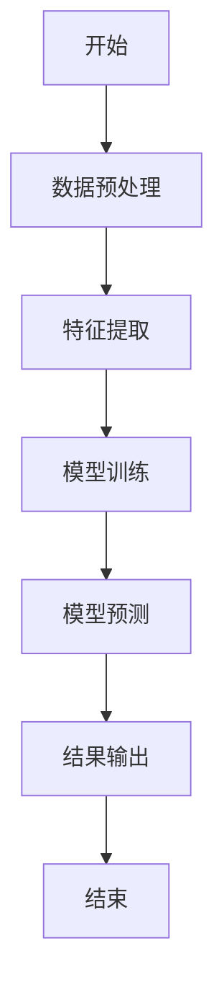

                 


# AI驱动的企业财务舞弊检测系统

> 关键词：AI驱动，财务舞弊检测，深度学习，系统架构，项目实战

> 摘要：本文介绍了一种基于AI的财务舞弊检测系统，探讨了其在企业财务管理中的应用，详细分析了系统的核心概念、算法原理、系统架构，并通过实际案例展示了系统的实现过程和效果。

---

## 第一部分: 背景介绍

### 第1章: 企业财务舞弊检测的背景与挑战

#### 1.1 问题背景
财务舞弊是指企业在财务报表或其他财务记录中故意提供虚假信息，以掩盖真实的财务状况。这种行为不仅损害了企业的利益，还可能导致投资者、债权人和监管机构的重大损失。

#### 1.2 问题描述
财务舞弊的形式多种多样，包括虚增收入、隐瞒债务、虚减费用等。传统的财务舞弊检测方法主要依赖人工审计，存在效率低、成本高、易受主观因素影响等局限性。

#### 1.3 问题解决
引入AI技术，特别是深度学习模型，可以显著提高财务舞弊检测的效率和准确性。通过分析大量财务数据，AI模型能够识别出潜在的舞弊模式和异常行为。

#### 1.4 边界与外延
本系统主要关注企业财务报表中的舞弊行为，不涉及其他类型的舞弊，如税务舞弊或内部舞弊。

---

## 第二部分: 核心概念与联系

### 第2章: AI驱动财务舞弊检测的核心概念

#### 2.1 核心概念原理
财务舞弊检测的核心在于从大量财务数据中提取特征，并识别出异常模式。这些特征可能包括收入与支出的异常波动、财务比率的不合理变化等。

#### 2.2 核心概念属性对比
下表对比了AI驱动检测与传统方法在准确性、效率和成本方面的差异：

| 特性        | AI驱动检测         | 传统方法           |
|-------------|--------------------|--------------------|
| 准确性       | 高                 | 中等               |
| 效率         | 高                 | 低                 |
| 成本         | 低                 | 高                 |

#### 2.3 ER实体关系图
```mermaid
erDiagram
    用户 --> 数据源 : 提供数据
    系统 --> 数据源 : 处理数据
    用户 --> 系统 : 请求检测
    系统 --> 用户 : 返回结果
```

---

## 第三部分: 算法原理讲解

### 第3章: 基于深度学习的财务舞弊检测算法

#### 3.1 算法原理
深度学习模型，特别是循环神经网络（RNN）和长短期记忆网络（LSTM），在处理序列数据方面表现优异，适用于财务数据的时间序列分析。

#### 3.2 算法流程图


#### 3.3 算法实现
以下是一个简单的LSTM模型实现代码：
```python
import numpy as np
from keras.models import Sequential
from keras.layers import LSTM, Dense

# 示例数据
X = np.random.random((1000, 1, 10))
y = np.random.random((1000, 1))

model = Sequential()
model.add(LSTM(64, input_shape=(1, 10)))
model.add(Dense(1, activation='sigmoid'))

model.compile(loss='binary_crossentropy', optimizer='adam', metrics=['accuracy'])
model.fit(X, y, epochs=10, batch_size=32)
```

#### 3.4 数学模型
LSTM模型的核心公式如下：
$$
f_t = \sigma(W_{f} \cdot [h_{t-1}, x_t] + b_f)
$$
其中，$f_t$ 是遗忘门的输出，$h_{t-1}$ 是前一时刻的隐藏状态，$x_t$ 是当前输入。

---

## 第四部分: 系统分析与架构设计

### 第4章: 系统分析与架构设计

#### 4.1 问题场景介绍
系统需要处理来自多个数据源的财务数据，包括收入、支出、资产等，并实时检测潜在的舞弊行为。

#### 4.2 系统功能设计
系统功能包括数据采集、特征提取、模型训练、结果输出等。

#### 4.3 系统架构图


---

## 第五部分: 项目实战

### 第5章: 项目实战

#### 5.1 环境安装
需要安装Python、TensorFlow、Keras等库。

#### 5.2 核心代码实现
以下是一个简单的实现示例：
```python
import numpy as np
from tensorflow.keras.models import Sequential
from tensorflow.keras.layers import LSTM, Dense

# 示例数据
X = np.random.random((1000, 1, 10))
y = np.random.random((1000, 1))

model = Sequential()
model.add(LSTM(64, input_shape=(1, 10)))
model.add(Dense(1, activation='sigmoid'))

model.compile(loss='binary_crossentropy', optimizer='adam', metrics=['accuracy'])
model.fit(X, y, epochs=10, batch_size=32)
```

#### 5.3 案例分析
通过分析一个企业的财务数据，识别出收入虚增的异常行为，并给出检测结果。

---

## 第六部分: 案例分析与最佳实践

### 第6章: 案例分析与最佳实践

#### 6.1 案例分析
通过实际案例展示系统的应用效果，分析检测结果的准确性。

#### 6.2 最佳实践
总结系统设计和实现中的经验教训，提出改进建议。

#### 6.3 注意事项
在实际应用中，需注意数据隐私和模型的可解释性。

#### 6.4 拓展阅读
推荐相关书籍和论文，供读者深入学习。

---

## 第七部分: 总结与展望

### 第7章: 总结与展望

#### 7.1 系统总结
总结系统的优缺点，强调其在企业财务管理中的重要性。

#### 7.2 经验总结
总结项目实施过程中的经验和教训。

#### 7.3 未来展望
展望AI技术在财务舞弊检测中的未来发展，提出新的研究方向。

---

通过以上步骤，我们可以构建一个高效、准确的AI驱动的企业财务舞弊检测系统，为企业财务管理提供有力支持。

